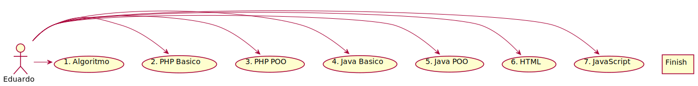

# Curso em Vídeo | Prof. Gustavo Guanabara :earth_americas: 

[](https://github.com/eduardodsr/cursoemvideo)


<h1 align="center"> Curso em Vídeo </h1> 

<p align="center"> |&nbsp;&nbsp;&nbsp; 
  <a href="#algoritmo">01. Algoritmo</a>&nbsp;&nbsp;&nbsp;|&nbsp;&nbsp;&nbsp;
  <a href="#php-basico">02. PHP Básico</a>&nbsp;&nbsp;&nbsp;|&nbsp;&nbsp;&nbsp;
  <a href="#php-poo">03. PHP POO</a>&nbsp;&nbsp;&nbsp;|&nbsp;&nbsp;&nbsp;
   <a href="#autor">Autor &rarr; eduardodsr</a>&nbsp;&nbsp;&nbsp;|&nbsp;&nbsp;&nbsp;
</p>


## Cursos: Diagrama de Controle :brazil:

```txt
 ┌────────────┐┌─────────────┐┌──────────┐
 │1. Algoritmo││2. PHP Básico││3. PHP POO│
 └─────┬──────┘└──────┬──────┘└────┬─────┘
       │              │            │      
       │              │     OK     │      
       │              │───────────>│      
       │              │            │      
       │      OK      │            │      
       │─────────────>│            │      
 ┌─────┴──────┐┌──────┴──────┐┌────┴─────┐
 │    100%    ││     100%    ││   60%    │
 └────────────┘└─────────────┘└──────────┘
```



<a href="#" target="_blank"></a>

## Cursos Concluídos

<span id="algoritmo">


&nbsp;&nbsp;&nbsp;


<a href="#" target="_blank"></a>


## 01. Curso de Algoritmo [40 Horas] :one: 🏆

- O **Visualg** é um programa que permite criar, editar, interpretar e que também executa os algoritmos em português como se fosse um “programa” normal de computador.

- O Visualg possui recursos como simulação da “tela” do MS-DOS, visualização de variáveis, “breakpoints”, com ajuda on-line, impressão dos fontes e outras características que auxiliam o aprendizado das técnicas de programação.

    - Atual versão – 3.0.7 | Última revisão – 20/08/2020

- **OBS:** Para utilizar no MacOS, estou utilizando o software **CrossOver**, permite utilizar os aplicativos Windows no MacOS.


### Conteúdo do Módulo :bookmark:

1. Aula 1 – Introdução a Algoritmos  ✅
2. Aula 2 – Primeiro Algoritmo ✅
3. Aula 3 – Comando de Entrada e Operadores ✅
4. Aula 4 – Operadores Lógicos e Relacionais ✅
5. Aula 5 – Introdução ao Scratch ✅
6. Aula 6 – Exercícios de Algoritmo Resolvidos ✅
7. Aula 7 – Estruturas Condicionais 1 ✅
8. Aula 8 – Estruturas Condicionais 2 ✅
9. Aula 9 – Estruturas de Repetição 1 ✅
10. Aula 10 – Estruturas de Repetição 2 ✅
11. Aula 11 – Estruturas de Repetição 3 ✅
12. Aula 12 – Procedimentos ✅
13. Aula 13 – Funções ✅
14. Aula 14 – Vetores ✅
15. Aula 15 – Matrizes ✅


### Anotações das Aulas: :open_book: :writing_hand:

[Anotações das Aulas com Código Fonte](https://github.com/eduardodsr/cursoemvideo/blob/master/curso-de-algoritmo/README.md)

### Código Fonte / Projetos: :computer: :file_folder:

[Código Fonte das Aulas - Curso de Algoritmo - Projetos](https://github.com/eduardodsr/cursoemvideo/tree/master/curso-de-algoritmo/Projetos) 

### YouTube - Playlist: :desktop_computer: :headphones:

[Curso de Algoritmos](https://www.youtube.com/playlist?list=PLHz_AreHm4dmSj0MHol_aoNYCSGFqvfXV)

### Certificado: :trophy: :100: 

[Certificado de Conclusão | Teste Final -> 10 de 10 Pontos(100% de aproveitamento)](https://github.com/eduardodsr/cursoemvideo/tree/master/curso-de-algoritmo/certificado) 

### Links: :link:

[Curso de Algoritmo, site do Prof. Gustavo Guanabara](https://www.cursoemvideo.com/curso/curso-de-algoritmo/)

[Visual G - Site Oficial](http://visualg3.com.br/)

[Visual G - Download](https://sourceforge.net/projects/visualg30/)

[Manual do VisualG - SITE](https://manual.visualg3.com.br/doku.php?id=manual) 

[Manual do VisualG - Apostila Download](https://sourceforge.net/projects/visualg30/files/Apostila%20de%20VisualG%20Curso_Basico.pdf)

[Exercícios de Algoritmos - Prof. Gustavo Guanabara](https://www.cursoemvideo.com/wp-content/uploads/2019/08/exercicios-algoritmos.pdf)


### Agradecimentos: :clap:

- Prof. *Antonio Carlos Nicolodi*, criador do Visual G.
    - Obrigado por compartilhar o seu conhecimento. 

- Prof. *Gustavo Guanabara*, criador do site Curso em Vídeo.
    - Obrigado pela excelente qualidade e dedicação das suas aulas. 

<br>

<hr>

<span id="php-basico">


&nbsp;&nbsp;&nbsp;

 


## 02. PHP Básico [40 Horas] :two: 🏆

- Criado em 1995, por Rasmus Lerdorf, o **PHP** (acrônimo para PHP: Hypertext Preprocessor) é uma linguagem de script Open Source de uso geral. Com ela, desenvolvedores podem criar sites dinâmicos, extensões para aplicativos e otimizar tanto programas quanto Sistemas Operacionais. Ela é especialmente adequada para o desenvolvimento web e pode ser embutida dentro do HTML.

- Você vai aprender os primeiros passos para criar sites que utilizem a tecnologia PHP incorporada. Para isso, aprenderá como instalar um servidor, criar scripts básicos, interatividade com formulários e acesso a bancos de dados simples. No final, vai aprender como colocar seu site no ar utilizando um servidor profissional de hospedagem.

### Conteúdo do Módulo :bookmark:

1. Aula 1 – História do PHP ✅
2. Aula 2 – Como funciona o PHP ✅
3. Aula 3 – Como Instalar o PHP ✅
4. Aula 4 – Variáveis em PHP ✅
5. Aula 5 – Operadores Aritméticos ✅ 
6. Aula 6 – Operadores de Atribuição  ✅
7. Aula 7 – Operadores Relacionais  ✅
8. Aula 8 – Integração HTML5 + PHP  ✅
9. Aula 9 – Estrutura Condicional if  ✅
10. Aula 10 – Estrutura Condicional Switch ✅
11. Aula 11 – Estrutura de Repetição While  ✅
12. Aula 12 – Estrutura de Repetição Do While  ✅
13. Aula 13 – Estrutura de Repetição For  ✅
14. Aula 14 – Rotinas em PHP – Parte 1  ✅
15. Aula 15 – Rotinas em PHP – Parte 2  ✅
16. Aula 16 – Funções String em PHP (Parte 1) ✅
17. Aula 17 – Funções String em PHP (Parte 2) ✅
18. Aula 18 – Vetores e Matrizes – Parte 1  ✅
19. Aula 19 – Vetores e Matrizes – Parte 2 ✅

### Anotações das Aulas: :open_book: :writing_hand:

[Anotações das aulas](https://github.com/eduardodsr/cursoemvideo/tree/master/php-basico)

<p><a href="https://github.com/eduardodsr/cursoemvideo/blob/master/php-basico/README.md" target="_blank">Resumo das aulas</a></p>

### Código Fonte / Projetos: :computer: :file_folder:

[Código fonte das aulas | Projetos das aulas - Curso de PHP Básico](https://github.com/eduardodsr/cursoemvideo/tree/master/php-basico/projetos/) 

### YouTube - Playlist: :desktop_computer: :headphones:

[Curso de PHP para Iniciantes](https://www.youtube.com/playlist?list=PLHz_AreHm4dm4beCCCmW4xwpmLf6EHY9k)

### Certificado: :trophy: :100: 

[Certificado de Conclusão | Teste Final -> 10 de 10 Pontos(100% de aproveitamento)](https://github.com/eduardodsr/cursoemvideo/tree/master/php-basico/certificado) 

### Links: :link:

<a href="https://github.com/eduardodsr/cursoemvideo#php-basico" target="_blank">Meu repositório do curso em vídeo, PHP </a>

<a href="https://www.cursoemvideo.com/curso/php-basico" target="_blank">Site do Curso em Vídeo, curso de PHP Básico</a>

[Curso de PHP Básico](https://www.cursoemvideo.com/curso/php-basico "cursoemvideo.com")

[PHP museum - Release Archives](https://museum.php.net/ "museum.php.net")

[Manual do PHP - php.net - manual pt_BR](https://www.php.net/manual/pt_BR/ "php.net")

[PHP - Download documentation](https://www.php.net/download-docs.php "php.net")

[XAMP - Download - Windows | Linux | MacOS](https://www.apachefriends.org/download.html "apachefriends.org")

[phpstorm - Teclas de Atalhos](https://resources.jetbrains.com/storage/products/phpstorm/docs/phpstorm_Leaflet.pdf)

[PHP - Design Patterns - PADRÕES de PROJETO](https://refactoring.guru/pt-br/design-patterns/php)


### Agradecimentos: :clap:

- Prof. *Gustavo Guanabara*, criador do site Curso em Vídeo.
    - Obrigado pela criação do projeto, oferecendo ensino de alta qualidade, onde aprendi a programar com a linguagem PGP. 

<br>

<hr>

<span id="php-poo">


&nbsp;&nbsp;&nbsp;

 


## 03. PHP POO [40 Horas] :three:

- Curso completo de **Programação Orientada a Objetos (POO)** com a linguagem PHP. 
- Aborda os principais conceitos como Classes, Objetos, instanciamento, abstração, encapsulamento, herança, polimorfismo e muito mais. 
- Criado pelo professor Gustavo Guanabara para o Curso em Vídeo, explica todos os conceitos de POO de uma maneira simples, objetiva e divertida.


### Conteúdo do Módulo :bookmark:

1. Aula 1  ✅
    - Aula Teórica 1 – O que é Programação Orientada a Objetos?
    - Aula Prática 1 – Instalando o XAMPP e o NetBeans
2. Aula 2  ✅
    - Aula Teórica 2 – O que é um Objeto?
    - Aula Prática 2 – Criando Classes e Objetos em PHP
3. Aula 3  ✅
    - Aula Teórica 3 – O que é Visibilidade em um Objeto?
    - Aula Prática 3 – Configurando Visibilidade de Atributos e Métodos
4. Aula 4  ✅
    - Aula Teórica 4 – Métodos Especiais
    - Aula Prática 4 – Métodos Getter, Setter e Construtor
5. Aula 5  ✅
    - Aula Teórica 5 – Exemplo Prático com Objetos
    - Aula Prática 5 – Exemplo Prático em PHP
6. Aula 6 ✅
    - Aula Teórica 6 – Pilares da POO: Encapsulamento
    - Aula Prática 6 – Encapsulamento
7. Aula 7 ✅
    - Aula Teórica 7 – Relacionamento entre Classes
    - Aula Prática 7 – Objetos Compostos em PHP
8. Aula 8 ✅
    - Aula Teórica 8 – Relacionamento de Agregação
    - Aula Prática 8 – Agregação entre Objetos em PHP
9. Aula 9 ✅
    - Aula Teórica 9 – Exercícios de POO
    - Aula Prática 9 – Exercício prático POO em PHP
10. Aula 10
    - Aula Teórica 10 – Herança (Parte 1)
    - Aula Prática 10 – Herança (Parte 1)
11. Aula 11
    - Aula Teórica 11 – Herança (Parte 2)
    - Aula Prática 11 – Herança (Parte 2)
12. Aula 12
    - Aula Teórica 12 – Conceito Polimorfismo (Parte 1)
    - Aula Prática 12 – Polimorfismo em PHP (Parte 1)
13. Aula 13
    - Aula Teórica 13 – Conceito Polimorfismo (Parte 2)
    - Aula Prática 13 – Polimorfismo Sobrecarga (Parte 2)
14. Aula 14
    - Aula Teórica 14 – Exercícios de POO (Parte 2)
    - Aula Prática 14 – Projeto Final em PHP (Parte 1)
15. Aula 15
    - Aula Teórica 15 – Exercícios de POO (Parte 3)
    - Aula Prática 15 – Projeto Final em PHP (Parte 2)


### Anotações das Aulas: :open_book: :writing_hand:

[Anotações das Aulas com Código Fonte](https://github.com/eduardodsr/cursoemvideo/blob/master/php-poo/README.md)

### Código Fonte das Aulas : :computer: :file_folder:

[Código Fonte das Aulas - PHP POO](https://github.com/eduardodsr/cursoemvideo/tree/master/php-poo/aulas) 

### YouTube - Playlist: :desktop_computer: :headphones:

[Curso de PHP POO](https://www.youtube.com/playlist?list=PLHz_AreHm4dmGuLII3tsvryMMD7VgcT7x)


### Links: :link:

<a href="https://github.com/eduardodsr/cursoemvideo#php-poo" target="_blank">Meu repositório do curso em vídeo, PHP </a>

<a href="https://www.cursoemvideo.com/curso/php-poo/" target="_blank">Site do Curso em Vídeo, curso de PHP Básico</a>

[Curso de PHP POO](https://www.cursoemvideo.com/curso/php-poo/ "cursoemvideo.com")

[Manual do PHP - php.net - manual pt_BR](https://www.php.net/manual/pt_BR/ "php.net")

[XAMP - Download - Windows | Linux | MacOS](https://www.apachefriends.org/download.html "apachefriends.org")

[phpstorm - Teclas de Atalhos](https://resources.jetbrains.com/storage/products/phpstorm/docs/phpstorm_Leaflet.pdf)


### Agradecimentos: :clap:

- Prof. *Gustavo Guanabara*, criador do site Curso em Vídeo.
 
<br>


<hr>


<span id="autor">

### Autor :smile:

<div align="rigth">
  <a href="https://github.com/eduardodsr">
   
  </a>
</div>

  * ` Dev: ` Eduardo da Silva Rodrigues
  
  * ` GitHub: ` [github.com/eduardodsr](https://www.github.com/eduardodsr) :link:
 
  * ` E-mail: ` <eduardodsr@gmail.com> :email: