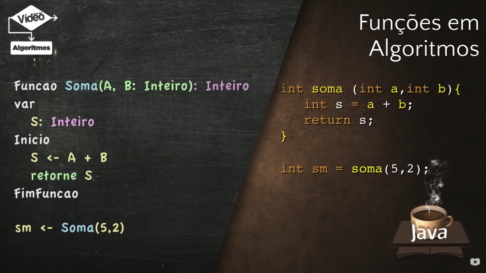
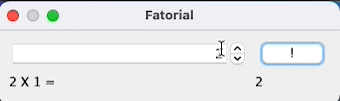

### 04. Java Básico [40 Horas] 

- Java é uma linguagem de programação, orientada a objetos, desenvolvida na década de 90 por uma equipe de programadores chefiada por James Gosling, na empresa Sun Microsystems.

- Este curso é indicado para qualquer pessoa que já possua bons conhecimentos de algoritmos e lógica de programação. 

- Caso você já domine a construção de algoritmos e a lógica de programação, o professor Gustavo Guanabara vai mostrar a história, introdução e explicação do funcionamento da linguagem, assim como suas sintaxes e estruturas de maneira fácil e descontraída.


<h2 align="center"> Java Básico - Índice</h2> 

<p align="center"> |&nbsp;&nbsp;&nbsp; 
  <a href="#aula01">Aula 01</a>&nbsp;&nbsp;&nbsp;|&nbsp;&nbsp;&nbsp;
  <a href="#aula02">Aula 02</a>&nbsp;&nbsp;&nbsp;|&nbsp;&nbsp;&nbsp;
  <a href="#aula03">Aula 03</a>&nbsp;&nbsp;&nbsp;|&nbsp;&nbsp;&nbsp;
  <a href="#aula04">Aula 04</a>&nbsp;&nbsp;&nbsp;|&nbsp;&nbsp;&nbsp;
  <a href="#aula05">Aula 05</a>&nbsp;&nbsp;&nbsp;|&nbsp;&nbsp;&nbsp;
  <a href="#aula06">Aula 06</a>&nbsp;&nbsp;&nbsp;|&nbsp;&nbsp;&nbsp;
  <a href="#aula07">Aula 07</a>&nbsp;&nbsp;&nbsp;|&nbsp;&nbsp;&nbsp;
  <a href="#aula08">Aula 08</a>&nbsp;&nbsp;&nbsp;|&nbsp;&nbsp;&nbsp;
  <a href="#aula09">Aula 09</a>&nbsp;&nbsp;&nbsp;|&nbsp;&nbsp;&nbsp;
  <a href="#aula10">Aula 10</a>&nbsp;&nbsp;&nbsp;|&nbsp;&nbsp;&nbsp;
  <a href="#aula11">Aula 11</a>&nbsp;&nbsp;&nbsp;|&nbsp;&nbsp;&nbsp;
  <a href="#aula12">Aula 12</a>&nbsp;&nbsp;&nbsp;|&nbsp;&nbsp;&nbsp;
  <a href="#aula13">Aula 13</a>&nbsp;&nbsp;&nbsp;|&nbsp;&nbsp;&nbsp;
  <a href="#aula14">Aula 14</a>&nbsp;&nbsp;&nbsp;|&nbsp;&nbsp;&nbsp;
  <a href="#aula15">Aula 15</a>&nbsp;&nbsp;&nbsp;|&nbsp;&nbsp;&nbsp;
</p>

<hr>

### Conteúdo do Módulo :bookmark:


1. Aula 01 – História do Java  ✅
    - Exercícios de Java #01
2. Aula 02 – Como Funciona o Java  ✅
    - Exercícios de Java #02
3. Aula 3 – Instalando o JDK no seu Computador  ✅
    - Exercícios de Java #03
4. Aula 4 – Primeiro Programa em Java  ✅
    - Exercícios de Java #04
5. Aula 5 – Introdução ao Swing e JavaFX ✅
    - Exercícios de Java #05
6. Aula 6 – Tipos Primitivos e Manipulação de Dados ✅
    - Exercícios de Java #06
7. Aula 7 – Operadores Aritméticos e Classe Math ✅
    - Exercícios de Java #07
8. Aula 8 – Operadores Lógicos e Relacionais  ✅
    - Exercícios de Java #08
9. Aula 9 – Estruturas Condicionais (Parte 1)  ✅
    - Exercícios de Java #09
10. Aula 10 – Estruturas Condicionais (Parte 2)  ✅
    - Exercícios de Java #10
11. Aula 11 – Estruturas de Repetição (Parte 1) ✅
    - Exercícios de Java #11
12. Aula 12 – Estruturas de Repetição (Parte 2)  ✅
    - Exercício de Java #12
13. Aula 13 – Estruturas de Repetição (Parte 3)  ✅
    - Exercícios de Java #13
14. Aula 14 – Vetores  ✅
    - Exercícios de Java #14 
15. Aula 15 – Métodos ✅
    - Exercícios de Java #15  

<hr>

### Aulas :bookmark:

<span id="aula01">

#### 01. Aula 1 – História do Java 

[Slide da aula 01](https://github.com/eduardodsr/cursoemvideo/tree/master/java-basico/slides/01-aula-curso-java-slides.pdf)

A História da Linguagem Java se inicia em 1990, quando a Sun Microsystems criou uma equipe chamada Green Team, liderada por James Gosling.

Até o momento, as Linguagens de Programação como Pascal e C, precisavam de compiladores específicos para cada plataforma. Sem isso, os programas só seriam executáveis para um único sistema.

Foi aí que o grupo criou o projeto GreenTalk, que virou a Linguagem Oak, capaz de ligar dispositivos diferentes e fazer com que eles pudessem se comunicar. 

O Star Seven (*7) surgiu em 1991 e era um aparelho multimídia capaz de controlar vários dispositivos da sua casa. Infelizmente o projeto não foi aceito na época e tudo foi engavetado em 1992.

Em 1994, com o advento da World Wide Web (www) e da Linguagem HTML, o projeto da Sun foi reestabelecido com o objetivo de criar um Navegador Web capaz de rodar aplicativos em Oak.

O nome "Oak" não poderia ser utilizado por questões de direitos relacionados. A linguagem foi rebatizada em homenagem a uma gíria relativa a "Café Quente": Java Coffee.

Surgem então o navegador HotJava e a linguagem Java, que ficou famosa por conta de matérias veiculadas pela imprensa da época.

A partir daí, vários projetos surgiram para usar Java em todo lugar. O Java Ring e Sondas Espaciais da NASA são exemplos disso.

Em 2006 a Linguagem Java se tornou Open Source, que tem seu código livre para consultas, pesquisas e personalizações. Java usa a licença GPL (General Public Licence)

Em 2009 a Sun Microsystems foi vendida para a Oracle por US$7,4 bilhões.

Atualmente, a Linguagem Java pode ser encontrada em chips de cartão de crédito, discos de blu-ray, vídeo games (PS4 roda Java), leitores de e-books (Kindle roda Java), smartphones (Android roda Java), TV digital (o padrão Ginga é feito em Java), relógios inteligentes (Moto 360 roda Java) e até mesmo no programa para a Declaração de Imposto de Renda.

---

- Exercícios de Java #01


<a href="#" target="_blank"></a>

<a href="#" target="_blank"></a>

<a href="#" target="_blank"></a>

<a href="#" target="_blank"></a>

<a href="#" target="_blank"></a>

<a href="#" target="_blank"></a>

<a href="#" target="_blank"></a>

---

<span id="aula02">

#### 02. Aula 02 – Como Funciona o Java

[Slide da aula 02](https://github.com/eduardodsr/cursoemvideo/tree/master/java-basico/slides/02-aula-curso-java-slides.pdf)

Como funciona o Java? Você sabe o que é JVM, JRE, JDK, JavaC, bytecode? É exatamente isso que você vai aprender durante essa aula.

O *JavaC (Java Compiler)* vai transformar o Código Fonte Java em Bytecode, um código específico que vai executar em uma Máquina Virtual Java (Java Virtual Machine - JVM).

Uma *JVM* é uma solução de software capaz de executar bytecode em qualquer máquina, independente da plataforma que o Código Fonte foi compilado. Java é multiplataforma sem a necessidade de recompilação.

A JVM é composta por várias partes internas, como por exemplo Loader, Verificador, Interpretador, Gerenciador de Memória e Compilador JIT (Just in Time).

Atualmente existem JVMs em várias plataformas, como Computadores Pessoais (Windows, Linux, MacOS), dispositivos móveis (Android) e até mesmo os modernos wearables (relógios inteligentes, óculos inteligentes).

O princípio de funcionamento desse mecanismo explicado acima é conhecido pela sigla WORA (Write Once Run Anywhere) que significa “Escreva uma vez, execute em qualquer lugar”.

*JRE (Java Runtime Environment)* é um conjunto de software que forma um ambiente para a execução de bytecodes feitos em Java. Ela é composta da JVM e bibliotecas adicionais.

*JDK (Java Development Kit)* é um conjunto de programas que todo programador Java deve ter. 
Ele é um kit de desenvolvimento Java composto pela JRE (item acima), o JavaLang, o JavaTools (JavaC, Debugger, APIs). 
Além disso, você ainda pode adicionar uma IDE para facilitar o desenvolvimento Java.

As IDEs mais conhecidas são o Eclipse, o IntelliJ e o NetBeans. 
O Curso em Vídeo de Java vai adotar o NetBeans para o aprendizado da Linguagem Java.

Na próxima aula, veremos as versões do Java que usaremos (SE/EE/ME), em qual lugar vamos fazer o download do JDK para o Java SE e veremos as instruções para a instalação da plataforma Java que será utilizada durante todo o curso.

- Slides 


<a href="#" target="_blank"></a>

<a href="#" target="_blank"></a>

<a href="#" target="_blank"></a>

<a href="#" target="_blank"></a>

<a href="#" target="_blank"></a>

---

- Exercícios de Java #02


<a href="#" target="_blank"></a>

<a href="#" target="_blank"></a>

<a href="#" target="_blank"></a>

<a href="#" target="_blank"></a>

<a href="#" target="_blank"></a>

<a href="#" target="_blank"></a>

---


<span id="aula03">

#### Conteúdo para o Curso de Java

Download do JDK Java SE + NetBeans

Para aprender JAVA você precisa instalar um Kit de Desenvolvimento Java (JDK) e uma IDE. Para isso, deve instalar a versão à sua escolha. 

Existem várias opções no site da Oracle, indicamos aqui algumas versões encontradas no site oficial:

 [Download Grátis Java JDK](https://www.oracle.com/br/java/technologies/javase/javase8-archive-downloads.html)

 [Download Grátis Java JRE](https://www.oracle.com/br/java/technologies/javase/javase8-archive-downloads.html)

[JavaFX Scene Builder](https://www.oracle.com/java/technologies/javafxscenebuilder-1x-archive-downloads.html)

[Vídeo - Como instalar o Java JDK](https://www.youtube.com/watch?v=yWU5bm_pZzY)

[Google Drive - Download dos SLIDES usados em Aula](https://info.cursoemvideo.com/asset/1:slides-curso-java)

[Java Tutorial](https://www.javatpoint.com/pt/primeiro-programa-em-java)

<hr>

#### 03. Aula 3 – Instalando o JDK no seu Computador

[Slide da aula 03](https://github.com/eduardodsr/cursoemvideo/tree/master/java-basico/slides/03-aula-curso-java-slides.pdf)

Veja o passo-a-passo para Instalar o Java Development Kit (JDK) do Java SE 8.

Para instalar o pacote do JDK Java, você deve baixar os arquivos diretamente do site da Oracle.

**Edições do Java**

- **Java SE (Standard Edition)** é usado para o desenvolvimento da maioria das aplicações que você vai criar em Java.
- **Java EE (Enterprise Edition)** usado para aplicações maiores, com acesso a servidores, grandes bases de dados, etc.
- **Java ME (Micro Edition)** é usado para o desenvolvimento de aplicativos voltados para dispositivos móveis.

**Qual é a melhor IDE para programar em Java?**

Nós utilizaremos o **NetBeans** durante o curso. 
Uma **IDE (Integrated Development Environment)** é um **Ambiente de Desenvolvimento Integrado** que permite utilizar técnicas de RAD (Rapid Application Development). 

**Algumas vantagens são:**

- É um editor completo
- Possui integração entre compilador, linker e debugger
- Gerador Automático de Código
- Possui um ambiente de teste
- Distribuição simplificada

<br>

---

- Exercícios de Java #03


<a href="#" target="_blank"></a>

<a href="#" target="_blank"></a>

<a href="#" target="_blank"></a>

<a href="#" target="_blank"></a>

---

<span id="aula04">

#### 04. Aula 4 – Primeiro Programa em Java

[Slide da aula 04](https://github.com/eduardodsr/cursoemvideo/tree/master/java-basico/slides/04-aula-curso-java-slides.pdf)

- Slides


<a href="#" target="_blank"></a>

<a href="#" target="_blank"></a>

<a href="#" target="_blank"></a>

<a href="#" target="_blank"></a>

<br>

---

- Exercícios de Java #04


<a href="#" target="_blank"></a>

<a href="#" target="_blank"></a>

---

#### Hello, World

Como criar um tradicional “Olá, Mundo!” (Hello World) em Java.

Estou utilizando o IntelliJ IDEA da JetBrains.

[YouTube - Creating your first Java application with IntelliJ IDEA](https://www.youtube.com/watch?v=H_XxH66lm3U&list=PLoWO2Tlnu1Ow8AWoQ7kj0U3QCdsfQvPmW&index=1)

[Help - Create your first Java application](https://www.jetbrains.com/help/idea/creating-and-running-your-first-java-application.html#run_jar_artifact)

[IntelliJIDEA_ReferenceCard](https://resources.jetbrains.com/storage/products/intellij-idea/docs/IntelliJIDEA_ReferenceCard.pdf)

<br>

#### Code completion (IntelliSense):

- Ao digital <code> psvm </code> apresenta <code> public static void main </code> 
```java
public static void main(String[] args) {
         
    } 
```

- Ao digital <code> sout </code> apresenta <code> System.out.println </code> 

```java
    System.out.println(""); 
```

<br>

#### Projects

-  Programa <code> class HelloWorld </code>

```java
package com.example.helloworld;

public class HelloWorld {

    // digitar 'psvm' <TAB>
    public static void main(String[] args) {

        // digitar 'sout' <TAB>
        System.out.println("Hello, World!"); 
    }
}
```

- Programa <code> class HoraDoSistema </code>

```java
import java.util.Date;

public class HoraDoSistema {
    public static void main(String[] args) {
        Date data = new Date();
        System.out.println("A hora do sistema é");
        System.out.println(data);
    }
}
```

- Programa <code> class IdiomaSistema </code>

```java
package idiomasistema;

import java.util.Locale;

public class IdiomaSistema {
    public static void main(String[] args) {
        Locale currentLocale = Locale.getDefault();

        System.out.println(currentLocale.getDisplayLanguage()); // "English"
        System.out.println(currentLocale.getDisplayCountry());  // "Brazil"

        System.out.println(currentLocale.getLanguage());        // "en"
        System.out.println(currentLocale.getCountry());         // "BR"

        System.out.println(System.getProperty("user.language")); // "en"
        System.out.println(System.getProperty("user.country")); // "BR"

        /**
         * Locale getLanguage() Method in Java with Examples
         */
        // Create a new locale
        Locale brazil_locale = new Locale("pt","BR");

        // Displaying brazil_locale locale
        System.out.println("\n Brazil Locale: " + brazil_locale); // Brazil Locale: pt_BR

        // Displaying the language_code of this locale
        System.out.println("\n Language: " + brazil_locale.getLanguage()); // Language: pt
    }
}
```

- Programa <code> class ResolucaoTela </code>

```java
package resolucaotela;

import java.awt.*;

public class ResolucaoTela {
    public static void main(String[] args) {
        
        Toolkit tk = Toolkit.getDefaultToolkit();

        System.out.println("Screen resolution = " + tk.getScreenResolution()); // Screen resolution = 96
        
        Dimension d = tk.getScreenSize();                   
        System.out.println("Screen width = " + d.width);    // Screen width = 1920
        System.out.println("Screen height = " + d.height);  // Screen height = 1080
    }
}

```
<br>

<span id="aula05">

#### 05. Aula 5 – Introdução ao Swing e JavaFX

[Slide da aula 05](https://github.com/eduardodsr/cursoemvideo/tree/master/java-basico/slides/05-aula-curso-java-slides.pdf)

Por ser uma linguagem multiplataforma, o Java tem que utilizar pacotes adicionais para que os seus arquivos não sejam sobrecarregados sem necessidade.

Para isso, é necessário utilizar a instrução "import" para carregar bibliotecas de pacotes adicionais. 

Por padrão, apenas o pacote java.lang é carregado automaticamente. 
Porém, caso você precise carregar bibliotecas adicionais, utilize a importação desses pacotes.

**Biblioteca Swing**

O Swing é uma evolução do antigo AWT (Abstract Windows Toolkit) que permite criar interfaces gráficas atraentes para qualquer sistema operacional baseado em janelas. 

**Plataforma JavaFX** 

Com o objetivo de substituir o Swing, o JavaFX cria interfaces para qualquer tipos de dispositivos, como ambientes de Janela, celulares e navegadores. Para a próxima versão, já está previsto o suporte para videogames, blu-rays e smart TVs.

Nessa aula, você vai aprender como criar uma aplicação simples utilizando Swing e JavaFX com XML. Não se esqueça de praticar bastante!

---

**Informações gerais sobre o JavaFX**

O JavaFX expande o poder do Java, permitindo que os desenvolvedores usem qualquer biblioteca Java em aplicações JavaFX. Dessa forma, os desenvolvedores podem expandir seus recursos no Java e aproveitar a tecnologia de apresentação que o JavaFX fornece para criar experiências visuais envolventes. Como usuário, você será capaz de executar as aplicações JavaFX em um browser ou arrastá-las e soltá-las na área de trabalho.

**Destaques do JavaFX:**

Permite que os desenvolvedores integrem gráficos de vetor, recursos Web de animação, áudio e vídeo em uma aplicação rica, interativa e imersiva;
Estende a tecnologia Java permitindo o uso de qualquer biblioteca Java em uma aplicação JavaFX;
Permite um fluxo de trabalho eficiente de designer para desenvolvedor, no qual os designers podem trabalhar com suas ferramentas preferidas, em colaboração com desenvolvedores.

Fonte: https://www.java.com/pt-BR/download/help/javafx.html

---


- **Swing UI Design -> GUI Design**

<code> class HelloDemo </code>

```java
import javax.swing.*;
import java.awt.event.ActionEvent;
import java.awt.event.ActionListener;

public class HelloDemo extends JFrame {
    private JPanel panelMain;
    private JTextField txtName;
    private JButton btnClick;
    private JTextField txtMessage;

    public HelloDemo() {
        btnClick.addActionListener(new ActionListener() {
            @Override // @SobrePor
            public void actionPerformed(ActionEvent e) {
                JOptionPane.showMessageDialog(btnClick, txtName.getText()+ ", Hello!");

                txtMessage.setText(txtName.getText());
             }
        });
    }

    public static void main(String[] args) {

        HelloDemo h = new HelloDemo();
        h.setContentPane(h.panelMain);
        h.setTitle("Hello");
        h.setSize(300,300);
        h.setVisible(true);
        h.setDefaultCloseOperation(JFrame.EXIT_ON_CLOSE);
    }
}
```

<code> Program Hello (Swing UI Design -> GUI Design) </code>


<a href="#" target="_blank"></a>

<br>

---

- **Program Hello JavaFX**

<code> hello-view.fxml </code>

```xml
<?xml version="1.0" encoding="UTF-8"?>

<?import javafx.geometry.Insets?>
<?import javafx.scene.control.Label?>
<?import javafx.scene.layout.VBox?>

<?import javafx.scene.control.Button?>
<VBox alignment="CENTER" spacing="20.0" xmlns:fx="http://javafx.com/fxml"
      fx:controller="com.example.olamundojavafx.HelloController">
    <padding>
        <Insets bottom="20.0" left="20.0" right="20.0" top="20.0"/>
    </padding>

    <Label fx:id="welcomeText"/>
    <Button text="Click Me!" onAction="#onHelloButtonClick"/>
</VBox>
```

<code> HelloController.java </code>

```java
package com.example.olamundojavafx;

import javafx.fxml.FXML;
import javafx.scene.control.Label;

public class HelloController {
    @FXML
    private Label welcomeText;

    @FXML
    protected void onHelloButtonClick() {
        welcomeText.setText("Welcome to JavaFX Application!");
    }
}
```

<code> HelloApplication.java </code>

```java
package com.example.olamundojavafx;

import javafx.application.Application;
import javafx.fxml.FXMLLoader;
import javafx.scene.Scene;
import javafx.stage.Stage;

import java.io.IOException;

public class HelloApplication extends Application {
    @Override
    public void start(Stage stage) throws IOException {
        FXMLLoader fxmlLoader = new FXMLLoader(HelloApplication.class.getResource("hello-view.fxml"));
        Scene scene = new Scene(fxmlLoader.load(), 320, 240);
        stage.setTitle("Hello!");
        stage.setScene(scene);
        stage.show();
    }

    public static void main(String[] args) {
        launch();
    }
}
```

<code> Program hello (JavaFx) </code>


<a href="#" target="_blank"></a>

<br>

---

- Exercícios de Java #05


<a href="#" target="_blank"></a>

<a href="#" target="_blank"></a>

<a href="#" target="_blank"></a>

---


<span id="aula06">

#### 06. Aula 6 – Tipos Primitivos e Manipulação de Dados

[Slide da aula 06](https://github.com/eduardodsr/cursoemvideo/tree/master/java-basico/slides/06-aula-curso-java-slides.pdf)

Aprenda durante a aula a utilizar tipos primitivos, typecast ou classes invólucro para declarar variáveis/objetos para o seu programa.

**Tipos Primitivos do Java**

O Java tem os tipos primitivos:

- **Lógico**: boolean
- **Literal**: char
- **Inteiro**: byte, short, int, long
- **Real**: float, double

Além disso existem as classes Wrapper para os tipos: Boolean, Character, String, Byte, Short, Integer, Long, Float e Double.

Aprenda durante a aula a utilizar tipos primitivos, typecast ou classes invólucro para declarar variáveis/objetos para o seu programa.

**Comentários em Java**

Você pode utilizar comentários em Java utilizando os símbolos de 

// para comentários de uma linha 

e 

/* */ para múltiplas linhas.

Além disso você vai aprender os **comandos de saída**: println, printf e String.format.

Aprenda também a utilizar a **classe Scanner** para ler dados via teclado usando os métodos nextInt, nextLine e nextFloat.

Por fim, aprenda a realizar **conversões de dados** usando as classes invólucro e seus métodos de parsing como parseInt, parseFloat e toString.


- Slides


<a href="#" target="_blank"></a>

<a href="#" target="_blank"></a>

<a href="#" target="_blank"></a>

<a href="#" target="_blank"></a>

<a href="#" target="_blank"></a>

<br>

- **Saída de dados**: <code> println, printf e String.format </code>

<code> class TiposPrimitivosSaidaDados </code>

```java
package tiposprimitivos;
/**
 * #author: Eduardo Rodrigues
 */
public class TiposPrimitivosSaidaDados {
    public static void main(String[] args) {
        // TODO code application logic here
        float nota = 8.5F;
        String nome = "Eduardo";

        System.out.print("A nota é " + nota);           // A nota é 8.5

        System.out.print("\n");                         // pula linha

        System.out.println("A nota é " + nota);         // A nota é 8.5

        System.out.printf("A sua nota é %.2f", nota);   // A sua nota é 8.50

        System.out.printf("\n A nota de %s é %.4f", nome, nota); // A nota de Eduardo é 8.5000

        System.out.format("\n A nota de %s é %.1f", nome, nota); // A nota de Eduardo é 8.5
    }
}
```

- **Entrada de dados**: métodos <code> nextInt, nextLine e nextFloat </code>

<code> class TiposPrimitivosEntradaDados </code>

```java
import java.util.Scanner;

public class TiposPrimitivosEntradaDados {
    public static void main(String[] args) {

        Scanner teclado = new Scanner(System.in);

        System.out.print("Digite o seu nome: "); // Eduardo
        String nome = teclado.nextLine();

        System.out.print("Digite a sua nota: "); // 8.55
        float nota = teclado.nextFloat();

        System.out.format("A nota de %s é %.1f \n", nome, nota); // A nota de Eduardo é 8.6 
    }
}

```

- **Conversões de dados:** métodos <code> parseInt, parseFloat e toString</code>

<code> class TesteTipos (toString) </code>

```java
public class TesteTipos {

    public static void main(String[] args) {
        int idade = 30;
        String valor = Integer.toString(idade);
        System.out.println(valor); // "30" [String]

        /*
         * Verificar o tipo de uma variável em Java:
         * Utilize getClass().getSimpleName()
         */
        System.out.println(valor.getClass().getSimpleName()); // String
    }
}

```

<code> class TesteTipos (parseInt) </code>

```java
public class TesteTipos {

    public static void main(String[] args) {

        String valor = "30";
        int idade = Integer.parseInt(valor); 
        System.out.println(idade); // 30 [int]
        System.out.println(((Object)idade).getClass().getSimpleName()); // Integer
    }
}
```


<code> class TesteTipos (parseFloat) </code>


```java
public class TesteTipos {

    public static void main(String[] args) {

        String valor = "30.5";
        float idade = Float.parseFloat(valor);
        System.out.println(idade); // 30.5 [float]
        System.out.println(((Object)idade).getClass().getSimpleName()); // Float

    }
}
```

- Programa que realiza a soma de dois números

<code> class TelaSoma </code>

```java
import javax.swing.*;
import java.awt.event.ActionEvent;
import java.awt.event.ActionListener;

public class TelaSoma extends JDialog {
    private JPanel contentPane;
    private JTextField txtN1;
    private JTextField txtN2;
    private JButton btnSoma;
    private JLabel lblResultado;
    private JButton buttonOK;

    public TelaSoma() {
        setContentPane(contentPane);
        setModal(true);
        getRootPane().setDefaultButton(buttonOK);
        btnSoma.addActionListener(new ActionListener() {
            @Override
            public void actionPerformed(ActionEvent e) {
                int n1 = Integer.parseInt(txtN1.getText());
                int n2 = Integer.parseInt(txtN2.getText());
                int s = n1 + n2;
                lblResultado.setText(Integer.toString(s));
            }
        });
    }

    public static void main(String[] args) {
        TelaSoma dialog = new TelaSoma();
        dialog.pack();
        dialog.setVisible(true);
        System.exit(0);
    }
}
```


<a href="#" target="_blank"></a>

<br>

<code> Program TelaSoma </code>


<a href="#" target="_blank"></a>

<br>

- Programa que calcula a idade

```java
import javax.swing.*;
import java.awt.event.ActionEvent;
import java.awt.event.ActionListener;
import java.util.Calendar;

public class TelaSoma extends JDialog {
    private JPanel contentPane;
    private JButton buttonOK;
    private JButton buttonCancel;
    private JSpinner txtAN;
    private JButton btnCalc;
    private JLabel lblIdade;
    private JLabel lblAno;

    public TelaSoma() {
        setContentPane(contentPane);
        setModal(true);
        getRootPane().setDefaultButton(buttonOK);
        btnCalc.addActionListener(new ActionListener() {
            @Override
            public void actionPerformed(ActionEvent e) {

                int an = Integer.parseInt(txtAN.getValue().toString());

                Calendar cal = Calendar.getInstance();
                int ano = cal.get(Calendar.YEAR);

                lblAno.setText(Integer.toString(ano));

                int id = ano - an;
                lblIdade.setText(Integer.toString(id));

            }
        });
        buttonCancel.addActionListener(new ActionListener() {
            @Override
            public void actionPerformed(ActionEvent e) {
                lblIdade.setText("");
                txtAN.setValue(2000);
            }
        });
    }

    public static void main(String[] args) {
        TelaSoma dialog = new TelaSoma();
        dialog.pack();
        dialog.setVisible(true);
        System.exit(0);
    }
}
```

<code> Program Idade </code>


<a href="#" target="_blank"></a>

<br>

---

- Exercícios de Java #06


<a href="#" target="_blank"></a>

<a href="#" target="_blank"></a>

<a href="#" target="_blank"></a>

<a href="#" target="_blank"></a>

<a href="#" target="_blank"></a>

---

<span id="aula07">

#### 07. Aula 7 – Operadores Aritméticos e Classe Math

[Slide da aula 07](https://github.com/eduardodsr/cursoemvideo/tree/master/java-basico/slides/07-aula-curso-java-slides.pdf)

<code> class OperadoresAritmeticos (exemplo Calculo da média entre dois números)</code>

```java
public class OperadoresAritmeticos {
    /**
     * author: Eduardo Rodrigues
     */
    public static void main(String[] args) {
        int n1 = 3;
        int n2 = 5;
        float m = (n1 + n2)/2;
        System.out.println("A média é igual a " + m); // A média é igual a 4.0
    }
}
```

<code> class OperadoresAritmeticos (exemplos de pos-incremento e pré-incremento) </code>

```java
public class OperadoresAritmeticos {
    /**
     * author: Eduardo Rodrigues
     */
    public static void main(String[] args) {

        int num = 5;
        num++;
        System.out.println(num); // 6

        int num = 5;
        int valor = 5 + num++;      // pos-incremento
        System.out.println(valor);  // 10 (5 + 5)
        System.out.println(num);    // 6
]       
        int num = 5;
        int valor = 5 + ++num;      // pré-incremento
        System.out.println(valor);  // 11 (5 + 6)
        System.out.println(num);    // 6

        int num = 10;
        int valor = 4 + num--;      // pos-incremento
        System.out.println(valor);  // 14 (4 + 10)
        System.out.println(num);    // 9

        int num = 10;
        int valor = 4 + --num;      // pré-incremento
        System.out.println(valor);  // 13 (4 + 9)
        System.out.println(num);    // 9
    }
}

```

<br>

<code> class OperadoresAritmeticos (Operadores de Atribuição) </code>

```java
public class OperadoresAritmeticos {
    /**
     * author: Eduardo Rodrigues
     */
    public static void main(String[] args) {

       int a = 4;
        a += 2; // somar e atribuir
        System.out.println(a); // 6

        int b = 4;
        b -= 2; // subtrair e atribuir
        System.out.println(b); // 2

        int c = 4;
        c *= 2; // multiplicar e atribuir
        System.out.println(c); // 8

        int d = 9;
        d /= 3; // dividir e atribuir
        System.out.println(d); // 3

        int e = 9;
        e %= 2; // resto e atribuir
        System.out.println(e); // 1
    }
}

```

<br>

- Como gerar um número aleatório em Java

código fonte de exemplo: [clique aqui](https://dicasdejava.com.br/como-gerar-um-numero-aleatorio-em-java/)

<code> class GerarNumeroAleatorio </code>

```java
import java.util.Random;

public class GerarNumeroAleatorio {

    public static void main(String[] args) {

        Random random = new Random();

        int numeroInteiroAleatorio_0_a_10 = random.nextInt(10);
        System.out.println("Número inteiro aleatório de 0 até 10: " + numeroInteiroAleatorio_0_a_10);

        double numeroRealAleatorio_0_a_1 = random.nextDouble();
        System.out.println("Número real aleatório de 0 até 1: " + Math.round(numeroRealAleatorio_0_a_1));

        double numeroRealAleatorio_0_a_10 = random.nextDouble() * 10;
        System.out.println("Número real aleatório de 0 até 10: " + Math.round(numeroRealAleatorio_0_a_10));

    }
}
```

<br>

- Programa que apresenta o valor absoluto e exemplos de arrendondamento

<code> class OperadoresAritmeticos (valor absoluto e exemplos de arrendondamento)</code>

```java
public class OperadoresAritmeticos {
    /**
     * author: Eduardo Rodrigues
     */
    public static void main(String[] args) {
        
        System.out.println("Valor Absoluto de (-10) = " + Math.abs(-10)); // 10

        float valorFloat = 8.9f;

        int arrendondamentoCima = (int) Math.ceil(valorFloat); // 9
        System.out.println("arrendondamentoCima (8.9) = " + arrendondamentoCima);

        int arrendondamentoBaixo = (int) Math.floor(valorFloat); // 8
        System.out.println("arrendondamentoBaixo (8.9) = " + arrendondamentoBaixo);

        int arrendondamentoAritmetico = (int) Math.round(valorFloat); // 9
        System.out.println("arrendondamentoAritmetico (8.9) = " + arrendondamentoAritmetico);
    }
}

```

<br>

- Programa que realiza a divisão

<code> TelaValores </code>

```java
import javax.swing.*;
import java.awt.event.*;

public class TelaValores extends JDialog {
    private JPanel contentPane;
    private JButton buttonOK;
    private JButton buttonCancel;
    private JTextField txtN;
    private JTextField txtD;
    private JButton btnCalc;
    private JLabel lblQ;
    private JLabel lblR;
    private JLabel ImageLogo;

    public TelaValores() {
        setContentPane(contentPane);
        setModal(true);
        getRootPane().setDefaultButton(buttonOK);

        buttonOK.addActionListener(new ActionListener() {
            public void actionPerformed(ActionEvent e) {
                onOK();
            }
        });

        buttonCancel.addActionListener(new ActionListener() {
            public void actionPerformed(ActionEvent e) {
                onCancel();
            }
        });

        // call onCancel() when cross is clicked
        setDefaultCloseOperation(DO_NOTHING_ON_CLOSE);
        addWindowListener(new WindowAdapter() {
            public void windowClosing(WindowEvent e) {
                onCancel();
            }
        });

        // call onCancel() on ESCAPE
        contentPane.registerKeyboardAction(new ActionListener() {
            public void actionPerformed(ActionEvent e) {
                onCancel();
            }
        }, KeyStroke.getKeyStroke(KeyEvent.VK_ESCAPE, 0), JComponent.WHEN_ANCESTOR_OF_FOCUSED_COMPONENT);
        btnCalc.addActionListener(new ActionListener() {
            @Override
            public void actionPerformed(ActionEvent e) {
                // TODO
                int dividendo = Integer.parseInt(txtN.getText());
                int divisor = Integer.parseInt(txtD.getText());
                float quociente = dividendo / divisor;
                float resto = dividendo % divisor;

                lblQ.setText(Float.toString(quociente));
                lblR.setText(Float.toString(resto));
            }
        });
    }

    private void onOK() {
        // add your code here
        dispose();
    }

    private void onCancel() {
        // add your code here if necessary
        txtN.setText("");
        txtD.setText("");
        lblQ.setText("");
        lblR.setText("");
        // dispose();
    }

    public static void main(String[] args) {
        TelaValores dialog = new TelaValores();
        dialog.setTitle("Calcula divisão");
        dialog.pack();
        dialog.setVisible(true);
        System.exit(0);
    }

    private void createUIComponents() {
        // TODO: place custom component creation code here
        ImageLogo = new JLabel(new ImageIcon("divisao.png")); // load the image to a imageIcon
    }
}
```

<br>

<code> Program Calcula Divisão </code>


<a href="#" target="_blank"></a>

<br>

---

- Exercícios de Java #07


<a href="#" target="_blank"></a>

<a href="#" target="_blank"></a>

<a href="#" target="_blank"></a>


---

- Program Super Calculadora


<a href="#" target="_blank"></a>

<code> class SuperCalculadora </code>

```java
import javax.swing.*;
import java.awt.event.ActionEvent;
import java.awt.event.ActionListener;

public class SuperCalculadora extends JDialog {
    private JPanel contentPane;
    private JButton buttonOK;
    private JButton buttonCancel;
    private JSpinner txtNum;
    private JLabel imgCalc;
    private JButton panCalc;
    private JLabel imgBtn;
    private JLabel lblResto;
    private JLabel lblCubo;
    private JLabel lblRaizQ;
    private JLabel lblRaizC;
    private JLabel lblAbs;

    public SuperCalculadora() {
        setContentPane(contentPane);
        setModal(true);
        getRootPane().setDefaultButton(buttonOK);
        panCalc.addActionListener(new ActionListener() {
            @Override
            public void actionPerformed(ActionEvent e) {
                int num = Integer.parseInt(txtNum.getValue().toString()); // Numero digitado

                int resto = num % 2;
                lblResto.setText(Integer.toString(resto));

                double cubo = Math.pow(num, 3);
                lblCubo.setText(Double.toString(cubo));

                double raizQ = Math.sqrt(num);
                lblRaizQ.setText(String.format("%.2f", raizQ));
                // lblRaizQ.setText(Double.toString(raizQ));

                double raizC = Math.cbrt(num);
                lblRaizC.setText(String.format("%.2f", raizC));

                int abs = Math.abs(num);
                lblAbs.setText(Integer.toString(abs));

            }
        });

        buttonCancel.addActionListener(new ActionListener() {
            @Override
            public void actionPerformed(ActionEvent e) {
                    // add your code here if necessary
                    txtNum.setValue(0);

            }
        });
    }

    public static void main(String[] args) {
        SuperCalculadora dialog = new SuperCalculadora();
        dialog.setTitle("Super Calculadora");
        dialog.pack();
        dialog.setVisible(true);
        System.exit(0);
    }

    private void createUIComponents() {
        // TODO: place custom component creation code here
        imgCalc = new JLabel(new ImageIcon("calculadora.png"));
        imgBtn = new JLabel(new ImageIcon("calc-botao.png"));
    }
}

```

<code> Program Super Calculadora </code>


<a href="#" target="_blank"></a>

<br>


<br>

<span id="aula08">

#### 08. Aula 8 – Operadores Lógicos e Relacionais

[Slide da aula 08](https://github.com/eduardodsr/cursoemvideo/tree/master/java-basico/slides/08-aula-curso-java-slides.pdf)


<code> class OperadorTernario </code>

```java
public class OperadorTernario {
    public static void main(String[] args) {
        int n1 = 4;
        int n2 = 8;
        String resultado;

        resultado = (n1 > n2) ? "n1 é maior" : "n2 é maior ";
        System.out.println(resultado); // n2 é maior
    }
}
```

<code> class OperadorTernario </code>

```java
public class OperadorTernario {
    public static void main(String[] args) {
        int n1 = 4;
        int n2 = 8;
        int resultado;

        resultado = (n1 > n2) ? 0 : 1;
        System.out.println(resultado); // 1
    }
}
```

<code> class ComparacaoString </code>

```java
import javax.management.ObjectName;

public class ComparacaoString {
    public static void main(String[] args) {
        String nome1 = "Eduardo";
        String nome2 = "Eduardo";
        String nome3 = new String("Eduardo");
        String resultado;


        resultado = (nome1 == nome2) ? "igual" : "diferente";
        System.out.println(resultado); // igual


        resultado = (nome1 == nome3) ? "igual" : "diferente";
        System.out.println(resultado); // diferente

        /*
        *  equals() -> verifica se o conteudo de um objeto é igual ao outro objeto
        *  nome1.equals(nome3) -> verificar se nome1 é igual ao nome3
        */

        resultado = (nome1.equals(nome3)) ? "igual" : "diferente";
        System.out.println(resultado); // igual
    }
}

```

<code> class OperadoresLogicos </code>

```java
public class OperadoresLogicos {
    public static void main(String[] args) {
        int x = 4;
        int y = 7;
        int z = 12;
        boolean r1, r2, r3, r4, r5;

        r1 = (x < y) && (y < z) ? true : false;
        System.out.println(r1); // true

        r2 = (x < y) && (y == z) ? true : false;
        System.out.println(r2); // false

        r3 = (x < y) || (y == z) ? true : false;
        System.out.println(r3); // true

        r4 = (x < y) ^ (y == z) ? true : false;
        System.out.println(r4); // true

        r5 = (x < y) ^ (y < z) ? true : false;
        System.out.println(r5); // false
    }
}

```

---

- Exercícios de Java #08


<a href="#" target="_blank"></a>

<a href="#" target="_blank"></a>


---

<span id="aula09">

#### 09. Aula 9 – Estruturas Condicionais (Parte 1)

[Slide da aula 09](https://github.com/eduardodsr/cursoemvideo/tree/master/java-basico/slides/09-aula-curso-java-slides.pdf)


<code> class CalculaMedia </code>

```java
import java.util.Scanner;

public class CalculaMedia {
    public static void main(String[] args) {
        Scanner keyboard = new Scanner(System.in);
        System.out.print("Digite a 1º nota: ");
        float num1 = keyboard.nextFloat();
        System.out.print("Digite a 2º nota: ");
        float num2 = keyboard.nextFloat();
        float media = (num1 + num2) / 2;
        System.out.println("Sua média foi " + media);
        if (media >= 9) {
            System.out.println("Parabéns!");
        }
    }
}
```

<code> class CalculaIdade </code>

```java
import java.util.Calendar;
import java.util.Scanner;

public class CalculaIdade {
    public static void main(String[] args) {

        Scanner teclado = new Scanner(System.in);

        System.out.print("Ano que você nasceu? ");
        int anoNas = teclado.nextInt();

        // anoAtual
        Calendar cal = Calendar.getInstance();
        int anoAtual = cal.get(Calendar.YEAR); // anoAtual = 2022

        int idade = anoAtual - anoNas; // int idade = 2022 - anoNas;

        System.out.println("Sua idade é " + idade);

        if (idade >= 18) {
            System.out.println("Maior de idade");
        } else {
            System.out.println("Menot de idade");
        }
    }
}
```

<code> class ParOuImpar </code>

```java
import java.util.Scanner;

public class ParOuImpar {
    public static void main(String[] args) {

        Scanner teclado = new Scanner(System.in);

        System.out.print("Digite um valor inteiro: ");
        int valor = teclado.nextInt();

        if (valor % 2 == 0) {
            System.out.println("Número é PAR!");
        } else {
            System.out.println("Número é ÍMPAR!");
        }
    }
}

```

<code> class EquacaoSegundoGrau </code>

```java
import java.util.Scanner;

public class SegundoGrau {
    public static void main(String[] args) {

        Scanner teclado = new Scanner(System.in);

        System.out.println("-----------------------------------------");
        System.out.println("              Equação do 2º Grau         ");
        System.out.println("-----------------------------------------");

        System.out.print("Digite o valor de a: ");
        int a = Integer.parseInt(teclado.next());

        System.out.print("Digite o valor de b: ");
        int b = Integer.parseInt(teclado.next());

        System.out.print("Digite o valor de c: ");
        int c = Integer.parseInt(teclado.next());

        System.out.println("\n Sua equação é " + a + "x² + " + b + "x + " + c + " = 0");

        double delta = Math.pow(b, 2) - 4 * a * c;

        System.out.printf("\n O valor de delta é = " + String.valueOf(delta));
        System.out.println("\n");

        if (delta < 0) {
            System.out.println("\nPara Delta negativo. Não existe raizes reais!");
        }
        else if (delta == 0) {
            double x1 = (-b + Math.sqrt(delta)) / (2 * a);
            System.out.println("\nPara Delta zero. Temos duas raizes iguais a = " + x1);

        }
        else if (delta > 0) {
            double x1 = (-b + Math.sqrt(delta)) / (2 * a);
            double x2 = (-b - Math.sqrt(delta)) / (2 * a);
            System.out.println("Para Delta positivo. Temos duas diferentes: ");
            System.out.println("Primeira raiz (x1) = " + x1);
            System.out.println("Segunda  raiz (x2) = " + x2);
        }
    }

    /**
     *  Teste de equação do segundo grau:
     *  Ex1: Δ = 1;
     *  x² – 5x + 6 = 0
     *  a = 1, b = -5, c = 6.
     *  Δ = 1;
     *  Como Δ > 0,
     *  Para Delta positivo, essa equação terá duas soluções reais; x1 = 3 ; x2 = 2
     *
     *  Ex2: Δ = 0;
     *  4x² – 4x + 1 = 0.
     *  a = 4, b = -4, c = 1
     *  Δ = 0 ;
     *  Para Delta zero. Temos duas raizes iguais a = 0.5
     *
     * Ex3: Δ < 0, ou seja, Δ negativo
     * 5x² + x + 6 = 0.
     * a = 5 , b = 1, c = 6
     * Δ = -119 ;
     * Para Delta negativo. Não existe raizes reais!
     *
     */

}

```

 ---

- Exercícios de Java #09


<a href="#" target="_blank"></a>

<a href="#" target="_blank"></a>


---


<span id="aula10">

#### 10. Aula 10 – Estruturas Condicionais (Parte 2)

[Slide da aula 10](https://github.com/eduardodsr/cursoemvideo/tree/master/java-basico/slides/10-aula-curso-java-slides.pdf)


<code> class CalculaIdade </code>

```java
import java.util.Calendar;
import java.util.Scanner;

public class CalculaIdade {
    public static void main(String[] args) {

        Scanner teclado = new Scanner(System.in);

        System.out.print("Ano que você nasceu? ");
        int anoNas = teclado.nextInt();

        // anoAtual
        Calendar cal = Calendar.getInstance();
        int anoAtual = cal.get(Calendar.YEAR); // anoAtual = 2022

        int idade = anoAtual - anoNas; // int idade = 2022 - anoNas;

        System.out.println("Sua idade é " + idade);

        if (idade >= 18) {
            System.out.println("Maior de idade");
        } else {
            System.out.println("Menor de idade");
        }
    }
}
```

<code> class Votacao </code>

```java
import java.util.Calendar;
import java.util.Scanner;

public class Votacao {
    public static void main(String[] args) {

        Scanner teclado = new Scanner(System.in);

/*      System.out.print("Ano que você nasceu? ");
        int anoNas = teclado.nextInt();

        // anoAtual
        Calendar cal = Calendar.getInstance();
        int anoAtual = cal.get(Calendar.YEAR); // anoAtual = 2022

        int idade = anoAtual - anoNas; // int idade = 2022 - anoNas;

        System.out.println("Sua idade é " + idade);
*/
        System.out.println(" ┌────────────────────────┐");
        System.out.println(" │     IDADE DE VOTAÇÃO   │");
        System.out.println(" └────────────────────────┘");

        System.out.print("Qwal a sua idade? ");
        int idade = teclado.nextInt();

        if (idade < 16) {
            System.out.println("Não Vota!");
        } else {
            if ( (idade >= 16 && idade < 18) || (idade > 70) ) {
                System.out.println("Voto Opcional");
            } else {
                System.out.println("Voto Obrigatório!");
            }
        }
    }
}

```

- Programa que utiliza o **switch** que é uma estrutura de repetição

<code> class QuantasPernas </code>

```java
import java.util.Scanner;

public class QuantasPernas {
    public static void main(String[] args) {

        Scanner teclado = new Scanner(System.in);

        System.out.print("Qual a quantidade de pernas? ");
        int pernas = teclado.nextInt();

        System.out.print("Isso é um(a) ");

        String tipo;
        switch (pernas) {
            case 1:
                tipo = "Saci (folcore brasileiro, uma perna)";
                break;
            case 2:
                tipo = "Bípede (duas pernas)";
                break;
            case 4:
                tipo = "Quadrúpede (quadro pernas)";
                break;
            case 6, 8:
                tipo = "Aranha";
                break;
            default:
                tipo = "Animal desconhecido!";
        }
        System.out.println(tipo);
    }
}
```

---

- Exercícios de Java #10


<a href="#" target="_blank"></a>

<a href="#" target="_blank"></a>

<a href="#" target="_blank"></a>

- Lista de Exercícios (Q2), pegadinha!!!

<code> TesteQuestaoDois </code>

```java
public class TesteQuestaoDois {
    public static void main(String[] args) {
        String nome = "João";
        imprimeNome("Empty");
    }
    public static void imprimeNome(String nome) {

        System.out.println("Nome: " +nome); // "Empty"

        // A String nome está Vazia? True or False
        if (!nome.isEmpty()) {
            System.out.println("Tudo bem " + nome + "?"); // Tudo bem Empty?
        } else {
            System.out.println("O nome é " + nome + "?");
        }
    }
}
```

- Lista de Exercícios (Q3)

<code> class TesteQuestaoTres </code>

```java
public class TesteQuestaoTres {
    public static void main(String[] args) {

        char ch;

        String test2 = "abcde";             // Objeto não instanciado
        String test = new String("abcde");  // Objeto instanciado

        if(test.equals(test2)) {
            ch = (test == test2) ? test.charAt(0) : test.charAt(1); //  teste lógico (false) => test.charAt(1) = 'b'
        } else {
            ch = (test == test2) ? test.charAt(2) : test.charAt(3);
        }
        System.out.println(ch); // b
        // test.charAt(1) = 'b'
        // 'b' é 2º posição do Objeto String, ou seja, String test = new String("abcde");

        /**
         * O que será impresso quando o seguinte programa escrito na
         * liguagem JAVA for compitado e executado?
         * Respostas:
         * a) a ;   b) b ;  c) c ;  d) d ;  e) e
         */
    }
}
```

<br>

<code> class ProjetoTriangulo </code>

```java
import javax.swing.*;
import javax.swing.event.ChangeEvent;
import javax.swing.event.ChangeListener;
import java.awt.event.*;

public class ProjetoTriangulo extends JDialog {
    private JPanel contentPane;
    private JButton buttonOK;
    private JButton buttonCancel;
    private JSlider sliA;
    private JSlider sliB;
    private JSlider sliC;
    private JLabel img;
    private JButton btnVerificar;
    private JLabel lblA;
    private JLabel lblB;
    private JLabel lblC;
    private JPanel panResposta;
    private JLabel lblStatus;
    private JLabel lblTipo;

    public ProjetoTriangulo() {
        setContentPane(contentPane);
        setModal(true);
        getRootPane().setDefaultButton(buttonOK);
        panResposta.setVisible(false);

        buttonOK.addActionListener(new ActionListener() {
            public void actionPerformed(ActionEvent e) {
                onOK();
            }
        });

        buttonCancel.addActionListener(new ActionListener() {
            public void actionPerformed(ActionEvent e) {
                onCancel();
            }
        });

        // call onCancel() when cross is clicked
        setDefaultCloseOperation(DO_NOTHING_ON_CLOSE);
        addWindowListener(new WindowAdapter() {
            public void windowClosing(WindowEvent e) {
                onCancel();
            }
        });

        // call onCancel() on ESCAPE
        contentPane.registerKeyboardAction(new ActionListener() {
            public void actionPerformed(ActionEvent e) {
                onCancel();
            }
        }, KeyStroke.getKeyStroke(KeyEvent.VK_ESCAPE, 0), JComponent.WHEN_ANCESTOR_OF_FOCUSED_COMPONENT);
        btnVerificar.addActionListener(new ActionListener() {
            @Override
            public void actionPerformed(ActionEvent e) {
                // TODO
                int a = sliA.getValue();
                int b = sliB.getValue();
                int c = sliC.getValue();
                panResposta.setVisible(true);
                /*
                Eh_Triangulo <- (L1 < L2+L3) E (L2 < L1+L3) E (L3 < L1+L2)
                Triangulo_Equilatero <- ( (L1 = L2)  E (L2 = L3)  E (L1 = L3) )
                Triangulo_Escaleno   <- ( (L1 <> L2) E (L2 <> L3) E (L1 <> L3) )
                 */
                if ( a<b+c && b<a+c && c<a+b ) {
                    lblStatus.setText("É um triangulo!");

                    if ( a==b && b==c && a==c ){
                        lblTipo.setText("O triangulo é Equilátero, os três lados iguais.");
                    } else if ( a!=b && b!=c && a!=c) {
                        lblTipo.setText("O triângulo é Escaleno, os três lados são diferente.");
                    } else if ( a==b || b==c || a==c ) {
                        lblTipo.setText("O triângulo é isósceles, possui pelo menos dois lados iguais");
                    }
                } else {
                    lblStatus.setText("Não é um triangulo, pois um lado é maior que soma dos dois lados!");
                    lblTipo.setText("----------");
                }
                panResposta.setVisible(true);

            }
        });
        sliA.addChangeListener(new ChangeListener() {
            @Override
            public void stateChanged(ChangeEvent e) {
                lblA.setText(Integer.toString(sliA.getValue()));
            }
        });
        sliB.addChangeListener(new ChangeListener() {
            @Override
            public void stateChanged(ChangeEvent e) {
                lblB.setText(Integer.toString(sliB.getValue()));
            }
        });
        sliC.addChangeListener(new ChangeListener() {
            @Override
            public void stateChanged(ChangeEvent e) {
                lblC.setText(Integer.toString(sliC.getValue()));
            }
        });
    }

    private void onOK() {
        // add your code here
        dispose();
    }

    private void onCancel() {
        // add your code here if necessary
        dispose();
    }

    public static void main(String[] args) {
        ProjetoTriangulo dialog = new ProjetoTriangulo();
        dialog.setTitle("Triangulo");
        dialog.setSize(600,600);

        dialog.pack();
        dialog.setVisible(true);
        System.exit(0);

    }

    private void createUIComponents() {
        // TODO: place custom component creation code here
        img = new JLabel(new ImageIcon("triangulo2.png"));
    }
}

```

<code> Program Triangulo </code>


<a href="#" target="_blank"></a>

<br>

---

<span id="aula11">

#### 11. Aula 11 – Estruturas de Repetição (Parte 1)

[Slide da aula 11](https://github.com/eduardodsr/cursoemvideo/tree/master/java-basico/slides/11-aula-curso-java-slides.pdf)

- Repetição com teste no início

    - while

<code> class Contador </code>

```java
public class Contador {
    public static void main(String[] args) {
        int contador = 1;
        while (contador <= 4) {
            System.out.println("Cambalhota " + contador);
            contador++;
        }
    }
}
```
<code> &rarr; Run 🖥️ &lt;Contador&gt; </code>

```markdown
Cambalhota 1
Cambalhota 2
Cambalhota 3
Cambalhota 4
```

- **Mudando o fluxo de um laço** (continue e break)

<code> class ContadorContinue </code>

```java
public class ContadorContinue {
    public static void main(String[] args) {
        int contador = 0;
        while (contador < 10) {
            contador++;

            if ( contador == 5 || contador == 7) {
                continue;
            }
            System.out.println("Cambalhota " + contador);
        }
    }
}

```
<code> &rarr; Run 🖥️ &lt;ContadorContinue&gt; </code>

```markdown
Cambalhota 1
Cambalhota 2
Cambalhota 3
Cambalhota 4
Cambalhota 6
Cambalhota 8
Cambalhota 9
Cambalhota 10
```

<code> class ContadorBreak </code>

```java
public class ContadorBreak {
    public static void main(String[] args) {
        int contador = 0;
        while (contador < 10) {
            contador++;

            if (contador == 5) {
                break;
            }
            System.out.println("Cambalhota " + contador);
        }
    }
}
```
<code> &rarr; Run 🖥️ &lt;ContadorBreak&gt; </code>

```markdown
Cambalhota 1
Cambalhota 2
Cambalhota 3
Cambalhota 4
```

<code> class ContadorContinueBreak </code>

```java
public class ContadorContinueBreak {
    public static void main(String[] args) {
        int contador = 0;
        while (contador < 10) {
            contador++;

            if (contador == 2 || contador == 3 || contador == 4) {
                continue;
            }

            if (contador == 7) {
                break;
            }
            System.out.println("Cambalhota " + contador);
        }
    }
}
```
<code> &rarr; Run 🖥️ &lt;ContadorContinueBreak&gt; </code>

```markdown
Cambalhota 1
Cambalhota 5
Cambalhota 6
```


---

- Exercícios de Java #11


<a href="#" target="_blank"></a>

<a href="#" target="_blank"></a>

<code> class Questao1 </code>

```java
public class Questao1 {
    public static void main(String[] args) {
        char c = 'c';
        int i = 10;
        double d = 10;
        long l = 1;
        String s = "Hello";

        // compila sem apresentar erro?

        // c = c + i;  // erro de tipo

        s += 1; // OK
        System.out.println(s); // Hello1

        // i += s; // erro de tipo

        // c += s; // incompatible types: String cannot be converted to char

        i += 1; // OK
        System.out.println(i); // 11
    }
}
```

<br>

- Calculando fatorial em Java

<code> class ProjetoFatorial </code>

```java
import javax.swing.*;
import javax.swing.event.ChangeEvent;
import javax.swing.event.ChangeListener;
import java.awt.event.*;

public class ProjetoFatorial extends JDialog {
    private JPanel contentPane;
    private JButton buttonOK;
    private JButton buttonCancel;
    private JSpinner txtN;
    private JLabel imgFatorial;
    private JLabel lblFat;
    private JLabel txtMensagem;

    public ProjetoFatorial() {
        setContentPane(contentPane);
        setModal(true);
        getRootPane().setDefaultButton(buttonOK);

        buttonOK.addActionListener(new ActionListener() {
            public void actionPerformed(ActionEvent e) {
                onOK();
            }
        });

        buttonCancel.addActionListener(new ActionListener() {
            public void actionPerformed(ActionEvent e) {
                onCancel();
            }
        });

        // call onCancel() when cross is clicked
        setDefaultCloseOperation(DO_NOTHING_ON_CLOSE);
        addWindowListener(new WindowAdapter() {
            public void windowClosing(WindowEvent e) {
                onCancel();
            }
        });

        // call onCancel() on ESCAPE
        contentPane.registerKeyboardAction(new ActionListener() {
            public void actionPerformed(ActionEvent e) {
                onCancel();
            }
        }, KeyStroke.getKeyStroke(KeyEvent.VK_ESCAPE, 0), JComponent.WHEN_ANCESTOR_OF_FOCUSED_COMPONENT);
        txtN.addChangeListener(new ChangeListener() {
            @Override
            public void stateChanged(ChangeEvent e) {
                int num = Integer.parseInt(txtN.getValue().toString());

                // Fatorial -> Exemplos (https://matematicabasica.net/fatorial/):
                // 0! = 1
                // n! = n . (n – 1).(n – 2) … 3 . 2 . 1
                // 0: 0! = 1
                // 1: 1! = 1
                // 2: 2! = 2 . 1 = 2
                // 3: 3! = 3 . 2 . 1 = 6
                // 4: 4! = 4 . 3 . 2 . 1 = 24
                // 5: 5! = 5 . 4 . 3 . 2 . 1 = 120

                int fatorial = 1;
                int contador = num;

                while (contador >= 1) {
                    fatorial *= contador;
                    contador--;
                }
                lblFat.setText(Integer.toString(fatorial));
            }
        });
    }

    private void onOK() {
        // add your code here
        dispose();
    }

    private void onCancel() {
        // add your code here if necessary
        dispose();
    }

    public static void main(String[] args) {
        ProjetoFatorial dialog = new ProjetoFatorial();
        dialog.setTitle("Calculando Fatorial em Java");
        dialog.pack();
        dialog.setVisible(true);
        System.exit(0);
    }

    private void createUIComponents() {
        // TODO: place custom component creation code here
        imgFatorial = new JLabel(new ImageIcon("fatorial2.png"));
        imgFatorial.setVisible(true);
        // imgFatorial.setSize(20,20);
    }
}

```

<code> Program Fatorial </code>


<a href="#" target="_blank"></a>


---


<span id="aula12">

#### 12. Aula 12 – Estruturas de Repetição (Parte 2)

[Slide da aula 12](https://github.com/eduardodsr/cursoemvideo/tree/master/java-basico/slides/12-aula-curso-java-slides.pdf)


- Repetição com Teste no Final

    - do while

* Programa contador de cambalhotas com teste no final

<code> class EstruturaRepeticao1 </code>

```java
public class EstruturaRepeticao1 {
    public static void main(String[] args) {
        int contador = 1;
        do {
            System.out.println("Cambalhota " + contador);
            contador++;
        } while (contador < 5);
    }
}
```

<code> &rarr; Run 🖥️ &lt;EstruturaRepeticao1&gt; </code>

```markdown
Cambalhota 1
Cambalhota 2
Cambalhota 3
Cambalhota 4
```

- Programa que realiza a soma de todos os valores digitados

<code> class EstruturaRepeticao2 </code>

```java
import java.util.Scanner;

public class EstruturaRepeticao2 {
    public static void main(String[] args) {
        int num = 0;
        int soma = 0;
        String resposta = null;
        Scanner teclado = new Scanner(System.in);
        do {
            System.out.print("Digite um número: ");
            num = teclado.nextInt();
            soma += num;
            System.out.print("Quer continuar? (S/N) ");
            resposta = teclado.next();
        } while ( resposta.toUpperCase().equals("S") );
        System.out.println("\nA soma de todos os valores é " + soma);
    }
}
```

<code> &rarr; Run 🖥️ &lt;EstruturaRepeticao2&gt; </code>

```markdown
Digite um número: 2
Quer continuar? (S/N) s
Digite um número: 3
Quer continuar? (S/N) s
Digite um número: 3
Quer continuar? (S/N) s
Digite um número: 4
Quer continuar? (S/N) n

A soma de todos os valores é 12
```


---


- Exercício de Java #12


<a href="#" target="_blank"></a>

<a href="#" target="_blank"></a>

<br>

- Programa Repita:

* Programa que apresenta as seguintes informações:
    - Somatório vale:
    - Valores inseridos:
    - Valores pares:
    - Valores ímpares:
    - Valores acima de 100:
    - Média dos valores:

<code> class Repita </code>

```java
import javax.swing.*;
import java.awt.event.*;
import java.util.Scanner;
import javax.swing.JOptionPane;

import static javax.swing.JOptionPane.showMessageDialog;

public class Repita extends JDialog {
    private JPanel contentPane;
    private JButton buttonOK;
    private JButton buttonCancel;

    public Repita() {
        setContentPane(contentPane);
        setModal(true);
        getRootPane().setDefaultButton(buttonOK);

        buttonOK.addActionListener(new ActionListener() {
            public void actionPerformed(ActionEvent e) {
                onOK();
            }
        });

        buttonCancel.addActionListener(new ActionListener() {
            public void actionPerformed(ActionEvent e) {
                onCancel();
            }
        });

        // call onCancel() when cross is clicked
        setDefaultCloseOperation(DO_NOTHING_ON_CLOSE);
        addWindowListener(new WindowAdapter() {
            public void windowClosing(WindowEvent e) {
                onCancel();
            }
        });

        // call onCancel() on ESCAPE
        contentPane.registerKeyboardAction(new ActionListener() {
            public void actionPerformed(ActionEvent e) {
                onCancel();
            }
        }, KeyStroke.getKeyStroke(KeyEvent.VK_ESCAPE, 0), JComponent.WHEN_ANCESTOR_OF_FOCUSED_COMPONENT);
    }

    private void onOK() {
        // add your code here
        dispose();
    }

    private void onCancel() {
        // add your code here if necessary
        dispose();
    }

    public static void main(String[] args) {

        /* Examples JOptionPane.showMessageDialog */
        // JOptionPane.showMessageDialog(null, "Olá, Mundo!", "Programa Olá, Mundo", JOptionPane.INFORMATION_MESSAGE);
        // JOptionPane.showMessageDialog(null, "Olá, Mundo!", "Programa Olá, Mundo", JOptionPane.WARNING_MESSAGE);
        // JOptionPane.showMessageDialog(null, "Olá, Mundo!", "Programa Olá, Mundo", JOptionPane.ERROR_MESSAGE);

        // TODO code application logic here
        int n, s=0, c=0, p=0, i=0, a=0;

        float media;

        do {
            n = Integer.parseInt(JOptionPane.showInputDialog(null,
                    "Informe um número: (valor 0 interrompe)"));

            if (n != 0) {

                s += n; // somatorio de valores => armazena os números digitados
                c++; // contador

                if (n % 2 == 0){
                    p++; // contador pares
                } else {
                    i++; // contador impares
                }

                if ( n > 100){
                    a++; // contador valores acima de 100
                }
            }

        } while (n != 0);

        media = (float) (s / c); // media = somatorio / quantidades de valores inseridos

        JOptionPane.showMessageDialog(null, "<html>Resultado final<br><hr>"
                + "Somatório vale: &nbsp;<strong>" + s
                + ".</strong><br>Valores inseridos: &nbsp;<strong>" + c
                + ".</strong><br>Valores pares: &nbsp;&nbsp;<strong>" + p
                + ".</strong><br>Valores ímpares: &nbsp;<strong>" + i
                + ".</strong><br>Valores acima de 100: &nbsp;<strong>" + a
                + ".</strong><br>Média dos valores: &nbsp;<strong>" + media + "</strong></html>");
    }
}
```
- Programa Repita


<a href="#" target="_blank"></a>


<a href="#" target="_blank"></a>

---

<br>

<span id="aula13">

#### 13. Aula 13 – Estruturas de Repetição (Parte 3)

[Slide da aula 13](https://github.com/eduardodsr/cursoemvideo/tree/master/java-basico/slides/13-aula-curso-java-slides.pdf)

- Estruturas de Repetição

    - for

<code> class RepeticaoFor </code>

```java
public class RepeticaoFor {
    public static void main(String[] args) {
        for (int contador = 1; contador <= 4; contador++){
            System.out.println("Cambalhota " + contador);
        }
/*
      int contador = 1;
        while (contador <= 4) {
            System.out.println("Cambalhota " + contador);
            contador++;
        }
*/
    }
}
```

<code> &rarr; Run 🖥️ &lt;RepeticaoFor&gt; </code>

```markdown
Cambalhota 1
Cambalhota 2
Cambalhota 3
Cambalhota 4
```

- Contador de 1 até 100, pulando 10 casas

<code> class RepeticaoFor2 </code>

```java
public class RepeticaoFor2 {
    public static void main(String[] args) {
        for (int i = 0; i <= 100; i += 10){
            System.out.println(i);
        }
    }
}

```

<code> &rarr; Run 🖥️ &lt;EstruturaRepeticao1&gt; </code>

```markdown
0
10
20
30
40
50
60
70
80
90
100
```

- Laços Aninhados

<code> &rarr; RepeticaoForAninhado </code>

```java
public class RepeticaoForAninhado {
    public static void main(String[] args) {
        for (int i = 1; i <= 3; i++) {
            for (int j = 0; j <= 2; j++) {
                System.out.println("[ " + i + " , " + j + " ]");
            }
        }
    }
}
```

<code> &rarr; Run 🖥️ &lt;RepeticaoForAninhado&gt; </code>

```markdown
[ 1 , 0 ]
[ 1 , 1 ]
[ 1 , 2 ]
[ 2 , 0 ]
[ 2 , 1 ]
[ 2 , 2 ]
[ 3 , 0 ]
[ 3 , 1 ]
[ 3 , 2 ]
```

- Program TelaContador (javax.swing) 

<code> class TelaContador </code>

```java
import javax.swing.*;
import javax.swing.event.ChangeEvent;
import javax.swing.event.ChangeListener;
import java.awt.event.*;

public class TelaContador extends JDialog {
    private JPanel contentPane;
    private JButton buttonOK;
    private JButton buttonCancel;
    private JSlider sliderInicio;
    private JButton buttonContador;
    private JList listContador;
    private JSlider sliderFim;
    private JSlider sliderPasso;
    private JLabel LabelInicio;
    private JLabel LabelFim;
    private JLabel LabelPasso;
    private JLabel Inicio;
    private JLabel Fim;
    private JLabel Passo;

    public TelaContador() {
        setContentPane(contentPane);
        setModal(true);
        getRootPane().setDefaultButton(buttonOK);

        buttonOK.addActionListener(new ActionListener() {
            public void actionPerformed(ActionEvent e) {
                onOK();
            }
        });

        buttonCancel.addActionListener(new ActionListener() {
            public void actionPerformed(ActionEvent e) {
                onCancel();
            }
        });

        // call onCancel() when cross is clicked
        setDefaultCloseOperation(DO_NOTHING_ON_CLOSE);
        addWindowListener(new WindowAdapter() {
            public void windowClosing(WindowEvent e) {
                onCancel();
            }
        });

        // call onCancel() on ESCAPE
        contentPane.registerKeyboardAction(new ActionListener() {
            public void actionPerformed(ActionEvent e) {
                onCancel();
            }
        }, KeyStroke.getKeyStroke(KeyEvent.VK_ESCAPE, 0), JComponent.WHEN_ANCESTOR_OF_FOCUSED_COMPONENT);
        sliderInicio.addChangeListener(new ChangeListener() {
            @Override
            public void stateChanged(ChangeEvent e) {
                int inicio = sliderInicio.getValue();
                LabelInicio.setText(Integer.toString(inicio));
            }
        });
        sliderFim.addChangeListener(new ChangeListener() {
            @Override
            public void stateChanged(ChangeEvent e) {
                int fim = sliderFim.getValue();
                LabelFim.setText(Integer.toString(fim));
            }
        });
        sliderPasso.addChangeListener(new ChangeListener() {
            @Override
            public void stateChanged(ChangeEvent e) {
                int passo = sliderPasso.getValue();
                LabelPasso.setText(Integer.toString(passo));
            }
        });
        buttonContador.addActionListener(new ActionListener() {
            @Override
            public void actionPerformed(ActionEvent e) {
                int inicio = sliderInicio.getValue();
                int fim = sliderFim.getValue();
                int passo = sliderPasso.getValue();

                DefaultListModel lista = new DefaultListModel();

                for (int c = inicio; c <= fim; c += passo) {
                    // TODO
                    lista.addElement(c);
                }
                listContador.setModel(lista);
            }
        });
    }

    private void onOK() {
        // add your code here
        dispose();
    }

    private void onCancel() {
        // add your code here if necessary
        dispose();
    }

    public static void main(String[] args) {
        TelaContador dialog = new TelaContador();
        dialog.setTitle("Contador");
        dialog.pack();
        dialog.setVisible(true);
        System.exit(0);
    }
}

```

<code> Program Contador </code>


<a href="#" target="_blank"></a>

---

- Exercícios de Java #13


<a href="#" target="_blank"></a>

<a href="#" target="_blank"></a>

<a href="#" target="_blank"></a>


---

<span id="aula14">

#### 14. Aula 14 – Vetores


<a href="#" target="_blank"></a>

<a href="#" target="_blank"></a>

<a href="#" target="_blank"></a>

<a href="#" target="_blank"></a>

<a href="#" target="_blank"></a>


<code> class Vetor01 </code>

```java
public class Vetor01 {
    public static void main(String[] args) {

        int num[] = {3, 2, 8, 7, 5, 4};

        System.out.println("O vetor tem " + num.length + " posições (índices).");

        for (int contador = 0; contador <= 5; contador++ ) {

            System.out.println("Na posição " + contador + " do vetor, temos o valor " + num[contador]);
        }
    }
}

```

<code> &rarr; Run 🖥️ &lt;Vetor01&gt; </code>

```markdown
O vetor tem 6 posições (índices).
Na posição 0 do vetor, temos o valor 3
Na posição 1 do vetor, temos o valor 2
Na posição 2 do vetor, temos o valor 8
Na posição 3 do vetor, temos o valor 7
Na posição 4 do vetor, temos o valor 5
Na posição 5 do vetor, temos o valor 4
```

<code> class Vetor02 </code>

```java
public class Vetor02 {
    public static void main(String[] args) {

        int num[] = {3, 2, 8, 7, 5, 4};

        System.out.println("O vetor tem " + num.length + " posições (índices).");

        //  for (int contador = 0; contador < num.length; contador++ ) { ... }

        for (int contador = 0; contador <= num.length - 1; contador++ ) {

            System.out.println("Na posição " + contador + " do vetor, temos o valor " + num[contador]);
        }
    }
}
```

<code> &rarr; Run 🖥️ &lt;Vetor02&gt; </code>

```markdown
O vetor tem 6 posições (índices).
Na posição 0 do vetor, temos o valor 3
Na posição 1 do vetor, temos o valor 2
Na posição 2 do vetor, temos o valor 8
Na posição 3 do vetor, temos o valor 7
Na posição 4 do vetor, temos o valor 5
Na posição 5 do vetor, temos o valor 4
```


<code> class VetorCalendario </code>

```java
public class VetorCalendario {
    public static void main(String[] args) {

        String mesesAno[] =   {"Jan", "Fev", "Mar", "Abr", "Mai", "Jun", "Jul", "Ago", "Set", "Out", "Nov", "Dez"};

        String totalDias [] = {"31",  "28",  "31",  "30",  "31",  "30",   "31",  "31",  "30",  "31",  "30",  "31"};

        for (int i = 0; i < mesesAno.length; i++) {
            System.out.println(mesesAno[i] + " = " + totalDias[i]);
        }
    }
}
```

<code> &rarr; Run 🖥️ &lt;VetorCalendario&gt; </code>

```markdown
Jan = 31
Fev = 28
Mar = 31
Abr = 30
Mai = 31
Jun = 30
Jul = 31
Ago = 31
Set = 30
Out = 31
Nov = 30
Dez = 31
```

- Desafio: Verificar se um ano é bissexto

<code> class AnoBissexto </code>

```java
import java.util.Scanner;

public class AnoBissexto {
    public static void main(String[] args) {

        int ano = 0;
        boolean bissexto;

        Scanner input = new Scanner(System.in);

        System.out.print("Digite o ano? ");
        ano = input.nextInt();

        if ( ano % 400 == 0) {
            bissexto = true; // Regra 3: De 400 em 400 anos é ano bissexto.
        } else {
            if ( (ano % 4 == 0) && (ano % 100 != 0) ) {
                bissexto = true;
                // Regra 2 - De 100 em 100 anos não é ano bissexto
                // AND
                // Regra 3 - De 4 em 4 anos é ano bissexto.

            } else {
                bissexto = false;
            }
        }

//        System.out.println(ano);
//        System.out.println(bissexto);
        System.out.println("O ano de " + ano + " é um ano Bissexto? "+ bissexto);
    }

/*
        Fonte: https://pt.wikipedia.org/wiki/Ano_bissexto

        Regra para o cálculo dos anos bissextos:
        1. De 4 em 4 anos é ano bissexto.
        2. De 100 em 100 anos não é ano bissexto.
        3. De 400 em 400 anos é ano bissexto.
        4. Prevalecem as últimas regras sobre as primeiras.
*/
}

```

- Desafio: Verificar se um ano é bissexto (com laço de repetição)

<code> class AnoBissextoLacoRepeticao </code>

```java
import java.util.Scanner;

public class AnoBissextoLacoRepeticao {
    public static void main(String[] args) {

        // fonte: https://pt.wikipedia.org/wiki/Ano_bissexto

        int ano = 0;
        boolean bissexto;
        String resposta = null;

        Scanner input = new Scanner(System.in);

        do {

            System.out.print("Digite o ano? ");
            ano = input.nextInt();

            if ( ano % 400 == 0) {
                bissexto = true; 
            } else {
                if ( (ano % 4 == 0) && (ano % 100 != 0) ) {
                    bissexto = true;
                } else {
                    bissexto = false;
                }
            }
            System.out.println("O ano de " + ano + " é um ano Bissexto? "+ bissexto);

            System.out.print("Quer continuar? (S/N) ");
            resposta = input.next();

        } while (resposta.toUpperCase().equals("S"));
    }
}
```

- Exemplos de Vetores em Java

<code> class Vetor03 </code>

```java
public class Vetor03 {
    public static void main(String[] args) {

        int num [] = {3 ,5, 1, 8, 4};

        for (int valor: num) {
            System.out.print(valor + " ");
        }
    }
}
```

<code> &rarr; Run 🖥️ &lt;Vetor03&gt; </code>

```markdown
3 5 1 8 4 
```


<code> class Vetor04 </code>

```java
public class Vetor04 {
    public static void main(String[] args) {

        double vetor[] = {3.5 , 2.75, 9, -4.5};

        for (double valor: vetor) {
            System.out.print(valor + " , ");
        }
    }
}
```

<code> &rarr; Run 🖥️ &lt;Vetor04&gt; </code>

```markdown
3.5 , 2.75 , 9.0 , -4.5 , 
```

- Vetor em ordem

<code> class Vetor05 </code>

```java
import java.util.Arrays;

public class Vetor05 {
    public static void main(String[] args) {

        double vetor[] = {3.5 , 2.75, 9, -4.5};

        Arrays.sort(vetor);

        for (double valor: vetor) {
            System.out.print(valor + " , ");
        }
    }
}
```

<code> &rarr; Run 🖥️ &lt;Vetor05&gt; </code>

```markdown
-4.5 , 2.75 , 3.5 , 9.0 , 
```

<code> class Vetor06 </code>

```java
import java.util.Arrays;

public class Vetor06 {
    public static void main(String[] args) {

        int itens[] = { 3, 7, 6, 1, 9, 4, 2 };

        // Arrays.sort(itens); // ordenar o vetor

        // Mostrar o vetor
        for (int item : itens) {
            System.out.print(item + " ");
        }

        // buscar o valor 1 no vetor
        int posicao = Arrays.binarySearch(itens, 1);

        System.out.println("\nEncontrei o valor {1} na posição " + posicao);
    }
}
```

<code> &rarr; Run 🖥️ &lt;Vetor06&gt; </code>

```markdown
3 7 6 1 9 4 2 
Encontrei o valor {1} na posição 3
```

- Criar um vetor de 5 posições com valor 0 (zero) para todos os índices do vetor.

<code> class Vetor07 </code>

```java
import java.util.Arrays;

public class Vetor07 {
    public static void main(String[] args) {

        /* Criar um vetor de 5 posições com valor 0 (zero) */

        int num[] = new int[5];

        Arrays.fill(num, 0);

        for (int valor: num) {
            System.out.println(valor);
        }
    }
}
```

<code> &rarr; Run 🖥️ &lt;Vetor07&gt; </code>

```markdown
0
0
0
0
0
```

---

Fonte: https://receitasdecodigo.com.br/java/exemplo-de-foreach-do-java-8


- **Exemplo de forEach do Java 8**
    Este post tem como objetivo demostrar como você pode utilizar o forEach do java 8 e como era antes do Java 8

<code> class ArrayOld01 </code>

```java
import java.util.Arrays;
import java.util.List;

public class ArrayOld01 {
    public static void main(String[] args) {

        List<Integer> itens = Arrays.asList(11, 10, 16, 5, 85);

        for (Integer item : itens) {
            System.out.println(item);
        }
    }
}
```

<code> &rarr; Run 🖥️ &lt;ArrayOld01&gt; </code>

```markdown
11
10
16
5
85
```

<code> class ArrayForEach01 </code>

```java
import java.util.Arrays;
import java.util.List;

public class ArrayForEach01 {

    public static void main(String[] args) {

        List<Integer> itens = Arrays.asList( 11, 10, 16, 5, 85 );

        itens.forEach(item-> System.out.println(item));
    }
}
```

<code> &rarr; Run 🖥️  &lt;ArrayForEach01&gt; </code>

```markdown
11
10
16
5
85
```

<code> class ArrayForEach02 </code>

```java
import java.util.Arrays;
import java.util.List;

public class ArrayForEach02 {

    public static void main(String[] args) {

        List<Integer> itens = Arrays.asList( 11, 10, 16, 5, 85 );

        itens.forEach(System.out::println);
    }
}
```

<code> &rarr; Run  🖥️ &lt;ArrayForEach01 &gt; </code>

```markdown
11
10
16
5
85
```

- Filtar itens de List usando Java 8 e lambda

Um dos objetivos é permitir filtrar itens de uma maneira mais fácil de ler e entender, veja:

<code> class ArrayForEach03 </code>

```java
import java.util.Arrays;
import java.util.List;

public class ArrayForEach03 {

    public static void main(String[] args) {

        List<Integer> itens = Arrays.asList( 11, 10, 16, 5, 85 );

        for(Integer item : itens) {
            if ( item == 16 )
                System.out.println(item);
        }
    }
}
```

<code> &rarr; Run 🖥️ &lt;ArrayForEach03&gt; </code>

```markdown
16
```

- Fazendo isso usando java 8, lambda e stream, podemos escrever assim:


<code> class ArrayForEach04 </code>

```java
import java.util.Arrays;
import java.util.List;

public class ArrayForEach04 {

    public static void main(String[] args) {

        List<Integer> itens = Arrays.asList( 11, 10, 16, 5, 85 );

        itens.stream().filter(i -> i == 16).forEach(System.out::println);
    }
}

```

<code> &rarr; Run 🖥️ &lt;ArrayForEach04&gt; </code>

```markdown
16
```

- Filtrando os itens maiores que 20
Você poderia escrever tranquilamente assim:


<code> class ArrayForEach05 </code>

```java
import java.util.Arrays;
import java.util.List;

public class ArrayForEach05 {

    public static void main(String[] args) {

        List<Integer> itens = Arrays.asList( 11, 10, 16, 5, 85 );

        for (Integer item : itens) {
            if ( item > 16 ) {
                System.out.println(item);
            }
        }
    }
}
```

<code> &rarr; Run 🖥️ &lt;ArrayForEach05&gt; </code>

```markdown
85
```

---


- Exercícios de Java #14


<a href="#" target="_blank"></a>

<a href="#" target="_blank"></a>

<br>

- Programa TelaVetor

<code> class TelaVetor </code>

```java
import javax.swing.*;
import java.awt.event.*;
import java.beans.PropertyChangeEvent;
import java.beans.PropertyChangeListener;
import java.lang.reflect.Array;
import java.util.Arrays;

public class TelaVetor extends JDialog {
    private JPanel contentPane;
    private JButton buttonOK;
    private JButton buttonCancel;
    private JSpinner txtNum;
    private JButton btnAdd;
    private JButton btnOrdem;
    private JButton btnRemove;
    private JList lstVetor;
    private JLabel lblSelecionado;

    int vetor[] = new int[5];
    DefaultListModel lista = new DefaultListModel();
    int selecionado = 0;

    public TelaVetor() {

        setContentPane(contentPane);
        setModal(true);
        getRootPane().setDefaultButton(buttonOK);

        for (int contador = 0; contador < vetor.length; contador++) {

            lista.addElement(vetor[contador]);
        }

        buttonOK.addActionListener(new ActionListener() {
            public void actionPerformed(ActionEvent e) {
                onOK();
            }
        });

        buttonCancel.addActionListener(new ActionListener() {
            public void actionPerformed(ActionEvent e) {
                onCancel();
            }
        });

        // call onCancel() when cross is clicked
        setDefaultCloseOperation(DO_NOTHING_ON_CLOSE);
        addWindowListener(new WindowAdapter() {
            public void windowClosing(WindowEvent e) {
                onCancel();
            }
        });

        // call onCancel() on ESCAPE
        contentPane.registerKeyboardAction(new ActionListener() {
            public void actionPerformed(ActionEvent e) {
                onCancel();
            }
        }, KeyStroke.getKeyStroke(KeyEvent.VK_ESCAPE, 0), JComponent.WHEN_ANCESTOR_OF_FOCUSED_COMPONENT);
        btnAdd.addActionListener(new ActionListener() {
            @Override
            public void actionPerformed(ActionEvent e) {
                // TODO
                vetor[selecionado] = Integer.parseInt(txtNum.getValue().toString());

                lista.removeAllElements();

                for (int contador = 0; contador < vetor.length; contador++) {
                    lista.addElement(vetor[contador]);
                }
            }
        });
        lstVetor.addPropertyChangeListener(new PropertyChangeListener() {
            @Override
            public void propertyChange(PropertyChangeEvent evt) {

            }
        });
        lstVetor.addPropertyChangeListener(new PropertyChangeListener() {
            @Override
            public void propertyChange(PropertyChangeEvent evt) {
                lstVetor.setModel(lista);
            }
        });
        btnAdd.addActionListener(new ActionListener() {
            @Override
            public void actionPerformed(ActionEvent e) {

                vetor[selecionado] = Integer.parseInt(txtNum.getValue().toString());

                lista.removeAllElements();

                for (int contador = 0; contador < vetor.length; contador++) {

                    lista.addElement(vetor[contador]);
                }
            }
        });
        lstVetor.addMouseListener(new MouseAdapter() {
            @Override
            public void mouseClicked(MouseEvent e) {
                super.mouseClicked(e);
                selecionado = lstVetor.getSelectedIndex();
                lblSelecionado.setText(" [ " + selecionado + " ] ");
            }
        });
        btnRemove.addActionListener(new ActionListener() {
            @Override
            public void actionPerformed(ActionEvent e) {

                vetor[selecionado] = 0;

                lista.removeAllElements();

                for (int contador = 0; contador < vetor.length; contador++) {

                    lista.addElement(vetor[contador]);
                }
            }
        });
        btnOrdem.addActionListener(new ActionListener() {
            @Override
            public void actionPerformed(ActionEvent e) {

                Arrays.sort(vetor);

                lista.removeAllElements();

                for (int contador = 0; contador < vetor.length; contador++) {

                    lista.addElement(vetor[contador]);
                }
            }
        });
    }

    private void onOK() {
        // add your code here
        dispose();
    }

    private void onCancel() {
        // add your code here if necessary
        dispose();
    }

    public static void main(String[] args) {
        TelaVetor dialog = new TelaVetor();
        dialog.setTitle("Vetor - Adicionar/Remover/Ordenar");
        dialog.pack();
        dialog.setVisible(true);
        System.exit(0);
    }

    private void createUIComponents() {
        // TODO: place custom component creation code here
    }
}
```

- Program Tela Vetor - Adicionar/Remover/Ordenar


<a href="#" target="_blank"></a>

<br>

<span id="aula15">

#### 15. Aula 15 – Métodos


<a href="#" target="_blank"></a>

<a href="#" target="_blank"></a>

<a href="#" target="_blank"></a>


- Exemplos de Métodos em Java (Procedimentos em Algoritmos)

<code> TesteFuncao01 </code>

```java
public class TesteFuncao01 {

    static void soma(int a, int b) {

        int soma = a + b;
        System.out.println("A soma de " + a + " + " + b + " = " + soma);
    }

    public static void main(String[] args) {

        System.out.println("Começou o programa.");

        soma(4, 2);
        soma(5, 2);
        soma(6, 4);
    }
}
```

<code> &rarr; Run 🖥️ &lt;TesteFuncao01&gt; </code>

```markdown
Começou o programa.
A soma de 4 + 2 = 6
A soma de 5 + 2 = 7
A soma de 6 + 4 = 10
```


<code> class TesteFuncao02 </code>

```java
public class TesteFuncao02 {

    static int soma(int a, int b) {

        int soma = a + b;

        return soma;

        // System.out.println("A soma de " + a + " + " + b + " = " + soma);
    }

    public static void main(String[] args) {

        System.out.println("Começou o programa.");

        int n1 = 5;
        int n2 = 2;
        int s = soma(n1, n2);

        System.out.println("A soma de " + n1 + " + " + n2 + " = " + s);
    }
}
```

<code> &rarr; Run 🖥️ &lt;TesteFuncao02&gt; </code>

```markdown
Começou o programa.
A soma de 5 + 2 = 7
```

- Exemplo de uma classe acessando outra classe.
    - A *class TesteFuncaoOperacoes* acessando a *class Operacoes*

    - Na *class Operacoes* é necessário estar declado da seguinte forma: 
    <code> public static </code> antes do método
    - Dessa forma, a *class TesteFuncaoOperacoes* terá acesso a *class Operacoes*

<code> class Operacoes </code>

```java
public class Operacoes {

      public static String contador(int inicio, int fim) {

        String soma = "";

        for (int cont = inicio; cont <= fim; cont++) {
            soma += cont + " ";
        }
        return soma;
    }
}
```

<code> class TesteFuncaoOperacoes </code>

```java
public class TesteFuncaoOperacoes {

    public static void main(String[] args) {

        System.out.println("Vai começar a contagem.");

        System.out.println(Operacoes.contador(1, 5));
    }
}
```

<code> &rarr; Run 🖥️ &lt;TesteFuncaoOperacoes&gt; </code>

```markdown
Vai começar a contagem.
1 2 3 4 5 
```

---

- Exercícios de Java #15


<a href="#" target="_blank"></a>

<a href="#" target="_blank"></a>

<br>

- Exemplo de uma classe acessando outra classe.
    - *class FuncaoFat* com acesso *class Fatorial*


<code> class Fatorial </code>

```java
public class Fatorial {

    private int numero = 0;
    private int fatorial = 1;
    private String formula = "";

    public void setValor(int num) {

        numero = num;
        int fat = 1;
        String str = "";

        for (int cont = num; cont > 1; cont--) {

            fat *= cont;
            str += cont + " X ";

        }
        str += "1 = ";
        fatorial = fat;
        formula = str;
    }

    public int getFatorial() {
        return fatorial;
    }

    public String getFormula() {
        return formula;
    }
}
```

- Programa mostra a formulta e o resultado da Fatorial

<code> class FuncaoFat </code>

```java
public class FuncaoFat {

    public static void main(String[] args) {

        Fatorial fat = new Fatorial();
        fat.setValor(5);

        System.out.print(fat.getFormula());
        System.out.println(fat.getFatorial());

    }
}
```

<code> &rarr; Run 🖥️ &lt;FuncaoFat&gt; </code>

```markdown
5 X 4 X 3 X 2 X 1 = 120
```

<br>

- A classe FuncaoFatorial com acesso a classe Operacoes

<code> class FuncaoFatorial </code>

```java
import javax.swing.*;
import java.awt.event.*;

public class FuncaoFatorial extends JDialog {
    private JPanel contentPane;
    private JButton buttonOK;
    private JButton buttonCancel;
    private JSpinner txtNum;
    private JButton btnFat;
    private JLabel lblFormula;
    private JLabel lblResultado;

    public FuncaoFatorial() {
        setContentPane(contentPane);
        setModal(true);
        getRootPane().setDefaultButton(buttonOK);

        buttonOK.addActionListener(new ActionListener() {
            public void actionPerformed(ActionEvent e) {
                onOK();
            }
        });

        buttonCancel.addActionListener(new ActionListener() {
            public void actionPerformed(ActionEvent e) {
                onCancel();
            }
        });

        // call onCancel() when cross is clicked
        setDefaultCloseOperation(DO_NOTHING_ON_CLOSE);
        addWindowListener(new WindowAdapter() {
            public void windowClosing(WindowEvent e) {
                onCancel();
            }
        });

        // call onCancel() on ESCAPE
        contentPane.registerKeyboardAction(new ActionListener() {
            public void actionPerformed(ActionEvent e) {
                onCancel();
            }
        }, KeyStroke.getKeyStroke(KeyEvent.VK_ESCAPE, 0), JComponent.WHEN_ANCESTOR_OF_FOCUSED_COMPONENT);
        btnFat.addActionListener(new ActionListener() {
            @Override
            public void actionPerformed(ActionEvent e) {

                int num = Integer.parseInt(txtNum.getValue().toString());

                Fatorial fat = new Fatorial();

                fat.setValor(num);

                lblFormula.setText(fat.getFormula());

                lblResultado.setText(Integer.toString(fat.getFatorial()));

            }
        });
    }

    private void onOK() {
        // add your code here
        dispose();
    }

    private void onCancel() {
        // add your code here if necessary
        dispose();
    }

    public static void main(String[] args) {
        FuncaoFatorial dialog = new FuncaoFatorial();
        dialog.setTitle("Fatorial");
        dialog.pack();
        dialog.setVisible(true);
        System.exit(0);
    }
}
```

- Program Tela Vetor - Adicionar/Remover/Ordenar


<a href="#" target="_blank"></a>


---

<span id="certificado">

#### Teste de Java

-  100% de aproveitamento.


<a href="./certificado/certificado-eduardo-da-silva-rodrigues.png" target="_blank"></a>


<br>

<hr>

<span id="autor">

### Autor :smile:

<div align="rigth">
  <a href="https://github.com/eduardodsr">
   
  </a>
</div>

  * ` Dev: ` Eduardo da Silva Rodrigues
  
  * ` GitHub: ` [github.com/eduardodsr](https://www.github.com/eduardodsr) :link:
 
  * ` E-mail: ` <eduardodsr@gmail.com> :email:

