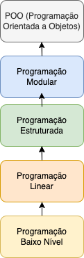
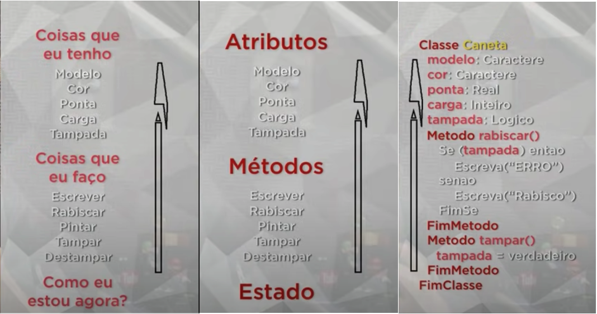
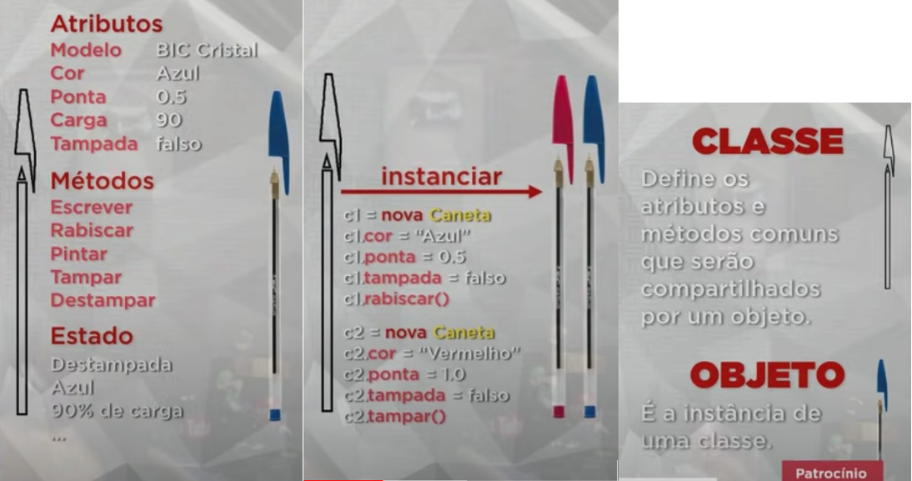

 
 

### 05. JAVA POO [40 Horas] 

- Curso completo de **Programação Orientada a Objetos (POO)** com a linguagem JAVA. 
- Aborda os principais conceitos como Classes, Objetos, instanciamento, abstração, encapsulamento, herança, polimorfismo e muito mais. 
- Criado pelo professor Gustavo Guanabara para o Curso em Vídeo, explica todos os conceitos de POO de uma maneira simples, objetiva e divertida.


<h1 align="center"> JAVA POO - Índice</h1> 

<p align="center"> |&nbsp;&nbsp;&nbsp; 
  <a href="#aula01">Aula 01</a>&nbsp;&nbsp;&nbsp;|&nbsp;&nbsp;&nbsp;
  <a href="#aula02">Aula 02</a>&nbsp;&nbsp;&nbsp;|&nbsp;&nbsp;&nbsp;
  <a href="#aula03">Aula 03</a>&nbsp;&nbsp;&nbsp;|&nbsp;&nbsp;&nbsp;
  <a href="#aula04">Aula 04</a>&nbsp;&nbsp;&nbsp;|&nbsp;&nbsp;&nbsp;
  <a href="#aula05">Aula 05</a>&nbsp;&nbsp;&nbsp;|&nbsp;&nbsp;&nbsp;
  <a href="#aula06">Aula 06</a>&nbsp;&nbsp;&nbsp;|&nbsp;&nbsp;&nbsp;
  <a href="#aula07">Aula 07</a>&nbsp;&nbsp;&nbsp;|&nbsp;&nbsp;&nbsp;
  <a href="#aula08">Aula 08</a>&nbsp;&nbsp;&nbsp;|&nbsp;&nbsp;&nbsp;
  <a href="#aula09">Aula 09</a>&nbsp;&nbsp;&nbsp;|&nbsp;&nbsp;&nbsp;
  <a href="#aula10">Aula 10</a>&nbsp;&nbsp;&nbsp;|&nbsp;&nbsp;&nbsp;
  <a href="#aula11">Aula 11</a>&nbsp;&nbsp;&nbsp;|&nbsp;&nbsp;&nbsp;
  <a href="#aula12">Aula 12</a>&nbsp;&nbsp;&nbsp;|&nbsp;&nbsp;&nbsp;
  <a href="#aula13">Aula 13</a>&nbsp;&nbsp;&nbsp;|&nbsp;&nbsp;&nbsp;
  <a href="#aula14">Aula 14</a>&nbsp;&nbsp;&nbsp;|&nbsp;&nbsp;&nbsp;
  <a href="#aula15">Aula 15</a>&nbsp;&nbsp;&nbsp;|&nbsp;&nbsp;&nbsp;
</p>


### Aulas :bookmark:

1. Aula 1  ✅
    - Aula Teórica 1 – O que é Programação Orientada a Objetos?
    - Aula Prática 1 – Instalando o JDK e NetBeans
2. Aula 2  ✅
    - Aula Teórica 2 – O que é um Objeto?
    - Aula Prática 2 – Criando Classes e Objetos em Java
3. Aula 3  
    - Aula Teórica 3 – O que é Visibilidade em um Objeto?
    - Aula Prática 3 – Configurando Visibilidade de Atributos e Métodos
4. Aula 4  
    - Aula Teórica 4 – Métodos Especiais
    - Aula Prática 4 – Métodos Getter, Setter e Construtor
5. Aula 5  
    - Aula Teórica 5 – Exemplo Prático com Objetos
    - Aula Prática 5 – Exemplo Prático em Java
6. Aula 6 
    - Aula Teórica 6 – Pilares da POO: Encapsulamento
    - Aula Prática 6 – Encapsulamento
7. Aula 7 
    - Aula Teórica 7 – Relacionamento entre Classes
    - Aula Prática 7 – Objetos Compostos em Java
8. Aula 8 
    - Aula Teórica 8 – Relacionamento de Agregação
    - Aula Prática 8 – Agregação entre Objetos com Java
9. Aula 9 
    - Aula Teórica 9 – Exercícios de POO
    - Aula Prática 9 – Exercício prático POO em Java
10. Aula 10 
    - Aula Teórica 10 – Herança (Parte 1)
    - Aula Prática 10 – Herança (Parte 1)
11. Aula 11 
    - Aula Teórica 11 – Herança (Parte 2)
    - Aula Prática 11 – Herança (Parte 2)
12. Aula 12 
    - Aula Teórica 12 – Conceito Polimorfismo (Parte 1)
    - Aula Prática 12 – Polimorfismo em Java (Parte 1)
13. Aula 13  
    - Aula Teórica 13 – Conceito Polimorfismo (Parte 2)
    - Aula Prática 13 – Polimorfismo Sobrecarga (Parte 2)
14. Aula 14 
    - Aula Teórica 14 – Exercícios de POO (Parte 2)
    - Aula Prática 14 – Projeto Final em Java (Parte 1)
15. Aula 15 
    - Aula Teórica 15 – Exercícios de POO (Parte 3)
    - Aula Prática 15 – Projeto Final em Java (Parte 2)

<hr>

### Conteúdo do Módulo :bookmark:


### 1. Aula 1

<u>Aula Teórica 1 – O que é Programação Orientada a Objetos?</u>

Nessa aula de POO, vamos aprender o que é Programação Orientada a Objetos e quais são as suas principais vantagens em relação a outros tipos de Linguagem de Programação.

* Como era?

Programação de baixo nível -> Programação linear -> Programação estruturada -> Programação modular -> POO (Programação Orientada a Objetos)



<a href="#" target="_blank"></a>

* Quem criou (POO) ?
    - Alan Kay


* Linguagens POO
    - C++
    - Java
    - PHP
    - Python
    - Ruby
    - Visual Basic


-  **Vantagens da POO**
    - Acrônimo das vantagens da POO: 

    - <strong><big> C O M E R N </strong>a d a </big>

        - **C** -> **Confiável** -> O isolamento entre as partes gera o software seguro. Ao alterar uma parte, nenhuma outra é afetada;
        - **O** -> **Oportuno** -> Ao dividir tudo em partes, várias delas podem ser desenvolvidas em paralelo;
        - **M** -> **Manutenível** -> Atualizar um software é mais fácil. Uma pequena modificação vai beneficiar todas as partes que usarem o objeto;
        - **E** -> **Extensível** -> O software não é estático. Ele deve crescer para permanecer útil;
        - **R** -> **Reutilizável** -> Podemos usar objetos que criamos em outro sistema futuro;
        - **N**ada -> **Natural** -> Mais fácil de entender. Você se preocupa mais na funcionalidade do que nos detalhes de implementação.

<br>

---

<u>Aula Prática 1 – Instalando o JDK e NetBeans</u>

 

- Estou utilizando o IDE, IntelliJ IDEA.

- O IntelliJ IDEA é um ambiente de desenvolvimento integrado escrito em Java para o desenvolvimento de software de computador. 
- Ele é desenvolvido pela empresa JetBrains.

- Versão do JAVA, comando no terminal: <code> java -version </code>

    ```markdown
    eduardo@MacBook ~ % java -version
    java version "18" 2022-03-22
    Java(TM) SE Runtime Environment (build 18+36-2087)
    Java HotSpot(TM) 64-Bit Server VM (build 18+36-2087, mixed mode, sharing)
    eduardo@MacBook ~ % 
    ```


#### Hello, World

Como criar um tradicional “Olá, Mundo!” (Hello World) em Java.

Estou utilizando o IntelliJ IDEA da JetBrains.

[YouTube - Creating your first Java application with IntelliJ IDEA](https://www.youtube.com/watch?v=H_XxH66lm3U&list=PLoWO2Tlnu1Ow8AWoQ7kj0U3QCdsfQvPmW&index=1)

[Help - Create your first Java application](https://www.jetbrains.com/help/idea/creating-and-running-your-first-java-application.html#run_jar_artifact)

[IntelliJIDEA_ReferenceCard](https://resources.jetbrains.com/storage/products/intellij-idea/docs/IntelliJIDEA_ReferenceCard.pdf)


#### Code completion (IntelliSense):

- Ao digital <code> psvm </code> apresenta <code> public static void main </code> 
```java
public static void main(String[] args) {
         
    } 
```

- Ao digital <code> sout </code> apresenta <code> System.out.println </code> 

```java
    System.out.println(""); 
```


#### Projects

-  Programa <code> class HelloWorld </code>

```java
package com.example.helloworld;

public class HelloWorld {

    // digitar 'psvm' <TAB>
    public static void main(String[] args) {

        // digitar 'sout' <TAB>
        System.out.println("Hello, World!"); 
    }
}
```

<br>

<span id="aula02">

### 2. Aula 2

<u>Aula Teórica 2 – O que é um Objeto?</u>

Nessa aula de POO, vamos aprender os conceitos de Classes e Objetos, passando pela teoria de Atributos, Métodos, Estado e Instâncias. Veja como criar uma classe e instanciar, criando objetos.

- **O que é um objeto?**

    "Coisa material ou abstrata que pode ser percebida pelos sentidos e descrita por meio das suas características, comportamentos e estado atual (status)." [Gustavo Guanabara]
    
    * Tudo que tiver **característica** [ATRIBUTO], **comportamento** [MÉTODO/PROCEDIMENTOS/ROTINAS] e **estado atual** [STATUS] é considerado um **objeto**.

    Exemplo de objeto:
    - Controle Remoto; Caneta.

    <br>

- **OBJETO** 

    Uma **Caneta** é um **Objeto**.

    Antes de criar uma caneta tenho que planejar / classificar como será o objeto caneta, ou seja, tenho que fazer um molde para as canetas (**Classe**)
    
    Todo **objeto** vem a partir de uma **classe** (molde que foi gerado para criar o objeto).

    <br>
 

- **CLASSE**

    - Uma **classe** precisa responde as 3 perguntas abaixo:

    <br>

    * **Coisas que eu tenho? &nbsp;&nbsp; <big>(ATRIBUTO)</big>**
        - Modelo
        - Cor
        - Ponta
        - Carga
        - Tampada

    * **Coisas que eu faço? &nbsp;&nbsp; <big>(MÉTODO)</big>**
        - Escrever( )
        - Rabiscar( )
        - Pintar( )
        - Tampar( )
        - Destampar( )

    * **Como eu estou agora? &nbsp;&nbsp; <big>(ESTADO ATUAL)</big>**
        - Cor azul
        - Ponta do tipo fina
        - 50% de carga
        - A caneta está sem tampa (tampa aberta)
        - A caneta está escrevendo agora



<a href="#" target="_blank"></a>


<a href="#" target="_blank"></a>


- **POO** :

- **OBJETO**

- "É a instância de uma classe."

    - **Atributos** (características) -> Coisas que eu tenho;
    - **Métodos** (comportamentos) -> Coisas que eu faço;
    - **Estado atual** (estado/características atuais no momento que estou analisando o objeto) -> Como eu estou agora.

- **CLASSE**

    - "Define os atributos e métodos comuns que serão compartilhados por um objeto."

    - **Classes** são os modelos ou moldes nos quais surgirão os objetos. 
    As classes definem algumas propriedades e métodos que deverão fazer parte do objeto que derivar dela ou então, como dizemos, os objetos que serão instanciados a partir dela.

<br>

- **OBJETO**

    É a instância de uma classe. 
    **Instanciar** é quando pego uma classe e consigo gerar um objeto a partir dela.

<br>

- **ABSTRAÇÃO**

    [Conceito de Abstração] &rarr; Habilidade de concentrar-se nos aspectos essenciais de um domínio, ignorando características menos importantes ou acidentais. Nesse contexto, objetos são abstrações de entidades existentes no domínio em questão.

    Abstração consiste de focalizar nos aspectos essenciais inerentes a uma entidade e ignorar propriedades menos importantes  ou "acidentais."
    
    Em termos de desenvolvimento de sistemas, isto significa concentrar-se no que um objeto é e faz antes de se decidir como ele será implementado. 
    O uso de abstração preserva a liberdade para tomar decisões de desenvolvimento ou de implementação apenas quando há um melhor entendimento do problema a ser resolvido.

<br>

<u>Aula Prática 2 – Criando Classes e Objetos em Java</u>


<br>

<span id="aula03">

### 3. Aula 3

#### Aula Teórica 3 – O que é Visibilidade em um Objeto?

Nessa aula de POO, vamos aprender qual a importância dos modificadores de visibilidade público (+), privado (-) e protegido (#) na Programação Orientada a Objetos.

- UML - Linguagem Modelada Unificada


- Diagrama de Classes

    No Diagrama de Classes -> toda classe será representada por um retangulo.

- **Modificadores de Visibilidade**

    Indicam o nível de acesso aos componentes internos de uma classe na Programação Orientada a Objetos (POO):

    - público   ( + )
    - privado   ( - )
    - protegido ( # )

   

| Simbolo   | Modificadores de Visibilidade | Definição |
| :---------:                   | :-----:| :-----|
| +  | **public** (público)     | a classe atual e todas as outras classes |
| -  | **private** (privado)    | somente a classe atual |
| #  | **protected** (protegido)| a classe atual e todas as suas sub-classes |


<a href="#" target="_blank"></a>

<a href="#" target="_blank"></a>

<a href="#" target="_blank"></a>

<a href="#" target="_blank"></a>

<a href="#" target="_blank"></a>

<a href="#" target="_blank"></a>

<a href="#" target="_blank"></a>

<a href="#" target="_blank"></a>

<a href="#" target="_blank"></a>


#### Aula Prática 3 – Configurando Visibilidade de Atributos e Métodos

Nessa aula de POO, vamos aprender na prática como utilizar os modificadores de visibilidade public, private e protected e qual é o efeito de cada um deles.


<br>

<span id="aula04">

### 4. Aula 4

#### Aula Teórica 4 – Métodos Especiais

Nessa aula de POO, vamos aprender como funcionam os Métodos Acessores (Getters), Métodos Modificadores (Setters) e Métodos Construtores (Construct) para a Programação Orientada a Objetos. 

- **Métodos Acessores (Getters)** &rarr; são métodos que dão acesso a uma determinada coisa; Getter (sentido de pegar/acessar alguma coisa), ele pega/acessa alguma informação c/ segurança. 

Os Métodos Acessores (Getters) conseguem acessar um determinado atributo mantendo a segurança de acesso a ele.


- **Métodos Modificadores (Setters)** &rarr; são métodos que modificam coisas dentro de um objeto. Setters (sentido de modificar/atualizar alguma coisa), ele modifica alguma informação c/ segurança.


**Getters** e **setters** são usados para proteger seus dados, especialmente na criação de classes.

Para cada instância de variável, um método **getter** retorna seu valor, enquanto um método **setter** o define ou atualiza. Com isso em mente, getters e setters também são conhecidos como métodos de acesso e de modificação, respectivamente.

Por convenção, **getters** começam com a palavra "**get**" e **setters** com a palavra "**set**", seguidos de um nome de variável.

**Por que usar getters e setters?**
Getters e setters permitem controlar a forma como variáveis importantes são acessadas e atualizadas no seu código. 


- **Métodos Construtores (Construct)** &rarr; Classes que tem um método construtor chamam o método a cada objeto recém criado, sendo apropriado para qualquer inicialização que o objeto necessite antes de ser utilizado.

O método construtor (Construct) de uma classe serve para executar algum comportamento (atribuição de valor, execução de método, etc) logo no momento em que uma instancia da mesma for criada. Isso traz vantagens pois evita a execução de tarefas repetitivas e obrigatórias.

**Construtores** são métodos ordinários que são chamados durante a criação do objeto correspondente. Eles podem definir um número arbitrários de argumentos, quais podem ser obrigatórios, podem ter um tipo, e podem ter valores padrão. Argumentos de construtores são informados dentro de parênteses depois do nome da classe.


<a href="#" target="_blank"></a>

<a href="#" target="_blank"></a>

<a href="#" target="_blank"></a>

<a href="#" target="_blank"></a>

<a href="#" target="_blank"></a>

<a href="#" target="_blank"></a>

<a href="#" target="_blank"></a>

<br>

#### Aula Prática 4 – Métodos Getter, Setter e Construtor


<br>

<span id="aula05">

### 5. Aula 5

#### Aula Teórica 5 – Exemplo Prático com Objetos

Nessa aula de POO, vamos fazer um exemplo prático com Programação Orientada a Objetos, usando tudo aquilo que aprendemos até aqui.


<a href="#" target="_blank"></a>

<a href="#" target="_blank"></a>

<a href="#" target="_blank"></a>

<a href="#" target="_blank"></a>

<a href="#" target="_blank"></a>

<a href="#" target="_blank"></a>

<a href="#" target="_blank"></a>

<a href="#" target="_blank"></a>

<a href="#" target="_blank"></a>

<a href="#" target="_blank"></a>

<a href="#" target="_blank"></a>

<a href="#" target="_blank"></a>

<a href="#" target="_blank"></a>


#### Aula Prática 5 – Exemplo Prático em PHP


<br>

<span id="aula06">

### 6. Aula 6

#### Aula Teórica 6 – Pilares da POO: Encapsulamento

Nessa aula de POO, vamos aprender quais são os três pilares da Programação Orientada a Objetos e vamos estudar o primeiro pilar: o **Encapsulamento** da POO.

**Encapsulamento**

O princípio de esconder a estrutura de dados utilizada e somente prover uma interface bem definida é chamado de encapsulamento.

**Algumas definições comuns de encapsulamento:**
  1. Encapsulamento é o processo de esconder todos os detalhes de um objeto que não contribuem para as suas características essenciais.
2. Encapsulamento é um princípio, utilizando quando se está desenvolvendo a estrutura geral de um programa, no qual cada componente de um programa deve encapsular ou esconder cada decisão de projeto (...) A interface com cada módulo é definida de forma a revelar o mínimo possível sobre o seu funcionamento interno.
3. O encapsulamento esconde detalhes de implementação do objeto (métodos) e o que sobra visível é a sua interface, isto é, o conjunto de todas as mensagens a que ele pode responder. Uma vez que o objeto é encapsulado, seus detalhes de implementação não são mais imediatamente acessíveis. Ao invés disso, eles são empacotados e são somente indiretamente acessíveis através da interface do objeto. A única forma de acessar a um objeto encapsulado é através da troca de mensagens: é enviada uma mensagem ao objeto, o objeto mesmo seleciona o método pelo qual ele irá reagir à mensagem.
 
Podemos dizer portanto que os objetos possuem uma parte interna, os dados, que não podem ser acessados por outros objetos do sistema, e outra externa, os métodos, que permitem a alteração ou verificação de seu estado.


**Os Benefícios do Encapsulamento:**

**Modularidade**: o código-fonte para um objeto pode ser escrito e mantido independentemente do código-fonte de outros objetos (desacoplamento). Além disso, como não dependem de outros objetos, cada objeto pode ser utilizado livremente no sistema. Por exemplo, você pode dar sua bicicleta a alguém e mesmo assim ela funcionará. O objeto bicicleta deve ser independente dos objetos que a utilizam (objetos ciclistas).

**Ocultação de informações**: um objeto possui uma interface pública que outros objetos podem utilizar para comunicarem-se com ele. Mas o objeto pode manter informações privadas e métodos podem ser modificados em qualquer momento sem afetar os outros objetos que dependem dele. Por exemplo, você não precisa de entender o funcionamento interno do mecanismo de marchas da sua bicicleta para utilizá-lo.

A única parte do objeto que o resto do sistema precisa conhecer é sua interface.

<br>


<a href="#" target="_blank"></a>

<a href="#" target="_blank"></a>

<a href="#" target="_blank"></a>

<a href="#" target="_blank"></a>

<a href="#" target="_blank"></a>

<a href="#" target="_blank"></a>

<a href="#" target="_blank"></a>

<a href="#" target="_blank"></a>

<a href="#" target="_blank"></a>

<a href="#" target="_blank"></a>

<a href="#" target="_blank"></a>

<a href="#" target="_blank"></a>

<a href="#" target="_blank"></a>

<a href="#" target="_blank"></a>

<a href="#" target="_blank"></a>

<a href="#" target="_blank"></a>

<a href="#" target="_blank"></a>

<a href="#" target="_blank"></a>

<a href="#" target="_blank"></a>

<a href="#" target="_blank"></a>

<a href="#" target="_blank"></a>

<a href="#" target="_blank"></a>

<a href="#" target="_blank"></a>

<a href="#" target="_blank"></a>

<a href="#" target="_blank"></a>


<hr>


#### Aula Prática 6 – Encapsulamento


<br>

<span id="aula07">

### 7. Aula 7

#### Aula Teórica 7 – Relacionamento entre Classes

Nessa aula de POO, vamos aprender como fazer relacionamentos entre as classes.


<!-- 
<a href="#" target="_blank"></a> -->

<a href="#" target="_blank"></a>

<a href="#" target="_blank"></a>

<a href="#" target="_blank"></a>

<a href="#" target="_blank"></a>

<a href="#" target="_blank"></a>

<a href="#" target="_blank"></a>

<a href="#" target="_blank"></a>

<a href="#" target="_blank"></a>

<a href="#" target="_blank"></a>

<a href="#" target="_blank"></a>

<a href="#" target="_blank"></a>

<a href="#" target="_blank"></a>

<a href="#" target="_blank"></a>

<a href="#" target="_blank"></a>

<a href="#" target="_blank"></a>

<a href="#" target="_blank"></a>

<a href="#" target="_blank"></a>

<a href="#" target="_blank"></a>


#### Aula Prática 7 – Objetos Compostos em PHP


<br>

<span id="aula08">

### 8. Aula 8

Objetos são instância de classes.

Preciso de uma Classe para poder instanciar um Objeto.

Não consigo ter Objetos sem ter uma Classe definindo a estrutura.

Uma Classe encapsula dados e funcionalidades.

Na programação OO, o encapsulamento se refere ao agrupamento de dados com os métodos que operam nesses dados ou à restrição do acesso direto a alguns dos componentes de um objeto.


#### Aula Teórica 8 – Relacionamento de Agregação

Nessa aula de POO, vamos aprender como realizar um relacionamento de agregação entre classes para gerar objetos ainda mais poderosos.


<a href="#" target="_blank"></a>

<a href="#" target="_blank"></a>

<a href="#" target="_blank"></a>

<a href="#" target="_blank"></a>

<a href="#" target="_blank"></a>

<a href="#" target="_blank"></a>

<a href="#" target="_blank"></a>

<a href="#" target="_blank"></a>

<a href="#" target="_blank"></a>

<a href="#" target="_blank"></a>

<a href="#" target="_blank"></a>

<a href="#" target="_blank"></a>

<a href="#" target="_blank"></a>

<a href="#" target="_blank"></a>


#### Aula Prática 8 – Agregação entre Objetos em PHP


<br>

<span id="aula09">

### 9. Aula 9

#### Aula Teórica 9 – Exercícios de POO

Nessa aula de POO, vamos fazer alguns exercícios de Programação Orientada a Objeto conceituais que já apareceram em concursos. Coloque em prática tudo aquilo que aprendeu até aqui.


<a href="#" target="_blank"></a>

<a href="#" target="_blank"></a>

<a href="#" target="_blank"></a>

<a href="#" target="_blank"></a>

<a href="#" target="_blank"></a>

<a href="#" target="_blank"></a>

<a href="#" target="_blank"></a>

<a href="#" target="_blank"></a>

<a href="#" target="_blank"></a>

<a href="#" target="_blank"></a>

<a href="#" target="_blank"></a>

<a href="#" target="_blank"></a>

<a href="#" target="_blank"></a>

<a href="#" target="_blank"></a>

<a href="#" target="_blank"></a>


* Q1 -> Uma casa está para uma planta arquitetônica assim como um **objeto** está para... 

**uma classe**

* Q2 -> Vantagens da POO

**C O M E R N**ada
- **C** -> Confiável
- **O**-> Oportuno
- **M** -> Manutenível
- **E** -> Extensível
- **R** -> Reutilizavel
- **N**ada -> Natural

* Q3

- Uma **classe** é instância de um **objeto**.

* Q4

- **OBJETO** -> construção de sw que encapsula estado e comportamento
- **CLASSE** -> define os atributos e comportamentos comuns
- **ATRITUBO** -> característica de uma classe que é visível
- **COMPORTAMENTO** -> ação executada por um objeto
- **DOMÍNIO** -> espaço onde o problema reside

* Q5 

- Uma **variável interna** é um valor mantido dentro do objeto
- **Atributos** são as características de uma classe visíveis externamente
- **Comportamentos (Métodos)** são funcionalidades externas.
- O **estado de um objeto** é o significado das variáveis internas do objeto

* Q6

- **Construtor** -> métodos usados para inicializar objetos durante a inicialização
- **Acessor** -> métodos que dão acessos aos dados internos
- **Mutante (Modificador)** -> métodos que permitem que se altere o estado de um objeto.
- **Tipos** -> define as diferentes espécies de valores que podem ser usados

* Q7 - 3 Pilares da POO (Programação Orientada a Objetos)

-  E H P
- **Encapsulamento**
- **Herança**
- **Polimorfismo** 

* Q8

- **CLASSE** -> define os atributos e comportamentos (métodos) compartilhados
- **OBJETO** -> instanciação de uma classe
- **CONSTRUTOR** -> utilizado para inicializar objetos
- **INTERFACE** -> Define o que uma entidade pode fazer com o objeto. A interface diz quais são os métodos que são determinados como públicos que estão diretamente acessíveis.

* Q9 - Níveis de acesso (visibilidade) em POO

- público (+) , privado (-) e protegido (#).

* Q10 - niveis de acesso (Visibilidade dos Modificadores)

- público (+) -> qualquer um pode acessar. A classe atual e outras classes.
- privado (-) -> é visível somente dentro da classe. Somente a classe atual.
- protegido (#) -> nível intermediário entre o publico e o privado. A classe atual e todas as sub-classes (filhas)

- Q11

- Conceito de **Encapsulamento** -> A proteção de atributos e operações das classes, fazendo com que estas se comuniquem com o meio externo por meio de suas interfaces.

- Q12

- **Implementação** -> define os detalhes internos do componente
- **Interface** -> lista os serviços fornecidos por ele.

- Q13

- **ENCAPSULAMENTO** -> é a característica da POO que permite separar o programa em várias partes menores e independentes. Cada parte possui sua implementação isolada e realiza seu trabalho de forma autônoma. Com essa característica é possível ocultar os detalhes internos de cada parte através de uma interface.

* Q14

- **ABSTRAÇÃO** -> significa representar uma entidade, incluindo apenas seus atributos relevantes.

* Q15

- **CLASSES** -> são tipos abstratos de dados
- **OBJETOS** -> são instâncias de uma classe
- **SUBCLASSE** -> é um classe definida por meio de outra classe
- **MÉTODOS** -> são subprogramas que definem as operações em objetos de uma classe.

<br>

#### Aula Prática 9 – Exercício prático POO em PHP


<br>

<span id="aula10">

### 10. Aula 10

#### Aula Teórica 10 – Herança (Parte 1)

Nessa aula de POO, vamos aprender o que é Herança em Programação Orientada a Objetos.


<a href="#" target="_blank"></a>

<a href="#" target="_blank"></a>

<a href="#" target="_blank"></a>

<a href="#" target="_blank"></a>

<a href="#" target="_blank"></a>

<a href="#" target="_blank"></a>

<a href="#" target="_blank"></a>

<a href="#" target="_blank"></a>

<a href="#" target="_blank"></a>

<a href="#" target="_blank"></a>

<a href="#" target="_blank"></a>

<a href="#" target="_blank"></a>

<a href="#" target="_blank"></a>

<a href="#" target="_blank"></a>

<a href="#" target="_blank"></a>


#### Aula Prática 10 – Herança (Parte 1)


<br>

<span id="aula11">

### 11. Aula 11

#### Aula Teórica 11 – Herança (Parte 2)

Nessa aula de POO, vamos aprender como funcionam os tipos de Herança, que são a Herança de Implementação e Herança para Diferença. Além disso, vamos ver algumas nomenclaturas importantes para a Programação Orientada a Objetos.


<a href="#" target="_blank"></a>

<a href="#" target="_blank"></a>

<a href="#" target="_blank"></a>

<a href="#" target="_blank"></a>

<a href="#" target="_blank"></a>

<a href="#" target="_blank"></a>

<a href="#" target="_blank"></a>

<a href="#" target="_blank"></a>

<a href="#" target="_blank"></a>

<a href="#" target="_blank"></a>

<a href="#" target="_blank"></a>

<a href="#" target="_blank"></a>

<a href="#" target="_blank"></a>

<a href="#" target="_blank"></a>

<a href="#" target="_blank"></a>


#### Aula Prática 11 – Herança (Parte 2)


<br>

<span id="aula12">

### 12. Aula 12

#### Aula Teórica 12 – Conceito Polimorfismo (Parte 1)

Nessa aula de POO, vamos aprender como funciona o Polimorfismo em Programação Orientada a Objetos, o terceiro pilar de teoria.


<a href="#" target="_blank"></a>

<a href="#" target="_blank"></a>

<a href="#" target="_blank"></a>

<a href="#" target="_blank"></a>

<a href="#" target="_blank"></a>

<a href="#" target="_blank"></a>

<a href="#" target="_blank"></a>

<a href="#" target="_blank"></a>

<a href="#" target="_blank"></a>

<a href="#" target="_blank"></a>

<a href="#" target="_blank"></a>

<a href="#" target="_blank"></a>

<a href="#" target="_blank"></a>

<a href="#" target="_blank"></a>

<a href="#" target="_blank"></a>

<a href="#" target="_blank"></a>

<a href="#" target="_blank"></a>

<a href="#" target="_blank"></a>

<a href="#" target="_blank"></a>

<a href="#" target="_blank"></a>

<a href="#" target="_blank"></a>


#### Aula Prática 12 – Polimorfismo em PHP (Parte 1)


<br>

<span id="aula13">

### 13. Aula 13

#### Aula Teórica 13 – Conceito Polimorfismo (Parte 2)

Nessa aula de POO, vamos aprender como aplicar o Polimorfismo de Sobrecarga às nossas classes. Veja também a diferença entre sobrecarga e sobreposição, algo que muita gente confunde.


<a href="#" target="_blank"></a>

<a href="#" target="_blank"></a>

<a href="#" target="_blank"></a>

<a href="#" target="_blank"></a>

<a href="#" target="_blank"></a>

<a href="#" target="_blank"></a>

<a href="#" target="_blank"></a>

<a href="#" target="_blank"></a>


#### Aula Prática 13 – Polimorfismo Sobrecarga (Parte 2)


<br>

<span id="aula14">

### 14. Aula 14

#### Aula Teórica 14 – Exercícios de POO (Parte 2)

Nessa aula de POO, vamos fazer uma lista de exercícios de programação orientada a objetos para você testar os seus conhecimentos adquiridos durante as 13 primeiras aulas do curso.

- Exercícios de POO


<a href="#" target="_blank"></a>

<a href="#" target="_blank"></a>

<a href="#" target="_blank"></a>

<a href="#" target="_blank"></a>

<a href="#" target="_blank"></a>

<a href="#" target="_blank"></a>

<a href="#" target="_blank"></a>

<a href="#" target="_blank"></a>

<a href="#" target="_blank"></a>

<a href="#" target="_blank"></a>

<br>

- Respostas aos Exercícios de POO


<a href="#" target="_blank"></a>

<a href="#" target="_blank"></a>

<a href="#" target="_blank"></a>

<a href="#" target="_blank"></a>

<a href="#" target="_blank"></a>

<a href="#" target="_blank"></a>

<a href="#" target="_blank"></a>

<a href="#" target="_blank"></a>

<a href="#" target="_blank"></a>

<a href="#" target="_blank"></a>

<br>

#### Aula Prática 14 – Projeto Final em PHP (Parte 1)

Nessa aula de POO, vamos iniciar a construção de um exemplo completo de um modelo 100% construído em Programação Orientada a Objetos com PHP.


<a href="#" target="_blank"></a>

<a href="#" target="_blank"></a>

<br>


<span id="aula15">

### 15. Aula 15

#### Aula Teórica 15 – Exercícios de POO (Parte 3)

Nessa aula de POO, vamos fazer mais 10 Exercícios de Programação Orientada a Objetos e continuar a construção do modelo do Diagrama de Classes da aula anterior.

- Exercícios de POO


<a href="#" target="_blank"></a>

<a href="#" target="_blank"></a>

<a href="#" target="_blank"></a>

<a href="#" target="_blank"></a>

<a href="#" target="_blank"></a>

<a href="#" target="_blank"></a>

<a href="#" target="_blank"></a>

<a href="#" target="_blank"></a>

<br><br>

- Respostas aos Exercícios de POO


<a href="#" target="_blank"></a>

<a href="#" target="_blank"></a>

<a href="#" target="_blank"></a>

<a href="#" target="_blank"></a>

<a href="#" target="_blank"></a>

<a href="#" target="_blank"></a>

<a href="#" target="_blank"></a>

<a href="#" target="_blank"></a>


#### Aula Prática 15 – Projeto Final em PHP (Parte 2)

Nessa aula de POO, vamos aplicar o modelo de agregação em Classes utilizando linguagem PHP. Um exercício prático e completamente feito em Programação Orientada a Objetos.


<a href="#" target="_blank"></a>

<a href="#" target="_blank"></a>


<a href="#" target="_blank"></a>

<a href="#" target="_blank"></a>


<hr>

<span id="autor">

### Autor :smile:

<div align="rigth">
  <a href="https://github.com/eduardodsr">
   
  </a>
</div>

  * ` Dev: ` Eduardo da Silva Rodrigues
  
  * ` GitHub: ` [github.com/eduardodsr](https://www.github.com/eduardodsr) :link:
 
  * ` E-mail: ` <eduardodsr@gmail.com> :email:

