 

### 05. JAVA POO [40 Horas]

- Curso completo de **Programação Orientada a Objetos (POO)** com a linguagem JAVA.
- Aborda os principais conceitos como Classes, Objetos, instanciamento, abstração, encapsulamento, herança, polimorfismo e muito mais.
- Criado pelo professor Gustavo Guanabara para o Curso em Vídeo, explica todos os conceitos de POO de uma maneira simples, objetiva e divertida.

<h1 align="center"> JAVA POO - Índice</h1>

<p align="center"> |&nbsp;&nbsp;&nbsp; 
  <a href="#aula01">Aula 01</a>&nbsp;&nbsp;&nbsp;|&nbsp;&nbsp;&nbsp;
  <a href="#aula02">Aula 02</a>&nbsp;&nbsp;&nbsp;|&nbsp;&nbsp;&nbsp;
  <a href="#aula03">Aula 03</a>&nbsp;&nbsp;&nbsp;|&nbsp;&nbsp;&nbsp;
  <a href="#aula04">Aula 04</a>&nbsp;&nbsp;&nbsp;|&nbsp;&nbsp;&nbsp;
  <a href="#aula05">Aula 05</a>&nbsp;&nbsp;&nbsp;|&nbsp;&nbsp;&nbsp;
  <a href="#aula06">Aula 06</a>&nbsp;&nbsp;&nbsp;|&nbsp;&nbsp;&nbsp;
  <a href="#aula07">Aula 07</a>&nbsp;&nbsp;&nbsp;|&nbsp;&nbsp;&nbsp;
  <a href="#aula08">Aula 08</a>&nbsp;&nbsp;&nbsp;|&nbsp;&nbsp;&nbsp;
  <a href="#aula09">Aula 09</a>&nbsp;&nbsp;&nbsp;|&nbsp;&nbsp;&nbsp;
  <a href="#aula10">Aula 10</a>&nbsp;&nbsp;&nbsp;|&nbsp;&nbsp;&nbsp;
  <a href="#aula11">Aula 11</a>&nbsp;&nbsp;&nbsp;|&nbsp;&nbsp;&nbsp;
  <a href="#aula12">Aula 12</a>&nbsp;&nbsp;&nbsp;|&nbsp;&nbsp;&nbsp;
  <a href="#aula13">Aula 13</a>&nbsp;&nbsp;&nbsp;|&nbsp;&nbsp;&nbsp;
  <a href="#aula14">Aula 14</a>&nbsp;&nbsp;&nbsp;|&nbsp;&nbsp;&nbsp;
  <a href="#aula15">Aula 15</a>&nbsp;&nbsp;&nbsp;|&nbsp;&nbsp;&nbsp;
</p>

### Aulas :bookmark:

1. Aula 1
   - Aula Teórica 1 – O que é Programação Orientada a Objetos?
   - Aula Prática 1 – Instalando o JDK e NetBeans
2. Aula 2
   - Aula Teórica 2 – O que é um Objeto?
   - Aula Prática 2 – Criando Classes e Objetos em Java
3. Aula 3
   - Aula Teórica 3 – O que é Visibilidade em um Objeto?
   - Aula Prática 3 – Configurando Visibilidade de Atributos e Métodos
4. Aula 4
   - Aula Teórica 4 – Métodos Especiais
   - Aula Prática 4 – Métodos Getter, Setter e Construtor
5. Aula 5
   - Aula Teórica 5 – Exemplo Prático com Objetos
   - Aula Prática 5 – Exemplo Prático em Java
6. Aula 6
   - Aula Teórica 6 – Pilares da POO: Encapsulamento
   - Aula Prática 6 – Encapsulamento
7. Aula 7
   - Aula Teórica 7 – Relacionamento entre Classes
   - Aula Prática 7 – Objetos Compostos em Java
8. Aula 8
   - Aula Teórica 8 – Relacionamento de Agregação
   - Aula Prática 8 – Agregação entre Objetos com Java
9. Aula 9
   - Aula Teórica 9 – Exercícios de POO
   - Aula Prática 9 – Exercício prático POO em Java
10. Aula 10
    - Aula Teórica 10 – Herança (Parte 1)
    - Aula Prática 10 – Herança (Parte 1)
11. Aula 11
    - Aula Teórica 11 – Herança (Parte 2)
    - Aula Prática 11 – Herança (Parte 2)
12. Aula 12
    - Aula Teórica 12 – Conceito Polimorfismo (Parte 1)
    - Aula Prática 12 – Polimorfismo em Java (Parte 1)
13. Aula 13
    - Aula Teórica 13 – Conceito Polimorfismo (Parte 2)
    - Aula Prática 13 – Polimorfismo Sobrecarga (Parte 2)
14. Aula 14
    - Aula Teórica 14 – Exercícios de POO (Parte 2)
    - Aula Prática 14 – Projeto Final em Java (Parte 1)
15. Aula 15
    - Aula Teórica 15 – Exercícios de POO (Parte 3)
    - Aula Prática 15 – Projeto Final em Java (Parte 2)

<hr>

### Conteúdo do Módulo :bookmark:

### 1. Aula 1

<u>Aula Teórica 1 – O que é Programação Orientada a Objetos?</u>

Nessa aula de POO, vamos aprender o que é Programação Orientada a Objetos e quais são as suas principais vantagens em relação a outros tipos de Linguagem de Programação.

- Como era?

Programação de baixo nível -> Programação linear -> Programação estruturada -> Programação modular -> POO (Programação Orientada a Objetos)


<a href="#" target="_blank"></a>

- O que é Programação Orientada a Objetos?
- A programação orientada à objetos (POO), surgiu com a finalidade de facilitar a vida de programadores.
- Na POO, os objetos conversam entre si.
- Criada por Alan Kay, um Biólogo e Matemático, que formulou sua “analogia algébrico-biológica” e lançou o postulado de que o computador ideal deveria funcionar como um organismo vivo, isto é, cada “célula” relacionando-se com outras.
- “As coisas simples devem ser simples e as coisas complexas, possíveis.” - Alan Kay

<br>

- Quem criou (POO) ?

  - Alan Kay

- Linguagens POO
  - C++
  - Java
  - PHP
  - Python
  - Ruby
  - Visual Basic

* **Vantagens da POO** (C O M E R N a d a)

1. Confiável
2. Oportuno
3. Manutenível
4. Extensível
5. Reutilizável
6. Natural

<br>

- **Vantagens da POO** :

  - <strong><big> C O M E R N </strong>a d a </big>

1. **C**onfiável -> O isolamento entre as partes gera o software seguro. Ao alterar uma parte, nenhuma outra é afetada;
2. **O**portuno -> Ao dividir tudo em partes, várias delas podem ser desenvolvidas em paralelo;
3. **M**anutenível -> Atualizar um software é mais fácil. Uma pequena modificação vai beneficiar todas as partes que usarem o objeto;
4. **E**xtensível -> O software não é estático. Ele deve crescer para permanecer útil;
5. **R**eutilizável -> Podemos usar objetos que criamos em outro sistema futuro;
6. **Na**tural -> Mais fácil de entender. Você se preocupa mais na funcionalidade do que nos detalhes de implementação.

<br>

---

<u>Aula Prática 1 – Instalando o JDK e IntelliJ IDEA</u>


- Estou utilizando o IDE, IntelliJ IDEA.

  - Link para Download: https://www.jetbrains.com/pt-br/idea/download/

- O IntelliJ IDEA é um ambiente de desenvolvimento integrado escrito em Java para o desenvolvimento de software de computador.
- Ele é desenvolvido pela empresa JetBrains.

- Versão do JAVA, comando no terminal: <code> java -version </code>

  ```markdown
  eduardo@MacBook ~ % java -version
  java version "18" 2022-03-22
  Java(TM) SE Runtime Environment (build 18+36-2087)
  Java HotSpot(TM) 64-Bit Server VM (build 18+36-2087, mixed mode, sharing)
  eduardo@MacBook ~ %
  ```

#### Hello, World

Como criar um tradicional “Olá, Mundo!” (Hello World) em Java.

Estou utilizando o IntelliJ IDEA da JetBrains.

[YouTube - Creating your first Java application with IntelliJ IDEA](https://www.youtube.com/watch?v=H_XxH66lm3U&list=PLoWO2Tlnu1Ow8AWoQ7kj0U3QCdsfQvPmW&index=1)

[Help - Create your first Java application](https://www.jetbrains.com/help/idea/creating-and-running-your-first-java-application.html#run_jar_artifact)

[IntelliJIDEA_ReferenceCard](https://resources.jetbrains.com/storage/products/intellij-idea/docs/IntelliJIDEA_ReferenceCard.pdf)

#### Code completion (IntelliSense):

- Ao digital <code> psvm </code> apresenta <code> public static void main </code>

```java
public static void main(String[] args) {

    }
```

- Ao digital <code> sout </code> apresenta <code> System.out.println </code>

```java
    System.out.println("");
```

#### Projects

- Programa <code> class HelloWorld </code>

```java
package com.example.helloworld;

public class HelloWorld {

    // digitar 'psvm' <TAB>
    public static void main(String[] args) {

        // digitar 'sout' <TAB>
        System.out.println("Hello, World!");
    }
}
```

<code> &rarr; Run 🖥️ &lt;HelloWorld&gt; </code>

```markdown
Hello, World!
```

<br>

<span id="aula02">

### 2. Aula 2

<u>Aula Teórica 2 – O que é um Objeto?</u>

Nessa aula de POO, vamos aprender os conceitos de Classes e Objetos, passando pela teoria de Atributos, Métodos, Estado e Instâncias. Veja como criar uma classe e instanciar, criando objetos.

- **O que é um objeto?**

  [Conceito de Objeto] &rarr; "Coisa material ou abstrata que pode ser percebida pelos sentidos e descrita por meio das suas características, comportamentos e estado atual (status)." [Gustavo Guanabara]

  - Tudo que tiver: <br>

    - **característica** [ ATRIBUTO ],
    - **comportamento** [MÉTODO / PROCEDIMENTOS / ROTINAS] e
    - **estado atual** [ STATUS ] é considerado um **objeto**.

  - Exemplo de objeto:

    - Controle Remoto; Caneta.

    <br>

- **OBJETO**

  Uma **Caneta** é um **Objeto**.

  Antes de criar uma caneta tenho que planejar/classificar como será o objeto caneta, ou seja, tenho que fazer um molde para as canetas (**Classe**).

  Todo **objeto** vem a partir de uma **classe** (molde que foi gerado para criar o objeto).

    <br>

- **CLASSE**

  - Uma **classe** precisa responde as 3 perguntas abaixo:

    <br>

  - 1 - **Coisas que eu tenho? &nbsp;&nbsp; <big>[ ATRIBUTO ]</big>**

    - Modelo
    - Cor
    - Ponta
    - Carga
    - Tampada

  - 2 - **Coisas que eu faço? &nbsp;&nbsp; <big>[ MÉTODO]</big>**

    - Escrever( )
    - Rabiscar( )
    - Pintar( )
    - Tampar( )
    - Destampar( )

  - 3 - **Como eu estou agora? &nbsp;&nbsp; <big>[ ESTADO ATUAL ]</big>**
    - Cor azul
    - Ponta do tipo fina
    - 50% de carga
    - A caneta está sem tampa, ou seja. a tampa da caneta está aberta
    - A caneta está escrevendo agora


<a href="#" target="_blank"></a>


<a href="#" target="_blank"></a>

---

#### POO (Programação Orientada a Objetos)

- **OBJETO**

  - [Conceito de Objeto] &rarr; "É a instância de uma classe."

    <br>

- **CLASSE**

  - [Conceito de Classe] &rarr; "Define os atributos e métodos comuns que serão compartilhados por um objeto."

  - **Classes** são os modelos ou moldes nos quais surgirão os objetos.

  - As classes definem algumas propriedades e métodos que deverão fazer parte do objeto que derivar dela ou então, como dizemos, os objetos que serão instanciados a partir dela.
    <br>

  - **Atributos** (características) &rarr; Coisas que eu tenho?
  - **Métodos** (comportamentos) &rarr; Coisas que eu faço?
  - **Estado atual** (característica/estado atual) &rarr; no momento que estou analisando o objeto. &rarr; Como eu estou agora?
    <br>

* Em POO, essas perguntas são representadas da seguinte maneira: <br>

1. **Atributos** = Como o objeto é;
2. **Métodos** = O que o objeto faz;
3. **Estado** = Estado atual.

- Dica: Para gravar **A**TRIBUTOS, **M**ÉTODOS & **E**STADO, lembre-se da sigla AME.

<br>

- **OBJETO**

  [Conceito de Objeto] &rarr; É a instância de uma classe.
  **Instanciar** é quando pego uma _Classe_ e consigo gerar um _Objeto_ a partir dela.

<br>

- **ABSTRAÇÃO**

  [Conceito de Abstração] &rarr; Habilidade de concentrar-se nos aspectos essenciais de um domínio, ignorando características menos importantes ou acidentais. Nesse contexto, objetos são abstrações de entidades existentes no domínio em questão.

  Abstração consiste de focalizar nos aspectos essenciais inerentes a uma entidade e ignorar propriedades menos importantes ou "acidentais."

  Em termos de desenvolvimento de sistemas, isto significa concentrar-se no que um objeto é e faz antes de se decidir como ele será implementado.
  O uso de abstração preserva a liberdade para tomar decisões de desenvolvimento ou de implementação apenas quando há um melhor entendimento do problema a ser resolvido.

<br>

---

<u>Aula Prática 2 – Criando Classes e Objetos em Java</u>

Nessa aula de POO, vamos aprender como criar uma Classe, com seus atributos e métodos, e a instanciar novos objetos a partir dessa classe inicial.

- Programa Aula02

<code> class Caneta </code>

```java
package aula02;

public class Caneta {
    // Atributos
    String modelo;
    String cor;
    float ponta;
    int carga;
    boolean tampada;

    // Métodos
    void status() {
        System.out.println("--------------------");
        System.out.println("Modelo: " + this.modelo);
        System.out.println("Cor: " + this.cor);
        System.out.println("Ponta: " + this.ponta);
        System.out.println("Está tampada? " + this.tampada);
        System.out.println("--------------------");
    }

    void rabiscar() {
        // ( this.tampada == true )
        if (this.tampada) {
            System.out.println("ERRO! Não posso rabiscar, pois a tampa da caneta está tampada!");
        } else {
            System.out.println("Estou rabiscando...");
        }
        System.out.println("\n");
    }
    void tampar() {
        this.tampada  = true;
    }
    void destampar() {
        this.tampada = false;
    }
}
```

<code> class Aula02 </code>

```java
package aula02;

public class Aula02 {
    public static void main(String[] args) {

        Caneta c1 = new Caneta();

        c1.modelo = "BIC";
        c1.cor = "Azul";
        c1.ponta = 0.5F;
        c1.tampar();
        c1.status();
        c1.rabiscar();

        Caneta c2 = new Caneta();

        c2.modelo = "BIC CRISTAL";
        c2.cor = "Vermelha";
        c2.ponta = 1.0F;
        c2.destampar();
        c2.status();
        c2.rabiscar();
    }
}

```

<code> &rarr; Run 🖥️ &lt;Aula02&gt; </code>

```markdown
---

Modelo: BIC
Cor: Azul
Ponta: 0.5
Está tampada? true

---

ERRO! Não posso rabiscar, pois a tampa da caneta está tampada!

---

Modelo: BIC CRISTAL
Cor: Vermelha
Ponta: 1.0
Está tampada? false

---

Estou rabiscando...
```

---

<br>

<span id="aula03">

### 3. Aula 3

<u>Aula Teórica 3 – O que é Visibilidade em um Objeto?</u>

Nessa aula de POO, vamos aprender qual a importância dos modificadores de visibilidade:
público (+), privado (-) e protegido (#) na Programação Orientada a Objetos.

- UML - Linguagem Modelada Unificada

- Diagrama de Classes

  No Diagrama de Classes &rarr; toda classe será representada por um **retangulo**.

    <br>

- **Modificadores de Visibilidade**

  Indicam o nível de acesso aos componentes internos de uma classe na Programação Orientada a Objetos (POO):

  - público ( + )
  - privado ( - )
  - protegido ( # )

| Simbolo | Modificadores de Visibilidade | Definição                                                 |
| :-----: | :---------------------------: | :-------------------------------------------------------- |
|    +    |     **public** (público)      | a classe atual e todas as outras classes                  |
|    -    |     **private** (privado)     | somente a classe atual                                    |
|    #    |   **protected** (protegido)   | a classe atual (mãe) e todas as suas sub-classes (filhas) |

---

<u> Material adicional </u>

- Apresentação sobre Diagrama de Classes, do prof. Eduardo Figueiredo
  http://www.dcc.ufmg.br/~figueiredo

- [Apresentação - Diagrama de Classes](https://homepages.dcc.ufmg.br/~figueiredo/disciplinas/aulas/uml-diagrama-classes_v02-1.pdf)

---


<a href="#" target="_blank"></a>

<a href="#" target="_blank"></a>

<a href="#" target="_blank"></a>

<a href="#" target="_blank"></a>

<a href="#" target="_blank"></a>

<a href="#" target="_blank"></a>

<a href="#" target="_blank"></a>

<a href="#" target="_blank"></a>

<a href="#" target="_blank"></a>


<br><br>

- O que é Visibilidade em um Objeto?
  _Public, Protected e Private_ são modificadores de acesso, com eles é possível determinar a disponibilidade de um atributo ou método.

- _Public_ ( + ) &rarr; Um nível de acesso que o torna disponível a todos.
  - Imagine o telefone público;
- _Protected_ ( # ) &rarr; Somente classes e subclasses podem acessar.
  - Imagine o telefone residencial, onde os proprietários e os filhos têm acesso;
- Default &rarr; Sem modificador, significa que não declaramos explicitamente um modificador de acesso para uma classe, atributo, método etc;
- _Private_ ( - ) &rarr; Somente a classe onde ela foi definida pode acessar, ou usando os métodos getter e setter como intermediador.
  - Imagine o seu celular.

A tabela abaixo mostra quem pode acessar atributos/métodos de acordo com o modificador:


<a href="#" target="_blank"></a>

<!-- 
<a href="#" target="_blank"></a> -->

---

<u> Aula Prática 3 – Configurando Visibilidade de Atributos e Métodos </u>

Nessa aula de POO, vamos aprender na prática como utilizar os modificadores de visibilidade public, private e protected e qual é o efeito de cada um deles.

<!-- 
<a href="#" target="_blank"></a> -->

- Programa Aula03

<code> class Caneta </code>

```java
package aula03;

public class Caneta {
    // Atributos
    public String modelo;
    public String cor;
    private float ponta;
    protected int carga;
    private boolean tampada;

    // Métodos
    public void status() {
        System.out.println("--------------------");
        System.out.println("Modelo: " + this.modelo);
        System.out.println("Cor: " + this.cor);
        System.out.println("Ponta: " + this.ponta);
        System.out.println("Carga: " + this.carga);
        System.out.println("Está tampada? " + this.tampada);
        System.out.println("--------------------");
    }

    public void rabiscar() {
        // ( this.tampada == true )
        if (this.tampada) {
            System.out.println("ERRO! Não posso rabiscar, pois a tampa da caneta está tampada!");
        } else {
            System.out.println("Estou rabiscando...");
        }
        System.out.println("\n");
    }
    public void tampar() {
        this.tampada  = true;
    }
    public void destampar() {
        this.tampada = false;
    }
}
```

<code> class Aula03 </code>

```java
package aula03;

public class Aula03 {
    public static void main(String[] args) {

        Caneta c1 = new Caneta();

        c1.modelo = "BIC CRISTAL";
        c1.cor = "Azul";
        // c1.ponta = 1.0F; // java: ponta has private access in aula03.Caneta
        c1.carga = 80;

        c1.tampar(); // c1.tampada = false;
        c1.status();
        c1.rabiscar(); // java: rabiscar() has private access in aula03.Caneta
    }
}
```

<code> &rarr; Run 🖥️ &lt;Aula03&gt; </code>

```markdown
---

Modelo: BIC CRISTAL
Cor: Azul
Ponta: 0.0
Carga: 80
Está tampada? true

---

ERRO! Não posso rabiscar, pois a tampa da caneta está tampada!
```

---

<br>

<span id="aula04">

### 4. Aula 4

<u>Aula Teórica 4 – Métodos Especiais</u>

Nessa aula de POO, vamos aprender como funcionam os Métodos Acessores (Getters), Métodos Modificadores (Setters) e Métodos Construtores (Construct) para a Programação Orientada a Objetos.

- **Métodos Acessores (Getters)** &rarr; são métodos que dão acesso a uma determinada coisa; Getter (sentido de pegar/acessar alguma coisa), ele pega/acessa alguma informação c/ segurança.

Os Métodos Acessores (Getters) conseguem acessar um determinado atributo mantendo a segurança de acesso a ele.

<br>

- **Métodos Modificadores (Setters)** &rarr; são métodos que modificam coisas dentro de um objeto. Setters (sentido de modificar/atualizar alguma coisa), ele modifica alguma informação c/ segurança.

**Getters** e **setters** são usados para proteger seus dados, especialmente na criação de classes.

Para cada instância de variável, um método **getter** retorna seu valor, enquanto um método **setter** o define ou atualiza. Com isso em mente, getters e setters também são conhecidos como métodos de acesso e de modificação, respectivamente.

Por convenção, **getters** começam com a palavra "**get**" e **setters** com a palavra "**set**", seguidos de um nome de variável.

**Por que usar getters e setters?**
Getters e setters permitem controlar a forma como variáveis importantes são acessadas e atualizadas no seu código.

<br>

- **Métodos Construtores (Construct)** &rarr; Classes que tem um método construtor chamam o método a cada objeto recém criado, sendo apropriado para qualquer inicialização que o objeto necessite antes de ser utilizado.

O **método construtor (Construct)** de uma classe serve para executar algum comportamento (atribuição de valor, execução de método, etc) logo no momento em que uma instancia da mesma for criada. Isso traz vantagens pois evita a execução de tarefas repetitivas e obrigatórias.

**Construtores** são métodos ordinários que são chamados durante a criação do objeto correspondente. Eles podem definir um número arbitrários de argumentos, quais podem ser obrigatórios, podem ter um tipo, e podem ter valores padrão. Argumentos de construtores são informados dentro de parênteses depois do nome da classe.


<a href="#" target="_blank"></a>

<a href="#" target="_blank"></a>

<a href="#" target="_blank"></a>

<a href="#" target="_blank"></a>

<a href="#" target="_blank"></a>

<a href="#" target="_blank"></a>

<a href="#" target="_blank"></a>

<br>

---

<u>Aula Prática 4 – Métodos Getter, Setter e Construtor</u>

Nessa aula de POO, vamos aprender como criar em Java os Métodos Acessores (Getters), Métodos Modificadores (Setters) e Métodos Construtores (Construct).

- **Métodos especiais**
  Veja como funcionam os Métodos Acessores (Getters), Métodos Modificadores (Setters) e Métodos Construtores (Construct).

Métodos _Getters_ e _Setters_ são usados com a visibilidade _public_.

Eles têm a **função de acessar e enviar dados de forma segura**, sem que o solicitante tenha acesso direto aos atributos/métodos do objeto, sendo necessária a intermediação do método para **pegar ou modificar dados**.

- **Getter**: Acessa/Pega um dado:

```java
public String getModelo(){
   return this.modelo;
}
```

Sempre retorna algum valor, por isso, é necessário informar que tipo de valor será retornado, que neste exemplo é _String_.

- **Setter**: Envia/Define um dado:

```java
public void setModelo(String m){
   this.modelo = m;
}
```

Repare que ele é _void_, ou seja, não tem retorno, no entanto, temos que definir o parâmetro que será "setado”(enviado), que nesse exemplo foi o <code> (String m) </code>, e quando ele for enviado/definido será atribuído ao atributo modelo que é do tipo _String_.

- **Construtor**: Constroem objetos com atributos pré-definidos, onde normalmente recebem parâmetros, mas não é obrigatório.

```java
public class Caneta {
   //  Constructor
   public Caneta (String m, float p, String c){
        this.setModelo(m);
        this.setPonta(p); // Modo seguro de atribuição de valores
        this.cor = c;     // Modo "inseguro" de atribuição de valores
        this.tampar();
   }
}
```

O exemplo acima é um _Constructor_ que recebe 3 parâmetros (uma _String_ para Modelo, um _float_ para Ponta e uma _String_ para Cor). Parâmetros que devem ser passados sempre que for criado um novo objeto com o Construtor Caneta.
<br>
O Constructor sempre recebem o nome da classe, que nesse exemplo, ele é um Construtor da classe Caneta.java e são facilmente percebidos pois **não possuem** a declaração void, String, int, float, etc.

---

- Programa Aula04 (Exemplo dos Métodos Getters e Setters)

<code> class Caneta </code>

```java
package aula04;

public class Caneta {
    // Atributos
    private String modelo;
    private float ponta;

    // Métodos
    public String getModelo() {
        return this.modelo;
    }
    public void setModelo(String m) {
        this.modelo = m;
    }
    public float getPonta() {
        return this.ponta;
    }
    public void setPonta(float p) {
        this.ponta = p;
    }

    public void status() {
        System.out.println("--------------------");
        System.out.println("Modelo: " + this.getModelo());
        System.out.println("Ponta: " + this.getPonta());
        System.out.println("--------------------");
    }
}
```

<code> class Aula04 </code>

```java
package aula04;

public class Aula04 {

    public static void main(String[] args) {

        Caneta c1 = new Caneta();

        c1.setModelo("BIC");
        // c1.modelo = "BIC"; // java: modelo has private access in aula04.Caneta

        c1.setPonta(0.5f);
        // c1.ponta = 0.5f; // java: ponta has private access in aula04.Caneta

        c1.status();

        System.out.println("Tenho uma caneta de modelo " + c1.getModelo() +
                " de ponta " + c1.getPonta());
    }
}
```

<code> &rarr; Run 🖥️ &lt;Aula04&gt; </code>

```markdown
---
Modelo: BIC
Ponta: 0.5
---

Tenho uma caneta de modelo BIC de ponta 0.5
```

<br>

- Programa 04 (Exemplo do Método Construtor sem receber argumentos/parametros)

<code> class Caneta </code>

```java
package aula04;

public class Caneta {
    // Atributos
    private String modelo;
    private float ponta;
    private String cor;
    private boolean tampada;

    // Método Construtor
    public Caneta() {
        this.tampar();
        this.cor = "Azul";
    }

    // Métodos Getters e Setters
    public String getModelo() {
        return this.modelo;
    }
    public void setModelo(String m) {
        this.modelo = m;
    }
    public float getPonta() {
        return this.ponta;
    }
    public void setPonta(float p) {
        this.ponta = p;
    }

    // Método para tampar() e destampar() a caneta
    public void tampar() {
        this.tampada = true;
    }
    public void destampar() {
        this.tampada = false;
    }

    // Método para retornar o status da caneta
    public void status() {
        System.out.println("--------------------");
        System.out.println("Modelo: " + this.getModelo());
        System.out.println("Ponta: " + this.getPonta());
        System.out.println("Cor: " + this.cor);
        System.out.println("Está tampada? " + this.tampada);
        System.out.println("--------------------");
    }
}

```

<code> class Aula04 </code>

```java
package aula04;

public class Aula04 {

    public static void main(String[] args) {

        Caneta c1 = new Caneta();
        c1.status();
    }
}
```

<code> &rarr; Run 🖥️ &lt;Aula04&gt; </code>

```markdown
---

Modelo: null
Ponta: 0.0
Cor: Azul
Está tampada? true

---
```

---

<br>

- IntelliJ IDEA - Code Generate - Construtor & Getters and Setters
  <br>
  - Code Generation in IntelliJ IDEA
  - https://www.jetbrains.com/help/idea/generating-code.html
  - https://www.youtube.com/watch?v=btqCYUc3nFE
    <br>
  - IntelliJ IDEA - Main Menu, select: - Code | Generate:
    <br> - ⌘ + N , to open the popup menu with available constructs that you can generate.
    <br> - Generate constructors - Generate getters and setters

<code> class Caneta </code>

```java
package aula04v2;

public class Caneta {
    // Atributos
    private String modelo;
    private float ponta;
    private String cor;
    private boolean tampada;

    // Método Construtor
    public Caneta(String modelo, float ponta, String cor) {
        this.modelo = modelo;
        this.ponta = ponta;
        this.cor = cor;
    }

    // Métodos Getters e Setters
    public String getModelo() {
        return modelo;
    }

    public void setModelo(String modelo) {
        this.modelo = modelo;
    }

    public float getPonta() {
        return ponta;
    }

    public void setPonta(float ponta) {
        this.ponta = ponta;
    }

    public String getCor() {
        return cor;
    }

    public void setCor(String cor) {
        this.cor = cor;
    }

    public boolean isTampada() {
        return tampada;
    }

    public void setTampada(boolean tampada) {
        this.tampada = tampada;
    }

    public void status() {
        System.out.println("----------------------------------------");
        System.out.println("Modelo: " + this.getModelo());
        System.out.println("Ponta: " + this.getPonta());
        System.out.println("Cor: " + this.cor);
        System.out.println("Está tampada? " + this.tampada);
        // System.out.println("----------------------------------------");
    }
}
```

<code> class Aula04 </code>

```java
package aula04v2;

public class Aula04 {

    public static void main(String[] args) {

        Caneta c1 = new Caneta("BIC Cristal (Ponta Média)", 1.0f, "Vermelha");
        c1.status();

        Caneta c2 = new Caneta("BIC Cristal (Ponta Fina)", 0.8f, "Preta");
        c2.status();

        Caneta c3 = new Caneta("BIC Cristal (Ponta Fina)", 0.8f, "Azul");
        c3.status();

        Caneta c4 = new Caneta("BIC Cristal (Ponta Grossa)", 1.6f, "Preta");
        c4.status();
    }
}
```

<code> &rarr; Run 🖥️ &lt;Aula04&gt; </code>

```markdown
---

Modelo: BIC Cristal (Ponta Média)
Ponta: 1.0
Cor: Vermelha
Está tampada? false

---

Modelo: BIC Cristal (Ponta Fina)
Ponta: 0.8
Cor: Preta
Está tampada? false

---

Modelo: BIC Cristal (Ponta Fina)
Ponta: 0.8
Cor: Azul
Está tampada? false

---

Modelo: BIC Cristal (Ponta Grossa)
Ponta: 1.6
Cor: Preta
Está tampada? false
```

---

<br>

<span id="aula05">

### 5. Aula 5

<u>Aula Teórica 5 – Exemplo Prático com Objetos</u>

Nessa aula de POO, vamos fazer um exemplo prático com Programação Orientada a Objetos, usando tudo aquilo que aprendemos até aqui.

- Slides da Aula 05:

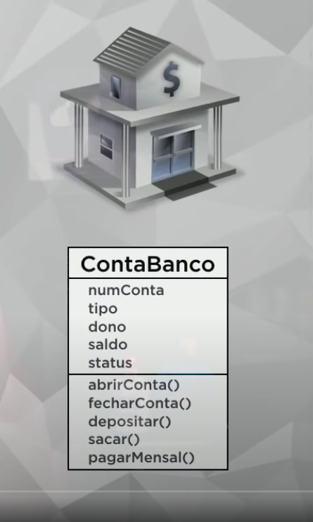
<a href="#" target="_blank"></a>

<a href="#" target="_blank"></a>

<a href="#" target="_blank"></a>

<a href="#" target="_blank"></a>
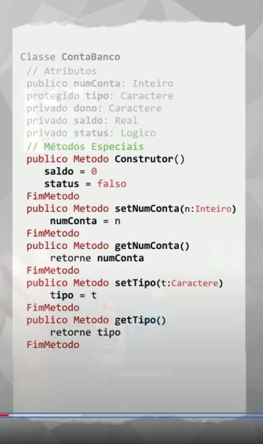
<a href="#" target="_blank"></a>

<a href="#" target="_blank"></a>

<a href="#" target="_blank"></a>

<a href="#" target="_blank"></a>
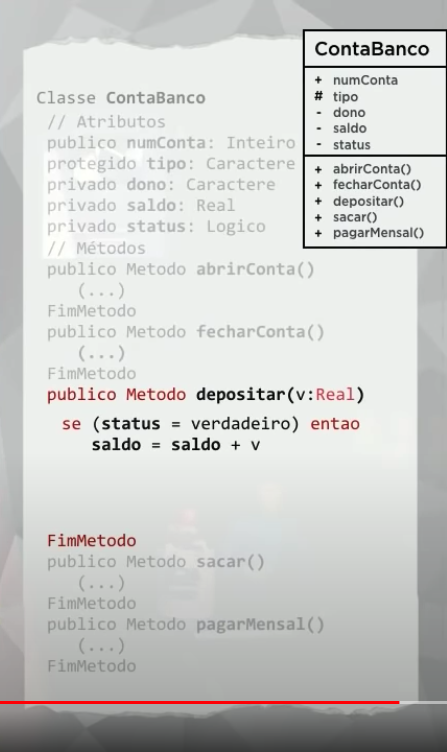
<a href="#" target="_blank"></a> 
 
<a href="#" target="_blank"></a>

<a href="#" target="_blank"></a> 
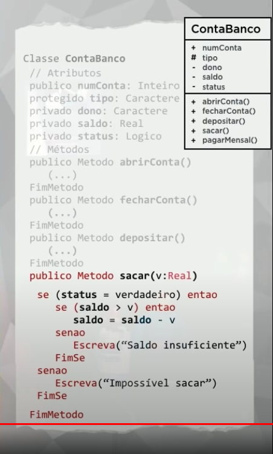
<a href="#" target="_blank"></a>

<a href="#" target="_blank"></a>

<br>

---

<u>Aula Prática 5 – Exemplo Prático em JAVA</u>

Nessa aula de POO, vamos fazer um grande exercício de Programação Orientada a Objetos utilizando Java.

Criação de um protótipo de sistema bancário, confira os requisitos abaixo:

```markdown
Exercício – Duas pessoas querem abrir uma conta no banco, o Jubileu e a Creusa.
O Jubileu optou por abrir uma conta poupança, e irá deposita 300 reais na sua conta.
A Creusa, possui mais dinheiro e quer depositar 500 reais em uma conta corrente.
Para isso, eles precisam abrir uma conta no banco.
Os atributos e métodos da ContaBanco estão expostos abaixo,
com base nesse diagrama de classes.

Requisitos:

1. O tipo da conta, só aceita dois caracteres, cc e cp.
   Conta corrente(cc) e conta poupança (cp), respectivamente.

2. Na hora de abrir conta, eu mudo o status de falso para verdadeiro.
   É nesse momento que decido qual conta vou abrir:

- para uma cp já recebe um presente de 150 reais,
- para uma cc já recebe um presente de 50 reais.

3. Para fechar conta, o Jubileu ou a Creusa
   não vão poder ter dinheiro dentro da sua conta ou saldo devedor.

4. Para fazer um depósito ou sacar,
   a conta já deve ter sido aberta com status verdadeiro.
   No caso do saque, eu devo já ter dinheiro dentro,
   e o valor do saque não deve ser superior ao seu saldo.

5. A mensalidade vai ser cobrada diretamente do saldo.
   Na hora que for chamado a mensalidade(), o cliente com cc pagará 12 reais,
   e o cliente com cp pagará 20 reias de mensalidade.

6. Você precisará usar o método getter e setter para TODOS os atributos.

7. É necessário ter um método construtor,
   onde o seu status será definido como zero e
   o saldo definido como zero, pois a conta está fechada.

8. Visibilidades:
   -> numConta ( + )
   -> tipo ( # )
   -> dono ( - )
   -> saldo ( - )
   -> status ( - )

Todos os métodos especiais (getter e setter) devem ser públicos.
Os demais métodos, privados.

Legenda das Visibilidades:
( + ) é public.
( - ) é private.
( # ) é protected.
```

- Classe ContaBanco


<a href="#" target="_blank"></a>

- Programa ContaBanco em Java

<code> class ContaBanco </code>

```java
package aula05;

public class ContaBanco {
    // ATRIBUTOS
    public int numConta;
    protected String tipo;
    private String dono;
    private float saldo;
    private boolean status;

    // MÉTODO CONSTRUTOR
    public ContaBanco() {
        this.setSaldo(0);
        this.setStatus(false);
    }

    // MÉTODOS ESPECIAIS

    public void estadoAtual() {
        System.out.println("------------------------------------------------------------");
        System.out.println("Conta: " + this.getNumConta());
        System.out.println("Tipo: " + this.getTipo());
        System.out.println("Dono: " + this.getDono());
        System.out.println("Saldo: " + this.getSaldo());
        System.out.println("Status: " + this.getStatus());
        System.out.println("------------------------------------------------------------");
        System.out.println("\n");
    }

    public void abrirConta(String tipo){
        this.setTipo(tipo);
        this.setStatus(true);

        if ( tipo == "CC") {
            this.setSaldo(50);
        }
        else if ( tipo == "CP" ) {
            this.setSaldo(150);
        }
        System.out.println(this.getDono() + ". Conta aberta com sucesso!");
    }

    public void fecharConta(){
        if ( this.getSaldo() > 0 ) {
            System.out.println("[ERRO] Conta de " +
                    this.getDono() + " está com dinheiro, saldo de R$ " +
                    this.getSaldo() + ", não posso fechar a conta!");
        }
        else if ( this.getSaldo() < 0 ) {
            System.out.println("[ERRO] Conta de " +
                    this.getDono() + " está com débito, saldo de R$ " +
                    this.getSaldo() + ", não posso fechar a conta!");
        }
        // ( this.getSaldo == 0)
        else {
            setStatus(false);
            System.out.println("Conta de " + this.getDono() + " foi fechada com sucesso!");
        }
    }

    public void depositar(float v){
        if ( this.getStatus() ) {
            this.setSaldo(this.getSaldo() + v); // this.saldo = this.saldo + v;
            System.out.println("Depósito de R$ " + v + " na conta de " + this.getDono());
        } else {
            System.out.println("ERRO. Impossível depositar em uma conta fechada!");
        }
    }
    public void sacar(float v){

        if ( this.getStatus() ) {
            if ( this.getSaldo() >= v) {
                this.setSaldo(this.getSaldo() - v);
                System.out.println("Saque de R$ " + v + " na conta de " + this.getDono());
                System.out.println(this.getDono() + ", saldo da conta R$ " + this.getSaldo());
            } else {
                System.out.println(this.getDono() + ", saldo insuficiente para saque!");
            }
        } else {
            System.out.println("[ERRO] Impossível sacar de uma conta está fechada!");
        }
    }

    public void pagarMensalidade(){
        float v = 0.0f;

        if (this.getTipo() == "CC") {
            v = 12;
        } else if (this.getTipo() == "CP") {
            v = 20;
        }

        if ( this.getStatus() ) {
            if ( this.getSaldo() > v) {
                this.setSaldo(this.getSaldo() - v);
                System.out.println("Mensalidade de R$ " + v + " debitada na conta de " +
                        this.getDono() + ". Saldo disponível R$ " + this.getSaldo());

            } else {
                System.out.println("Saldo negativo");
            }

        } else {
            System.out.println("[ERRO] Impossível débitar a mensalidade, a conta está fechada!");
        }

    }


    // Métodos Getters e Setters
    public int getNumConta() {
        return numConta;
    }

    public void setNumConta(int numConta) {
        this.numConta = numConta;
    }

    public String getTipo() {
        return tipo;
    }

    public void setTipo(String tipo) {
        this.tipo = tipo;
    }

    public String getDono() {
        return dono;
    }

    public void setDono(String dono) {
        this.dono = dono;
    }

    public float getSaldo() {
        return saldo;
    }

    public void setSaldo(float saldo) {
        this.saldo = saldo;
    }

    public boolean getStatus() {
        return status;
    }

    public void setStatus(boolean status) {
        this.status = status;
    }
}

```

<code> class Aula05 </code>

```java
package aula05;

public class Aula05 {

    public static void main(String[] args) {

        ContaBanco p1 = new ContaBanco(); // Jubileu

        p1.setDono("Jubileu");
        p1.abrirConta("CC");
        p1.setNumConta(1001);
        p1.depositar(300);      // 300 [deposito] + 50 [abertura CC] = 350 [saldo]
        // p1.fecharConta();    // [ERRO] Conta de Jubileu está com dinheiro, saldo de R$ 350.0, não posso fechar a conta!
        p1.pagarMensalidade();  // 350 - 12 [mensalidade CC] = 338 [saldo]
        p1.sacar(338);
        p1.fecharConta();
        p1.estadoAtual();

        ContaBanco p2 = new ContaBanco(); // Creuza

        p2.setDono("Creuza");
        p2.abrirConta("CP");
        p2.setNumConta(2002);
        p2.depositar(500);      // 500 [deposito] + 150 [abertura CP] = 650 [saldo]
        p2.sacar(100);          // 650 - 100 [saque] = 550 [saldo]
        // p2.sacar(1000);      // Creuza, saldo insuficiente para saque!
        p2.pagarMensalidade();  // 550 - 20 [mensalidade CP] = 530 [saldo]
        p2.sacar(530);
        p2.fecharConta();
        p2.estadoAtual();
    }
}
```

<code> &rarr; Run 🖥️ &lt;Aula05&gt; </code>

```markdown
Jubileu. Conta aberta com sucesso!
Depósito de R$ 300.0 na conta de Jubileu
Mensalidade de R$ 12.0 debitada na conta de Jubileu. Saldo disponível R$ 338.0
Saque de R$ 338.0 na conta de Jubileu
Jubileu, saldo da conta R$ 0.0
Conta de Jubileu foi fechada com sucesso!

---

Conta: 1001
Tipo: CC
Dono: Jubileu
Saldo: 0.0
Status: false

---

Creuza. Conta aberta com sucesso!
Depósito de R$ 500.0 na conta de Creuza
Saque de R$ 100.0 na conta de Creuza
Creuza, saldo da conta R$ 550.0
Mensalidade de R$ 20.0 debitada na conta de Creuza. Saldo disponível R$ 530.0
Saque de R$ 530.0 na conta de Creuza
Creuza, saldo da conta R$ 0.0
Conta de Creuza foi fechada com sucesso!

---

Conta: 2002
Tipo: CP
Dono: Creuza
Saldo: 0.0
Status: false

---
```

---

<br>

<span id="aula06">

### 6. Aula 6

<u>Aula Teórica 6 – Pilares da POO: Encapsulamento</u>

Nessa aula de POO, vamos aprender quais são os três pilares da Programação Orientada a Objetos e vamos estudar o primeiro pilar: o **Encapsulamento** da POO.

Os três pilares da POO são: **Encapsulamento, Herança e Polimorfismo.**

Alguns autores citam 3 pilares da POO e outros citam 4 pilares da POO.

Para os autores que citam 4 os pilares principais da POO:

A E H P : ABSTRAÇÃO, ENCAPSULAMENTO, HERANÇA E POLIMORFISMO.

O prof. Gustavo Guanabara, ensina como 3 os pilares principais da POO:

E H P : **ENCAPSULAMENTO**, **HERANÇA** E **POLIMORFISMO**.

- Dica: Para lembrar dos pilares pensa nome da sua impressora:
- “É - H - P ?” — ENCAPSULAMENTO - HERANÇA - POLIMORFISMO.
  <br>
- OBS: Por exemplo, o prof. Gustavo Guanabara, diz que são 3 pilares da POO.
  Nesse caso, a ABSTRAÇÃO está dentro do ENCAPSULAMENTO.

---

#### Encapsulamento

[Conceito de Encapsulamento] &rarr; Ocultar partes independentes da implementação, permitindo construir partes invisíveis ao mundo exterior.

[Conceito de Encapsulamento] &rarr; Encapsular significa esconder a implementação dos objetos. O encapsulamento favorece principalmente dois aspectos de um sistema: a manutenção e a evolução.

Consiste na ideia de proteger o usuário do código e o código do usuário, **ocultando partes internas do mundo exterior**.
Além de proteção, também é usado para padronizar objetos.
Ex: Imagina uma pilha de controle remoto.
<br>

- **OBS**: Encapsular _não é obrigatório_, mas é uma boa prática para produzir Classe mais eficientes.

**Exemplo:** uma pilha possui todos os seus atributos guardados (propriedades químicas dentro dela), com isso, para nos proteger — e vice-versa — , ela nos oferece apenas a sua energia, através de uma interface\* (os polos: positivo e o negativo) que nesse exemplo, a interface são as extremidades da pilha.

- **Vantagens em encapsular** :

  - Tornar mudanças invisíveis;
  - Facilitar reutilização de código;
  - Reduzir efeitos colaterais.
    <br>

- **O que é uma interface?**

[Conceito de Interface] &rarr; Lista de serviços fornecidos por um componente. É o contato com o mundo exterior, que define o que pode ser feito com um objeto dessa classe.

- **Interface** é tudo aquilo que está disponível para o usuário.
- Por exemplo:
  - os pedais de um carro, e
  - os botões de um controle são exemplos de interfaces.

**Como criar uma interface?**

Toda interface precisa de métodos/funções, afinal quando apertamos um botão estamos realizando uma ação.
Esses métodos são sempre _públicos (public) e abstratos (abstract)_:

- **public** porque todo mundo pode chamar e realizar a ação;
- **abstract** porque o usuário não precisa saber o que acontece “por trás dos panos” quando ele realiza uma ação e nem de onde os códigos vêm.

Exemplo de uma interface, com o nome Controlador:

```java
package aula06;
public interface Controlador {
    public abstract void ligar();
    public abstract void desligar();
    ...
}
```

No exemplo acima, apenas dizemos: “Olha, há duas funções: ligar/desligar e você pode chamar elas quando quiser”, porém, o usuário do programa não precisa saber necessariamente como elas funcionam.

- Como “conectar” a interface para usar as funções da classe?
  Na classe ControleRemoto.java, faremos o uso do **implements** (após ter criado a interface), ele será responsável para criar essa “conexão” entre a interface e o código definitivamente:

```java
public class ControleRemoto implements Controlador {
  ...
}
```

---

- <u>Material Complementar</u>:

**Encapsulamento**

O princípio de esconder a estrutura de dados utilizada e somente prover uma interface bem definida é chamado de encapsulamento.

**Algumas definições comuns de encapsulamento:**

1. Encapsulamento é o processo de esconder todos os detalhes de um objeto que não contribuem para as suas características essenciais.
2. Encapsulamento é um princípio, utilizando quando se está desenvolvendo a estrutura geral de um programa, no qual cada componente de um programa deve encapsular ou esconder cada decisão de projeto (...) A interface com cada módulo é definida de forma a revelar o mínimo possível sobre o seu funcionamento interno.
3. O encapsulamento esconde detalhes de implementação do objeto (métodos) e o que sobra visível é a sua interface, isto é, o conjunto de todas as mensagens a que ele pode responder. Uma vez que o objeto é encapsulado, seus detalhes de implementação não são mais imediatamente acessíveis. Ao invés disso, eles são empacotados e são somente indiretamente acessíveis através da interface do objeto. A única forma de acessar a um objeto encapsulado é através da troca de mensagens: é enviada uma mensagem ao objeto, o objeto mesmo seleciona o método pelo qual ele irá reagir à mensagem.

Podemos dizer, portanto, que os objetos possuem uma parte interna, os dados, que não podem ser acessados por outros objetos do sistema, e outra externa, os métodos, que permitem a alteração ou verificação de seu estado.

**Os Benefícios do Encapsulamento:**

**Modularidade**: o código-fonte para um objeto pode ser escrito e mantido independentemente do código-fonte de outros objetos (desacoplamento). Além disso, como não dependem de outros objetos, cada objeto pode ser utilizado livremente no sistema.

**Ocultação de informações**: um objeto possui uma interface pública que outros objetos podem utilizar para comunicarem-se com ele. Mas o objeto pode manter informações privadas e métodos podem ser modificados em qualquer momento sem afetar os outros objetos que dependem dele. Por exemplo, você não precisa de entender o funcionamento interno do mecanismo de marchas da sua bicicleta para utilizá-lo.

A única parte do objeto que o resto do sistema precisa conhecer é sua **interface**.

---

<u>Aula Teórica 6 – Pilares da POO: Encapsulamento</u>

<br>

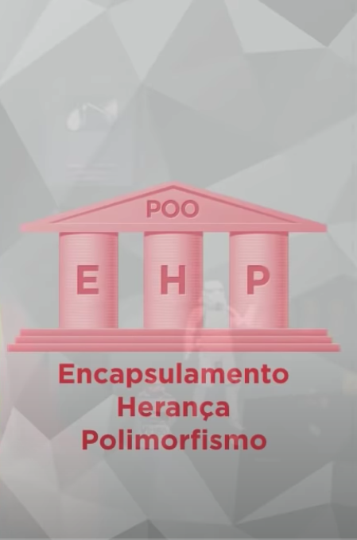
<a href="#" target="_blank"></a>

<a href="#" target="_blank"></a>

<a href="#" target="_blank"></a>

<a href="#" target="_blank"></a>

<a href="#" target="_blank"></a>
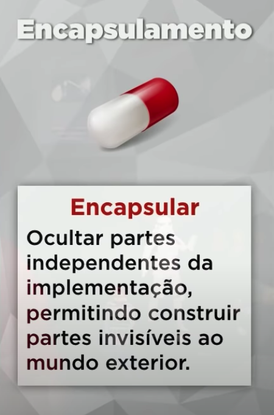
<a href="#" target="_blank"></a>

<a href="#" target="_blank"></a>

<a href="#" target="_blank"></a>

<a href="#" target="_blank"></a>
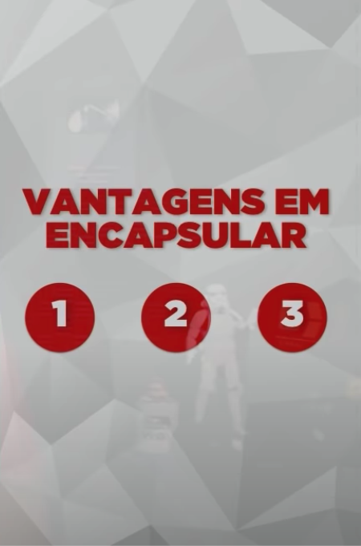
<a href="#" target="_blank"></a>
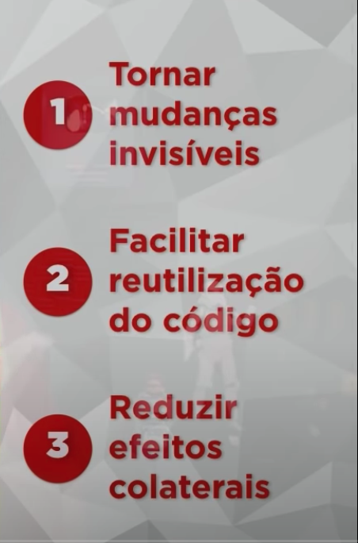
<a href="#" target="_blank"></a>

<a href="#" target="_blank"></a>

<a href="#" target="_blank"></a>

<a href="#" target="_blank"></a>

<a href="#" target="_blank"></a>

<a href="#" target="_blank"></a>

<a href="#" target="_blank"></a>

<a href="#" target="_blank"></a>

<a href="#" target="_blank"></a>

<a href="#" target="_blank"></a>

<a href="#" target="_blank"></a>

<a href="#" target="_blank"></a>

<a href="#" target="_blank"></a>

<a href="#" target="_blank"></a>

<a href="#" target="_blank"></a>


<hr>

<u> Aula Prática 6 – Encapsulamento </u>

Nessa aula de POO, vamos aprender como fazer Encapsulamento em Java, implementando o primeiro pilar da POO.

<code> interface Controlador</code>

```java
package aula06;

public interface Controlador {

    // Métodos Abstratos
    public abstract void ligar();
    public abstract void desligar();
    public abstract void abrirMenu();
    public abstract void fecharMenu();
    public abstract void maisVolume();
    public abstract void menosVolume();
    public abstract void ligarMudo();
    public abstract void desligarMudo();
    public abstract void play();
    public abstract void pause();
}
```

<code> class ControleRemoto implements Controlador </code>

```java
package aula06;

public class ControleRemoto implements Controlador {

    // Atributos

    private int volume;
    private boolean ligado;
    private boolean tocando;

    // Método Construtor

    public ControleRemoto() {
        this.volume = 10;
        this.ligado = false;
        this.tocando = false;
    }

    // Métodos Getters e Setters

    private int getVolume() {
        return volume;
    }

    private void setVolume(int volume) {
        this.volume = volume;
    }

    // type boolean ->  Generate (Default) -> isLigado()
    private boolean getLigado() {
        return ligado;
    }

    private void setLigado(boolean ligado) {
        this.ligado = ligado;
    }

    // type boolean ->  Generate (Default) -> isTocando()
    private boolean getTocando() {
        return tocando;
    }

    private void setTocando(boolean tocando) {
        this.tocando = tocando;
    }

    /**
     * @Override = Sobrescrever; Sobrepor; Sobrescrita
     *
     * @Override -> Significa que eu já tinha um método abstrato (abstract) e sobrescrevo os métodos.
     *
     * A sobrescrita (ou override) está diretamente relacionada à orientação a objetos, mais especificamente com a herança.
     * Com a sobrescrita, conseguimos especializar os métodos herdados das superclasses, alterando o seu comportamento nas subclasses por um mais específico.
     */

    // Métodos Abstratos

    @Override
    public void ligar() {
        this.setLigado(true);
    }

    @Override
    public void desligar() {
        this.setLigado(false);
    }

    @Override
    public void abrirMenu() {
        if ( this.getLigado() ) {
            System.out.println("\nAbrindo Menu!");
            System.out.println("----------------------------------------------");
            System.out.println("Está ligado? " + this.getLigado());
            System.out.println("Está tocando? " + this.getTocando());
            System.out.print("Volume: " + this.getVolume() + " -> ");
            for (int i = 0; i < this.getVolume(); i += 10) {
                System.out.print(" ▲ ");
            }
            System.out.println("\n----------------------------------------------");
        } else {
            System.out.println("Não é possível mostrar o Menu, pois o controle remoto está desligado!");
        }
    }

    @Override
    public void fecharMenu() {
        System.out.println("Fechando Menu!");
    }

    @Override
    public void maisVolume() {
        if ( this.getLigado() ) {
            this.setVolume(this.getVolume() + 10);
        } else {
            System.out.println("Não é possível aumentar o volume!");
        }
    }

    @Override
    public void menosVolume() {
        if ( this.getLigado() ) {
            this.setVolume(this.getVolume() - 10);
        } else {
            System.out.println("Não é possível diminuir o volume!");
        }
    }

    @Override
    public void ligarMudo() {
        if ( this.getLigado() && this.getVolume() > 0 ) {
            this.setVolume(0);
        } else {
            System.out.println("Não é possível ligar o mudo!");
        }
    }

    @Override
    public void desligarMudo() {
        if ( this.getLigado() && this.getVolume() == 0 ) {
            this.setVolume(50);
        }
    }

    @Override
    public void play() {
        if ( this.getLigado() && !(this.getTocando()) ) {
            this.setTocando(true);
        } else {
            System.out.println("Não é possível executar o play!");
        }
    }

    @Override
    public void pause() {
        if ( this.getLigado() && this.getTocando() ) {
            this.setTocando(false);
        } else {
            System.out.println("Não é possível executar o pause!");
        }
    }
}

```

<code> class Aula06 </code>

```java
package aula06;

public class Aula06 {

    public static void main(String[] args) {

        ControleRemoto c = new ControleRemoto();

        c.ligar();
        c.play();
        c.maisVolume();
        c.maisVolume();
        c.pause();
        c.play();
        c.menosVolume();
        c.abrirMenu();
        c.fecharMenu();
    }
}

```

<code> &rarr; Run 🖥️ &lt;Aula06&gt; </code>

```markdown
## Abrindo Menu!

Está ligado? true
Está tocando? true
Volume: 20 -> ▲ ▲

---

Fechando Menu!
```

<br>

<hr>

<br>

<span id="aula07">

### 7. Aula 7

<u> Aula Teórica 7 – Relacionamento entre Classes </u>

Nessa aula de POO, vamos aprender como fazer relacionamentos entre as classes.

<!-- 
<a href="#" target="_blank"></a> -->

<a href="#" target="_blank"></a>

<a href="#" target="_blank"></a>

<a href="#" target="_blank"></a>

<a href="#" target="_blank"></a>

<a href="#" target="_blank"></a>
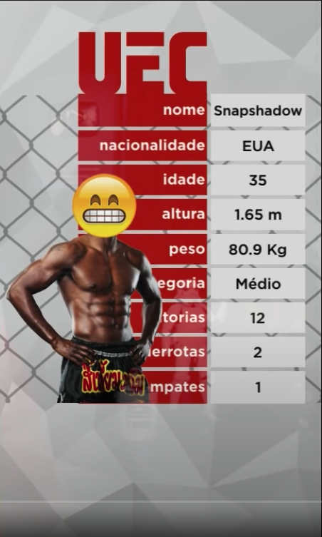
<a href="#" target="_blank"></a>

<a href="#" target="_blank"></a>

<a href="#" target="_blank"></a>

<a href="#" target="_blank"></a>

<a href="#" target="_blank"></a>

<a href="#" target="_blank"></a>

<a href="#" target="_blank"></a>
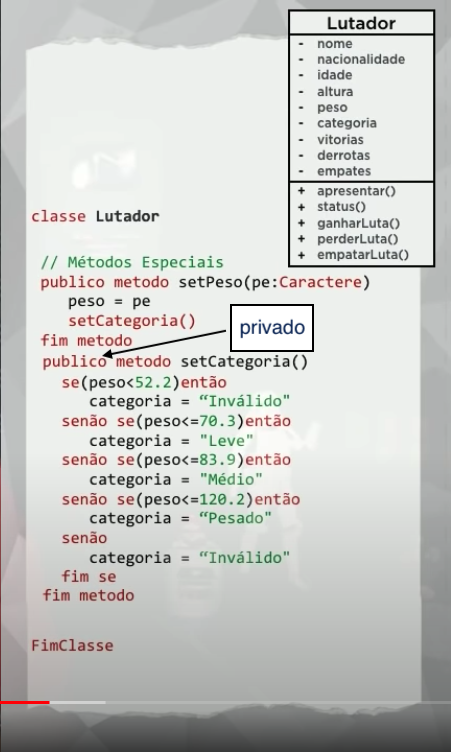
<a href="#" target="_blank"></a>

<a href="#" target="_blank"></a>

<a href="#" target="_blank"></a>

<a href="#" target="_blank"></a>

<a href="#" target="_blank"></a>

<a href="#" target="_blank"></a>

---

<u> Aula Prática 7 – Objetos Compostos em Java </u>

Nessa aula de POO, vamos aprender como criar Objetos Compostos criando um vetor de objetos.

Aprendemos sobre o Relacionamento entre as Classes.

As aulas 7 e 8 são complementares, isso é, apesar da divisão, nos vídeos você irá aprender sobre o conceito de Agregação que faz parte da modelagem UML.

#### Agregação

- Tipo especial de associação;
- Demostra que as informações de um objeto precisam ser complementadas por um objeto de outra classe;
- Associação Todo-Parte
  - objeto-tipo
  - objeto-parte

**Representação de Agregação**

- Um losango na extremidade da classe que contém os objetos-todo.

<br>

**O Ultimate Emoji Combate**

Foi o exercício proposto, confira o resumo dos requisitos abaixo

```markdown
UltraEmojiCombate - Programa que simula uma arena de combate (com lutadores com nomes esquisitos)

Criar uma classe para os lutadores, onde ela deve ter os seguintes requisitos:

1.  Atributos: - nome; - nacionalidade; - idade; - altura; - peso; - categoria; - vitorias; - derrotas; - empates;

2.  Métodos públicos:

    - ganharLuta();     // Adiciona mais 1 na variável vitorias
    - perderLuta();     // Adiciona mais 1 na variável derrotas
    - empatarLuta();    // Adiciona mais um na variável empates
    - apresentar();     // Apresenta os dados do lutador
    - status();         // Apresenta suas vitórias, derrotas e empates

3.  Métodos especiais:

    Crie um construtor que receba TODAS as informações do lutador, menos a categoria, pois ela,
    em especial, deve ser definida automaticamente no momento que soubermos qual o peso do atleta;

    Segue abaixo os dados de todos os 6 atletas que devem ser cadastrados na arena de combate:

    Nome, Nacionalidade, Idade, Altura, Peso, Vitórias, Derrotas Empates;

        "Prettyboy", "Frances", 31, 1.75f, 68.9f, 11, 3, 1
        "Putscript", "Brasil", 29, 1.68f, 57.8f, 14, 2, 3
        "Snapshadow", "EUA", 35, 1.65f, 80.9f, 12, 2, 1
        "Dead code", "Australia", 28, 1.93f, 81.6f, 13, 0, 2
        "UFOCobol", "Brasil", 37, 1.70f, 119.3f, 5, 4, 3
        "Nerdart", "EUA", 30, 1.81f, 105.7f, 12, 2, 4

4.  Métodos getter e setter:

    Crie os métodos getter e setter de todos os atributos acima, porém, crie uma condição para que
    o seu programa defina automaticamente a categoria do lutador baseando-se no peso dele.

    Faixas para definir qual a categoria do lutator, onde, se:

    peso < 52.2 então categoria = "Invalido";
    peso <= 70.3 então categoria = "Leve";
    peso <= 83.9 então categoria = "Médio";
    peso <= 120.2 então categoria = "Pesado";
    peso > 120.2 então categoria = "Invalido";

Legenda: 
    ( - ) é igual a privado (private). 
    ( + ) é igual a público (public).
```

<br><br>

<code> class Lutador </code>

```java
package aula07;

import java.text.SimpleDateFormat;
import java.util.Date;
import java.util.Locale;

public class Lutador {

    // ATTRIBUTES

    private String nome;
    private String nacionalidade;
    private int idade;
    private float altura;
    private float peso;
    private String categoria;
    private int vitorias;
    private int derrotas;
    private int empates;

    // PUBLIC METHODS

    public void mensagem() {
        Date data = new Date();
        SimpleDateFormat df = new SimpleDateFormat("dd-MM-yyyy HH:mm:ss");
        System.out.println("Data: " + df.format(data));

        System.out.println("----------------------------------------");
        System.out.println(" 'Ladies and gentlemen, we are live!' ");
        System.out.println(" 'This is the moment you've all been waiting for' ");
        System.out.println(" 'It's time!' ");
        System.out.println("----------------------------------------");
        // System.out.println("\n");
    }

    public void apresentar(){
        // System.out.println("APRESENTAÇÃO DO LUTADOR");
        System.out.println("----------------------------------------");
        System.out.println("Lutador: " + this.getNome());
        System.out.println("Nacionalidade: " + this.getNacionalidade());
        System.out.println("Idade: " + this.getIdade() + " anos");
        System.out.println("Peso: " +  this.getPeso() + " Kg");
        System.out.print("Vitorias: " + this.getVitorias() + "; ");
        System.out.print("Empates: " + this.getEmpates() + "; ");
        System.out.print("Derrotas: " + this.getDerrotas() + "\n");
        // System.out.println("----------------------------------------");
        // System.out.println("\n");
    }
    public void status(){
        // System.out.println("STATUS DO LUTADOR");
        System.out.println("----------------------------------------");
        System.out.println("Nome: " + this.getNome());
        System.out.println("Categoria: " + this.getCategoria());
        System.out.print("Vitorias: " + this.getVitorias() + "; ");
        System.out.print("Empates: " + this.getEmpates() + "; ");
        System.out.print("Derrotas: " + this.getDerrotas() + "\n");
        // System.out.println("----------------------------------------");
        // System.out.println("\n");
    }
    public void ganharLuta(){
        this.setVitorias(this.getVitorias() + 1);
    }
    public void perderLuta(){
        this.setDerrotas(this.getDerrotas() + 1);
    }
    public void empatarLuta(){
        this.setEmpates(this.getEmpates() + 1);
    }

    // SPECIAL METHODS

    // Constructor
    // OBS: A categoria não será selecionada no método construtor!
    // Por que? Porque a categoria sera calcula no método: setPeso(peso)

    public Lutador(String nome, String nacionalidade, int idade, float altura, float peso, int vitorias, int derrotas, int empates) {
        this.nome = nome;
        this.nacionalidade = nacionalidade;
        this.idade = idade;
        this.altura = altura;
        this.setPeso(peso); // this.peso = peso;
        this.vitorias = vitorias;
        this.derrotas = derrotas;
        this.empates = empates;
    }

    // Getters and Setters

    public String getNome() {
        return nome;
    }

    public void setNome(String nome) {
        this.nome = nome;
    }

    public String getNacionalidade() {
        return nacionalidade;
    }

    public void setNacionalidade(String nacionalidade) {
        this.nacionalidade = nacionalidade;
    }

    public int getIdade() {
        return idade;
    }

    public void setIdade(int idade) {
        this.idade = idade;
    }

    public float getAltura() {
        return altura;
    }

    public void setAltura(float altura) {
        this.altura = altura;
    }

    public float getPeso() {
        return peso;
    }

    public void setPeso(float peso) {
        this.peso = peso;
        this.setCategoria();
    }

    public String getCategoria() {
        return categoria;
    }

    // setCategoria() -> será um método interno, pois a categoria muda conforme o peso!
    private void setCategoria() {
        if ( this.peso < 52.2F ) {
            this.categoria = "Inválido";
        }
        else if ( this.peso <= 70.3F ) {
            this.categoria = "Leve";
        }
        else if ( this.peso <= 83.9F ) {
            this.categoria = "Médio";
        }
        else if ( this.peso <= 120.2F ) {
            this.categoria = "Pesado";
        }
        else {
            this.categoria = "Inválido";
        }
    }

    public int getVitorias() {
        return vitorias;
    }

    public void setVitorias(int vitorias) {
        this.vitorias = vitorias;
    }

    public int getDerrotas() {
        return derrotas;
    }

    public void setDerrotas(int derrotas) {
        this.derrotas = derrotas;
    }

    public int getEmpates() {
        return empates;
    }

    public void setEmpates(int empates) {
        this.empates = empates;
    }
}

```

<code> class Aula07 </code>

```java
package aula07;

public class Aula07 {

    public static void main(String[] args) {

        Lutador arr[] = new Lutador[6];

        arr[0] = new Lutador("[0]. Pretty Boy", "França", 31, 1.75F, 68.9F, 11, 2, 1);
        arr[1] = new Lutador("[1]. Putscript", "Brasil", 29, 1.68F, 57.8F, 14, 2, 3);
        arr[2] = new Lutador("[2]. Snapshadown", "EUA", 35, 1.65F, 80.9F, 12, 2, 1 );
        arr[3] = new Lutador("[3]. Dead Code", "Austrália", 28, 1.93F, 81.6F, 13, 0, 2 );
        arr[4] = new Lutador("[4]. Ufocobol", "Brasil", 37, 1.70F, 119.3F, 5, 4, 3 );
        arr[5] = new Lutador("[5]. Nederland", "EUA", 30, 1.81F, 105.7F, 12, 2, 4 );

        arr[0].mensagem(); // Mensagem inicial antes da luta

        // luta peso leve
        System.out.println("\n # Luta Peso Leve: \n" +
                arr[0].getNome() + " VS " +
                arr[1].getNome() );

        arr[0].apresentar();
        arr[1].apresentar();

        System.out.println("\n Luta Peso Leve: EMPATE");
        arr[0].empatarLuta();
        arr[1].empatarLuta();

        arr[0].status();
        arr[1].status();

        // luta peso médio
        System.out.println("\n # Luta Peso Médio: \n" +
                arr[2].getNome() + " VS " +
                arr[3].getNome() );

        arr[2].apresentar();
        arr[3].apresentar();

        System.out.println("\n Luta Peso Médio | VITORIA: " + arr[2].getNome());
        arr[2].ganharLuta();
        arr[3].perderLuta();

        arr[2].status();
        arr[3].status();

        // luta peso pesado
        System.out.println("\n # Luta Peso Pesado: \n" +
                arr[4].getNome() + " VS " +
                arr[5].getNome() );

        arr[4].apresentar();
        arr[5].apresentar();

        System.out.println("\n Luta Peso Pesado | VITORIA: " + arr[4].getNome());
        arr[4].ganharLuta();
        arr[5].perderLuta();

        arr[4].status();
        arr[5].status();
    }
}
```

<code> &rarr; Run 🖥️ &lt;Aula07&gt; </code>

```markdown
## Data: 07-04-2022 23:15:06

'Ladies and gentlemen, we are live!'
'This is the moment you've all been waiting for'
'It's time!'

---

# Luta Peso Leve:

## [0]. Pretty Boy VS [1]. Putscript

Lutador: [0]. Pretty Boy
Nacionalidade: França
Idade: 31 anos
Peso: 68.9 Kg
Vitorias: 11; Empates: 1; Derrotas: 2

---

Lutador: [1]. Putscript
Nacionalidade: Brasil
Idade: 29 anos
Peso: 57.8 Kg
Vitorias: 14; Empates: 3; Derrotas: 2

## Luta Peso Leve: EMPATE

Nome: [0]. Pretty Boy
Categoria: Leve
Vitorias: 11; Empates: 2; Derrotas: 2

---

Nome: [1]. Putscript
Categoria: Leve
Vitorias: 14; Empates: 4; Derrotas: 2

# Luta Peso Médio:

## [2]. Snapshadown VS [3]. Dead Code

Lutador: [2]. Snapshadown
Nacionalidade: EUA
Idade: 35 anos
Peso: 80.9 Kg
Vitorias: 12; Empates: 1; Derrotas: 2

---

Lutador: [3]. Dead Code
Nacionalidade: Austrália
Idade: 28 anos
Peso: 81.6 Kg
Vitorias: 13; Empates: 2; Derrotas: 0

## Luta Peso Médio | VITORIA: [2]. Snapshadown

Nome: [2]. Snapshadown
Categoria: Médio
Vitorias: 13; Empates: 1; Derrotas: 2

---

Nome: [3]. Dead Code
Categoria: Médio
Vitorias: 13; Empates: 2; Derrotas: 1

# Luta Peso Pesado:

## [4]. Ufocobol VS [5]. Nederland

Lutador: [4]. Ufocobol
Nacionalidade: Brasil
Idade: 37 anos
Peso: 119.3 Kg
Vitorias: 5; Empates: 3; Derrotas: 4

---

Lutador: [5]. Nederland
Nacionalidade: EUA
Idade: 30 anos
Peso: 105.7 Kg
Vitorias: 12; Empates: 4; Derrotas: 2

## Luta Peso Pesado | VITORIA: [4]. Ufocobol

Nome: [4]. Ufocobol
Categoria: Pesado
Vitorias: 6; Empates: 3; Derrotas: 4

---

Nome: [5]. Nederland
Categoria: Pesado
Vitorias: 12; Empates: 4; Derrotas: 3

Process finished with exit code 0
```

---

<br>

<span id="aula08">

### 8. Aula 8

<u> Revisão POO </u>:

- Objetos são instâncias de classes.

- Preciso de uma Classe para poder instanciar um Objeto.

- Não consigo ter Objetos sem ter uma Classe definindo a estrutura.

- Uma Classe encapsula dados e funcionalidades.

Na programação OO, o **encapsulamento** se refere ao agrupamento de dados com os métodos que operam nesses dados ou à restrição do acesso direto a alguns dos componentes de um objeto.

#### Agregação

- Tipo especial de associação;
- Demostra que as informações de um objeto precisam ser complementadas por um objeto de outra classe;
- Associação Todo-Parte
  - objeto-tipo
  - objeto-parte

#### Representação de Agregação

- Um losango na extremidade da classe que contém os objetos-todo.

- Link PowerPoint, material adicional, clique aqui: [Relacionamentos do Diagrama de Classes](https://homepages.dcc.ufmg.br/~figueiredo/disciplinas/aulas/uml-diagrama-classes-relacionamentos_v01.pdf)

<br>

---

**Associação**, **Agregação** e **Composição** em Java, são chamados de **relacionamento entre classes**, logo, compartilham dados entre si.

- **Associação**: Esse tipo de associação de classe não é nada mais que uma linha preenchida que conecta uma classe a outra que está sendo referenciada;

<br>

- **Agregação**: Vínculo Fraco (Não são dependentes uma da outra). É a ideia de que uma classe possui uma outra agregada à ela. Faz parte do relacionamento conhecido como “todo-parte”, que significa que ambas as classes estão conceitualmente no mesmo nível, onde um objeto todo tem objetos parte. Se o objeto todo for destruído, as partes ainda continuam vivas.

Veja só o exemplo:


<code> Agregação em diagrama sendo representado pelo losango branco. Livro é parte do todo. </code>

<br><br>

- **Composição**: Vínculo Forte (Se a classe pai deixar de existir a filha também deixa). Na composição, se a classe responsável pelo relacionamento for excluída, então deve-se excluir a classe que ele possui relacionamento. As partes devem ser criadas após o todo, e uma vez criadas, elas vivem e morre com o todo.

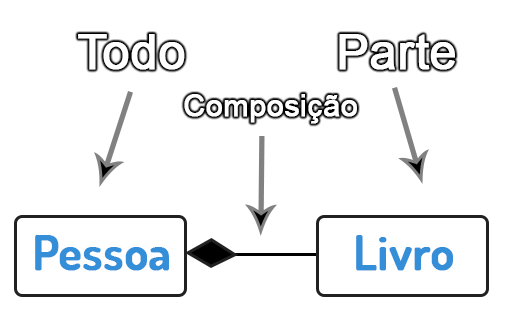

<code> Composição em diagrama sendo representado pelo losango preto. </code>

<br>

---

<br>

<u> Aula Teórica 8 – **Relacionamento de Agregação** </u>

Nessa aula de POO, vamos aprender como realizar um relacionamento de agregação entre classes para gerar objetos ainda mais poderosos.


<a href="#" target="_blank"></a>

<a href="#" target="_blank"></a>
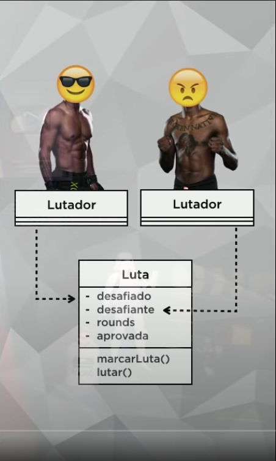
<a href="#" target="_blank"></a>

<a href="#" target="_blank"></a>

<a href="#" target="_blank"></a>
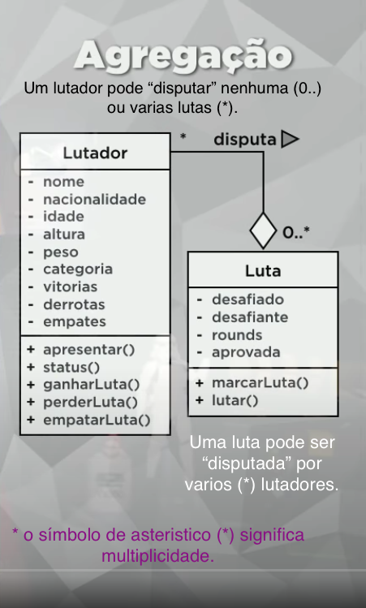
<a href="#" target="_blank"></a>

<a href="#" target="_blank"></a>

<a href="#" target="_blank"></a>

<a href="#" target="_blank"></a>
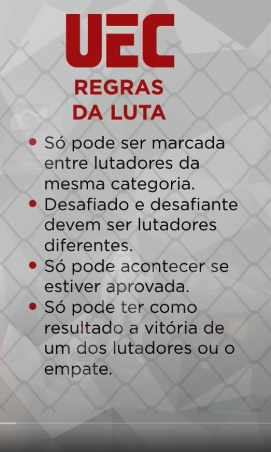
<a href="#" target="_blank"></a>
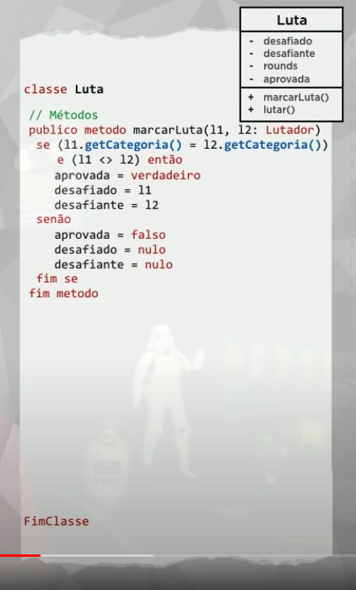
<a href="#" target="_blank"></a>

<a href="#" target="_blank"></a>

<a href="#" target="_blank"></a>

<a href="#" target="_blank"></a>

---

<u> Aula Prática 8 – Agregação entre Objetos em Java </u>

<br>

<code> class Lutador </code>

```java

package aula08;

import java.text.SimpleDateFormat;
import java.util.Date;

public class Lutador {

    // ATTRIBUTES

    private String nome;
    private String nacionalidade;
    private int idade;
    private float altura;
    private float peso;
    private String categoria;
    private int vitorias;
    private int derrotas;
    private int empates;

    // PUBLIC METHODS

    public void apresentar(){
        // System.out.println("APRESENTAÇÃO DO LUTADOR");
        System.out.println("----------------------------------------");
        System.out.println("Lutador: " + this.getNome());
        System.out.println("Nacionalidade: " + this.getNacionalidade());
        System.out.println("Idade: " + this.getIdade() + " anos");
        System.out.println("Peso: " +  this.getPeso() + " Kg");
        System.out.print("Vitorias: " + this.getVitorias() + "; ");
        System.out.print("Empates: " + this.getEmpates() + "; ");
        System.out.print("Derrotas: " + this.getDerrotas() + "\n");
        // System.out.println("----------------------------------------");
        // System.out.println("\n");
    }
    public void status(){
        // System.out.println("STATUS DO LUTADOR");
        System.out.println("----------------------------------------");
        System.out.println("Nome: " + this.getNome());
        System.out.println("Categoria: " + this.getCategoria());
        System.out.print("Vitorias: " + this.getVitorias() + "; ");
        System.out.print("Empates: " + this.getEmpates() + "; ");
        System.out.print("Derrotas: " + this.getDerrotas() + "\n");
        // System.out.println("----------------------------------------");
        // System.out.println("\n");
    }
    public void ganharLuta(){
        this.setVitorias(this.getVitorias() + 1);
    }
    public void perderLuta(){
        this.setDerrotas(this.getDerrotas() + 1);
    }
    public void empatarLuta(){
        this.setEmpates(this.getEmpates() + 1);
    }

    // SPECIAL METHODS

    // Constructor
    // OBS: A categoria não será selecionada no método construtor!
    // Por que? Porque a categoria sera calcula nos método: setPeso(peso)

    public Lutador(String nome, String nacionalidade, int idade, float altura, float peso, int vitorias, int derrotas, int empates) {
        this.nome = nome;
        this.nacionalidade = nacionalidade;
        this.idade = idade;
        this.altura = altura;
        this.setPeso(peso); // this.peso = peso;
        this.vitorias = vitorias;
        this.derrotas = derrotas;
        this.empates = empates;
    }

    // Getters and Setters

    public String getNome() {
        return nome;
    }

    public void setNome(String nome) {
        this.nome = nome;
    }

    public String getNacionalidade() {
        return nacionalidade;
    }

    public void setNacionalidade(String nacionalidade) {
        this.nacionalidade = nacionalidade;
    }

    public int getIdade() {
        return idade;
    }

    public void setIdade(int idade) {
        this.idade = idade;
    }

    public float getAltura() {
        return altura;
    }

    public void setAltura(float altura) {
        this.altura = altura;
    }

    public float getPeso() {
        return peso;
    }

    public void setPeso(float peso) {
        this.peso = peso;
        this.setCategoria();
    }

    public String getCategoria() {
        return categoria;
    }

    // setCategoria() -> será um método interno, pois a categoria muda conforme o peso
    private void setCategoria() {
        if ( this.peso < 52.2F ) {
            this.categoria = "Inválido";
        }
        else if ( this.peso <= 70.3F ) {
            this.categoria = "Leve";
        }
        else if ( this.peso <= 83.9F ) {
            this.categoria = "Médio";
        }
        else if ( this.peso <= 120.2F ) {
            this.categoria = "Pesado";
        }
        else {
            this.categoria = "Inválido";
        }
    }

    public int getVitorias() {
        return vitorias;
    }

    public void setVitorias(int vitorias) {
        this.vitorias = vitorias;
    }

    public int getDerrotas() {
        return derrotas;
    }

    public void setDerrotas(int derrotas) {
        this.derrotas = derrotas;
    }

    public int getEmpates() {
        return empates;
    }

    public void setEmpates(int empates) {
        this.empates = empates;
    }
}
```

<code> class Luta </code>

```java
package aula08;

import java.text.SimpleDateFormat;
import java.util.Date;
import java.util.Random;

public class Luta {

    // ATTRIBUTES
    private Lutador desafiado;
    private Lutador desafiante;
    private  int rounds;
    private boolean aprovada;

    // PUBLIC METHODS

    public void mensagem() {
        Date data = new Date();
        SimpleDateFormat df = new SimpleDateFormat("dd-MM-yyyy HH:mm:ss");
        System.out.println("Data: " + df.format(data));

        System.out.println("----------------------------------------");
        System.out.println(" 'Ladies and gentlemen, we are live!' ");
        System.out.println(" 'This is the moment you've all been waiting for' ");
        System.out.println(" 'It's time!' ");
        System.out.println("----------------------------------------");
        // System.out.println("\n");
    }

    public void marcarLuta(Lutador L1, Lutador L2) {

        // L1.getCategoria().equals(L2.getCategoria())
      if ( ( L1.getCategoria() == L2.getCategoria()  )  && ( L1 != L2 ) ) {
              this.aprovada = true;
              this.desafiado = L1;
              this.desafiante = L2;
          } else {
              this.aprovada = false;
              this.desafiado = null;
              this.desafiante = null;
          }
    }

    public void lutar() {

        if (this.aprovada) {
            System.out.println("\n ### DESAFIADO ###");
            this.desafiante.apresentar();
            System.out.println("\n ### DESAFIANTE ###");
            this.desafiado.apresentar();

            // Gerar Numero Aleatorio de 0 a 2, ou seja: { 0 , 1 , 2 }
            Random aleatorio = new Random();

            int vencedor = aleatorio.nextInt(3); // Vai gerar 3 resultados: { 0 , 1 , 2 }

            // 0 = EMPATE
            // 1 = GANHOU DESAFIADO
            // 2 = GANHOU DESAFIANTE"

            switch (vencedor) {
                case 0:
                    System.out.println("\n ### EMPATE: " + this.desafiado.getNome() + " VS "  + this.desafiante.getNome());
                    this.desafiado.empatarLuta();
                    this.desafiante.empatarLuta();
                    break;
                case 1:
                    System.out.println("\n ### GANHOU DESAFIADO! -> " + this.desafiado.getNome());
                    this.desafiado.ganharLuta();
                    this.desafiante.perderLuta();
                    break;
                case 2:
                    System.out.println("\n ### GANHOU DESAFIANTE! -> " + this.desafiante.getNome());
                    this.desafiante.ganharLuta();
                    this.desafiado.perderLuta();
                    break;
                default:
                    System.out.println("NÃO HOUVE VENCEDOR!"); // Opcional
            }
        } else {
            System.out.println(" A luta não pode acontecer!");
        }
    }

    // SPECIAL METHODS
    public Lutador getDesafiado() {
        return desafiado;
    }

    public void setDesafiado(Lutador desafiado) {
        this.desafiado = desafiado;
    }

    public Lutador getDesafiante() {
        return desafiante;
    }

    public void setDesafiante(Lutador desafiante) {
        this.desafiante = desafiante;
    }

    public int getRounds() {
        return rounds;
    }

    public void setRounds(int rounds) {
        this.rounds = rounds;
    }

    public boolean isAprovada() {
        return aprovada;
    }

    public void setAprovada(boolean aprovada) {
        this.aprovada = aprovada;
    }
}

```

<code> class Aula08 </code>

```java
package aula08;

public class Aula08 {

    public static void main(String[] args) {

        Lutador arr[] = new Lutador[6];

        arr[0] = new Lutador("v[0]. Pretty Boy", "França", 31, 1.75F, 68.9F, 11, 2, 1);
        arr[1] = new Lutador("v[1]. Putscript", "Brasil", 29, 1.68F, 57.8F, 14, 2, 3);
        arr[2] = new Lutador("v[2]. Snapshadown", "EUA", 35, 1.65F, 80.9F, 12, 2, 1 );
        arr[3] = new Lutador("v[3]. Dead Code", "Austrália", 28, 1.93F, 81.6F, 13, 0, 2 );
        arr[4] = new Lutador("v[4]. Ufocobol", "Brasil", 37, 1.70F, 119.3F, 5, 4, 3 );
        arr[5] = new Lutador("v[5]. Nederland", "EUA", 30, 1.81F, 105.7F, 12, 2, 4 );

        System.out.println("\n------------------------------------ Luta peso leve ----------------------------------------------");
        Luta pesoLeve = new Luta();

        pesoLeve.mensagem();
        pesoLeve.marcarLuta(arr[0], arr[1]);
        pesoLeve.lutar();
        pesoLeve.getDesafiado().status();  // arr[0].status();
        pesoLeve.getDesafiante().status(); // arr[1].status();

        System.out.println("\n------------------------------------ Luta peso medio ----------------------------------------------");
        Luta pesoMedio = new Luta();

        // pesoMedio.mensagem();
        pesoMedio.marcarLuta(arr[2], arr[3]);
        pesoMedio.lutar();
        pesoMedio.getDesafiante().status();
        pesoMedio.getDesafiado().status();

        System.out.println("\n------------------------------------ Luta peso pesado ----------------------------------------------");
        Luta pesoPesado = new Luta();

        // pesoPesado.mensagem();
        pesoPesado.marcarLuta(arr[4], arr[5]);
        pesoPesado.lutar();
        pesoPesado.getDesafiante().status();
        pesoPesado.getDesafiado().status();
    }
}
```

<code> &rarr; Run 🖥️ &lt;Aula08&gt; </code>

```markdown
------------------------------------ Luta peso leve ----------------------------------------------
Data: 08-04-2022 03:05:25

---

'Ladies and gentlemen, we are live!'
'This is the moment you've all been waiting for'
'It's time!'

---

### DESAFIADO

---

Lutador: v[1]. Putscript
Nacionalidade: Brasil
Idade: 29 anos
Peso: 57.8 Kg
Vitorias: 14; Empates: 3; Derrotas: 2

### DESAFIANTE

---

Lutador: v[0]. Pretty Boy
Nacionalidade: França
Idade: 31 anos
Peso: 68.9 Kg
Vitorias: 11; Empates: 1; Derrotas: 2

### EMPATE: v[0]. Pretty Boy VS v[1]. Putscript

---

Nome: v[0]. Pretty Boy
Categoria: Leve
Vitorias: 11; Empates: 2; Derrotas: 2

---

Nome: v[1]. Putscript
Categoria: Leve
Vitorias: 14; Empates: 4; Derrotas: 2

------------------------------------ Luta peso medio ----------------------------------------------

### DESAFIADO

---

Lutador: v[3]. Dead Code
Nacionalidade: Austrália
Idade: 28 anos
Peso: 81.6 Kg
Vitorias: 13; Empates: 2; Derrotas: 0

### DESAFIANTE

---

Lutador: v[2]. Snapshadown
Nacionalidade: EUA
Idade: 35 anos
Peso: 80.9 Kg
Vitorias: 12; Empates: 1; Derrotas: 2

### GANHOU DESAFIADO! -> v[2]. Snapshadown

---

Nome: v[3]. Dead Code
Categoria: Médio
Vitorias: 13; Empates: 2; Derrotas: 1

---

Nome: v[2]. Snapshadown
Categoria: Médio
Vitorias: 13; Empates: 1; Derrotas: 2

------------------------------------ Luta peso pesado ----------------------------------------------

### DESAFIADO

---

Lutador: v[5]. Nederland
Nacionalidade: EUA
Idade: 30 anos
Peso: 105.7 Kg
Vitorias: 12; Empates: 4; Derrotas: 2

### DESAFIANTE

---

Lutador: v[4]. Ufocobol
Nacionalidade: Brasil
Idade: 37 anos
Peso: 119.3 Kg
Vitorias: 5; Empates: 3; Derrotas: 4

### EMPATE: v[4]. Ufocobol VS v[5]. Nederland

---

Nome: v[5]. Nederland
Categoria: Pesado
Vitorias: 12; Empates: 5; Derrotas: 2

---

Nome: v[4]. Ufocobol
Categoria: Pesado
Vitorias: 5; Empates: 4; Derrotas: 4

Process finished with exit code 0
```

<br>

---

<br>

<span id="aula09">

### 9. Aula 9

#### Aula Teórica 9 – Exercícios de POO

Nessa aula de POO, vamos fazer alguns exercícios de Programação Orientada a Objeto conceituais que já apareceram em concursos. Coloque em prática tudo aquilo que aprendeu até aqui.


<a href="#" target="_blank"></a>

<a href="#" target="_blank"></a>

<a href="#" target="_blank"></a>

<a href="#" target="_blank"></a>

<a href="#" target="_blank"></a>
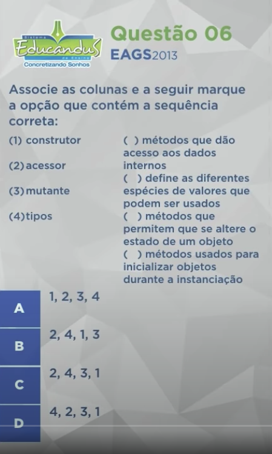
<a href="#" target="_blank"></a>

<a href="#" target="_blank"></a>

<a href="#" target="_blank"></a>

<a href="#" target="_blank"></a>

<a href="#" target="_blank"></a>
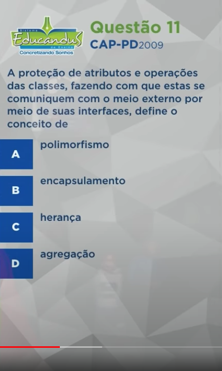
<a href="#" target="_blank"></a>

<a href="#" target="_blank"></a>

<a href="#" target="_blank"></a>

<a href="#" target="_blank"></a>

<a href="#" target="_blank"></a>

<br><br>

#### Exercícios de POO

- Q1 &rarr; Uma casa está para uma planta arquitetônica assim como um **objeto** está para...

* **uma classe**

<br>

- Q2 &rarr; Vantagens da POO

- **C O M E R N**ada

1. - **C** &rarr; Confiável
2. - **O** &rarr; Oportuno
3. - **M** &rarr; Manutenível
4. - **E** &rarr; Extensível
5. - **R** &rarr; Reutilizavel
6. - **N**ada &rarr; Natural

- Q3

* [**Incorreta**] &rarr; Uma <s> **Classe** </s> é instância de um <s> **Objeto** </s>.

* [Correta] &rarr; Uma **Objeto** é instância de um **Classe**.

<br>

* [Correta] &rarr; Um objeto é uma construção de software que encapsula estado e comportamento.

* [Correta] &rarr; Uma classe define os atributos e comportamentos compartilhados por um tipo de objeto.

* [Correta] &rarr; Um uma linguagem POO pura, tudo é um objeto, desde os tipos mais básicos.

- Q4

* **OBJETO** &rarr; construção de sw que encapsula estado e comportamento
* **CLASSE** &rarr; define os atributos e comportamentos comuns
* **ATRIBUTO** &rarr; característica de uma classe que é visível
* **COMPORTAMENTO** &rarr; ação executada por um objeto
* **DOMÍNIO** &rarr; espaço onde o problema reside

- Q5

* Uma **variável interna** (ou Atributo) é um valor mantido dentro do objeto
* **Atributos** são as características de uma classe visíveis externamente
* **Comportamentos** (ou Métodos) são funcionalidades **internas**.
* O **estado de um objeto** é o significado das variáveis internas do objeto

- Q6

* **Construtor** &rarr; métodos usados para inicializar objetos durante a inicialização
* **Acessor** &rarr; métodos que dão acessos aos dados internos
* **Mutante (Modificador)** &rarr; métodos que permitem que se altere o estado de um objeto.
* **Tipos** &rarr; define as diferentes espécies de valores que podem ser usados

- Q7 - **3 Pilares da POO** (Programação Orientada a Objetos)

* [DICA] &rarr; Qual o nome da sua impressora?
    * É H P
* **Encapsulamento**
* **Herança**
* **Polimorfismo**

- Q8

* **CLASSE** &rarr; define os atributos e comportamentos (métodos) compartilhados
* **OBJETO** &rarr; instanciação de uma classe
* **CONSTRUTOR** &rarr; utilizado para inicializar objetos
* **INTERFACE** &rarr; Define o que uma entidade pode fazer com o objeto.

- A interface diz quais são os métodos que são determinados como públicos que estão diretamente acessíveis.

* [Conceito de Interface] → Lista de serviços fornecidos por um componente. É o contato com o mundo exterior, que define o que pode ser feito com um objeto dessa classe.

<br>

- Q9 - **Níveis de acesso (visibilidade)** em POO

* público (+) , privado (-) e protegido (#).

<br>

- Q10 - niveis de acesso (Visibilidade dos Modificadores)

* público ( + ) &rarr; qualquer um pode acessar. A classe atual e outras classes.
* privado ( - ) &rarr; é visível somente dentro da classe. Somente a classe atual.
* protegido ( # ) &rarr; nível intermediário entre o publico e o privado. A classe atual e todas as sub-classes (filhas)

<br>

- Q11

* [Conceito de **Encapsulamento**] &rarr; A proteção de atributos e operações das classes, fazendo com que estas se comuniquem com o meio externo por meio de suas interfaces.

<br>

- Q12

* **Implementação** &rarr; define os detalhes internos do componente
* **Interface** &rarr; lista os serviços fornecidos por ele.

<br>

- Q13

* **ENCAPSULAMENTO** &rarr; é a característica da POO que permite separar o programa em várias partes menores e independentes. Cada parte possui sua implementação isolada e realiza seu trabalho de forma autônoma. Com essa característica é possível ocultar os detalhes internos de cada parte através de uma interface.

<br>

- Q14

* **ABSTRAÇÃO** &rarr; significa representar uma entidade, incluindo apenas seus atributos mais relevantes.

<br>

- Q15

* **CLASSES** &rarr; são tipos abstratos de dados
* **OBJETOS** &rarr; são instâncias de uma classe
* **SUBCLASSE** &rarr; é um classe definida por meio de outra classe
* **MÉTODOS** &rarr; são subprogramas que definem as operações em objetos de uma classe.

<br>

---

#### Aula Prática 9 – Exercício prático POO em Java

Nessa aula de POO, vamos fazer um exercício de Programação Orientada a Objeto em Java com tudo aquilo que aprendemos até aqui.


<a href="#" target="_blank"></a>

<br>

- package aula09
- ProjetoLivro

<code> class Pessoa</code>

```java
package aula09;

public class Pessoa {
    // ATTRIBUTES
    private String nome;
    private int idade;
    private String sexo;

    // METHODS
    public void fazerAniversario(){
        this.idade++;
    }
    // CONSTRUCTOR
    public Pessoa(String nome, int idade, String sexo) {
        this.nome = nome;
        this.idade = idade;
        this.sexo = sexo;
    }

    // GETTERS AND SETTERS
    public String getNome() {
        return nome;
    }

    public void setNome(String nome) {
        this.nome = nome;
    }

    public int getIdade() {
        return idade;
    }

    public void setIdade(int idade) {
        this.idade = idade;
    }

    public String getSexo() {
        return sexo;
    }

    public void setSexo(String sexo) {
        this.sexo = sexo;
    }
}
```

<code> class Livro implements Publicacao </code>

```java
package aula09;

public class Livro implements Publicacao {
    // ATTRIBUTES
    private String titulo;
    private String autor;
    private int totalPaginas;
    private int paginaAtual; // not constructor argument // this.paginaAtual = 0;
    private boolean aberto;  // not constructor argument // this.aberto = false;
    private Pessoa leitor;

   // METHODS

    // toString()
    // @Override
    public String detalhes() {
        return "Livro{" +
                "\n titulo='" + titulo +  '\'' +
                ", \n autor='" + autor + '\'' +
                ", \n totalPaginas=" + totalPaginas +
                ", \n paginaAtual=" + paginaAtual +
                ", \n aberto=" + aberto +
                ", \n leitor=" + leitor.getNome() +
                ", \n idade=" + leitor.getIdade() +
                ", \n sexo=" + leitor.getSexo() +
                '}';
    }

    // constructor
    public Livro(String titulo, String autor, int totalPaginas, Pessoa leitor) {
        this.titulo = titulo;
        this.autor = autor;
        this.totalPaginas = totalPaginas;
        this.leitor = leitor;

        this.paginaAtual = 0;
        this.aberto = false;
    }

    // Getters and Setters
    public String getTitulo() {
        return titulo;
    }

    public void setTitulo(String titulo) {
        this.titulo = titulo;
    }

    public String getAutor() {
        return autor;
    }

    public void setAutor(String autor) {
        this.autor = autor;
    }

    public int getTotalPaginas() {
        return totalPaginas;
    }

    public void setTotalPaginas(int totalPaginas) {
        this.totalPaginas = totalPaginas;
    }

    public int getPaginaAtual() {
        return paginaAtual;
    }

    public void setPaginaAtual(int paginaAtual) {
        this.paginaAtual = paginaAtual;
    }

    public boolean isAberto() {
        return aberto;
    }

    public void setAberto(boolean aberto) {
        this.aberto = aberto;
    }

    public Pessoa getLeitor() {
        return leitor;
    }

    public void setLeitor(Pessoa leitor) {
        this.leitor = leitor;
    }

    // interface Publicacao
    @Override
    public void abrir() {
        this.aberto = true;
    }

    @Override
    public void fechar() {
        this.aberto = false;
    }

    @Override
    public void folhear(int pagina) {
        if ( pagina > this.totalPaginas) {
            this.paginaAtual = 0;
        } else {
            this.paginaAtual = pagina;
        }
    }

    @Override
    public void avancarPagina() {
        this.paginaAtual++;
    }

    @Override
    public void voltarPagina() {
        this.paginaAtual--;
    }
}
```

<code> interface Publicacao </code>

```java
package aula09;

public interface Publicacao {

    public void abrir();
    public void fechar();
    public void folhear(int pagina);
    public void avancarPagina();
    public void voltarPagina();
}
```

<code> class ProjetoLivro </code>

```java
package aula09;

public class ProjetoLivro {

    public static void main(String[] args) {

        Pessoa [] p = new Pessoa[2];

        p[0] = new Pessoa("Pedro", 22, "M");
        p[1] = new Pessoa("Sofia", 25, "F");

        Livro [] l = new Livro[3];

        l[0] = new Livro("Java basic", "G. Guanabara", 100, p[0]);
        l[1] = new Livro("POO basic", "G. Guanabara", 200, p[1]);
        l[2] = new Livro("POO advanced", "G. Guanabara", 300, p[1]);

        l[0].abrir();
        l[0].folhear(90);
        l[0].avancarPagina(); // 91
        l[0].voltarPagina();  // 90

        System.out.println(l[0].detalhes());

        System.out.println();
        System.out.println(l[1].detalhes());

        System.out.println();
        System.out.println(l[2].detalhes());

    }
}
```

<code> &rarr; Run 🖥️ &lt;Aula09&gt; </code>

```markdown
Livro{
titulo='Java basic',
autor='G. Guanabara',
totalPaginas=100,
paginaAtual=90,
aberto=true,
leitor=Pedro,
idade=22,
sexo=M}

Livro{
titulo='POO basic',
autor='G. Guanabara',
totalPaginas=200,
paginaAtual=0,
aberto=false,
leitor=Sofia,
idade=25,
sexo=F}

Livro{
titulo='POO advanced',
autor='G. Guanabara',
totalPaginas=300,
paginaAtual=0,
aberto=false,
leitor=Sofia,
idade=25,
sexo=F}
```

<br>

---

<span id="aula10">

### 10. Aula 10

#### Aula Teórica 10 – Herança (Parte 1)

Nessa aula de POO, vamos aprender o que é Herança em Programação Orientada a Objetos.

- **Herança** é o conceito de herdar coisas, faça uma analogia, por exemplo, com a herança deixada por familiares. Usada quando queremos pegar atributos e comportamentos de uma classe e transferir eles para outra classe, isso sem necessidade de copiar e colar códigos.

- Em UML, a **herança** é representada com uma seta para cima. Toda classe que passa seus atributos e métodos adiante é chamada de **SuperClasse (mãe)**, e toda classe que herda algo é chamada de **SubClasse (filha)**. 


<a href="#" target="_blank"></a>

<a href="#" target="_blank"></a>

<a href="#" target="_blank"></a>

<a href="#" target="_blank"></a>

<a href="#" target="_blank"></a>

<a href="#" target="_blank"></a>

<a href="#" target="_blank"></a>

<a href="#" target="_blank"></a>

<a href="#" target="_blank"></a>

<a href="#" target="_blank"></a>

<a href="#" target="_blank"></a>

<a href="#" target="_blank"></a>

<a href="#" target="_blank"></a>

<a href="#" target="_blank"></a>

<a href="#" target="_blank"></a>


---

<br>

<u> Aula Prática 10 – Herança (Parte 1) </u>


Nessa aula de POO, vamos aprender a aplicar o conceito de Herança em Java.

<br>

<code> class Pessoa </code>

```java
package aula10;

public class Pessoa {

    // Attributes
    private String nome;
    private int idade;
    private String sexo;

    // Generate -> toString()
    @Override
    public String toString() {
        return "Pessoa{" +
                "nome='" + nome + '\'' +
                ", idade=" + idade +
                ", sexo='" + sexo + '\'' +
                '}';
    }

    // Methods
    public void fazerAniversario(){
        this.idade++;
    }

    // Special Methodos - Getters and Setters
    public String getNome() {
        return nome;
    }

    public void setNome(String nome) {
        this.nome = nome;
    }

    public int getIdade() {
        return idade;
    }

    public void setIdade(int idade) {
        this.idade = idade;
    }

    public String getSexo() {
        return sexo;
    }

    public void setSexo(String sexo) {
        this.sexo = sexo;
    }
}
```

<code> class Aluno extends Pessoa </code>

```java
package aula10;

public class Aluno extends Pessoa {
    // Attributes
    private int matricula;
    private String curso;

    // Methods
    public void cancelarMatricula(){
        System.out.println("Matrícula será cancelada!");
    }

    // Special Methods - Getters and Setters
    public int getMatricula() {
        return matricula;
    }

    public void setMatricula(int matricula) {
        this.matricula = matricula;
    }

    public String getCurso() {
        return curso;
    }

    public void setCurso(String curso) {
        this.curso = curso;
    }
}
```

<code> class Funcionario extends Pessoa </code>

```java
package aula10;

public class Funcionario extends Pessoa {
    // Attributes
    private String setor;
    private boolean trabalhando;

    // Methods
    public void mudarTrabalho() {
        this.trabalhando = !this.trabalhando;
    }

    // Special Methods - Getters and Setters
    public String getSetor() {
        return setor;
    }

    public void setSetor(String setor) {
        this.setor = setor;
    }

    // type boolean ->  Generate (Default) -> isTrabalhando()
    public boolean getTrabalhando() {
        return trabalhando;
    }

    public void setTrabalhando(boolean trabalhando) {
        this.trabalhando = trabalhando;
    }
}
```

<code> class Professor extends Pessoa </code>

```java
package aula10;

public class Professor extends Pessoa {
    // Attributes
    private String especialidade;
    private float salario;

    // Methods
    public void receberAumento(float aumento) {
        this.salario += aumento;
    }

    // Special Methods - Getters and Setters
    public String getEspecialidade() {
        return especialidade;
    }

    public void setEspecialidade(String especialidade) {
        this.especialidade = especialidade;
    }

    public float getSalario() {
        return salario;
    }

    public void setSalario(float salario) {
        this.salario = salario;
    }
}
```

<code> class ProjetoPessoas </code>

```java
package aula10;

public class ProjetoPessoas {

    public static void main(String[] args) {

        Pessoa p1 = new Pessoa();
        Aluno p2 = new Aluno();
        Professor p3 = new Professor();
        Funcionario p4 = new Funcionario();

        p1.setNome("Pedro");
        p2.setNome("Maria");
        p3.setNome("Claudio");
        p4.setNome("Fabiana");

        p1.setSexo("M");
        p2.setSexo("F");
        p3.setSexo("M");
        p4.setSexo("F");

        p1.setIdade(10);
        p2.setIdade(20);
        p3.setIdade(30);
        p4.setIdade(40);

        p2.setCurso("Informática"); // Aluno
        p3.setSalario(2500.75f);    // Professor
        p4.setSetor("Estoque");     // Funcionario

        System.out.println(p1);
        System.out.println(p2);
        System.out.println(p3);
        System.out.println(p4);

    }
}

```

<code> &rarr; Run 🖥️ &lt; class ProjetoPessoas (Aula10) &gt; </code>

```markdown
Pessoa{nome='Pedro', idade=10, sexo='M'}
Pessoa{nome='Maria', idade=20, sexo='F'}
Pessoa{nome='Claudio', idade=30, sexo='M'}
Pessoa{nome='Fabiana', idade=40, sexo='F'}
```

<br>

---


<span id="aula11">

### 11. Aula 11

#### Aula Teórica 11 – Herança (Parte 2)

Nessa aula de POO, vamos aprender como funcionam os tipos de Herança, que são a Herança de Implementação e Herança para Diferença. Além disso, vamos ver algumas nomenclaturas importantes para a Programação Orientada a Objetos.

#### Navegação pela Herança
Navegar pela herança pode ser visto assim como uma árvore genealógica, contudo, ela esta de ponta cabeça. Sim, a raiz começa no topo! Logo, temos duas formas de visualizar este modelo de diagrama:
1. **Especialização**: Quando você percorre a árvore de cima para baixo.
2. **Generalização**: Quando você percorre a árvore de baixo para cima.

- **Raiz**: Chamada de classe base. É uma classe que não possui superclasse (mãe). Imagina um ser místico que nasceu do nada.

- **Descendente**: Dada uma classe, toda classe que aparece depois dela é uma descendente da classe dada. Na imagem: ACA é descendente de A. AC não é descendente de A, AC é filha de A. Imagina seu neto(a) que vai ser descendente.

- **Ancestral**: Dada uma filha, uma ancestral é uma classe que aparece antes da progenitora (mãe). Na imagem: A teve um filho AA. AA teve um filho AAA. Ancestral de AAA é A. A não é ancestral de AA, A é mãe de AA. Lembra da vó.

- **Folha**: uma classe que não possui subclasses (filhas). Na imagem: ABAA e ABAB são folhas. Lembra do seu amigo(a) que não quer ter— e nem tem — filhos.


#### Tipos de Herança

#### 1. Herança para implementação
Conhecida também como **herança pobre** (porque só herda o básico), diz que a classe filha herda as características e comportamentos da mãe, porém, **a filha não implementa mais nada**. Aplicando o conceito de reuso de código, herdando características existentes em vez de recortar e colar o código novamente. Exemplo:

```java
package aula11;

public class Visitante extends Pessoa {

}
```

#### 2. Herança para diferença
Também herda características e comportamentos da classe mãe, porém, **a filha implementa mais coisas**, tornado a nova classe diferente da classe herdada. Isso permite que você programe através de incrementos. Exemplo:

```java
package aula11;

public class Aluno extends Pessoa {
    private int matricula;
    private String curso;

    public void pagarMensalidade() {
        System.out.println("Pagando mensalidade do aluno");
    }
}
```

No exemplo acima, o Aluno (filha) além de ter herdado tudo da classe Pessoa (mãe), também adicionou comportamentos a ele.

#### Classes e Métodos abstrato e final

- **Classe abstrata:** sempre será mãe, como também, não serve para instanciar novos objetos, ou seja, ela existe só para as outras classes herdarem suas características e comportamentos.

```java
package aula11;

public abstract class Pessoa {
  //
}
```

- **Métodos abstratos**: só podem ser colocados numa interface ou classe abstrata.

- **@Sobrepor (@Override) :** fazer a mesma coisa de formas diferentes. É um dos tipos de Polimorfismo.

- **Classes com o** <code>final</code> declarado é obrigatoriamente folha, isto quer dizer que, não pode ter filhos, logo, ela é final e nenhuma classe pode herdar coisas dela.

- **Métodos com o** <code>final</code> declarado não poder ser sobrescritos (@Override) pelas subclasses, isto é, nada de mudar o que o método faz, ele funcionará da mesma maneira em classe filhas.

- **Um atributo com** <code>final</code> declarado em uma classe pode ter seu valor atribuído uma única vez, seja na própria declaração ou no construtor.


<a href="#" target="_blank"></a>

<a href="#" target="_blank"></a>

<a href="#" target="_blank"></a>

<a href="#" target="_blank"></a>

<a href="#" target="_blank"></a>

<a href="#" target="_blank"></a>

<a href="#" target="_blank"></a>

<a href="#" target="_blank"></a>

<a href="#" target="_blank"></a>

<a href="#" target="_blank"></a>

<a href="#" target="_blank"></a>

<a href="#" target="_blank"></a>

<a href="#" target="_blank"></a>

<a href="#" target="_blank"></a>

<a href="#" target="_blank"></a>

---

<br>

#### <u> Aula Prática 11 – Herança (Parte 2) </u>


<a href="#" target="_blank"></a>

<br>

<br>

<code> class Pessoa </code>

```java
package aula11;

public abstract class Pessoa {

    // Attributes
    protected String nome;
    protected int idade;
    protected String sexo;

    // Generate -> toString()
    @Override
    public String toString() {
        return "Pessoa{" +
                "nome='" + nome + '\'' +
                ", idade=" + idade +
                ", sexo='" + sexo + '\'' +
                '}';
    }

    // Methods
    public void fazerAniversario(){
        this.idade++;
    }

    // Special Methodos - Getters and Setters
    public String getNome() {
        return nome;
    }

    public void setNome(String nome) {
        this.nome = nome;
    }

    public int getIdade() {
        return idade;
    }

    public void setIdade(int idade) {
        this.idade = idade;
    }

    public String getSexo() {
        return sexo;
    }

    public void setSexo(String sexo) {
        this.sexo = sexo;
    }
}
```

<code> class Visitante extends Pessoa </code>

```java
package aula11;

public class Visitante extends Pessoa {
    /**
     * A classe Visitante não tem nenhum atributo e nenhum metodo adicional;
     * Herança de Implementação, também conhecida como Herança Pobre;
     * Herança Pobre -> Vai herdar tudo de Pessoa, mas não vai implementar nada novo;
     */
}
```

<code> class Professor extends Pessoa </code>

```java
public class Professor extends Pessoa {
    // Attributes
    private String especialidade;
    private float salario;

    // Methods
    public void receberAumento(float aumento) {
        this.salario += aumento;
    }

    // Special Methods - Getters and Setters
    public String getEspecialidade() {
        return especialidade;
    }

    public void setEspecialidade(String especialidade) {
        this.especialidade = especialidade;
    }

    public float getSalario() {
        return salario;
    }

    public void setSalario(float salario) {
        this.salario = salario;
    }
}

```

<code> class Aluno extends Pessoa </code>

```java
package aula11;

public class Aluno extends Pessoa {
    // Attributes
    private int matricula;
    private String curso;

    // Methods
    public void pagarMensalidade() {
        System.out.println("Pagando mensalidade do aluno " + this.nome);
    }

    public void cancelarMatricula() {
        System.out.println("Matrícula será cancelada!");
    }

    // Special Methods - Getters and Setters
    public int getMatricula() {
        return matricula;
    }

    public void setMatricula(int matricula) {
        this.matricula = matricula;
    }

    public String getCurso() {
        return curso;
    }

    public void setCurso(String curso) {
        this.curso = curso;
    }
}
```

<code> class Bolsista extends Aluno </code>

```java
package aula11;

public class Bolsista extends Aluno {
    // Attributes
    private float bolsa;

    // Method
    public void renovarBolsa() {
        System.out.println("Renovando bolsa de " + this.nome);
    }

    @Override
    public void pagarMensalidade() {
        System.out.println(this.nome + " é bolsista! Pagamento facilitado.");
    }

    // Special Method - Getters and Setters
    public float getBolsa() {
        return bolsa;
    }

    public void setBolsa(float bolsa) {
        this.bolsa = bolsa;
    }
}
```

<code> class Tecnico extends Aluno </code>

```java
package aula11;

public class Tecnico extends Aluno {
    // Attributes
    private int registroProfissional;

    // Method
    public void praticar() {
        System.out.println(this.nome + " é aluno técnico! Relizando atividade pratica!");
    }

    // Special Method - Getters and Setters
    public int getRegistroProfissional() {
        return registroProfissional;
    }

    public void setRegistroProfissional(int registroProfissional) {
        this.registroProfissional = registroProfissional;
    }
}
```

<code> class ProjetoPessoas (Classe Principal) </code>

```java
package aula11;

public class ProjetoPessoas {

    public static void main(String[] args) {

        Visitante v1 = new Visitante();
        v1.setNome("Juvenal");
        v1.setIdade(24);
        v1.setSexo("M");
        System.out.println(v1);
        System.out.println();

        Aluno a1 = new Aluno();
        a1.setNome("Claudio");
        a1.setMatricula(1111);
        a1.setIdade(16);
        a1.setSexo("M");
        a1.pagarMensalidade();
        System.out.println(a1);
        System.out.println();

        Bolsista b1 = new Bolsista();
        b1.setMatricula(2222);
        b1.setNome("Jubileu");
        b1.setSexo("M");
        b1.setIdade(15);
        b1.setBolsa(12.5F);
        b1.pagarMensalidade();
        System.out.println(b1);
        System.out.println();

        Tecnico t1 = new Tecnico();
        t1.setNome("Creuza");
        t1.setSexo("F");
        t1.setIdade(14);
        t1.praticar();
        System.out.println(t1);
    }
}

```

<code> &rarr; Run 🖥️ &lt; class ProjetoPessoas (Aula11) &gt; </code>

```markdown
Pessoa{nome='Juvenal', idade=24, sexo='M'}

Pagando mensalidade do aluno Claudio
Pessoa{nome='Claudio', idade=16, sexo='M'}

Jubileu é bolsista! Pagamento facilitado.
Pessoa{nome='Jubileu', idade=15, sexo='M'}

Creuza é aluno técnico! Relizando atividade pratica!
Pessoa{nome='Creuza', idade=14, sexo='F'}
```

<br>

---

<span id="aula12">

### 12. Aula 12

#### Aula Teórica 12 – Conceito Polimorfismo (Parte 1)

Nessa aula de POO, vamos aprender como funciona o Polimorfismo em Programação Orientada a Objetos, o terceiro pilar de teoria.

**Polimorfismo** é terceiro e último pilar da POO. É um mecanismo que permite um único nome representar comportamentos diferentes…

- Poli = Muitas | Morfo = Formas

#### Assinatura dos métodos
São a quantidade e os tipos dos parâmetros. 
A assinatura só leva em consideração essas duas premissas: 
    - Quantidade e Tipo. 
    
#### Tipos de Polimorfismos

- **Sobreposição / @Override**: É usado para sobrescrever comportamentos, mas mantendo o nome do método e sobrescrevendo ele em outra classe, obrigatório que tenha a mesma assinatura.

- **Sobrecarga**: É usado para alterar comportamentos na mesma classe, com a possibilidade de ter assinaturas diferentes, ainda assim, em um método com o mesmo nome.


<a href="#" target="_blank"></a>

<a href="#" target="_blank"></a>

<a href="#" target="_blank"></a>

<a href="#" target="_blank"></a>

<a href="#" target="_blank"></a>

<a href="#" target="_blank"></a>

<a href="#" target="_blank"></a>

<a href="#" target="_blank"></a>
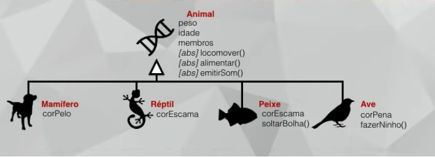
<a href="#" target="_blank"></a>

<a href="#" target="_blank"></a>

<a href="#" target="_blank"></a>

<a href="#" target="_blank"></a>

<a href="#" target="_blank"></a>

<a href="#" target="_blank"></a>

<a href="#" target="_blank"></a>

<a href="#" target="_blank"></a>

<a href="#" target="_blank"></a>

<a href="#" target="_blank"></a>

<a href="#" target="_blank"></a>

<a href="#" target="_blank"></a>

<a href="#" target="_blank"></a>

---

#### Aula Prática 12 – Polimorfismo em Java (Parte 1)


<code> class Animal </code>

```java
package aula12;

public abstract class Animal {
    // Attributes
    protected float peso;
    protected int idade;
    protected int membros;

    // Methods
    public abstract void locomover();
    public abstract void alimentar();
    public abstract void emitirSom();

    // Special Methods - Getters and Setters
    public float getPeso() {
        return peso;
    }

    public void setPeso(float peso) {
        this.peso = peso;
    }

    public int getIdade() {
        return idade;
    }

    public void setIdade(int idade) {
        this.idade = idade;
    }

    public int getMembros() {
        return membros;
    }

    public void setMembros(int membros) {
        this.membros = membros;
    }
}
```

<code> class Mamifero extends Animal </code>

```java
package aula12;

public class Mamifero extends Animal {
    // Attributes
    private String corPelo;

    @Override
    public void locomover() {
        System.out.println("Correndo");
    }

    @Override
    public void alimentar() {
        System.out.println("Mamando");
    }

    @Override
    public void emitirSom() {
        System.out.println("Som de mamifero");
    }

    // Special Methods - Getters and Setters
    public String getCorPelo() {
        return corPelo;
    }

    public void setCorPelo(String corPelo) {
        this.corPelo = corPelo;
    }
}
```

<code> class Cachorro extends Mamifero </code>

```java
package aula12;

public class Cachorro extends Mamifero {

    @Override
    public void emitirSom() {
        System.out.println("au au au");
    }

    public void enterrarOsso() {
        System.out.println("Enterrando o osso");
    }

    public void abanarRabo() {
        System.out.println("Abanando o rabo");
    }
}
```

<code> class Canguru extends Mamifero </code>

```java
package aula12;

public class Canguru extends Mamifero {
    @Override
    public void locomover() {
        System.out.println("Saltando");
    }

    public void usarBolsa() {
        System.out.println("Usando a bolsa");
    }
}
```

<code> class Reptil extends Animal </code>

```java
package aula12;

public class Reptil extends Animal {
    // Attributes
    private String corEscama;

    @Override
    public void locomover() {
        System.out.println("Rastejando");
    }

    @Override
    public void alimentar() {
        System.out.println("Comendo Vegetais");
    }

    @Override
    public void emitirSom() {
        System.out.println("Som de Réptil");
    }

    // Special Methods - Getters and Setters
    public String getCorEscama() {
        return corEscama;
    }

    public void setCorEscama(String corEscama) {
        this.corEscama = corEscama;
    }
}
```

<code> class Cobra extends Reptil </code>

```java
package aula12;

public class Cobra extends Reptil {

}
```

<code> class Tartaruga extends Reptil </code>

```java
package aula12;

public class Tartaruga extends Reptil {

    @Override
    public void locomover() {
        System.out.println("Andando beeeem devagar");
    }
}

```

<code> class Peixe extends Animal </code>

```java
package aula12;

public class Peixe extends Animal {
    // Attributes
    private String corEscama;

    @Override
    public void locomover() {
        System.out.println("Nadando");
    }

    @Override
    public void alimentar() {
        System.out.println("Comendo substâncias");
    }

    @Override
    public void emitirSom() {
        System.out.println("Peixe não faz som");
    }

     public void soltarBolha() {
         System.out.println("Soltou uma bolha");
     }

    // Special Methods - Getters and Setters
    public String getCorEscama() {
        return corEscama;
    }

    public void setCorEscama(String corEscama) {
        this.corEscama = corEscama;
    }
}
```

<code> class GoldFish extends Peixe </code>

```java
package aula12;

public class GoldFish extends Peixe {

}
```

<code> class Ave extends Animal </code>

```java
package aula12;

public class Ave extends Animal {
    // Attributes
    private String corPena;

    @Override
    public void locomover() {
        System.out.println("Voando");
    }

    @Override
    public void alimentar() {
        System.out.println("Comendo frutas");
    }

    @Override
    public void emitirSom() {
        System.out.println("Som de ave");
    }

    public void fazerNinho() {
        System.out.println("Construiu um ninho");
    }

    // Special Method - Getters and Setters
    public String getCorPena() {
        return corPena;
    }

    public void setCorPena(String corPena) {
        this.corPena = corPena;
    }
}
```

<code> class Arara extends Ave </code>

```java
package aula12;

public class Arara extends Ave {

}
```

<code> class Aula12 (Programa Principal) </code>

```java
package aula12;

public class Aula12 {
    public static void main(String[] args) {

        Mamifero ma = new Mamifero();
        System.out.println("####### Mamifero #######");
        ma.alimentar();
        ma.locomover();
        ma.emitirSom();

        Reptil rp = new Reptil();
        System.out.println("\n ####### Reptil #######");
        rp.locomover();
        rp.alimentar();
        rp.emitirSom();

        Peixe px = new Peixe();
        System.out.println("\n ######## Peixe ######");
        px.locomover();
        px.alimentar();
        px.emitirSom();

        Ave av = new Ave();
        System.out.println("\n ######### Ave ########");
        av.locomover();
        av.alimentar();
        av.emitirSom();

        Canguru cang = new Canguru();
        System.out.println("\n ####### Canguru ########");
        cang.locomover();
        cang.alimentar();
        cang.emitirSom();
        cang.usarBolsa();

        Cachorro cach = new Cachorro();
        System.out.println("\n ######## Cachorro #######");
        cach.locomover();
        cach.alimentar();
        cach.emitirSom();
        cach.enterrarOsso();
        cach.abanarRabo();

        Cobra cobr = new Cobra();
        System.out.println("\n ######### Cobra #########");
        cobr.locomover();
        cobr.alimentar();
        cobr.emitirSom();

        Tartaruga tart = new Tartaruga();
        System.out.println("\n ######### Tartaruga ######");
        tart.locomover();
        tart.alimentar();
        tart.emitirSom();

        GoldFish gold = new GoldFish();
        System.out.println("\n ######### GoldFish #######");
        gold.locomover();
        gold.alimentar();
        gold.emitirSom();

        Arara arar = new Arara();
        System.out.println("\n ########## Arara ##########");
        arar.locomover();
        arar.alimentar();
        arar.emitirSom();
    }
}
```

<code> &rarr; Run 🖥️  &lt;class Aula12&gt; </code>

```markdown
####### Mamifero #######
Mamando
Correndo
Som de mamifero

 ####### Reptil #######
Rastejando
Comendo Vegetais
Som de Réptil

 ######## Peixe ######
Nadando
Comendo substâncias
Peixe não faz som

 ######### Ave ########
Voando
Comendo frutas
Som de ave

 ####### Canguru ########
Saltando
Mamando
Som de mamifero
Usando a bolsa

 ######## Cachorro #######
Correndo
Mamando
au au au
Enterrando o osso
Abanando o rabo

 ######### Cobra #########
Rastejando
Comendo Vegetais
Som de Réptil

 ######### Tartaruga ######
Andando beeeem devagar
Comendo Vegetais
Som de Réptil

 ######### GoldFish #######
Nadando
Comendo substâncias
Peixe não faz som

 ########## Arara ##########
Voando
Comendo frutas
Som de ave
```

<br>

---

<span id="aula13">

### 13. Aula 13

#### Aula Teórica 13 – Conceito Polimorfismo (Parte 2)

Nessa aula de POO, vamos aprender como aplicar o Polimorfismo de Sobrecarga às nossas classes. Veja também a diferença entre sobrecarga e sobreposição, algo que muita gente confunde.


<a href="#" target="_blank"></a>

<a href="#" target="_blank"></a>

<a href="#" target="_blank"></a>

<a href="#" target="_blank"></a>

<a href="#" target="_blank"></a>

<a href="#" target="_blank"></a>

<a href="#" target="_blank"></a>

<a href="#" target="_blank"></a>

<br>

#### Polimorfismo

- *Polimorfismo* é terceiro e último pilar da POO. 
- É um mecanismo que permite um único nome representar comportamentos diferentes…
<br>
- Poli = Muitas | Morfo = Formas

#### Assinatura dos métodos

- São a quantidade e os tipos dos parâmetros. 
- A assinatura só leva em consideração essas duas premissas: 
    - Quantidade e Tipo. 
    
#### Tipos de Polimorfismos

- **Sobreposição / @Override**: É usado para sobrescrever comportamentos, mas mantendo o nome do método e sobrescrevendo ele em outra classe, obrigatório que tenha a mesma assinatura.

- **Sobrecarga**: É usado para alterar comportamentos na mesma classe, com a possibilidade de ter assinaturas diferentes, ainda assim, em um método com o mesmo nome.

---

<u> Aula Prática 13 – Polimorfismo Sobrecarga (Parte 2)</u>

<br>

<code> abstract class Animal </code>

```java
package aula13;

public abstract class Animal {
    // Attributes
    protected float peso;
    protected int idade;
    protected int membros;

    // Method
    public abstract void emitirSom();
}
```

<code> class Mamifero extends Animal </code>

```java
package aula13;

public class Mamifero extends Animal {
    // Attributes
    protected String corPelo;

    // Polimorfismo de Sobreposição
    @Override
    public void emitirSom() {
        System.out.println("Som de Mamifero!");
    }
}
```

<code> class Lobo extends Mamifero </code>

```java
package aula13;

public class Lobo extends Mamifero {
    // Polimorfismo de Sobreposição
    @Override
    public void emitirSom() {
        System.out.println("Auuuuuuuuuu!");
    }
}
```

<code> class Cachorro extends Lobo </code>

```java
package aula13;

public class Cachorro extends Lobo {

    // Polimorfismo de Sobreposição -> Mesma assinatura. Classes diferentes.
    @Override
    public void emitirSom() {
        System.out.println("Au! Au! Au!");
    }

    // Polimorfismo de Sobrecarga -> mesma classe. Assinatura diferentes.
    public void reagir(String frase) {
        if (frase.toLowerCase() == "toma comida" || frase.toLowerCase() == "ola") {
           System.out.println("Abanar! e Latir!");
        } else {
            System.out.println("Rosnar!");
        }
    }
    public void reagir(int hora, int minuto) {
        if (hora < 12) {
            System.out.println("Abanar!");
        }
        else if (hora >= 18) {
            System.out.println("Ignorar!");
        } else {
            System.out.println("Abanar! e Latir!");
        }
    }
    public void reagir(boolean dono) {
        if (dono) {
            System.out.println("Abanar!");
        } else {
            System.out.println("Rosnar! e Latir!");
        }
    }
    public void reagir(int idade, float peso) {
        if (idade < 5) {
            if (peso < 10){
                System.out.println("Abanar!");
            }
            else {
                System.out.println("Latir!");
            }
        } else {
            if (peso < 10) {
                System.out.println("Rosnar!");
            } else {
                System.out.println("Ignorar!");
            }
        }
    }
}
```

- Programa Principal

<code> class Aula13 </code>

```java
package aula13;

public class Aula13 {

    public static void main(String[] args) {

        Mamifero mam = new Mamifero();
        System.out.println("##### Mamifero #####");
        mam.emitirSom();            // Som de Mamifero!

        Lobo lob = new Lobo();
        System.out.println("\n##### Lobo #####");
        lob.emitirSom();            // Auuuuuuuuuu!

        Cachorro cac = new Cachorro();
        System.out.println("\n##### Cachorro #####");
        cac.emitirSom();           // Au! Au! Au!
        cac.reagir("ola");         // Abanar! e Latir!
        cac.reagir("Vai apanhar"); // Rosnar!
        System.out.println();
        cac.reagir(11,45);          // Abanar!
        cac.reagir(21,00);          // Ignorar!
        cac.reagir(17,00);          // Abanar! e Latir!
        System.out.println();
        cac.reagir(false);          // Rosnar! e Latir!
        cac.reagir(true);           // Abanar!
        System.out.println();
        cac.reagir(2,12.5F);        // Latir!
        cac.reagir(17,4.5F);        // Rosnar!
        cac.reagir(15, 15.0F);      // Ignorar!
    }
}
```

---

<span id="aula14">

### 14. Aula 14

#### Aula Teórica 14 – Exercícios de POO (Parte 2)

Nessa aula de POO, vamos fazer uma lista de exercícios de programação orientada a objetos para você testar os seus conhecimentos adquiridos durante as 13 primeiras aulas do curso.


---

- Exercícios de POO


<a href="#" target="_blank"></a>

<a href="#" target="_blank"></a>

<a href="#" target="_blank"></a>

<a href="#" target="_blank"></a>

<a href="#" target="_blank"></a>

<a href="#" target="_blank"></a>

<a href="#" target="_blank"></a>

<a href="#" target="_blank"></a>

<a href="#" target="_blank"></a>

<a href="#" target="_blank"></a>

<br>

----


- Respostas aos Exercícios de POO


<a href="#" target="_blank"></a>

<a href="#" target="_blank"></a>

<a href="#" target="_blank"></a>

<a href="#" target="_blank"></a>

<a href="#" target="_blank"></a>

<a href="#" target="_blank"></a>

<a href="#" target="_blank"></a>

<a href="#" target="_blank"></a>

<a href="#" target="_blank"></a>

<a href="#" target="_blank"></a>

---

<br>

#### Aula Prática 14 – Projeto Final em Java (Parte 1)

Nessa aula de POO, vamos iniciar a construção de um exemplo completo de um modelo 100% construído em Programação Orientada a Objetos com PHP.


<a href="#" target="_blank"></a>

<a href="#" target="_blank"></a>

<br><br>

- **PROJETO YOUTUBE**

<code> interface AcoesVideo  </code>

```java
package aula14;

public interface AcoesVideo {
    // abstract method
    public void play();
    public void pause();
    public void like();
}
```

<code> class Video implements AcoesVideo </code>

```java
package aula14;

public class Video implements AcoesVideo {
    // Attributes
    private String titulo;
    private int avaliacao;
    private int views;
    private int curtidas;
    private boolean reproduzindo;

    // Constructor
    public Video(String titulo) {
        this.titulo = titulo;
        this.avaliacao = 1;  // estrelas DE 1 ATE 5!
        this.views = 0;
        this.curtidas = 0;
        this.reproduzindo = false;
    }

    // toString()
    @Override
    public String toString() {
        return "Video{" +
                "titulo='" + titulo + '\'' +
                ", avaliacao=" + avaliacao +
                ", views=" + views +
                ", curtidas=" + curtidas +
                ", reproduzindo=" + reproduzindo +
                '}';
    }

    // Special Method - Getters and Setters
    public String getTitulo() {
        return titulo;
    }
    public void setTitulo(String titulo) {
        this.titulo = titulo;
    }
    public int getAvaliacao() {
        return avaliacao;
    }
    public void setAvaliacao(int avaliacao) {
        this.avaliacao = avaliacao;
    }
    public int getViews() {
        return views;
    }
    public void setViews(int views) {
        this.views = views;
    }
    public int getCurtidas() {
        return curtidas;
    }
    public void setCurtidas(int curtidas) {
        this.curtidas = curtidas;
    }

    @Override
    public void play() {
        this.reproduzindo = true;
    }

    @Override
    public void pause() {
        this.reproduzindo = false;
    }

    @Override
    public void like() {
        this.curtidas++;
    }
}
```

<code> abstract class Pessoa </code>

```java
package aula14;

public abstract class Pessoa {
    // Attributes
    protected String nome;
    protected int idade;
    protected String sexo;
    protected float experiencia;

    // Construct
    public Pessoa(String nome, int idade, String sexo) {
        this.nome = nome;
        this.idade = idade;
        this.sexo = sexo;
        this.experiencia = 0;
    }

    @Override
    public String toString() {
        return "Pessoa{" +
                "nome='" + nome + '\'' +
                ", idade=" + idade +
                ", sexo='" + sexo + '\'' +
                ", experiencia=" + experiencia +
                '}';
    }

    // Method
    public void ganharExperiencia(){
        // TODO
    }

    // Special Method
    public String getNome() {
        return nome;
    }

    public void setNome(String nome) {
        this.nome = nome;
    }

    public int getIdade() {
        return idade;
    }

    public void setIdade(int idade) {
        this.idade = idade;
    }

    public String getSexo() {
        return sexo;
    }

    public void setSexo(String sexo) {
        this.sexo = sexo;
    }

    public float getExperiencia() {
        return experiencia;
    }

    public void setExperiencia(float experiencia) {
        this.experiencia = experiencia;
    }
}
```

<code> class Gafanhoto extends Pessoa </code>

```java
package aula14;

public class Gafanhoto extends Pessoa {
    // Attributes
    private String login;
    private int totalAssistido;

    // Construcor
    public Gafanhoto(String nome, int idade, String sexo, String login) {
        super(nome, idade, sexo);
        this.login = login;
        this.totalAssistido = 0;
    }

    @Override
    public String toString() {
        return "Gafanhoto{" +
                "login='" + login + '\'' +
                ", nome='" + nome + '\'' +
                ", idade=" + idade +
                ", sexo='" + sexo + '\'' +
                '}';
    }

    // Method
    public void viuMaisUm(){
        // TODO
    }

    // Special Method - Getters and Setters
    public String getLogin() {
        return login;
    }

    public void setLogin(String login) {
        this.login = login;
    }

    public int getTotalAssistido() {
        return totalAssistido;
    }

    public void setTotalAssistido(int totalAssistido) {
        this.totalAssistido = totalAssistido;
    }
}
```

<code> class Aula14 (Programa Principal) </code>

```java
package aula14;

public class Aula14 {

    public static void main(String[] args) {

        Video vet[] = new Video[3];
        vet[0] = new Video("Aula 1 de POO");
        vet[1] = new Video("Aula 2 de PHP");
        vet[2] = new Video("Aula 3 de HTML");

        System.out.println(vet[0].toString());
        System.out.println(vet[1].toString());
        System.out.println(vet[2].toString());
        System.out.println();

        Gafanhoto gaf[] = new Gafanhoto[3];
        gaf[0] = new Gafanhoto("Jubileu", 15, "M", "juba");
        gaf[1] = new Gafanhoto("Creuza",16, "F", "creu");
        gaf[2] = new Gafanhoto("Jose", 17,"M", "jose");

        System.out.println(gaf[0].toString());
        System.out.println(gaf[1].toString());
        System.out.println(gaf[2].toString());
    }
}
```


<code> &rarr; Run 🖥️  &lt;class Aula14&gt; </code>

```markdown
Video{titulo='Aula 1 de POO', avaliacao=1, views=0, curtidas=0, reproduzindo=false}
Video{titulo='Aula 2 de PHP', avaliacao=1, views=0, curtidas=0, reproduzindo=false}
Video{titulo='Aula 3 de HTML', avaliacao=1, views=0, curtidas=0, reproduzindo=false}

Gafanhoto{login='juba', nome='Jubileu', idade=15, sexo='M'}
Gafanhoto{login='creu', nome='Creuza', idade=16, sexo='F'}
Gafanhoto{login='jose', nome='Jose', idade=17, sexo='M'}
```

<br>

---


<br>

<span id="aula15">

### 15. Aula 15

#### Aula Teórica 15 – Exercícios de POO (Parte 3)

Nessa aula de POO, vamos fazer mais 10 Exercícios de Programação Orientada a Objetos e continuar a construção do modelo do Diagrama de Classes da aula anterior.

- Exercícios de POO


<a href="#" target="_blank"></a>

<a href="#" target="_blank"></a>

<a href="#" target="_blank"></a>

<a href="#" target="_blank"></a>

<a href="#" target="_blank"></a>

<a href="#" target="_blank"></a>

<a href="#" target="_blank"></a>

<a href="#" target="_blank"></a>

<br><br>

- Respostas aos Exercícios de POO


<a href="#" target="_blank"></a>

<a href="#" target="_blank"></a>

<a href="#" target="_blank"></a>

<a href="#" target="_blank"></a>

<a href="#" target="_blank"></a>

<a href="#" target="_blank"></a>

<a href="#" target="_blank"></a>

<a href="#" target="_blank"></a>

---

<br>

#### Aula Prática 15 – Projeto Final em PHP (Parte 2)

Nessa aula de POO, vamos aplicar o modelo de agregação em Classes utilizando linguagem Java. Um exercício prático e completamente feito em Programação Orientada a Objetos.

O **desafio final** é a criação de um pequeno programa semelhante ao Youtube, onde você deverá criar um sistema que permite adicionar vídeos, um “login” para as pessoas assistirem os vídeos, como também, gravar a quantidade de visualizações e a opção de avaliar cada vídeo. Tudo isso aplicando conceitos de orientação à objetos.


<a href="#" target="_blank"></a>

<a href="#" target="_blank"></a>


<a href="#" target="_blank"></a>

<a href="#" target="_blank"></a>

<hr>

<span id="autor">

### Autor :smile:

<div align="rigth">
  <a href="https://github.com/eduardodsr">
   
  </a>
</div>

- `Dev:` Eduardo da Silva Rodrigues

- `GitHub:` [github.com/eduardodsr](https://www.github.com/eduardodsr) :link:

- `E-mail:` <eduardodsr@gmail.com> :email:

```

```
