### 02. PHP Básico [40 Horas] 

- Criado em 1995, por **Rasmus Lerdorf**, o **PHP** (acrônimo para PHP: Hypertext Preprocessor) é uma linguagem de script Open Source de uso geral. Com ela, desenvolvedores podem criar sites dinâmicos, extensões para aplicativos e otimizar tanto programas quanto Sistemas Operacionais. Ela é especialmente adequada para o desenvolvimento web e pode ser embutida dentro do HTML.

- Você vai aprender os primeiros passos para criar sites que utilizem a tecnologia PHP incorporada. Para isso, aprenderá como instalar um servidor, criar scripts básicos, interatividade com formulários e acesso a bancos de dados simples. No final, vai aprender como colocar seu site no ar utilizando um servidor profissional de hospedagem.


### Conteúdo do Módulo :bookmark:

1. Aula 1 – História do PHP ✅

A Linguagem PHP começou em 1994, quando Rasmus Lerdorf resolveu criar um gerenciador de visitas para o seu site. Sua primeira criação não era uma linguagem, e sim uma ferramenta. Batizada de Personal Home Page, usava comandos simples inspirados da linguagem PERL. A segunda versão da ferramenta já permitia a manipulação de formulários e pequenos livros de visita: o Personal Home Page/ Forms Interpreter, ou PHP/FI. Essa versão ficou bastante popular e começou a se espalhar em 1995.

Com o objetivo de fazer sua ferramenta crescer, Rasmus liberou o acesso ao código-fonte da CGI em 1996, o que despertou o interesse de diversos programadores, entre eles os israelenses Zeev Suraski e Andi Gutmans. Esses dois reescreveram o núcleo da ferramenta e a transformou em uma Linguagem de Scripts, nos moldes em que nós temos o PHP atualmente. A partir de 1998, o PHP já começava a se destacar como uma das linguagens mais utilizadas na Internet. Foi nessa época que a linguagem foi rebatizada e passou a se chamar PHP: Hypertext Preprocessor e chegou à sua versão 3.0, com muitas funcionalidades interessantes.

Em 2000, a quarta versão do PHP surge para eliminar a maioria dos erros e falhas de segurança encontrados pela comunidade. Enquanto isso, Zeev e Andi resolveram reescrever todo o núcleo da linguagem, abandonando quase que completamente o projeto original de Rasmus Lerdorf. Quatro anos depois, em 2004, surge o PHP5 que ficou mundialmente conhecido e atualmente conta com 32 versões internas, com mais de 1000 correções de falhas de segurança.

<br>

2. Aula 2 – Como funciona o PHP ✅

Como funciona o PHP? 
Como transformar meu computador em um servidor? 
Como funciona tecnologias server-side? 
Qual é a diferença entre tecnologias PHP, ASP, JSP e etc? 

A segunda aula do seu Curso de PHP do Curso em Vídeo vai responder a essas e muitas outras perguntas que normalmente são feitas por quem está iniciando seus estudos em PHP.

A infra-estrutura da Internet é baseada no modelo cliente x servidor. A Internet interliga clientes a servidores que possuem arquivos e fornecem cópias desses documentos.

Nas tecnologias **client-side**, a função do servidor é apenas fornecer arquivos que o cliente solicita. Quem vai ter mais trabalho de processamento é o lado do cliente (client-side) que terá seu navegador trabalhando para interpretar os códigos e arquivos enviados pelo server. São exemplos de tecnologias client-side: HTML, CSS, JavaScript e Flash.

Já nas tecnologias **server-side**, o servidor vai assumir a maior parte do trabalho, já que existe a interpretação de códigos do lado do servidor (server-side), que no caso do PHP são chamados scripts de servidor.

Para o PHP funcionar corretamente, o servidor precisa ter o Apache, que é um program server, um interpretador PHP (engine) e suporte a um ou mais tipos de banco de dados (geralmente MySQL).

Para transformar seu computador em um servidor com suporte PHP, você precisa de um sistema AMP (Apache + MySQL + PHP). Para usar PHP no Windows, instalamos um sistema WAMP. Para usar PHP no Linux, instalamos um sistema LAMP. Para usar PHP no Mac, instalamos um sistema MAMP.

<br>

3. Aula 3 – Como Instalar o PHP ✅

Nessa aula do Curso Grátis de PHP para Iniciantes você vai aprender como instalar um servidor PHP no seu computador e vai ver como criar o seu primeiro exemplo de código PHP: o “Olá, Mundo!”.

```php
<?php

    echo "Olá, Mundo !";

?> 
```

É possível instalar o PHP no seu PC, bem como todas as ferramentas necessárias para o desenvolvimento na linguagem, como o Apache, MySQL, PHPMyAdmin, interpretadores e etc.

<br>

4. Aula 4 – Variáveis em PHP ✅

Como criar variáveis em PHP? 
Como declarar variáveis em PHP? 
Quais são os tipos primitivos do PHP? 
Como realizar conversões em PHP? 

A resposta para essas e muitas outras perguntas você vai ter nessa quarta aula do Curso Grátis de PHP para Iniciantes.

Antes de mais nada, é importante que você entenda os conceitos de variáveis em Algoritmos e saiba utilizá-las corretamente. 

**Comandos de saída do PHP:**

Os comandos **ECHO, PRINT e PRINTF** servem para gerar saídas na tela. Um exemplo simples desse comando é:

    echo “Estou aprendendo variáveis em PHP”;

A pronúncia correta do comando echo é ECO (aquele som que se repete quando gritamos dentro de cavernas, lembra?).

Note que no comando acima, foi utilizada uma tag HTML para a quebra de linha. Isso é possível, já que o PHP se integra com essa tecnologia. Fique à vontade para utilizar tags de marcação hipertexto dentro dos seus comandos de saída em PHP.

**Usando variáveis**

Variáveis são espaços na memória do computador que podem conter valores. Variáveis simples armazenam apenas um valor de cada vez, dependendo do seu tipo.

Todas as **variáveis** no PHP possuem um **$** na frente e seguem as mesmas regras de construção de nomes de identificadores:

– Devem começar com uma letra (após o $)

– Podem conter letras e números

– Não podem conter caracteres acentuados

– Não podem conter símbolos como % # * & etc (exceto _ e $)

OBS: O PHP faz a diferenciação entre as letras maiúsculas e minúsculas, por isso recomendamos que você utilize apenas identificadores com letras minúsculas em seus scripts PHP.

**Declaração de variáveis**

No PHP não existe a necessidade de declarar variáveis. Os tipos serão atribuídos automaticamente de acordo com o valor que a variável receber. Esse processo é conhecido como coerção. Isso pode ser até empolgante no início, mas é preciso prestar bastante atenção para não fazer nada errado.

Você pode forçar um tipo primitivo a uma variável por **TYPECAST**, utilizando (int) (real) (float) (double) (string) antes do valor na atribuição.

Não existe typecast para variáveis lógicas. Os valores booleanos são considerados números, sendo o valor 1 atribuído para true e vazio para false.


<a href="https://youtu.be/DGZS9KrlrjI?t=450" target="_blank">Print tirado dessa vídeoaula</a>


**Atribuição de valores**

Atribuir valor é colocar um conteúdo em uma variável. Utilizamos o operador de atribuição = para realizar essa tarefa. Veja alguns exemplos:

    $idade = 15;

    $salario = 1500.25;

    $nome = “Gustavo”;

    $casado = true;

**Concatenação de valores**

Concatenar é juntar valores para tratá-los em conjunto. A concatenação em PHP é realizada pelo operador ponto (.) como no trecho de código a seguir.

    $idade = 18;

    $nome = “Maria”;

    echo $nome . “ tem “ . $idade . “ anos “;

No script acima, será exibido *“Maria tem 18 anos”*, já que acontecerão concatenações.

Porém, já que os identificadores PHP começam com um $, é possível realizar o comando de saída utilizando um modo simplificado:

    echo “$nome tem $idade anos”; 
O comando acima pode ser usado sem problemas, contanto que sejam utilizadas aspas duplas.

<br>

5. Aula 5 – Operadores Aritméticos ✅

Como fazer contas no PHP? 
Como realizar somas, multiplicações e mais? 
Exponenciações em PHP? 
Raiz quadrada em PHP? 

**Os operadores aritméticos do PHP são:**

    +     é o operador de adição

    –     é o operador de subtração

    *     é o operador de multiplicação

    /     é o operador de divisão Real

    %     é o operador de módulo (resto da divisão)

O código a seguir, vai somar dois números:

    $n1 = 3;

    $n2 = 2;

    $s = $n1 + $n2;

    echo “A soma entre $n1 e $n2 é igual a $s”;

O código acima vai mostrar na tela a mensagem

    A soma entre 3 e 2 é igual a 5

**Ordem de precedência de operadores aritméticos em PHP**

Outra coisa importante a saber é a ordem de precedência de operadores aritméticos em PHP. Sempre em uma expressão, os operadores que serão executados são, na ordem:

1. parênteses ( )

2. operadores de multiplicação, divisão e módulo  *  /  %

3. as adições e subtrações  +  –

Por exemplo, considerando o código a seguir:

    $media = $nota1 + $nota2 / 2;

A média será calculada de maneira errada, já que segundo a ordem de precedência, a divisão será feita antes. O correto seria escrever:

    $media = ($nota1 + $nota2) / 2;

Note que o uso dos parênteses muda bastante as coisas.

**Obtendo valores da URL com PHP**

Vamos analisar a URL abaixo: 

    http://localhost/aula05/operadores.php?a=3&b=2

<big>&nbsp; http://localhost/php/aula05/operadores.php?a=3&b=2 </big>

No link acima, o arquivo *operadores.php* está sendo chamado dentro da pasta *aula05* do servidor local. Na linha, serão passados dois valores: *a valendo 3* e *b valendo 2*.

Para pegar esses valores no script PHP, use o código

    $valor1 = $_GET[“a”];

    $valor2 = $_GET[“b”];

    No código acima, o parâmetro a (3) passado pela URL será armazenado na variável $valor1. 
    De maneira similar, a variável $valor2 vai conter o valor do parâmetro b (2).

Obs: use sempre <code>$_GET</code> com todas as letras maiúsculas.

**Funções Matemáticas em PHP**

abs( ) : Retorna o valor absoluto de um número.

    abs(-5) = 5

pow( ) : Calcula uma potência

    pow(3, 2) = 32 = 9

sqrt( ) : Calcula a raiz quadrada de um número.

    sqrt(25) = 5

round( ) : Arredonda valores.

    round(3.8) = 4

intval( ) : Trunca um número. Retorna a parte inteira de um valor.

    intval(3.99) = 3

number_format( ) : Formata um número Real.

    number_format(3258.754, 2, “,”, “.”) = 3.258. 75.

number_format( ) : Formata um número Real. 
Exemplo de formataçao de uma variavel em moeda.

    $v2 = 9999.99;
    echo "<br> O valor de $v2 em moeda é : R$ " .number_format($v2, 2, "," , ".");
    // O valor de 9999.99 em moeda é : R$ 9.999,99


Obs: Ainda existem os métodos <code> ceil() </code> e <code> floor() </code> para arredondamentos para cima e para baixo, respectivamente. 
A função <code> round() </code> vai usar as regras de arredondamento.

<br>

6. Aula 6 – Operadores de Atribuição ✅

Uma atribuição acontece quando queremos colocar algum valor dentro de uma variável, seja ele um número ou string estática, o resultado de uma expressão, o retorno de uma função ou o conteúdo de outra variável.

**Operadores de Atribuição do PHP**

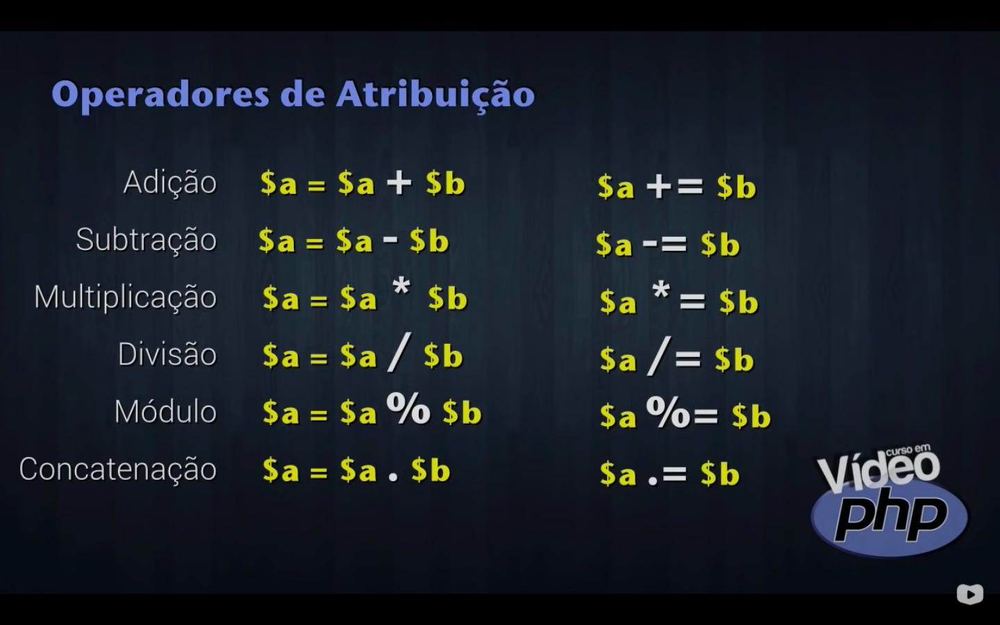
<a href="https://youtu.be/NuBt0B_GeEo?t=275" target="_blank">Print tirado dessa vídeoaula</a>

Os operadores de atribuição do PHP são :

    +=      Adição
    -=      Subtração
    *=      Multiplicação
    /=      Divisão
    %=      Módulo
    .=      Concatenação

Vejamos alguns exemplos:

    $c = $c + 5;    $c += 5;

    $c = $c – $a;   $c -= $a;

    $c = $c + 1;    $c += 1;

Na última linha da tabela acima, você verifica a adição de apenas uma unidade na variável. Nesses casos, podemos usar os operadores de incremento.

**Operadores de Incremento ou Decremento**

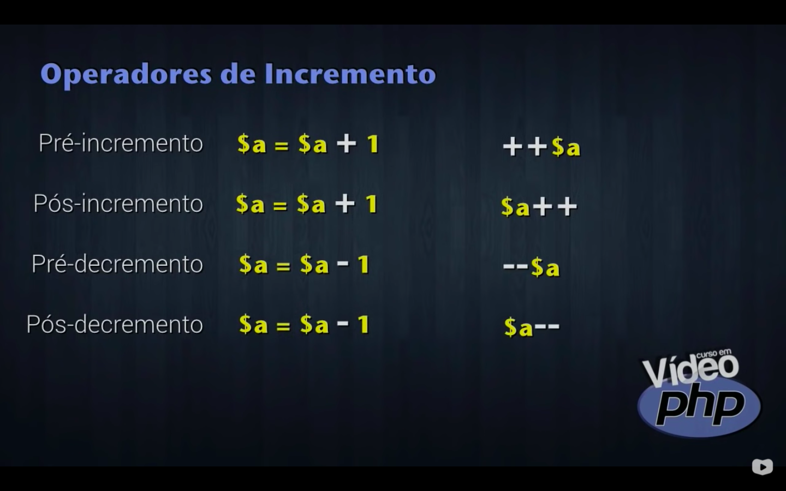
<a href="https://youtu.be/NuBt0B_GeEo?t=720" target="_blank">Print tirado dessa vídeoaula</a>

**Exemplo de Operadores de Incremento ou Decremento**:

    $c = $c + 1;    $c += 1;    $c++;

Qualquer uma das formas acima é válida. De maneira similar, temos:

    $c = $c – 1;    $c -= 1;    $c–-;

A forma de utilizar o operador de incremento/ decremento faz toda diferença se ele aparece antes ou depois da variável. Assim:

    $c++   $c–-


**Comentários em PHP**

Existem três tipos de comentários em PHP. 
Os **comentários inline** <code> // </code> e <code> #  </code> transformam tudo o que está após o(s) símbolo(s) será considerado comentário.

```php
<?php
    // Essa linha é um comentário
 
    # Essa também é um comentário
?> 
```

Existe também o **comentário multiline**, que vai criar comentários que ocupem várias linhas:  

```php
<?php
    /* 
        Esse comentário vai ocupar várias linhas do seu código
        e todas serão ignoradas.
        Tudo aquilo que estiver aqui no meio será considerado 
        como sendo um comentário. 
    */
?>
```

```php
<?php

    /* Esse comentário vai ocupar várias linhas do seu código 
    e todas serão ignoradas */

    $a += 1;    // Esse é um comentário de uma linha

    $b ++;      # Esse aqui também é um comentário

?>
```

**Variáveis Referenciadas**

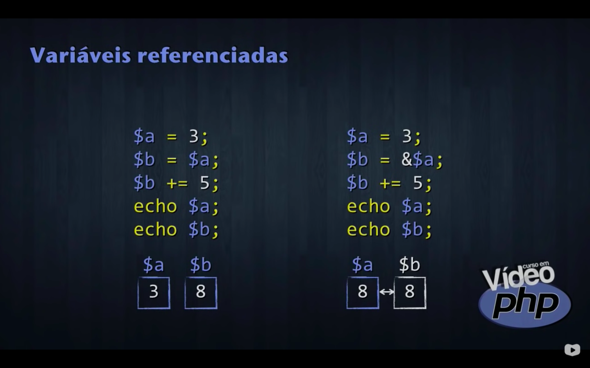
<a href="https://youtu.be/NuBt0B_GeEo?t=1190" target="_blank">Print tirado dessa vídeoaula</a>

Como fazer referências entre variáveis?

Colocar um caractere <code> & </code> na frente de uma variável vai criar um ponteiro em PHP. 
*Ela não será uma variável de fato, mas será uma <strong>referência à variável original</strong>.*

Considere o código:

```php
<?php

     $x = 3;    // A variável $x vai receber 3. 

     $y = $x;   // A variável $y vai receber o valor que está dentro da variável $x.

     $z = &$x;  // A variável $z vai ser uma ligação com a variável $x.

     /* 
        Mais tarde, qualquer modificação em $y não vai alterar o valor de $x. 
        Porém, se mudarmos o valor de $z, o valor de $x será afetado, já que existe uma relação entre as duas.
     */

?>
```

**Variáveis de Variáveis (Variáveis Variantes)**

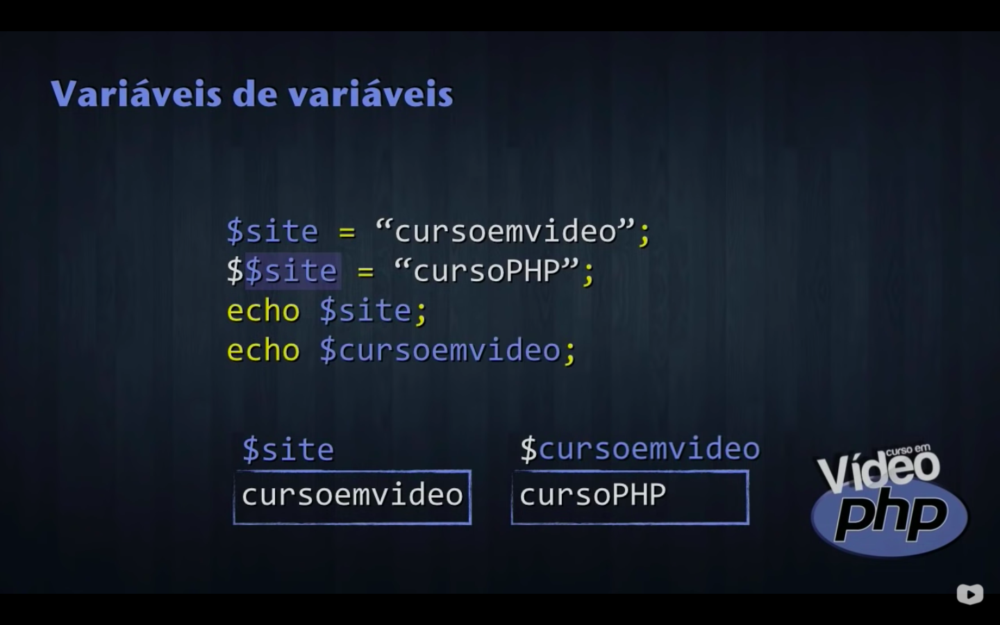
<a href="https://youtu.be/NuBt0B_GeEo?t=1460" target="_blank">Print tirado dessa vídeoaula</a>

Colocar um segundo <code> $ </code> na frente de uma variável também possui um efeito bem peculiar. Ele vai criar uma variável dinamicamente, dependendo do conteúdo da variável original. Essas são as variáveis de variáveis em PHP.

```php
<?php

    $nome = “gustavo”;  // uma variável $nome, como o conteúdo “gustavo”

    $$nome = “professor”; // uma variável $gustavo, com o conteúdo “professor”.

?>
```

<br>

7. Aula 7 – Operadores Relacionais  ✅

**Operadores Relacionais**

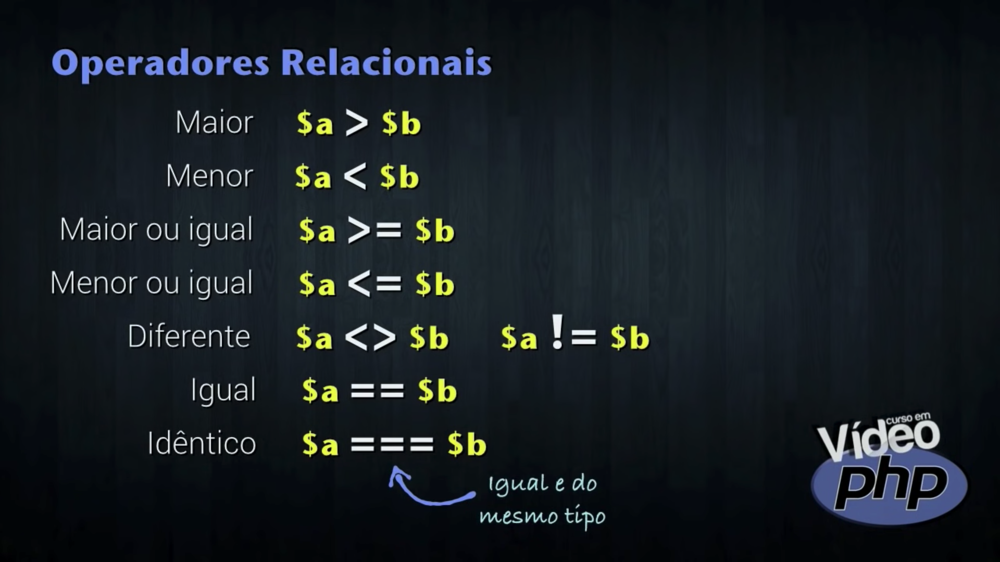
<a href="https://youtu.be/YrmPk8zL9Qw?t=55" target="_blank">Print tirado dessa vídeoaula</a>

**Operador Ternário**

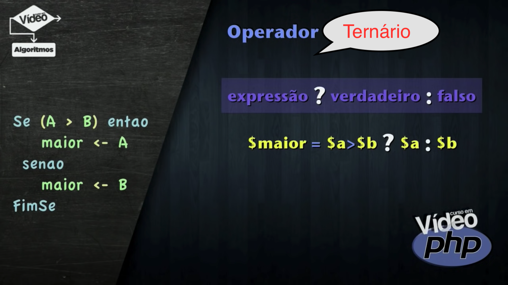
<a href="https://youtu.be/YrmPk8zL9Qw?t=175" target="_blank">Print tirado dessa vídeoaula</a>

**Operador Ternário no PHP**

Ele nada mais é do que uma forma mais enxuta ou curta de usar o comando condicional if.

Uma condição é avaliada, e se ela for **verdadeira**, atribui-se um valor, e se for **falsa**, atribui-se outro valor. A sintaxe fica assim:

    /* Operador Ternário */
    
    expressao  ?  verdadeiro  :  falso

```php
<?php

    /* Operador Ternário */

    // expressao ? verdadeiro : falso

    $r = $a > $b ? $a + $b : $a - $b

    $situacao = $media < 7 ? "recuperacao" : "aprovado"

?>
```

**Operadores Lógicos**

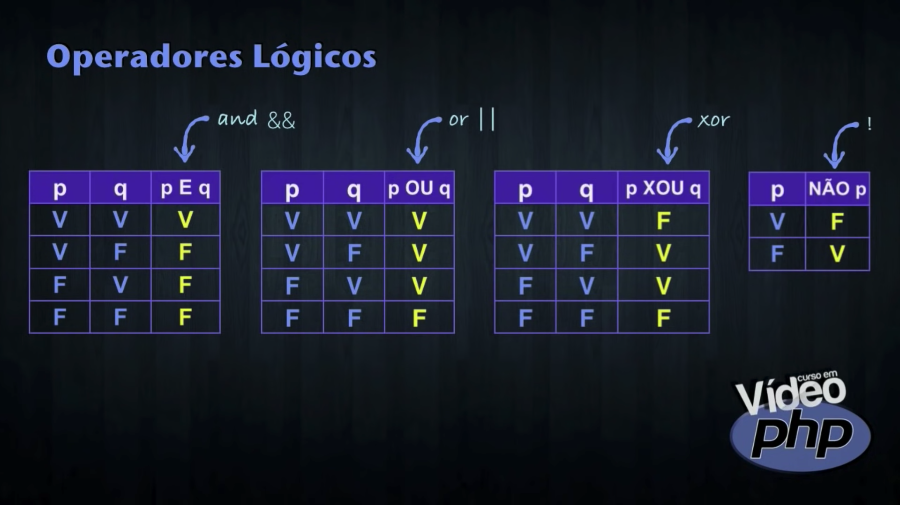
<a href="https://youtu.be/YrmPk8zL9Qw?t=1075" target="_blank">Print tirado dessa vídeoaula</a>

<br><br>

8. Aula 8 – Integração HTML5 + PHP  ✅

Ligação formulário HTML + PHP, integração HTML5 com PHP via formulário.

Nessa oitava aula do Curso de PHP, vamos aprender como aumentar a interatividade dos nossos scripts PHP com formulários HTML5.

**Formulários em HTML5**

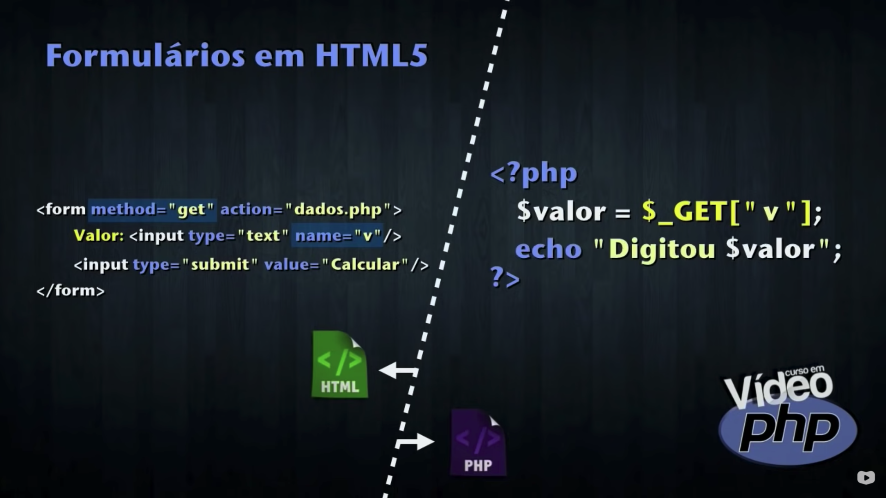
<a href="https://youtu.be/gvZfP2iBkw4?t=90" target="_blank">Print tirado dessa vídeoaula</a>

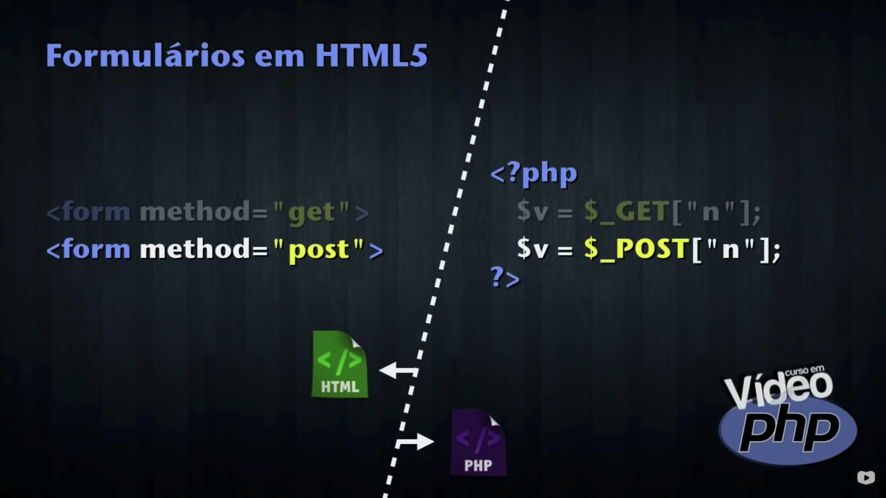
<a href="https://youtu.be/gvZfP2iBkw4?t=90" target="_blank">Print tirado dessa vídeoaula</a>

Se você não sabe como lidar com formulários HTML5, não se esqueça de assistir antes as duas aulas que tratam desse assunto no Curso em Vídeo Grátis de HTML5.

Formulários HTML5 – Parte 1: http://youtu.be/metoFY-x_yg

Formulários HTML5 – Parte 2: http://youtu.be/lwuDJN9Udfc

Formulários HTML5 e JavaScript: http://youtu.be/YY5hqlcbfoI

Lá você vai aprender como escrever códigos específicos para a criação de formulários completos e vai estudar todos os novos controles de formulários adicionados ao HTML5, como o range, color, number, date, etc.

Por exemplo, vamos considerar um formulário que use o método **GET** e envie um valor **V** para o arquivo **DADOS.PHP**:

Obs: O método **GET** envia dados de um formulário diretamente pela URL.

**Interligando o formulário HTML com o script PHP**

Para interligar o formulário, vamos usar a cláusula <code> $_GET </code> 

```php
<?php

     $valor = $_GET[“v”];

     echo “Digitou $valor”;

?>
```

**Formulário HTML com script PHP / Resumo do método GET e POST**

<strong><code> $_POST </code></strong>  =>  lento / mais seguro / enviar os dados por pacotes

<strong><code> $_GET </code></strong>   =>  rápido / menos seguro / enviar os dados pela URL

<em>Obs:</em>  
<code> $_GET </code> =>  formulários mais simples

<code> $_POST </code> =>  formulários mais complexos, por exemplo, senhas e cartão de crédito. Porém o POST não é tão seguro assim, pois não inclui criptografica e precisa utilizar outros protocolos mais poderosos.


**Interligando outros tipos de controles de formulários HTML5 com PHP**

A integração de qualquer controle de formulário PHP pode ser feita através do parâmetro NAME de cada um deles. Durante a aula, criamos um formulário com vários tipos de controles e interligamos eles ao arquivo PHP.

**Pegando o ano atual com PHP** 

Para obter o ano atual no PHP, utilizamos:

    $idade = date(“Y”) – $ano;

<br>

9. Aula 9 – Estrutura Condicional if  ✅

O PHP permite a criação de condicões. 
Nessa aula, veremos como utilizar a estrutura <code> IF </code>.

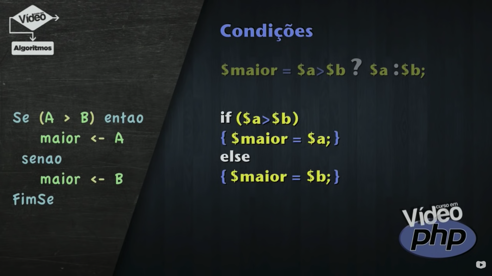
<a href="https://youtu.be/qAisUeI5oKE?t=140" target="_blank">Print tirado dessa vídeoaula</a>

A estrutura condicional em PHP é representada da seguinte forma:

```php
if ($idade >= 18) {

     $vota = true;
     $dirige = true;

} else {

    $vota = false;
    $dirige = false;
}
```

**Estruturas condicionais aninhadas**

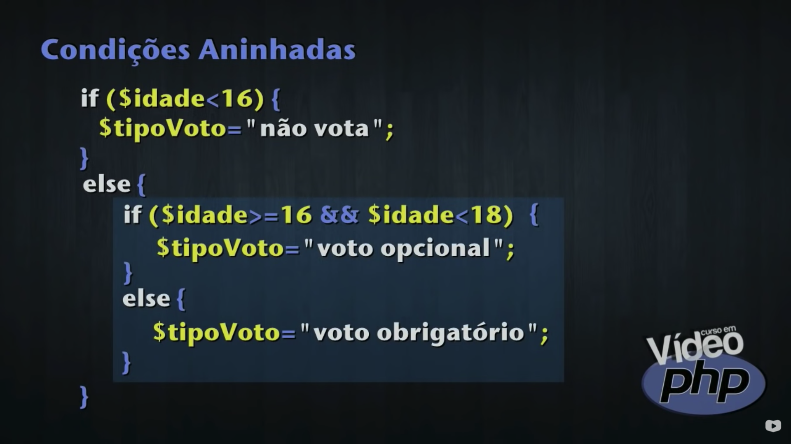
<a href="https://youtu.be/qAisUeI5oKE?t=850" target="_blank">Print tirado dessa vídeoaula</a>

Quando colocamos uma condicional dentro da outra, dizemos que estamos aninhando estruturas (termo que se refere a ninho). 
Para aninhar blocos, utilizamos uma sintaxe semelhante à anterior:

```php
if ($peso 50) {

    $tipo = “muito magro”;

} else {

    if ($peso =50 && $peso 70) {

          $tipo = “peso normal”;

     } else {

        $tipo = “acima do peso”;

     }
}
```

**Simplificando estruturas condicionais aninhadas**

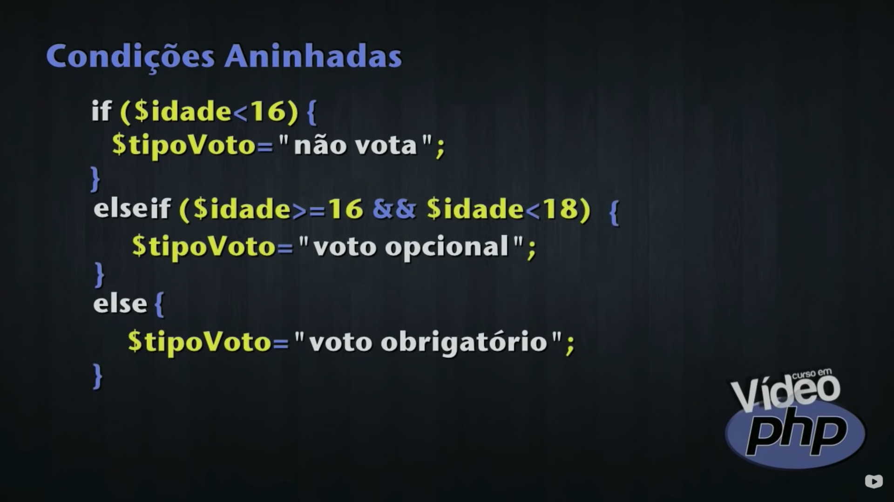
<a href="https://youtu.be/qAisUeI5oKE?t=1272" target="_blank">Print tirado dessa vídeoaula</a>

No PHP, podemos substituir uma cláusula <code> ELSE </code> seguida de outro <code> IF </code> (como feito acima) por uma estrutura <code> elseif {} </code> que vai se comportar exatamente da mesma maneira, mas usará menos blocos.

```php
if ($tipo == “nacional”) {

     $imposto = 0;

} elseif ($tipo == “importado”) {

     $imposto = 60;

} elseif ($tipo == “mercosul”) {

     $imposto = 20;

} else {

     $imposto = 80;

}
```

<br>

10. Aula 10 – Estrutura Condicional Switch ✅


<a href="https://youtu.be/thElQ5IhM1Q?t=100" target="_blank">Print tirado dessa vídeoaula</a>

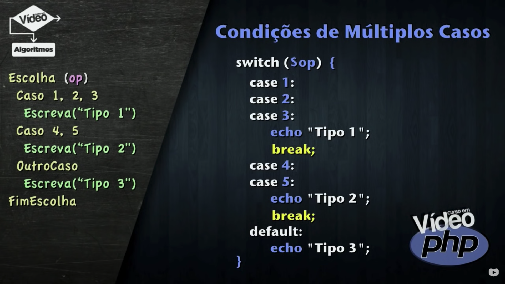
<a href="https://youtu.be/thElQ5IhM1Q?t=800" target="_blank">Print tirado dessa vídeoaula</a>

Estruturas de condição de múltipla escolha em PHP. 
**Switch** case em PHP usa a mesma sintaxe do Java e da Linguagem C e C++.

<br>

11. Aula 11 – Estrutura de Repetição While ✅

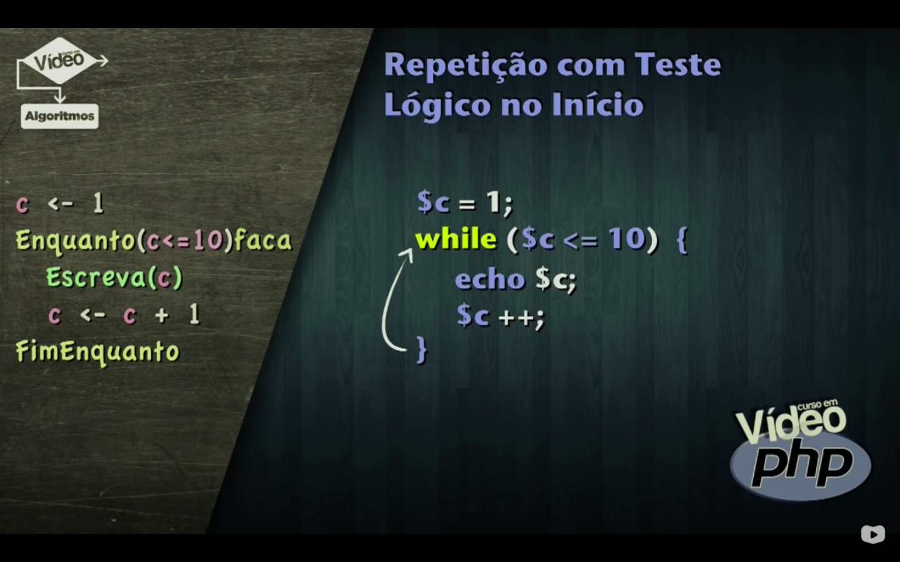
<a href="https://youtu.be/3jk8fSWpQIg?t=70" target="_blank">Print tirado dessa vídeoaula</a>

Vamos agora começar as <em>Estruturas de Repetição</em> em PHP, partindo da estrutura **WHILE (enquanto)**.

A Estrutura **While (enquanto)**, também conhecida como **Estrutura de Repetição com Teste Lógico no início**, realiza o teste de uma expressão lógica sempre na primeira linha da estrutura. 

Vamos ver como realizar uma contagem progressiva de 1 até 10, utilizando a estrutura while em PHP.

```php
$c = 1;

while ($c <= 10) {

    echo $c; 
    $c++;   // $c = $c + 1;  // $c + 1  // $c++
}
```

Vamos ver como realizar uma contagem regressiva de 10 até 1, utilizando a estrutura while em PHP.

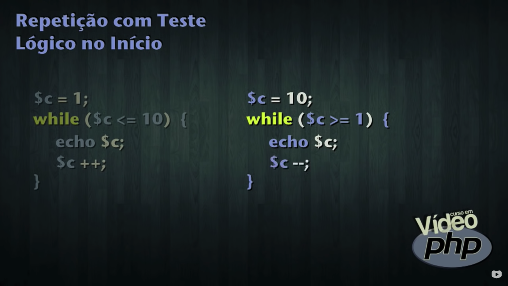
<a href="https://youtu.be/3jk8fSWpQIg?t=350" target="_blank">Print tirado dessa vídeoaula</a>

```php

$c = 10;

while ($c >= 1) {

    echo $c; 
    $c--;   // $c = $c - 1;  // $c - 1  // $c--
}
```
**Modificando o laço (break e continue)**

<code> break; </code>    -> comando para sair do laço, ou seja, vai direto ao final do laço (while)

<code> continue; </code> -> comando para voltar ao início (começo) do laço, mesmo sem ter chegado ao fim do laço (while)

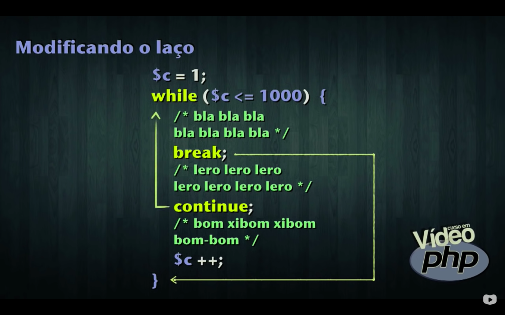
<a href="https://youtu.be/3jk8fSWpQIg?t=900" target="_blank">Print tirado dessa vídeoaula</a>

<br>

12. Aula 12 – Estrutura de Repetição Do While ✅

Na aula de hoje veremos como funciona a estrutura de repetição **do while**.

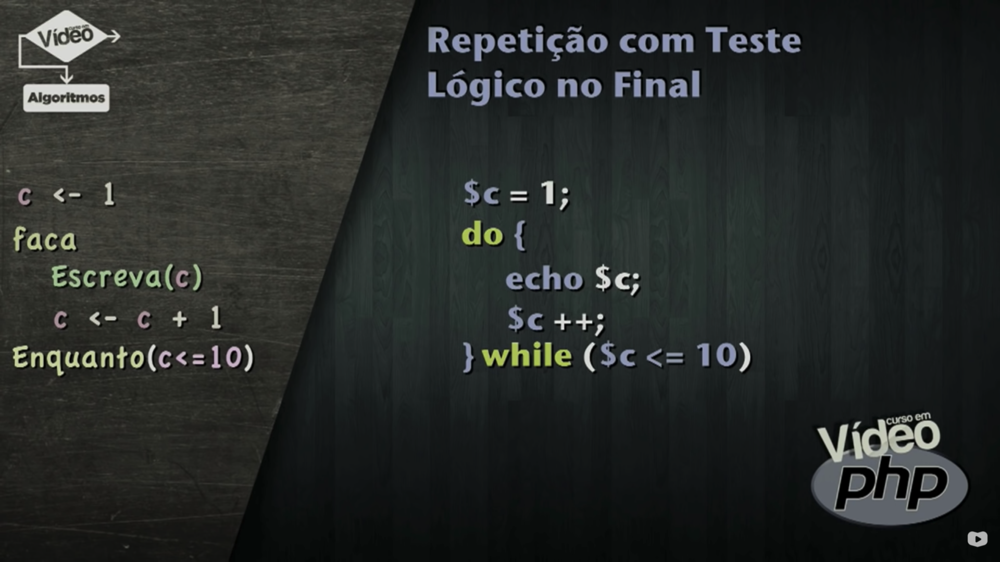
<a href="https://youtu.be/6QymvmX3YJU?t=55" target="_blank">Print tirado dessa vídeoaula</a>

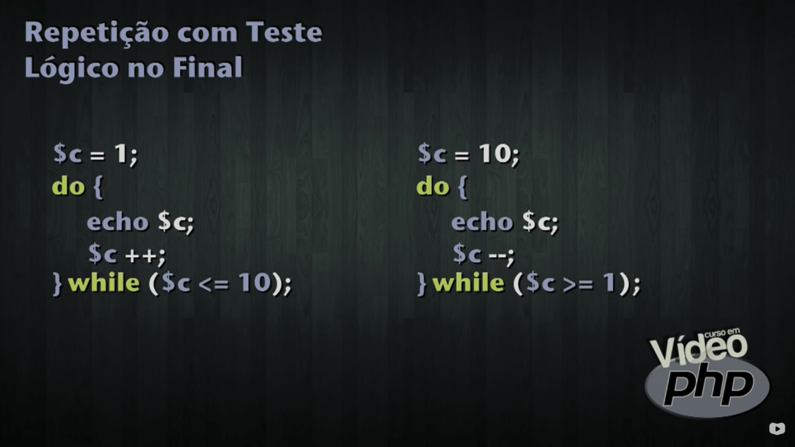
<a href="https://youtu.be/6QymvmX3YJU?t=493" target="_blank">Print tirado dessa vídeoaula</a>

**Aula 12 - Exibir a tabuada de um número escolhido pelo usuário de 1 a 10**

<strong>05-tabuada.html</strong>

```html
<!DOCTYPE html>
<html lang="pt-BR">
<head>
    <meta charset="UTF-8">
    <meta http-equiv="X-UA-Compatible" content="IE=edge">
    <meta name="viewport" content="width=device-width, initial-scale=1.0">
    <link rel="stylesheet" href="_css/estilo.css">
    <title>Aula 12 - Tabuada</title>
</head>
<body>
    <div>
        <!-- Exibir a tabuada de um número escolhido pelo usuário de 1 a 10 -->
        <form method="get" action="05-tabuada.php">
            <fieldset><legend>Tabuada</legend>
                Número : <input type="number" name="num" min="1" max="10" value="10">

                <input type="submit" value="Mostrar" class="botao">
            </fieldset>
        </form>
    </div>
</body>
</html>
```

<strong>05-tabuada.php</strong>

```php
<!DOCTYPE html>
<html lang="pt-BR">
<head>
    <meta charset="UTF-8">
    <meta http-equiv="X-UA-Compatible" content="IE=edge">
    <meta name="viewport" content="width=device-width, initial-scale=1.0">
    <link rel="stylesheet" href="_css/estilo.css">
    <title>Aula 12 - Tabuada</title>
</head>
<body>
    <div>
        <?php
            $numero = isset($_GET["num"]) ? $_GET["num"] : 10;
            $contador = 1;
            echo "<h2>Tabuada de $numero</h2>";
            do {
                echo "<br> $numero X $contador = &nbsp;&nbsp;" .($numero * $contador);
                $contador++;
            } while ($contador <= 10);
        ?>
        <br><br><a href="javascript:history.go(-1)" class="botao">Voltar</a>
    </div>
</body>
</html>
```

<br>

13. Aula 13 – Estrutura de Repetição For ✅

Aprenda a utilizar a estrutura de repetição **For** do PHP com vários exercícios práticos, demonstrações detalhadas e exercícios de fixação.

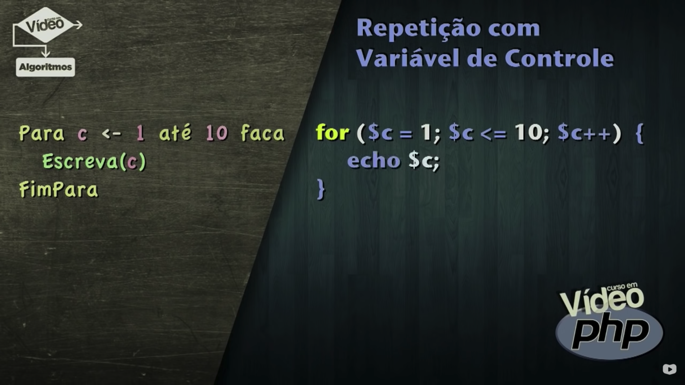
<a href="https://youtu.be/ancrPpEq9Rw?t=104" target="_blank">Print tirado dessa vídeoaula</a>

Preste atenção...
: while X for

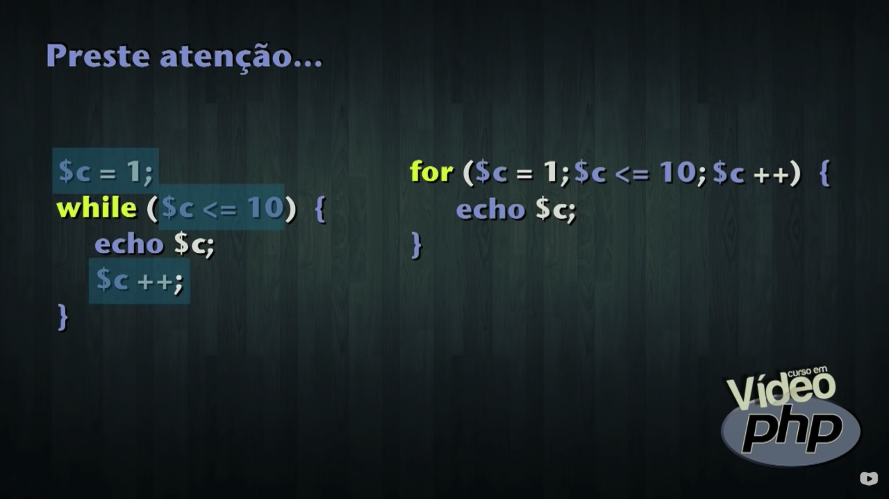
<a href="https://youtu.be/ancrPpEq9Rw?t=130" target="_blank">Print tirado dessa vídeoaula</a>


Numero Primo 
: <strong><u> Definição de número primo: </u></strong>
Um número natural maior do que 1 é primo quando é divisível somente por 1 e ele mesmo. 

: Números Primos de 1 a 100 são:

: 2, 3, 5, 7, 11, 13, 17, 19, 23, 29, 31, 37, 41, 43, 47, 53, 59, 61, 67, 71, 73 , 79, 83, 89, 97

Exemplo verifica se um número é primo utilizando o laço for.

<strong>03-index.html</strong>

```php
<!DOCTYPE html>
<html lang="pt-BR">
<head>
    <meta charset="UTF-8">
    <meta http-equiv="X-UA-Compatible" content="IE=edge">
    <meta name="viewport" content="width=device-width, initial-scale=1.0">
    <link rel="stylesheet" href="_css/estilo.css">
    <title>Aula 13 - Ex. 3 - </title>
</head>
<body>
    <div>
        <form method="get" action="03-primo.php">
            <fieldset><legend>Verificar se um número é primo</legend>
                Número : <input type="number" name="num" min="1" max="1000" value="2" required>

                <input type="submit" value="É primo ?" class="botao">
            </fieldset>
        </form>
    </div>
</body>
</html>   
```

<strong>03-primo.php</strong>

```php
<!DOCTYPE html>
<html lang="pt-BR">
<head>
    <meta charset="UTF-8">
    <meta http-equiv="X-UA-Compatible" content="IE=edge">
    <meta name="viewport" content="width=device-width, initial-scale=1.0">
    <link rel="stylesheet" href="_css/estilo.css">
    <title>Aula 13 - Primo</title>
</head>
<body>
    <div>
        <?php
            $n = isset($_GET["num"]) ? $_GET["num"] : 1 ;

            $contDiv = 0;
            echo "<h2> O número <span class='foco'> $n </span> é primo ? </h2>";

            for ($cont = 2 ; $cont < $n ; $cont++) {
                if ($n % $cont == 0) {
                    echo "Multiplo de $cont. <br>";
                    $contDiv++;
                }
            }
            echo "<br> Total de múltiplos : <strong> $contDiv </strong> <br>";

            if ($n == 1 || $n == 0) {
                $contDiv = true;
            }

            if ($contDiv) {
                echo "<br> O <strong> número $n </strong> <span class='foco'> &rarr; NÃO É PRIMO ! </span>";
            } else {
                echo "<br> O <strong> número $n </strong> <span class='foco'> &rarr; É PRIMO ! </span>";
            }
        ?>
        <br><br><a href="javascript:history.go(-1)" class="botao">Voltar</a>
    </div>
</body>
</html>

```
<br>

14. Aula 14 – Rotinas em PHP – Parte 1 ✅

Nessa aula daremos início as Rotinas em PHP.


<a href="https://youtu.be/7V6MdZQFArc?t=112" target="_blank">Print tirado dessa vídeoaula</a>

Exemplo: Criar um procedimento que some dois valores númericos inteiros 

```php
<?php
    function soma ($a, $b) {
        $s = $a + $b;
        echo "<br> Valores recebidos, a = $a e b = $b";
        echo "<br> A soma vale $s <br>";
    }

    soma(3,4); // A soma vale 7
    soma(8,2); // A soma vale 10

    $x = 9;
    $y = 15;
    soma($x, $y); // A soma vale 24
?>
```

Rotinas em PHP que retornam um valor.

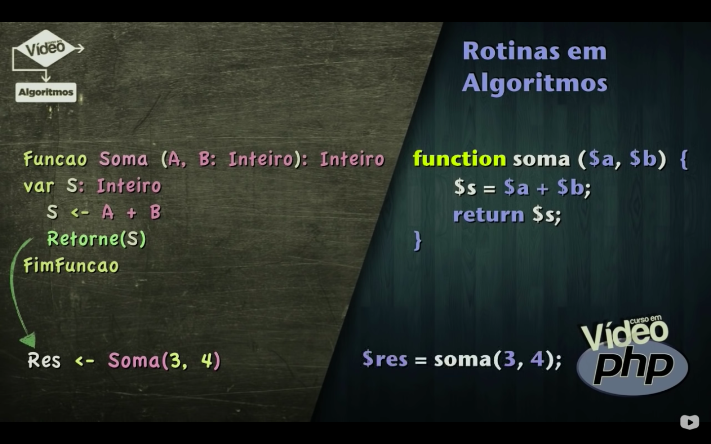
<a href="https://youtu.be/7V6MdZQFArc?t=455" target="_blank">Print tirado dessa vídeoaula</a>

```php
<?php
    function soma ($a, $b) {
        return $a + $b; 
    }
    $x = 3;
    $y = 8;
    $res = soma($x,$y);
    echo "A soma entre $x e $y é igual a $res";
    //    A soma entre 3  e 8  é igual a 11
?>
```

**Rotinas em PHP:**
Função sem retorno X Função com retorno

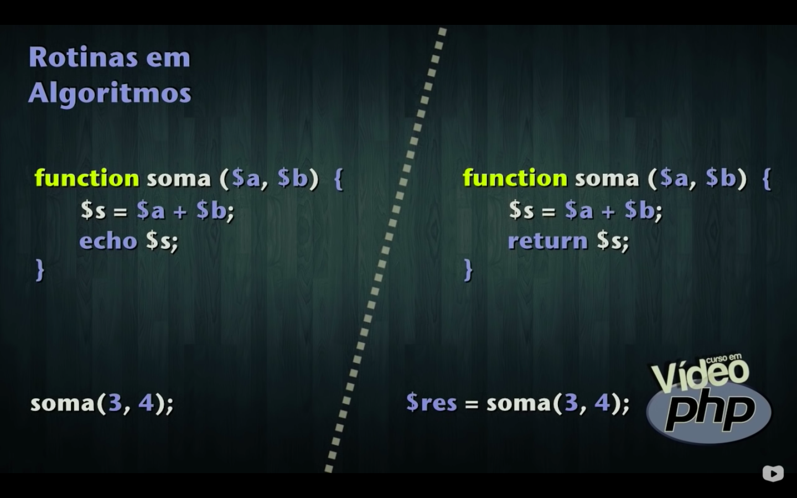
<a href="https://youtu.be/7V6MdZQFArc?t=730" target="_blank">Print tirado dessa vídeoaula</a>

**Rotinas em PHP com Parâmetros Dinâmicos:**
Rotinas com múltiplos parâmetros em PHP

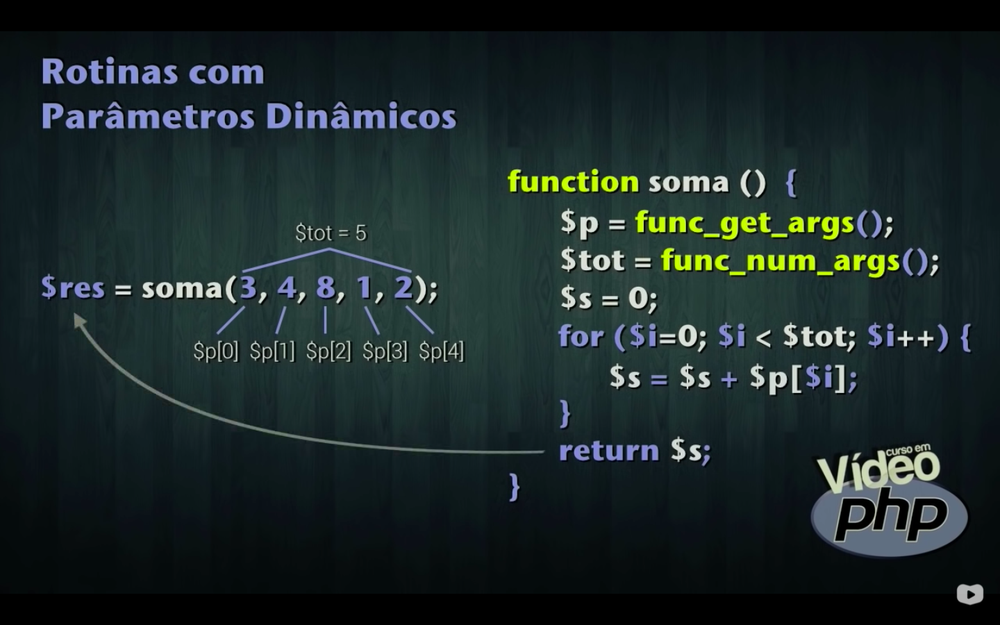
<a href="https://youtu.be/7V6MdZQFArc?t=775" target="_blank">Print tirado dessa vídeoaula</a>

```php
<?php
    function soma () {

        $p = func_get_args();
        // func_get_args(); -> Retorna um array contendo uma lista de argumentos da função
        // $p[0]=3, $p[1]=4, $p[2]=8, $p[3]=1, $p[4]=2

        $tot = func_num_args();
        // func_num_args(); -> Retorna o número de argumentos passados para a função
        // $tot = 5

        $soma = 0; // soma dos valores
        for ($i = 0 ; $i < $tot ; $i++) {
            $soma += $p[$i];    // $soma = $soma + $p[$i];
        }
        return $soma;
    }
    
    $res = soma(3, 4, 8, 1, 2);
    echo "A soma dos valores é $res"; // A soma dos valores é 18
?>
```

```php
<?php
    function soma () {
        $p = func_get_args();
        $tot = func_num_args();
        $soma = 0;
        for ($i = 0 ; $i < $tot ; $i++) {
            $soma += $p[$i];    
        }
        return $soma;
    }
    
    $res = soma(3, 5, 2);
    echo "A soma dos valores é $res"; // A soma dos valores é 10
?>
```

<br>

15. Aula 15 – Rotinas em PHP – Parte 2 ❌

Criando funções e procedimentos em PHP com passagem de parâmetros por valor e passagem de parâmetros por referência.

Aprenda como utilizar as instruções include, require, include_once, require_once para incluir arquivos externos em seu script PHP.

<br>

16. Aula 16 – Funções String em PHP (Parte 1) ❌

Nessa aula, veremos uma lista de funções para Strings usando PHP. São funções internas que já existem na linguagem. A lista de funções de manipulação de Strings que serão vistas nessa aula é composta pelas instruções:

Função printf( ) 
: Permite exibir uma string com itens formatados.

Função print_r( )
: Exibe coleções, objetos e variáveis compostas (vetores e matrizes) de maneira organizada.

Função wordwrap( )
: Cria quebras de linha ou divisões em uma string em um tamanho especificado.

Função strlen( ) 
: Permite verificar o tamanho de uma string, contando seus caracteres (inclusive espaços em branco).

Função trim( ) 
: Elimina espaços em branco antes e depois de uma string.

Função ltrim( ) 
: Elimina espaços no início de uma string.

Função rtrim( ) 
: Elimina espaços em branco no final de uma string.

Função str_word_count( ) 
: Conta quantas palavras uma string possui.

Função explode( ) 
: Quebra uma string e coloca os itens em um vetor.

Função str_split( ) 
: Coloca cada letra de uma string em uma posição de um vetor.

Função implode( ) 
: Transforma um vetor inteiro em uma string.

Função chr( ) 
: Retorna um caractere de acordo com seu código ASCII passado como parâmetro.

Função ord( ) 
: Retorna o código ASCII de um caractere passado como parâmetro.


<br>

17. Aula 17 – Funções String em PHP (Parte 2) ❌

Hoje, vamos continuar nossos estudos sobre string em PHP.

<br>

18. Aula 18 – Vetores e Matrizes – Parte 1 ❌

Na aula de hoje vamos dar início as variáveis compostas.

<br>

19. Aula 19 – Vetores e Matrizes – Parte 2 ❌

Nessa aula vamos dar continuidade aos nossos estudos sobre variáveis compostas, e encerraremos o curso de PHP para iniciantes.