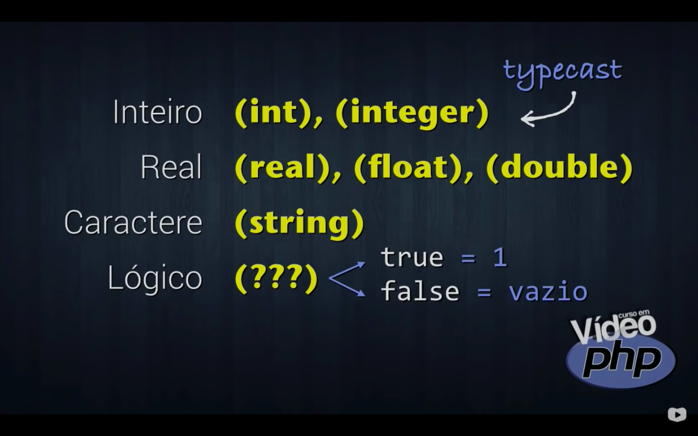

### 02. PHP Básico [40 Horas] 

- Criado em 1995, por Rasmus Lerdorf, o **PHP** (acrônimo para PHP: Hypertext Preprocessor) é uma linguagem de script Open Source de uso geral. Com ela, desenvolvedores podem criar sites dinâmicos, extensões para aplicativos e otimizar tanto programas quanto Sistemas Operacionais. Ela é especialmente adequada para o desenvolvimento web e pode ser embutida dentro do HTML.

- Você vai aprender os primeiros passos para criar sites que utilizem a tecnologia PHP incorporada. Para isso, aprenderá como instalar um servidor, criar scripts básicos, interatividade com formulários e acesso a bancos de dados simples. No final, vai aprender como colocar seu site no ar utilizando um servidor profissional de hospedagem.


### Conteúdo do Módulo :bookmark:

1. Aula 1 – História do PHP ✅

A Linguagem PHP começou em 1994, quando Rasmus Lerdorf resolveu criar um gerenciador de visitas para o seu site. Sua primeira criação não era uma linguagem, e sim uma ferramenta. Batizada de Personal Home Page, usava comandos simples inspirados da linguagem PERL. A segunda versão da ferramenta já permitia a manipulação de formulários e pequenos livros de visita: o Personal Home Page/ Forms Interpreter, ou PHP/FI. Essa versão ficou bastante popular e começou a se espalhar em 1995.

Com o objetivo de fazer sua ferramenta crescer, Rasmus liberou o acesso ao código-fonte da CGI em 1996, o que despertou o interesse de diversos programadores, entre eles os israelenses Zeev Suraski e Andi Gutmans. Esses dois reescreveram o núcleo da ferramenta e a transformou em uma Linguagem de Scripts, nos moldes em que nós temos o PHP atualmente. A partir de 1998, o PHP já começava a se destacar como uma das linguagens mais utilizadas na Internet. Foi nessa época que a linguagem foi rebatizada e passou a se chamar PHP: Hypertext Preprocessor e chegou à sua versão 3.0, com muitas funcionalidades interessantes.

Em 2000, a quarta versão do PHP surge para eliminar a maioria dos erros e falhas de segurança encontrados pela comunidade. Enquanto isso, Zeev e Andi resolveram reescrever todo o núcleo da linguagem, abandonando quase que completamente o projeto original de Rasmus Lerdorf. Quatro anos depois, em 2004, surge o PHP5 que ficou mundialmente conhecido e atualmente conta com 32 versões internas, com mais de 1000 correções de falhas de segurança.

2. Aula 2 – Como funciona o PHP ✅

Como funciona o PHP? 
Como transformar meu computador em um servidor? 
Como funciona tecnologias server-side? 
Qual é a diferença entre tecnologias PHP, ASP, JSP e etc? 

A segunda aula do seu Curso de PHP do Curso em Vídeo vai responder a essas e muitas outras perguntas que normalmente são feitas por quem está iniciando seus estudos em PHP.

A infra-estrutura da Internet é baseada no modelo cliente x servidor. A Internet interliga clientes a servidores que possuem arquivos e fornecem cópias desses documentos.

Nas tecnologias **client-side**, a função do servidor é apenas fornecer arquivos que o cliente solicita. Quem vai ter mais trabalho de processamento é o lado do cliente (client-side) que terá seu navegador trabalhando para interpretar os códigos e arquivos enviados pelo server. São exemplos de tecnologias client-side: HTML, CSS, JavaScript e Flash.

Já nas tecnologias **server-side**, o servidor vai assumir a maior parte do trabalho, já que existe a interpretação de códigos do lado do servidor (server-side), que no caso do PHP são chamados scripts de servidor.

Para o PHP funcionar corretamente, o servidor precisa ter o Apache, que é um program server, um interpretador PHP (engine) e suporte a um ou mais tipos de banco de dados (geralmente MySQL).

Para transformar seu computador em um servidor com suporte PHP, você precisa de um sistema AMP (Apache + MySQL + PHP). Para usar PHP no Windows, instalamos um sistema WAMP. Para usar PHP no Linux, instalamos um sistema LAMP. Para usar PHP no Mac, instalamos um sistema MAMP.

3. Aula 3 – Como Instalar o PHP ✅

Nessa aula do Curso Grátis de PHP para Iniciantes você vai aprender como instalar um servidor PHP no seu computador e vai ver como criar o seu primeiro exemplo de código PHP: o “Olá, Mundo!”.

É possível instalar o PHP no seu PC, bem como todas as ferramentas necessárias para o desenvolvimento na linguagem, como o Apache, MySQL, PHPMyAdmin, interpretadores e etc.

4. Aula 4 – Variáveis em PHP ✅

Como criar variáveis em PHP? 
Como declarar variáveis em PHP? 
Quais são os tipos primitivos do PHP? 
Como realizar conversões em PHP? 

A resposta para essas e muitas outras perguntas você vai ter nessa quarta aula do Curso Grátis de PHP para Iniciantes.

Antes de mais nada, é importante que você entenda os conceitos de variáveis em Algoritmos e saiba utilizá-las corretamente. 

**Comandos de saída do PHP:**

Os comandos **ECHO, PRINT e PRINTF** servem para gerar saídas na tela. Um exemplo simples desse comando é:

echo “Estou aprendendo variáveis em PHP”;

A pronúncia correta do comando echo é ECO (aquele som que se repete quando gritamos dentro de cavernas, lembra?).

Note que no comando acima, foi utilizada uma tag HTML para a quebra de linha. Isso é possível, já que o PHP se integra com essa tecnologia. Fique à vontade para utilizar tags de marcação hipertexto dentro dos seus comandos de saída em PHP.

**Usando variáveis**

Variáveis são espaços na memória do computador que podem conter valores. Variáveis simples armazenam apenas um valor de cada vez, dependendo do seu tipo.

Todas as variáveis no PHP possuem um **$** na frente e seguem as mesmas regras de construção de nomes de identificadores:

– Devem começar com uma letra (após o $)

– Podem conter letras e números

– Não podem conter caracteres acentuados

– Não podem conter símbolos como % # * & etc (exceto _ e $)

OBS: O PHP faz a diferenciação entre as letras maiúsculas e minúsculas, por isso recomendamos que você utilize apenas identificadores com letras minúsculas em seus scripts PHP.

**Declaração de variáveis**

No PHP não existe a necessidade de declarar variáveis. Os tipos serão atribuídos automaticamente de acordo com o valor que a variável receber. Esse processo é conhecido como coerção. Isso pode ser até empolgante no início, mas é preciso prestar bastante atenção para não fazer nada errado.

Você pode forçar um tipo primitivo a uma variável por TYPECAST, utilizando (int) (real) (float) (double) (string) antes do valor na atribuição.

Não existe typecast para variáveis lógicas. Os valores booleanos são considerados números, sendo o valor 1 atribuído para true e vazio para false.


<a href="https://youtu.be/DGZS9KrlrjI?t=450" target="_blank">Print tirado dessa vídeoaula</a>


**Atribuição de valores**

Atribuir valor é colocar um conteúdo em uma variável. Utilizamos o operador de atribuição = para realizar essa tarefa. Veja alguns exemplos:

$idade = 15;

$salario = 1500.25;

$nome = “Gustavo”;

$casado = true;

**Concatenação de valores**

Concatenar é juntar valores para tratá-los em conjunto. A concatenação em PHP é realizada pelo operador ponto (.) como no trecho de código a seguir.

    $idade = 18;

    $nome = “Maria”;

    echo $nome . “ tem “ . $idade . “ anos “;

No script acima, será exibido *“Maria tem 18 anos”*, já que acontecerão concatenações.

Porém, já que os identificadores PHP começam com um $, é possível realizar o comando de saída utilizando um modo simplificado:

    echo “$nome tem $idade anos”; 
O comando acima pode ser usado sem problemas, contanto que sejam utilizadas aspas duplas.

5. Aula 5 – Operadores Aritméticos ✅

Como fazer contas no PHP? 
Como realizar somas, multiplicações e mais? 
Exponenciações em PHP? 
Raiz quadrada em PHP? 

**Os operadores aritméticos do PHP são:**

    +       é o operador de adição

    –       é o operador de subtração

    *       é o operador de multiplicação

    /       é o operador de divisão Real

    %       é o operador de módulo (resto da divisão)

O código a seguir, vai somar dois números:

    $n1 = 3;

    $n2 = 2;

    $s = $n1 + $n2;

    echo “A soma entre $n1 e $n2 é igual a $s”;

O código acima vai mostrar na tela a mensagem

    A soma entre 3 e 2 é igual a 5

**Ordem de precedência de operadores aritméticos em PHP**

Outra coisa importante a saber é a ordem de precedência de operadores aritméticos em PHP. Sempre em uma expressão, os operadores que serão executados são, na ordem:

1. parênteses ( )

2. operadores de multiplicação, divisão e módulo  *  /  %

3. as adições e subtrações  +  –

Por exemplo, considerando o código a seguir:

    $media = $nota1 + $nota2 / 2;

A média será calculada de maneira errada, já que segundo a ordem de precedência, a divisão será feita antes. O correto seria escrever:

    $media = ($nota1 + $nota2) / 2;

Note que o uso dos parênteses muda bastante as coisas.

**Obtendo valores da URL com PHP**

Vamos analisar a URL abaixo: 

    http://localhost/aula05/operadores.php?a=3&b=2

<big>&nbsp; http://localhost/php/aula05/operadores.php?a=3&b=2 </big>

No link acima, o arquivo *operadores.php* está sendo chamado dentro da pasta *aula05* do servidor local. Na linha, serão passados dois valores: *a valendo 3* e *b valendo 2*.

Para pegar esses valores no script PHP, use o código

    $valor1 = $_GET[“a”];

    $valor2 = $_GET[“b”];

    No código acima, o parâmetro a (3) passado pela URL será armazenado na variável $valor1. 
    De maneira similar, a variável $valor2 vai conter o valor do parâmetro b (2).

Obs: use sempre <code>$_GET</code> com todas as letras maiúsculas.

**Funções Matemáticas em PHP**

abs( ) : Retorna o valor absoluto de um número.

    abs(-5) = 5

pow( ) : Calcula uma potência

    pow(3,2) = 32 = 9

sqrt( ) : Calcula a raiz quadrada de um número.

    sqrt(25) = 5

round( ) : Arredonda valores.

    round(3.8) = 4

intval( ) : Trunca um número. Retorna a parte inteira de um valor.

    intval(3.99) = 3

number_format( ) : Formata um número Real.

    number_format(3258.754, 2, “,”, “.”) = 3.258. 75.

number_format( ) : Formata um número Real. 
Exemplo de formataçao de uma variavel em moeda.

    $v2 = 9999.99;
    echo "<br> O valor de $v2 em moeda é : R$ " .number_format($v2, 2, "," , ".");
    // O valor de 9999.99 em moeda é : R$ 9.999,99


Obs: Ainda existem os métodos <code> ceil() </code> e <code> floor() </code> para arredondamentos para cima e para baixo, respectivamente. 
A função <code> round() </code> vai usar as regras de arredondamento.

6. Aula 6 – Operadores de Atribuição ✅

Uma atribuição acontece quando queremos colocar algum valor dentro de uma variável, seja ele um número ou string estática, o resultado de uma expressão, o retorno de uma função ou o conteúdo de outra variável.

**Operadores de Atribuição do PHP**


<a href="https://youtu.be/NuBt0B_GeEo?t=275" target="_blank">Print tirado dessa vídeoaula</a>

Os operadores de atribuição do PHP são :

    +=      Adição
    -=      Subtração
    *=      Multiplicação
    /=      Divisão
    %=      Módulo
    .=      Concatenação

Vejamos alguns exemplos:

    $c = $c + 5;    $c += 5;

    $c = $c – $a;   $c -= $a;

    $c = $c + 1;    $c += 1;

Na última linha da tabela acima, você verifica a adição de apenas uma unidade na variável. Nesses casos, podemos usar os operadores de incremento.

**Operadores de Incremento ou Decremento**


<a href="https://youtu.be/NuBt0B_GeEo?t=720" target="_blank">Print tirado dessa vídeoaula</a>

**Exemplo de Operadores de Incremento ou Decremento**:

    $c = $c + 1;    $c += 1;    $c++;

Qualquer uma das formas acima é válida. De maneira similar, temos:

    $c = $c – 1;    $c -= 1;    $c–-;

A forma de utilizar o operador de incremento/ decremento faz toda diferença se ele aparece antes ou depois da variável. Assim:

    $c++   $c–-


**Comentários em PHP**

Existem três tipos de comentários em PHP. 
Os **comentários inline** <code> // </code> e <code> #  </code> transformam tudo o que está após o(s) símbolo(s) será considerado comentário.

```php
<?php
    // Essa linha é um comentário
 
    # Essa também é um comentário
?> 
```

Existe também o **comentário multiline**, que vai criar comentários que ocupem várias linhas:  

```php
<?php
    /* 
        Esse comentário vai ocupar várias linhas do seu código
        e todas serão ignoradas.
        Tudo aquilo que estiver aqui no meio será considerado 
        como sendo um comentário. 
    */
?>
```

```php
<?php

    /* Esse comentário vai ocupar várias linhas do seu código 
    e todas serão ignoradas */

    $a += 1;    // Esse é um comentário de uma linha

    $b ++;      # Esse aqui também é um comentário

?>
```

**Variáveis Referenciadas**


<a href="https://youtu.be/NuBt0B_GeEo?t=1190" target="_blank">Print tirado dessa vídeoaula</a>

Como fazer referências entre variáveis?

Colocar um caractere <code> & </code> na frente de uma variável vai criar um ponteiro em PHP. 
*Ela não será uma variável de fato, mas será uma <strong>referência à variável original</strong>.*

Considere o código:

```php
<?php

     $x = 3;    // A variável $x vai receber 3. 

     $y = $x;   // A variável $y vai receber o valor que está dentro da variável $x.

     $z = &$x;  // A variável $z vai ser uma ligação com a variável $x.

     /* 
        Mais tarde, qualquer modificação em $y não vai alterar o valor de $x. 
        Porém, se mudarmos o valor de $z, o valor de $x será afetado, já que existe uma relação entre as duas.
     */

?>
```

**Variáveis de Variáveis (Variáveis Variantes)**

Colocar um segundo <code> $ </code> na frente de uma variável também possui um efeito bem peculiar. Ele vai criar uma variável dinamicamente, dependendo do conteúdo da variável original. Essas são as variáveis de variáveis em PHP.

```php
<?php

    $nome = “gustavo”;  // uma variável $nome, como o conteúdo “gustavo”

    $$nome = “professor”; // uma variável $gustavo, com o conteúdo “professor”.

?>
```


7. Aula 7 – Operadores Relacionais ❌
8. Aula 8 – Integração HTML5 + PHP ❌
9. Aula 9 – Estrutura Condicional if ❌
10. Aula 10 – Estrutura Condicional Switch ❌
11. Aula 11 – Estrutura de Repetição While ❌
12. Aula 12 – Estrutura de Repetição Do While ❌
13. Aula 13 – Estrutura de Repetição For ❌
14. Aula 14 – Rotinas em PHP – Parte 1 ❌
15. Aula 15 – Rotinas em PHP – Parte 2 ❌
16. Aula 16 – Funções String em PHP (Parte 1) ❌
17. Aula 17 – Funções String em PHP (Parte 2) ❌
18. Aula 18 – Vetores e Matrizes – Parte 1 ❌
19. Aula 19 – Vetores e Matrizes – Parte 2 ❌