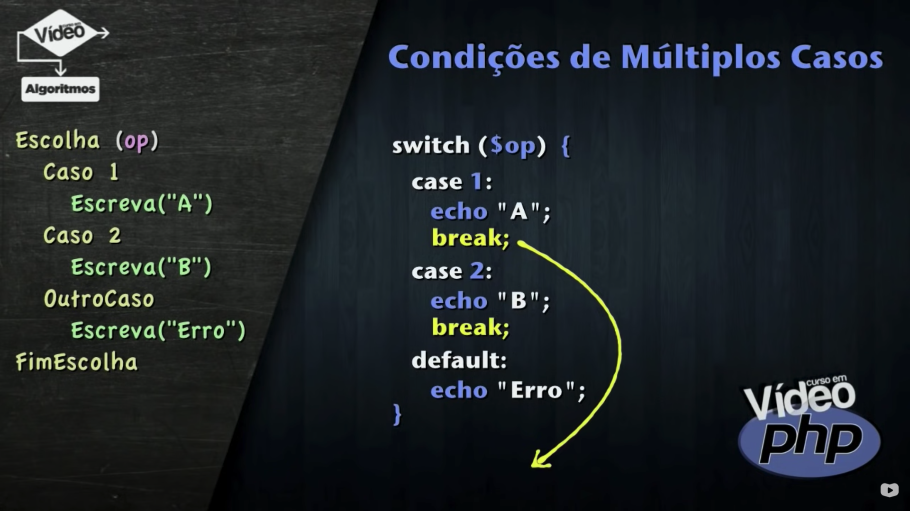
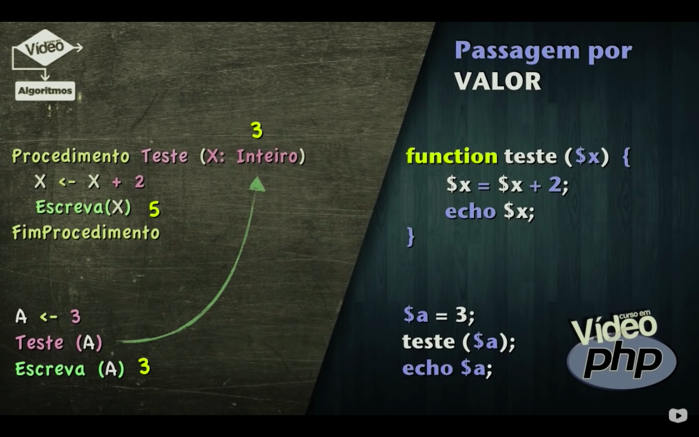
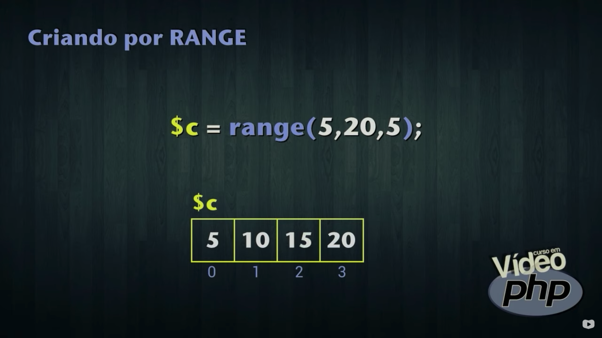

### 02. PHP Básico [40 Horas] 

- Criado em 1995, por **Rasmus Lerdorf**, o **PHP** (acrônimo para PHP: Hypertext Preprocessor) é uma linguagem de script Open Source de uso geral. Com ela, desenvolvedores podem criar sites dinâmicos, extensões para aplicativos e otimizar tanto programas quanto Sistemas Operacionais. Ela é especialmente adequada para o desenvolvimento web e pode ser embutida dentro do HTML.

- Você vai aprender os primeiros passos para criar sites que utilizem a tecnologia PHP incorporada. Para isso, aprenderá como instalar um servidor, criar scripts básicos, interatividade com formulários e acesso a bancos de dados simples. No final, vai aprender como colocar seu site no ar utilizando um servidor profissional de hospedagem.


<h1 align="center"> PHP - Índice</h1> 

<p align="center"> |&nbsp;&nbsp;&nbsp; 
  <a href="#aula01">Aula 01</a>&nbsp;&nbsp;&nbsp;|&nbsp;&nbsp;&nbsp;
  <a href="#aula02">Aula 02</a>&nbsp;&nbsp;&nbsp;|&nbsp;&nbsp;&nbsp;
  <a href="#aula03">Aula 03</a>&nbsp;&nbsp;&nbsp;|&nbsp;&nbsp;&nbsp;
  <a href="#aula04">Aula 04</a>&nbsp;&nbsp;&nbsp;|&nbsp;&nbsp;&nbsp;
  <a href="#aula05">Aula 05</a>&nbsp;&nbsp;&nbsp;|&nbsp;&nbsp;&nbsp;
  <a href="#aula06">Aula 06</a>&nbsp;&nbsp;&nbsp;|&nbsp;&nbsp;&nbsp;
  <a href="#aula07">Aula 07</a>&nbsp;&nbsp;&nbsp;|&nbsp;&nbsp;&nbsp;
  <a href="#aula08">Aula 08</a>&nbsp;&nbsp;&nbsp;|&nbsp;&nbsp;&nbsp;
  <a href="#aula09">Aula 09</a>&nbsp;&nbsp;&nbsp;|&nbsp;&nbsp;&nbsp;
  <a href="#aula10">Aula 10</a>&nbsp;&nbsp;&nbsp;|&nbsp;&nbsp;&nbsp;
  <a href="#aula11">Aula 11</a>&nbsp;&nbsp;&nbsp;|&nbsp;&nbsp;&nbsp;
  <a href="#aula12">Aula 12</a>&nbsp;&nbsp;&nbsp;|&nbsp;&nbsp;&nbsp;
  <a href="#aula13">Aula 13</a>&nbsp;&nbsp;&nbsp;|&nbsp;&nbsp;&nbsp;
  <a href="#aula14">Aula 14</a>&nbsp;&nbsp;&nbsp;|&nbsp;&nbsp;&nbsp;
  <a href="#aula15">Aula 15</a>&nbsp;&nbsp;&nbsp;|&nbsp;&nbsp;&nbsp;
  <a href="#aula16">Aula 16</a>&nbsp;&nbsp;&nbsp;|&nbsp;&nbsp;&nbsp;
  <a href="#aula17">Aula 17</a>&nbsp;&nbsp;&nbsp;|&nbsp;&nbsp;&nbsp;
  <a href="#aula18">Aula 18</a>&nbsp;&nbsp;&nbsp;|&nbsp;&nbsp;&nbsp;
  <a href="#aula19">Aula 19</a>&nbsp;&nbsp;&nbsp;|&nbsp;&nbsp;&nbsp;

</p>

### Conteúdo do Módulo :bookmark:

<span id="aula01">

1. Aula 1 – História do PHP ✅

A Linguagem PHP começou em 1994, quando Rasmus Lerdorf resolveu criar um gerenciador de visitas para o seu site. Sua primeira criação não era uma linguagem, e sim uma ferramenta. Batizada de Personal Home Page, usava comandos simples inspirados da linguagem PERL. A segunda versão da ferramenta já permitia a manipulação de formulários e pequenos livros de visita: o Personal Home Page/ Forms Interpreter, ou PHP/FI. Essa versão ficou bastante popular e começou a se espalhar em 1995.

Com o objetivo de fazer sua ferramenta crescer, Rasmus liberou o acesso ao código-fonte da CGI em 1996, o que despertou o interesse de diversos programadores, entre eles os israelenses Zeev Suraski e Andi Gutmans. Esses dois reescreveram o núcleo da ferramenta e a transformou em uma Linguagem de Scripts, nos moldes em que nós temos o PHP atualmente. A partir de 1998, o PHP já começava a se destacar como uma das linguagens mais utilizadas na Internet. Foi nessa época que a linguagem foi rebatizada e passou a se chamar PHP: Hypertext Preprocessor e chegou à sua versão 3.0, com muitas funcionalidades interessantes.

Em 2000, a quarta versão do PHP surge para eliminar a maioria dos erros e falhas de segurança encontrados pela comunidade. Enquanto isso, Zeev e Andi resolveram reescrever todo o núcleo da linguagem, abandonando quase que completamente o projeto original de Rasmus Lerdorf. Quatro anos depois, em 2004, surge o PHP5 que ficou mundialmente conhecido e atualmente conta com 32 versões internas, com mais de 1000 correções de falhas de segurança.

<br>

<span id="aula02">

2. Aula 2 – Como funciona o PHP ✅

Como funciona o PHP? 
Como transformar meu computador em um servidor? 
Como funciona tecnologias server-side? 
Qual é a diferença entre tecnologias PHP, ASP, JSP e etc? 

A segunda aula do seu Curso de PHP do Curso em Vídeo vai responder a essas e muitas outras perguntas que normalmente são feitas por quem está iniciando seus estudos em PHP.

A infra-estrutura da Internet é baseada no modelo cliente x servidor. A Internet interliga clientes a servidores que possuem arquivos e fornecem cópias desses documentos.

Nas tecnologias **client-side**, a função do servidor é apenas fornecer arquivos que o cliente solicita. Quem vai ter mais trabalho de processamento é o lado do cliente (client-side) que terá seu navegador trabalhando para interpretar os códigos e arquivos enviados pelo server. São exemplos de tecnologias client-side: HTML, CSS, JavaScript e Flash.

Já nas tecnologias **server-side**, o servidor vai assumir a maior parte do trabalho, já que existe a interpretação de códigos do lado do servidor (server-side), que no caso do PHP são chamados scripts de servidor.

Para o PHP funcionar corretamente, o servidor precisa ter o Apache, que é um program server, um interpretador PHP (engine) e suporte a um ou mais tipos de banco de dados (geralmente MySQL).

Para transformar seu computador em um servidor com suporte PHP, você precisa de um sistema AMP (Apache + MySQL + PHP). Para usar PHP no Windows, instalamos um sistema WAMP. Para usar PHP no Linux, instalamos um sistema LAMP. Para usar PHP no Mac, instalamos um sistema MAMP.

<br>

<span id="aula03">

3. Aula 3 – Como Instalar o PHP ✅

Nessa aula do Curso Grátis de PHP para Iniciantes você vai aprender como instalar um servidor PHP no seu computador e vai ver como criar o seu primeiro exemplo de código PHP: o “Olá, Mundo!”.

```php
<?php

    echo "Olá, Mundo !";

?> 
```

É possível instalar o PHP no seu PC, bem como todas as ferramentas necessárias para o desenvolvimento na linguagem, como o Apache, MySQL, PHPMyAdmin, interpretadores e etc.

<br>

<span id="aula04">

4. Aula 4 – Variáveis em PHP ✅

Como criar variáveis em PHP? 
Como declarar variáveis em PHP? 
Quais são os tipos primitivos do PHP? 
Como realizar conversões em PHP? 

A resposta para essas e muitas outras perguntas você vai ter nessa quarta aula do Curso Grátis de PHP para Iniciantes.

Antes de mais nada, é importante que você entenda os conceitos de variáveis em Algoritmos e saiba utilizá-las corretamente. 

**Comandos de saída do PHP:**

Os comandos **ECHO, PRINT e PRINTF** servem para gerar saídas na tela. Um exemplo simples desse comando é:

    echo “Estou aprendendo variáveis em PHP”;

A pronúncia correta do comando echo é ECO (aquele som que se repete quando gritamos dentro de cavernas, lembra?).

Note que no comando acima, foi utilizada uma tag HTML para a quebra de linha. Isso é possível, já que o PHP se integra com essa tecnologia. Fique à vontade para utilizar tags de marcação hipertexto dentro dos seus comandos de saída em PHP.

**Usando variáveis**

Variáveis são espaços na memória do computador que podem conter valores. Variáveis simples armazenam apenas um valor de cada vez, dependendo do seu tipo.

Todas as **variáveis** no PHP possuem um **$** na frente e seguem as mesmas regras de construção de nomes de identificadores:

– Devem começar com uma letra (após o $)

– Podem conter letras e números

– Não podem conter caracteres acentuados

– Não podem conter símbolos como % # * & etc (exceto _ e $)

OBS: O PHP faz a diferenciação entre as letras maiúsculas e minúsculas, por isso recomendamos que você utilize apenas identificadores com letras minúsculas em seus scripts PHP.

**Declaração de variáveis**

No PHP não existe a necessidade de declarar variáveis. Os tipos serão atribuídos automaticamente de acordo com o valor que a variável receber. Esse processo é conhecido como coerção. Isso pode ser até empolgante no início, mas é preciso prestar bastante atenção para não fazer nada errado.

Você pode forçar um tipo primitivo a uma variável por **TYPECAST**, utilizando (int) (real) (float) (double) (string) antes do valor na atribuição.

Não existe typecast para variáveis lógicas. Os valores booleanos são considerados números, sendo o valor 1 atribuído para true e vazio para false.


<a href="https://youtu.be/DGZS9KrlrjI?t=450" target="_blank">Print tirado dessa vídeoaula</a>


**Atribuição de valores**

Atribuir valor é colocar um conteúdo em uma variável. Utilizamos o operador de atribuição = para realizar essa tarefa. Veja alguns exemplos:

    $idade = 15;

    $salario = 1500.25;

    $nome = “Gustavo”;

    $casado = true;

**Concatenação de valores**

Concatenar é juntar valores para tratá-los em conjunto. A concatenação em PHP é realizada pelo operador ponto (.) como no trecho de código a seguir.

    $idade = 18;

    $nome = “Maria”;

    echo $nome . “ tem “ . $idade . “ anos “;

No script acima, será exibido *“Maria tem 18 anos”*, já que acontecerão concatenações.

Porém, já que os identificadores PHP começam com um $, é possível realizar o comando de saída utilizando um modo simplificado:

    echo “$nome tem $idade anos”; 
O comando acima pode ser usado sem problemas, contanto que sejam utilizadas aspas duplas.

<br>

<span id="aula05">

5. Aula 5 – Operadores Aritméticos ✅

Como fazer contas no PHP? 
Como realizar somas, multiplicações e mais? 
Exponenciações em PHP? 
Raiz quadrada em PHP? 

**Os operadores aritméticos do PHP são:**

    +     é o operador de adição

    –     é o operador de subtração

    *     é o operador de multiplicação

    /     é o operador de divisão Real

    %     é o operador de módulo (resto da divisão)

O código a seguir, vai somar dois números:

    $n1 = 3;

    $n2 = 2;

    $s = $n1 + $n2;

    echo “A soma entre $n1 e $n2 é igual a $s”;

O código acima vai mostrar na tela a mensagem

    A soma entre 3 e 2 é igual a 5

**Ordem de precedência de operadores aritméticos em PHP**

Outra coisa importante a saber é a ordem de precedência de operadores aritméticos em PHP. Sempre em uma expressão, os operadores que serão executados são, na ordem:

1. parênteses ( )

2. operadores de multiplicação, divisão e módulo  *  /  %

3. as adições e subtrações  +  –

Por exemplo, considerando o código a seguir:

    $media = $nota1 + $nota2 / 2;

A média será calculada de maneira errada, já que segundo a ordem de precedência, a divisão será feita antes. O correto seria escrever:

    $media = ($nota1 + $nota2) / 2;

Note que o uso dos parênteses muda bastante as coisas.

**Obtendo valores da URL com PHP**

Vamos analisar a URL abaixo: 

    http://localhost/aula05/operadores.php?a=3&b=2

<big>&nbsp; http://localhost/php/aula05/operadores.php?a=3&b=2 </big>

No link acima, o arquivo *operadores.php* está sendo chamado dentro da pasta *aula05* do servidor local. Na linha, serão passados dois valores: *a valendo 3* e *b valendo 2*.

Para pegar esses valores no script PHP, use o código

    $valor1 = $_GET[“a”];

    $valor2 = $_GET[“b”];

    No código acima, o parâmetro a (3) passado pela URL será armazenado na variável $valor1. 
    De maneira similar, a variável $valor2 vai conter o valor do parâmetro b (2).

Obs: use sempre <code>$_GET</code> com todas as letras maiúsculas.

**Funções Matemáticas em PHP**

abs( ) : Retorna o valor absoluto de um número.

    abs(-5) = 5

pow( ) : Calcula uma potência

    pow(3, 2) = 32 = 9

sqrt( ) : Calcula a raiz quadrada de um número.

    sqrt(25) = 5

round( ) : Arredonda valores.

    round(3.8) = 4

intval( ) : Trunca um número. Retorna a parte inteira de um valor.

    intval(3.99) = 3

number_format( ) : Formata um número Real.

    number_format(3258.754, 2, “,”, “.”) = 3.258. 75.

number_format( ) : Formata um número Real. 
Exemplo de formataçao de uma variavel em moeda.

    $v2 = 9999.99;
    echo "<br> O valor de $v2 em moeda é : R$ " .number_format($v2, 2, "," , ".");
    // O valor de 9999.99 em moeda é : R$ 9.999,99


Obs: Ainda existem os métodos <code> ceil() </code> e <code> floor() </code> para arredondamentos para cima e para baixo, respectivamente. 
A função <code> round() </code> vai usar as regras de arredondamento.

<br>

<span id="aula06">

6. Aula 6 – Operadores de Atribuição ✅

Uma atribuição acontece quando queremos colocar algum valor dentro de uma variável, seja ele um número ou string estática, o resultado de uma expressão, o retorno de uma função ou o conteúdo de outra variável.

**Operadores de Atribuição do PHP**


<a href="https://youtu.be/NuBt0B_GeEo?t=275" target="_blank">Print tirado dessa vídeoaula</a>

Os operadores de atribuição do PHP são :

    +=      Adição
    -=      Subtração
    *=      Multiplicação
    /=      Divisão
    %=      Módulo
    .=      Concatenação

Vejamos alguns exemplos:

    $c = $c + 5;    $c += 5;

    $c = $c – $a;   $c -= $a;

    $c = $c + 1;    $c += 1;

Na última linha da tabela acima, você verifica a adição de apenas uma unidade na variável. Nesses casos, podemos usar os operadores de incremento.

**Operadores de Incremento ou Decremento**


<a href="https://youtu.be/NuBt0B_GeEo?t=720" target="_blank">Print tirado dessa vídeoaula</a>

**Exemplo de Operadores de Incremento ou Decremento**:

    $c = $c + 1;    $c += 1;    $c++;

Qualquer uma das formas acima é válida. De maneira similar, temos:

    $c = $c – 1;    $c -= 1;    $c–-;

A forma de utilizar o operador de incremento/ decremento faz toda diferença se ele aparece antes ou depois da variável. Assim:

    $c++   $c–-


**Comentários em PHP**

Existem três tipos de comentários em PHP. 
Os **comentários inline** <code> // </code> e <code> #  </code> transformam tudo o que está após o(s) símbolo(s) será considerado comentário.

```php
<?php
    // Essa linha é um comentário
 
    # Essa também é um comentário
?> 
```

Existe também o **comentário multiline**, que vai criar comentários que ocupem várias linhas:  

```php
<?php
    /* 
        Esse comentário vai ocupar várias linhas do seu código
        e todas serão ignoradas.
        Tudo aquilo que estiver aqui no meio será considerado 
        como sendo um comentário. 
    */
?>
```

```php
<?php

    /* Esse comentário vai ocupar várias linhas do seu código 
    e todas serão ignoradas */

    $a += 1;    // Esse é um comentário de uma linha

    $b ++;      # Esse aqui também é um comentário

?>
```

**Variáveis Referenciadas**


<a href="https://youtu.be/NuBt0B_GeEo?t=1190" target="_blank">Print tirado dessa vídeoaula</a>

Como fazer referências entre variáveis?

Colocar um caractere <code> & </code> na frente de uma variável vai criar um ponteiro em PHP. 
*Ela não será uma variável de fato, mas será uma <strong>referência à variável original</strong>.*

Considere o código:

```php
<?php

     $x = 3;    // A variável $x vai receber 3. 

     $y = $x;   // A variável $y vai receber o valor que está dentro da variável $x.

     $z = &$x;  // A variável $z vai ser uma ligação com a variável $x.

     /* 
        Mais tarde, qualquer modificação em $y não vai alterar o valor de $x. 
        Porém, se mudarmos o valor de $z, o valor de $x será afetado, já que existe uma relação entre as duas.
     */

?>
```

**Variáveis de Variáveis (Variáveis Variantes)**


<a href="https://youtu.be/NuBt0B_GeEo?t=1460" target="_blank">Print tirado dessa vídeoaula</a>

Colocar um segundo <code> $ </code> na frente de uma variável também possui um efeito bem peculiar. Ele vai criar uma variável dinamicamente, dependendo do conteúdo da variável original. Essas são as variáveis de variáveis em PHP.

```php
<?php

    $nome = “gustavo”;  // uma variável $nome, como o conteúdo “gustavo”

    $$nome = “professor”; // uma variável $gustavo, com o conteúdo “professor”.

?>
```

<br>

<span id="aula07">

7. Aula 7 – Operadores Relacionais  ✅

**Operadores Relacionais**


<a href="https://youtu.be/YrmPk8zL9Qw?t=55" target="_blank">Print tirado dessa vídeoaula</a>

**Operador Ternário**


<a href="https://youtu.be/YrmPk8zL9Qw?t=175" target="_blank">Print tirado dessa vídeoaula</a>

**Operador Ternário no PHP**

Ele nada mais é do que uma forma mais enxuta ou curta de usar o comando condicional if.

Uma condição é avaliada, e se ela for **verdadeira**, atribui-se um valor, e se for **falsa**, atribui-se outro valor. A sintaxe fica assim:

    /* Operador Ternário */
    
    expressao  ?  verdadeiro  :  falso

```php
<?php

    /* Operador Ternário */

    // expressao ? verdadeiro : falso

    $r = $a > $b ? $a + $b : $a - $b

    $situacao = $media < 7 ? "recuperacao" : "aprovado"

?>
```

**Operadores Lógicos**


<a href="https://youtu.be/YrmPk8zL9Qw?t=1075" target="_blank">Print tirado dessa vídeoaula</a>

<br>

<span id="aula08">

8. Aula 8 – Integração HTML5 + PHP  ✅

Ligação formulário HTML + PHP, integração HTML5 com PHP via formulário.

Nessa oitava aula do Curso de PHP, vamos aprender como aumentar a interatividade dos nossos scripts PHP com formulários HTML5.

**Formulários em HTML5**


<a href="https://youtu.be/gvZfP2iBkw4?t=90" target="_blank">Print tirado dessa vídeoaula</a>


<a href="https://youtu.be/gvZfP2iBkw4?t=90" target="_blank">Print tirado dessa vídeoaula</a>

Se você não sabe como lidar com formulários HTML5, não se esqueça de assistir antes as duas aulas que tratam desse assunto no Curso em Vídeo Grátis de HTML5.

Formulários HTML5 – Parte 1: http://youtu.be/metoFY-x_yg

Formulários HTML5 – Parte 2: http://youtu.be/lwuDJN9Udfc

Formulários HTML5 e JavaScript: http://youtu.be/YY5hqlcbfoI

Lá você vai aprender como escrever códigos específicos para a criação de formulários completos e vai estudar todos os novos controles de formulários adicionados ao HTML5, como o range, color, number, date, etc.

Por exemplo, vamos considerar um formulário que use o método **GET** e envie um valor **V** para o arquivo **DADOS.PHP**:

Obs: O método **GET** envia dados de um formulário diretamente pela URL.

**Interligando o formulário HTML com o script PHP**

Para interligar o formulário, vamos usar a cláusula <code> $_GET </code> 

```php
<?php

     $valor = $_GET[“v”];

     echo “Digitou $valor”;

?>
```

**Formulário HTML com script PHP / Resumo do método GET e POST**

<strong><code> $_POST </code></strong>  =>  lento / mais seguro / enviar os dados por pacotes

<strong><code> $_GET </code></strong>   =>  rápido / menos seguro / enviar os dados pela URL

<em>Obs:</em>  
<code> $_GET </code> =>  formulários mais simples

<code> $_POST </code> =>  formulários mais complexos, por exemplo, senhas e cartão de crédito. Porém o POST não é tão seguro assim, pois não inclui criptografica e precisa utilizar outros protocolos mais poderosos.


**Interligando outros tipos de controles de formulários HTML5 com PHP**

A integração de qualquer controle de formulário PHP pode ser feita através do parâmetro NAME de cada um deles. Durante a aula, criamos um formulário com vários tipos de controles e interligamos eles ao arquivo PHP.

**Pegando o ano atual com PHP** 

Para obter o ano atual no PHP, utilizamos:

    $idade = date(“Y”) – $ano;

<br>

<span id="aula09">

9. Aula 9 – Estrutura Condicional if  ✅

O PHP permite a criação de condicões. 
Nessa aula, veremos como utilizar a estrutura <code> IF </code>.


<a href="https://youtu.be/qAisUeI5oKE?t=140" target="_blank">Print tirado dessa vídeoaula</a>

A estrutura condicional em PHP é representada da seguinte forma:

```php
if ($idade >= 18) {

     $vota = true;
     $dirige = true;

} else {

    $vota = false;
    $dirige = false;
}
```

**Estruturas condicionais aninhadas**


<a href="https://youtu.be/qAisUeI5oKE?t=850" target="_blank">Print tirado dessa vídeoaula</a>

Quando colocamos uma condicional dentro da outra, dizemos que estamos aninhando estruturas (termo que se refere a ninho). 
Para aninhar blocos, utilizamos uma sintaxe semelhante à anterior:

```php
if ($peso 50) {

    $tipo = “muito magro”;

} else {

    if ($peso =50 && $peso 70) {

          $tipo = “peso normal”;

     } else {

        $tipo = “acima do peso”;

     }
}
```

**Simplificando estruturas condicionais aninhadas**


<a href="https://youtu.be/qAisUeI5oKE?t=1272" target="_blank">Print tirado dessa vídeoaula</a>

No PHP, podemos substituir uma cláusula <code> ELSE </code> seguida de outro <code> IF </code> (como feito acima) por uma estrutura <code> elseif {} </code> que vai se comportar exatamente da mesma maneira, mas usará menos blocos.

```php
if ($tipo == “nacional”) {

     $imposto = 0;

} elseif ($tipo == “importado”) {

     $imposto = 60;

} elseif ($tipo == “mercosul”) {

     $imposto = 20;

} else {

     $imposto = 80;

}
```

<br>

<span id="aula10">

10. Aula 10 – Estrutura Condicional Switch ✅


<a href="https://youtu.be/thElQ5IhM1Q?t=100" target="_blank">Print tirado dessa vídeoaula</a>


<a href="https://youtu.be/thElQ5IhM1Q?t=800" target="_blank">Print tirado dessa vídeoaula</a>

Estruturas de condição de múltipla escolha em PHP. 
**Switch** case em PHP usa a mesma sintaxe do Java e da Linguagem C e C++.

<br>

<span id="aula11">

11. Aula 11 – Estrutura de Repetição While ✅


<a href="https://youtu.be/3jk8fSWpQIg?t=70" target="_blank">Print tirado dessa vídeoaula</a>

Vamos agora começar as <em>Estruturas de Repetição</em> em PHP, partindo da estrutura **WHILE (enquanto)**.

A Estrutura **While (enquanto)**, também conhecida como **Estrutura de Repetição com Teste Lógico no início**, realiza o teste de uma expressão lógica sempre na primeira linha da estrutura. 

Vamos ver como realizar uma contagem progressiva de 1 até 10, utilizando a estrutura while em PHP.

```php
$c = 1;

while ($c <= 10) {

    echo $c; 
    $c++;   // $c = $c + 1;  // $c + 1  // $c++
}
```

Vamos ver como realizar uma contagem regressiva de 10 até 1, utilizando a estrutura while em PHP.


<a href="https://youtu.be/3jk8fSWpQIg?t=350" target="_blank">Print tirado dessa vídeoaula</a>

```php

$c = 10;

while ($c >= 1) {

    echo $c; 
    $c--;   // $c = $c - 1;  // $c - 1  // $c--
}
```

**Modificando o laço (break e continue)**

<code> break; </code>    -> comando para sair do laço, ou seja, vai direto ao final do laço (while)

<code> continue; </code> -> comando para voltar ao início (começo) do laço, mesmo sem ter chegado ao fim do laço (while)


<a href="https://youtu.be/3jk8fSWpQIg?t=900" target="_blank">Print tirado dessa vídeoaula</a>

<br>

<span id="aula12">

12. Aula 12 – Estrutura de Repetição Do While ✅

Na aula de hoje veremos como funciona a estrutura de repetição **do while**.


<a href="https://youtu.be/6QymvmX3YJU?t=55" target="_blank">Print tirado dessa vídeoaula</a>


<a href="https://youtu.be/6QymvmX3YJU?t=493" target="_blank">Print tirado dessa vídeoaula</a>

**Aula 12 - Exibir a tabuada de um número escolhido pelo usuário de 1 a 10**

<strong>05-tabuada.html</strong>

```html
<!DOCTYPE html>
<html lang="pt-BR">
<head>
    <meta charset="UTF-8">
    <meta http-equiv="X-UA-Compatible" content="IE=edge">
    <meta name="viewport" content="width=device-width, initial-scale=1.0">
    <link rel="stylesheet" href="_css/estilo.css">
    <title>Aula 12 - Tabuada</title>
</head>
<body>
    <div>
        <!-- Exibir a tabuada de um número escolhido pelo usuário de 1 a 10 -->
        <form method="get" action="05-tabuada.php">
            <fieldset><legend>Tabuada</legend>
                Número : <input type="number" name="num" min="1" max="10" value="10">

                <input type="submit" value="Mostrar" class="botao">
            </fieldset>
        </form>
    </div>
</body>
</html>
```

<strong>05-tabuada.php</strong>

```php
<!DOCTYPE html>
<html lang="pt-BR">
<head>
    <meta charset="UTF-8">
    <meta http-equiv="X-UA-Compatible" content="IE=edge">
    <meta name="viewport" content="width=device-width, initial-scale=1.0">
    <link rel="stylesheet" href="_css/estilo.css">
    <title>Aula 12 - Tabuada</title>
</head>
<body>
    <div>
        <?php
            $numero = isset($_GET["num"]) ? $_GET["num"] : 10;
            $contador = 1;
            echo "<h2>Tabuada de $numero</h2>";
            do {
                echo "<br> $numero X $contador = &nbsp;&nbsp;" .($numero * $contador);
                $contador++;
            } while ($contador <= 10);
        ?>
        <br><br><a href="javascript:history.go(-1)" class="botao">Voltar</a>
    </div>
</body>
</html>
```

<br>

<span id="aula13">

13. Aula 13 – Estrutura de Repetição For ✅

Aprenda a utilizar a estrutura de repetição **For** do PHP com vários exercícios práticos, demonstrações detalhadas e exercícios de fixação.


<a href="https://youtu.be/ancrPpEq9Rw?t=104" target="_blank">Print tirado dessa vídeoaula</a>

Preste atenção...
: while X for


<a href="https://youtu.be/ancrPpEq9Rw?t=130" target="_blank">Print tirado dessa vídeoaula</a>


Numero Primo 
: <strong><u> Definição de número primo: </u></strong>
Um número natural maior do que 1 é primo quando é divisível somente por 1 e ele mesmo. 

: Números Primos de 1 a 100 são:

: 2, 3, 5, 7, 11, 13, 17, 19, 23, 29, 31, 37, 41, 43, 47, 53, 59, 61, 67, 71, 73 , 79, 83, 89, 97

Exemplo verifica se um número é primo utilizando o laço for.

<strong>03-index.html</strong>

```php
<!DOCTYPE html>
<html lang="pt-BR">
<head>
    <meta charset="UTF-8">
    <meta http-equiv="X-UA-Compatible" content="IE=edge">
    <meta name="viewport" content="width=device-width, initial-scale=1.0">
    <link rel="stylesheet" href="_css/estilo.css">
    <title>Aula 13 - Ex. 3 - </title>
</head>
<body>
    <div>
        <form method="get" action="03-primo.php">
            <fieldset><legend>Verificar se um número é primo</legend>
                Número : <input type="number" name="num" min="1" max="1000" value="2" required>

                <input type="submit" value="É primo ?" class="botao">
            </fieldset>
        </form>
    </div>
</body>
</html>   
```

<strong>03-primo.php</strong>

```php
<!DOCTYPE html>
<html lang="pt-BR">
<head>
    <meta charset="UTF-8">
    <meta http-equiv="X-UA-Compatible" content="IE=edge">
    <meta name="viewport" content="width=device-width, initial-scale=1.0">
    <link rel="stylesheet" href="_css/estilo.css">
    <title>Aula 13 - Primo</title>
</head>
<body>
    <div>
        <?php
            $n = isset($_GET["num"]) ? $_GET["num"] : 1 ;

            $contDiv = 0;
            echo "<h2> O número <span class='foco'> $n </span> é primo ? </h2>";

            for ($cont = 2 ; $cont < $n ; $cont++) {
                if ($n % $cont == 0) {
                    echo "Multiplo de $cont. <br>";
                    $contDiv++;
                }
            }
            echo "<br> Total de múltiplos : <strong> $contDiv </strong> <br>";

            if ($n == 1 || $n == 0) {
                $contDiv = true;
            }

            if ($contDiv) {
                echo "<br> O <strong> número $n </strong> <span class='foco'> &rarr; NÃO É PRIMO ! </span>";
            } else {
                echo "<br> O <strong> número $n </strong> <span class='foco'> &rarr; É PRIMO ! </span>";
            }
        ?>
        <br><br><a href="javascript:history.go(-1)" class="botao">Voltar</a>
    </div>
</body>
</html>

```

<br>

<span id="aula14">

14. Aula 14 – Rotinas em PHP – Parte 1 ✅

Nessa aula daremos início as Rotinas em PHP.


<a href="https://youtu.be/7V6MdZQFArc?t=112" target="_blank">Print tirado dessa vídeoaula</a>

Exemplo: Criar um procedimento que some dois valores númericos inteiros 

```php
<?php
    function soma ($a, $b) {
        $s = $a + $b;
        echo "<br> Valores recebidos, a = $a e b = $b";
        echo "<br> A soma vale $s <br>";
    }

    soma(3,4); // A soma vale 7
    soma(8,2); // A soma vale 10

    $x = 9;
    $y = 15;
    soma($x, $y); // A soma vale 24
?>
```

Rotinas em PHP que retornam um valor.


<a href="https://youtu.be/7V6MdZQFArc?t=455" target="_blank">Print tirado dessa vídeoaula</a>

```php
<?php
    function soma ($a, $b) {
        return $a + $b; 
    }
    $x = 3;
    $y = 8;
    $res = soma($x,$y);
    echo "A soma entre $x e $y é igual a $res";
    //    A soma entre 3  e 8  é igual a 11
?>
```

**Rotinas em PHP:**
Função sem retorno X Função com retorno


<a href="https://youtu.be/7V6MdZQFArc?t=730" target="_blank">Print tirado dessa vídeoaula</a>

**Rotinas em PHP com Parâmetros Dinâmicos:**
Rotinas com múltiplos parâmetros em PHP


<a href="https://youtu.be/7V6MdZQFArc?t=775" target="_blank">Print tirado dessa vídeoaula</a>

```php
<?php
    function soma () {

        $p = func_get_args();
        // func_get_args(); -> Retorna um array contendo uma lista de argumentos da função
        // $p[0]=3, $p[1]=4, $p[2]=8, $p[3]=1, $p[4]=2

        $tot = func_num_args();
        // func_num_args(); -> Retorna o número de argumentos passados para a função
        // $tot = 5

        $soma = 0; // soma dos valores
        for ($i = 0 ; $i < $tot ; $i++) {
            $soma += $p[$i];    // $soma = $soma + $p[$i];
        }
        return $soma;
    }
    
    $res = soma(3, 4, 8, 1, 2);
    echo "A soma dos valores é $res"; // A soma dos valores é 18
?>
```

```php
<?php
    function soma () {
        $p = func_get_args();
        $tot = func_num_args();
        $soma = 0;
        for ($i = 0 ; $i < $tot ; $i++) {
            $soma += $p[$i];    
        }
        return $soma;
    }
    
    $res = soma(3, 5, 2);
    echo "A soma dos valores é $res"; // A soma dos valores é 10
?>
```

<br>

<span id="aula15">

15. Aula 15 – Rotinas em PHP – Parte 2  ✅

Criando funções e procedimentos em PHP com **passagem de parâmetros por valor** e **passagem de parâmetros por referência**.

**Passagem por valor:**


<a href="https://youtu.be/o3y8af8rSKM?t=114" target="_blank">Print tirado dessa vídeoaula</a>

```php
<!DOCTYPE html>
<html lang="pt-BR">
<head>
</head>
<body>
    <div>
        <?php
        /*
         * Ex1-Criar um procedimento que use a passagem de parâmetros por valor
         */
            echo "<h3> Passagem por valor </h3>";

            function teste ($x) {
                $x += 2;
                echo "O valor de X é <strong> $x </strong>";
            }
            $a = 3;
            teste($a);
            echo "<br> O valor de A é <strong> $a </strong>";
        /* Passagem por valor:
         * O valor de X é 5
         * O valor de A é 3
         */
        ?>
    </div>
</body>
</html>
```

**Passagem por referência:**

<mark>Qualquer alteração em X interfere diretamente no valor de A</mark>


<a href="https://youtu.be/o3y8af8rSKM?t=245" target="_blank">Print tirado dessa vídeoaula</a>


```php
<!DOCTYPE html>
<html lang="pt-BR">
<head>
</head>
<body>
    <div>
        <?php
        /*
         * Ex2-Criar um procedimento que use a passagem de parâmetros por referência
         */
            echo "<h3>Passagem por referência</h3>";

            function teste (&$x) {
                $x += 2;
                echo "O valor de X é <strong> $x </strong>";
            }
            $a = 3;
            teste($a);
            echo "<br> O valor de A é <strong> $a </strong>";
            /* Passagem por referência:
             * O valor de X é 5
             * O valor de A é 5
             */
        ?>
    </div>
</body>
</html>

```

**Como utilizar rotinas externas?**


<a href="https://youtu.be/o3y8af8rSKM?t=560" target="_blank">Print tirado dessa vídeoaula</a>

Aprenda como utilizar as instruções para incluir **arquivos externos** em seu script PHP.
        
* Como utilizar rotinas externas (arquivos externos) no PHP?

<code> include </code> &rarr; o **include** significa **incluir**. Permitir incluir outros arquivos externos.

<code> require </code> &rarr; o **require** significa **requerido**. Permite requerer outros arquivos externos.

Qual a **diferença** entre o <code> include </code> e o <code> require </code> ?

A diferença é a forma como um erro é tratado.
Caso o arquivo externo não existir ou esteja corrompido ou inacessível ...

<code> include </code> &rarr; Continua tentando a execução do script ! O include apenas produz um warning (alerta)

<code> require </code> &rarr; Para (encerra) a execução do script ! O require produz um COMPILE_ERRO (erro fatal).


Qual a diferença entre o <code> include_once  </code> e o <code> require_once </code> ?

<code> include_once  </code> &rarr; Se o arquivo já foi carregado não precisa carregar mais o arquivo. 
O include_once tem a garantia que o arquivo não será incluído novamente se ele já foi incluído antes.

<code> require_once </code> &rarr; O **once** é carregar apenas uma vez. O require_once tem a garantia que o arquivo não será incluído novamente se ele já foi incluído antes.

**Qual a função de include, include_once, require e require_once** ?

As funções <code> include </code> , <code> include_once </code> , <code> require </code>  e <code> require_once </code>  são extremamente importantes no PHP, e talvez sejam as mais usadas no desenvolvimento de uma aplicação ou sites com PHP.

**E qual é a função de cada uma?**
Isso depende do que você espera, pois a funcionalidade é a mesma, mas o resultado de cada uma pode ser diferente.

<code> include </code> : “Include” irá adicionar o arquivo especificado na execução do script, e caso não seja encontrado, irá retornar um erro do tipo “warning” com mensagem de “arquivo não encontrado”.

<code> include_once </code> : A mesma função do “include” simples, mas não irá incluir o arquivo novamente, caso já tenha sido adicionado anteriormente na execução.

<code> require </code> : Basicamente irá realizar a mesma função que os includes, mas como o próprio nome descreve, o script requer o arquivo para continuar a execução. Sem esse “require”, o script será parado de executar e retornará um “fatal error”, ou seja, irá parar de executar o script.

<code> require_once: </code> Mesma funcionalidade do “require”, mas com o “once” junto, só irá incluir o arquivo se não houver uma chamada anterior do mesmo.


<br>

<span id="aula16">

16. Aula 16 – Funções String em PHP (Parte 1) ✅

**Como manipular Strings em PHP ?**

Nessa aula, veremos uma lista de funções internas para Strings usando PHP. 

1. Função printf( ) 
: Permite exibir uma string com itens formatados.


<a href="https://youtu.be/hQLyylI2LwI?t=145" target="_blank">Print tirado dessa vídeoaula</a>

```php
<?php
    $prod = "leite";
    $preco = 4.5;

    echo "<br> O $prod está custando R$ " .number_format($preco, 2, ".", ","); 
    // O leite está custando R$ 4.50

    printf("O %s está custando R$ %.2f", $prod, $preco); 
    // O leite está custando R$ 4.50

    // https://www.php.net/manual/en/function.printf.php
   /* 
    * string  ->  %s ( s = string )
    * int	  ->  %d ( d = decimal )
    * float	  ->  %f ( f = floating-point number )
    */
?>
```


<a href="https://youtu.be/hQLyylI2LwI?t=495" target="_blank">Print tirado dessa vídeoaula</a>

**Parametros para a função printf** (function printf)


| Type  |  Format  | Description  |
| ------------ | ------------ | ------------ 	|
| string  |  %s  			|  ( s = string )  |
|  int 		| 	%d   		|  ( d = decimal / números inteiros ) |
|  float 	|  %f  			|  ( f = float / números reais ) 	|

`Link`: https://www.php.net/manual/en/function.printf.php

<br>

2. Função print_r( )
: Exibe coleções, objetos e variáveis compostas (vetores e matrizes) de maneira organizada.


<a href="https://youtu.be/hQLyylI2LwI?t=603" target="_blank">Print tirado dessa vídeoaula</a>

A função **print_r** é muito utilizado para fazer testes.
```php
<?php
    $x[0] = 4;
    $x[1] = 3;
    $x[2] = 8;
    print_r($x);        // Array ( [0] => 4 [1] => 3 [2] => 8 )

    echo "<br><br>";

    $vet[0] = 4;
    $vet[1] = 3;
    $vet[2] = 8;
    var_dump($vet);     // array(3) { [0]=> int(4) [1]=> int(3) [2]=> int(8) }

    echo "<br><br>";

    $vetor[0] = 4;
    $vetor[1] = 3;
    $vetor[2] = 8;
    var_export($vetor); // array ( 0 => 4, 1 => 3, 2 => 8, )
?>
```

<u> OBS</u> :  
* O simbolo <code> => </code> significa **associação** em PHP.
* O **print_r** pode ser substituído por duas funçoes: **var_dump( )** e **var_export( )**.

<br>

3. Função wordwrap( )
: Cria quebras de linha ou divisões em uma string em um tamanho especificado.


<a href="https://youtu.be/hQLyylI2LwI?t=820" target="_blank">Print tirado dessa vídeoaula</a>

```php
<?php
    $txt = "Aqui temos um texto gigante criado pelo PHP e vai mostrar o funcionamento da função wordwrap";
    $res = wordwrap($txt, 20, "<br>\n");
    echo $res;
?>
```


<a href="https://youtu.be/hQLyylI2LwI?t=960" target="_blank">Print tirado dessa vídeoaula</a>

<br>

4. Função strlen( ) 
: Permite verificar o tamanho de uma string, contando seus caracteres (inclusive espaços em branco).


<a href="https://youtu.be/hQLyylI2LwI?t=1070" target="_blank">Print tirado dessa vídeoaula</a>

```php
<?php
    $txt = "Curso em video";
    $tamanho = strlen($txt);
    echo $tamanho; // 14
?>
```
<br>

5. Função trim( ) 
: Elimina espaços em branco antes e depois de uma string.


<a href="https://youtu.be/hQLyylI2LwI?t=1170" target="_blank">Print tirado dessa vídeoaula</a>

```php
<?php
    function pulaLinha() {
        echo "<br><br>";
    }
    $letraComAcento = "é"; // 2
    echo(strlen($letraComAcento));  // uma letra acentuada tem tamanho de 2 !
    pulaLinha();

    $letraSemAcento = "e"; // 1
    echo(strlen($letraSemAcento)); 
    pulaLinha();

    $nome = "   Jose da Silva   "; // 19
    echo(strlen($nome)); // Função strlen() : Conta tudo dentro da string, até os espaços em branco dentro da string. 
    pulaLinha();

    $novo = trim($nome); // Função trim() : Elimina espaços em branco antes e depois de uma string.
    echo($novo); // Jose da Silva
    pulaLinha();

    echo(strlen($novo)); // 13
?>
```
<br>

6. Função ltrim( ) 
: Elimina espaços no início de uma string.


<a href="https://youtu.be/hQLyylI2LwI?t=1276" target="_blank">Print tirado dessa vídeoaula</a>

```php
    <?php
        function pulaLinha() {
            echo "<br><br>";
        }
        $nome = "   Jose da Silva   ";
        echo(strlen($nome)); // 19
        pulaLinha();
        $novo = ltrim($nome); // Função ltrim() : Elimina espaços em branco antes de uma string.
        echo($novo); // Jose da Silva___
        pulaLinha();
        echo(strlen($novo)); // 16
    ?>

```
<br>

7. Função rtrim( ) 
: Elimina espaços em branco no final de uma string.


<a href="https://youtu.be/hQLyylI2LwI?t=1318" target="_blank">Print tirado dessa vídeoaula</a>

```php
    <?php
        function pulaLinha() {
            echo "<br><br>";
        }
        $nome = "   Jose da Silva   ";
        echo(strlen($nome)); // 19
        pulaLinha();
        $novo = rtrim($nome); // rtrim() : Elimina espaços em branco no final de uma string.

        echo($novo); // ___Jose da Silva
        pulaLinha();
        echo(strlen($novo)); // 16
    ?>
```
<br>

8. Função str_word_count( ) 
: Conta quantas palavras uma string possui.


<a href="https://youtu.be/hQLyylI2LwI?t=1358" target="_blank">Print tirado dessa vídeoaula</a>

```php
    <?php
        $frase = "Eu vou estudar PHP";
        $cont = str_word_count($frase, 0);
        print_r($cont); 
        // 4 
        // retorna a quantidade de palavras dentro da string
    ?>
```

```php
    <?php
        $frase = "Eu vou estudar PHP";
        $cont = str_word_count($frase, 1);
        print_r($cont); 
        // Array ( [0] => Eu [1] => vou [2] => estudar [3] => PHP )
        // retorna um array contendo todas as palavras encontradas dentro de string
    ?>
```

```php
    <?php
        $frase = "Eu vou estudar PHP";
        $cont = str_word_count($frase, 2);
        print_r($cont); 
        // Array ( [0] => Eu [3] => vou [7] => estudar [15] => PHP )
        // retorna um array associativo, onde a chave é a posição numérica da palavra dentro da string 
        // e o valor é a própria palavra.
    ?>
```
<br>

9. Função explode( ) 
: Quebra uma string e coloca os itens em um vetor.


<a href="https://youtu.be/hQLyylI2LwI?t=1555" target="_blank">Print tirado dessa vídeoaula</a>

```php
    <?php
        $site = "Curso em Video";
        $vetor = explode(" ", $site);
        print_r($vetor); 
        // Array ( [0] => Curso [1] => em [2] => Video )
    ?>
```
<br>

10. Função str_split( ) 
: Coloca cada letra de uma string em uma posição de um vetor.


<a href="https://youtu.be/hQLyylI2LwI?t=1647" target="_blank">Print tirado dessa vídeoaula</a>

```php
    <?php
        $nome = "Eduardo";
        $vetor = str_split($nome);
        print_r($vetor); 
        // Array ( [0] => E [1] => d [2] => u [3] => a [4] => r [5] => d [6] => o )
    ?>
```
<br>

11. Função implode( ) 
: Transforma um vetor inteiro em uma string.


<a href="https://youtu.be/hQLyylI2LwI?t=1693" target="_blank">Print tirado dessa vídeoaula</a>

```php
    <?php
        $vetor[0] = "Curso";
        $vetor[1] = "em";
        $vetor[3] = "Video";

        $textoSeparadoEspaco = implode(" ", $vetor);
        print($textoSeparadoEspaco); // Curso em Video
        echo "<br><br>";

        $textoSeparadoCerquilha = implode("#", $vetor);
        print($textoSeparadoCerquilha); // Curso#em#Video
        echo "<br><br>";

        $textoSeparadoUnderline = implode("_", $vetor);
        print($textoSeparadoUnderline); // Curso_em_Video
    ?>
```
<u> OBS</u> :  
* O **implode( )** pode ser substituído pela função **join( )** que funciona de maneira similar.

```php
    <?php
        $vetor[0] = "Curso";
        $vetor[1] = "em";
        $vetor[3] = "Video";

        $texto = implode(" ", $vetor);
        print($texto); // Curso em Video
        echo "<br><br>";

        $texto = join(" ", $vetor); // Curso em Video
        print($texto);
    ?>
```

<br>

12. Função chr( ) 
: Retorna um caractere de acordo com seu código ASCII passado como parâmetro.

[Tabela ASCII Completa](https://gdhpress.com.br/wp-content/uploads/2019/07/tabelaASCII.pdf)

```php
    <?php
        $letraC = chr(67);
        echo "O codigo 67 em ASCII é a letra <span class='foco'> $letraC </span>"; // C
        // O codigo 67 em ASCII é a letra C

        echo "<br>";

        $letrac = chr(99);
        echo "O codigo 99 em ASCII é a letra <span class='foco'> $letrac </span>"; // c
        // O codigo 99 em ASCII é a letra c

        // https://gdhpress.com.br/wp-content/uploads/2019/07/tabelaASCII.pdf
    ?>
```
<br>

13. Função ord( ) 
: Retorna o código ASCII de um caractere passado como parâmetro.

[Tabela ASCII Completa](https://gdhpress.com.br/wp-content/uploads/2019/07/tabelaASCII.pdf)


<a href="https://youtu.be/hQLyylI2LwI?t=1840" target="_blank">Print tirado dessa vídeoaula</a>

```php
    <?php
        $letra = "c";
        $cod = ord($letra);
        print("A letra $letra tem código ASCII <span class='foco'> $cod </span>");
        // A letra c tem código ASCII 99

        echo "<br><br>";

        $letra = "C";
        $cod = ord($letra);
        print("A letra $letra tem código ASCII <span class='foco'> $cod </span>")
        // A letra C tem código ASCII 67
    ?>
```

<br>

<span id="aula17">

17. Aula 17 – Funções String em PHP (Parte 2)  ✅

**Revisão da aula 16 e 17- Funções Strings em PHP**

1. Função printf( ) 
: Permite exibir uma string com itens formatados.
<br>

2. Função print_r( )
: Exibe coleções, objetos e variáveis compostas (vetores e matrizes) de maneira organizada.
<br>

3. Função wordwrap( )
: Cria quebras de linha ou divisões em uma string em um tamanho especificado.
<br>

4. Função strlen( ) 
: Permite verificar o tamanho de uma string, contando seus caracteres (inclusive espaços em branco).
<br>

5. Função trim( ) 
: Elimina espaços em branco antes e depois de uma string.
<br>

6. Função ltrim( ) 
: Elimina espaços no início de uma string.
<br>

7. Função rtrim( ) 
: Elimina espaços em branco no final de uma string.
<br>

8. Função str_word_count( ) 
: Conta quantas palavras uma string possui.
<br>

9. Função explode( ) 
: Quebra uma string e coloca os itens em um vetor.
<br>

10. Função str_split( ) 
: Coloca cada letra de uma string em uma posição de um vetor.
<br>

11. Função implode( ) 
: Transforma um vetor inteiro em uma string.
<br>

12. Função chr( ) 
: Retorna um caractere de acordo com seu código ASCII passado como parâmetro.
<br>

13. Função ord( ) 
: Retorna o código ASCII de um caractere passado como parâmetro.
<br>

14. Função strtolower( )		
: Converte uma string para **minúsculas**.
<br>

15. Função strtoupper( )		
: Converte uma string para **maiúsculas**.
<br>

16. Função ucfirst( )		        
: Converte para **maiúscula** o **primeiro caractere** de uma string.
: Converte somente a primeira letra em maiúscula.
<br>

17. Função ucwords( )	        
: Converte para maiúsculas o primeiro caractere de cada palavra. 
: Converte a primeira letra de cada palavra em maiúscula.
<br>

18. Função strrev( )		        
: Reverte uma string.
: Exibe a string ao contrário.
<br>

19. Função strpos( ) 	
: Encontra a posição da primeira ocorrência de uma string.        
: Posição númerica da primeira ocorrência da string referenciada.
: A função diferencia as palavras maiúsculas e minúsculas.
: Se não encontrar a palavra, retorna FALSE, ou seja, vazio em PHP. 
<br>

20. Função stripos( )
: Encontra a primeira ocorrencia de uma string sem diferenciar maiúsculas e minúsculas.
: Ignorando maiúsculas ou minúsculas.
<br>

21. Função substr_count( )	
: Conta o número de ocorrências de uma substring.
: Contagem de aparições de uma palavra.
<br>

22. Função substr( )	
: Retorna uma parte de uma string.	        
<br>

23. Função str_pad( )
: Preenche uma string para um certo tamanho com outra string.
<br>

24. Função str_repeat( )		
: Repete uma string.
<br>

25. Função str_replace( )  
: Substitui todas as ocorrências da string de procura com a string de substituição.       
: Substitui uma string por outra.
: O str_replace( ) -> diferencia maiúsculas e minúsculas
<br>

26. Função str_ireplace( )	  
: Versão que não diferencia maiúsculas e minúsculas de str_replace( ). 
: A letra **i** da função str_**i**replace, significa "**ignore**".     
: Ignorando maiúsculas ou minúsculas
<br>

**Aula 17 - Funções Strings em PHP (Parte 2)**


14. Função strtolower( )		
: Converte uma string para **minúsculas**.


<a href="https://youtu.be/1KdhIz0Gh5A?t=90" target="_blank">Print tirado dessa vídeoaula</a>

```php
    <?php
        $nome = "Eduardo Rodrigues";
        print("Seu nome é " .strtolower($nome) . ".");
        // Seu nome é eduardo rodrigues.
    ?>
```

<br>

15. Função strtoupper( )		
: Converte uma string para **maiúsculas**.


<a href="https://youtu.be/1KdhIz0Gh5A?t=258" target="_blank">Print tirado dessa vídeoaula</a>

```php
    <?php
        $nome = "Eduardo Rodrigues";
        print("Seu nome é " .strtoupper($nome) .".");
        // Seu nome é EDUARDO RODRIGUES.
    ?>
```

<br>

16. Função ucfirst( )		        
: Converte para **maiúscula** o **primeiro caractere** de uma string.
: Converte somente a primeira letra em maiúscula.


<a href="https://youtu.be/1KdhIz0Gh5A?t=314" target="_blank">Print tirado dessa vídeoaula</a>

```php
    <?php
        $nome = "eduardo rodrigues";
        print("Seu nome é " .ucfirst($nome) . ".");
        // Seu nome é Eduardo rodrigues.
    ?>
```

<br>

17. Função ucwords( )	        
: Converte para maiúsculas o primeiro caractere de cada palavra. 
: Converte a primeira letra de cada palavra em maiúscula.


<a href="https://youtu.be/1KdhIz0Gh5A?t=446" target="_blank">Print tirado dessa vídeoaula</a>

```php
    <?php
        $nome = "eduardo rodrigues";
        print("Seu nome é " .ucwords($nome) .".");
        // Seu nome é Eduardo Rodrigues.
    ?>
```

<br>

18. Função strrev( )		        
: Reverte uma string.
: Exibe a string ao contrário.


<a href="https://youtu.be/1KdhIz0Gh5A?t=518" target="_blank">Print tirado dessa vídeoaula</a>

```php
    <?php
        $nome = "Eduardo Rodrigues";
        $nomeInvertido = strrev($nome);
        print($nomeInvertido);
        // seugirdoR odraudE
    ?>
```

<br>


19. Função strpos( ) 	
: Encontra a posição da primeira ocorrência de uma string.        
: Posição númerica da primeira ocorrência da string referenciada.
: A função diferencia as palavras maiúsculas e minúsculas.
: Se não encontrar a palavra, retorna FALSE, ou seja, vazio em PHP. 


<a href="https://youtu.be/1KdhIz0Gh5A?t=553" target="_blank">Print tirado dessa vídeoaula</a>

```php
    <?php
        $frase = "Eu estou aprendendo PHP";
        $posicao = strpos($frase, "PHP");
        print("Encontrado a ocorrência da palavra 'PHP' na posição $posicao.");
        // Encontrado a ocorrência da palavra 'PHP' na posição 20.
    ?>
```

```php
    <?php
        $frase = "Eu estou aprendendo PHP";

        $posicao = strpos($frase, "PHP");

        print("O tamanho da string : " .strlen($frase) . " posições <br><br>");
        // O tamanho da string : 23 posições

        print("Encontrado a ocorrência da palavra 'PHP' na posição $posicao.");
        // Encontrado a ocorrência da palavra 'PHP' na posição 20.
    ?>
```

<br>

20. Função stripos( )
: Encontra a primeira ocorrencia de uma string sem diferenciar maiúsculas e minúsculas.
: Ignorando maiúsculas ou minúsculas.

```php
    <?php
        $frase = "Eu estou aprendendo PHP";

        $posicao = stripos($frase, "php"); 
        // stripos -> Encontra a primeira ocorrencia de uma string sem diferenciar maiúsculas e minúsculas

        print("Analisando a string : <br>'$frase'<br><br>");

        print("O tamanho da string : " .strlen($frase) . " posições <br><br>");
        // O tamanho da string : 23 posições

        print("Encontrado a ocorrência da palavra 'php' na posição $posicao.");
        // Encontrado a ocorrência da palavra 'php' na posição 20.
    ?>
```

<br> 

21. Função substr_count( )	
: Conta o número de ocorrências de uma substring.
: Contagem de aparições de uma palavra.


<a href="https://youtu.be/1KdhIz0Gh5A?t=762" target="_blank">Print tirado dessa vídeoaula</a>

```php
    <?php
        $frase = "Eu estou aprendendo PHP no curso em video de PHP";
        $count = substr_count($frase, "PHP");
        print ("PHP encontrado $count vezes.");
        // PHP encontrado 2 vezes.
    ?>
```

<br>

22. Função substr( )	
: Retorna uma parte de uma string.	        


<a href="https://youtu.be/1KdhIz0Gh5A?t=791" target="_blank">Print tirado dessa vídeoaula</a>

```php
    <?php
        $site = "Curso em Video";
        $substring = substr($site, 0, 5);
        print($substring); // Curso
        echo  "<br>";
        $substring = substr($site, 9, 5);
        print($substring); // Video
    ?>
```

<br>

23. Função str_pad( )
: Preenche uma string para um certo tamanho com outra string.


<a href="https://youtu.be/1KdhIz0Gh5A?t=974" target="_blank">Print tirado dessa vídeoaula</a>

```php
    <?php
        $nome = "GG";
        $nome1 = str_pad($nome, 6, "*", STR_PAD_RIGHT);
        $nome2 = str_pad($nome, 6, "*", STR_PAD_BOTH);
        $nome3 = str_pad($nome, 6, "*", STR_PAD_LEFT);

        print("<br>Meu professor <span class='foco'> $nome1 </span> é legal!<br>");
        print("<br>Meu professor <span class='foco'> $nome2 </span> é legal!<br>");
        print("<br>Meu professor <span class='foco'> $nome3 </span> é legal!<br>");

        /*
        Meu professor GG**** é legal!
        
        Meu professor **GG** é legal!
        
        Meu professor ****GG é legal!
        */
    ?>
```

<u>OBS:</u>
str_pad( ); -> Parameters - pad_type:
    - Optional argument pad_type can be **STR_PAD_RIGHT**, **STR_PAD_LEFT**, or **STR_PAD_BOTH**. 
    - If pad_type is not specified it is assumed to be STR_PAD_RIGHT.

```php
    str_pad(
        string $string,
        int $length,
        string $pad_string = " ",
        int $pad_type = STR_PAD_RIGHT
    ): strin
?>
```

<br>

24. Função str_repeat( )		
: Repete uma string.


<a href="https://youtu.be/1KdhIz0Gh5A?t=1135" target="_blank">Print tirado dessa vídeoaula</a>

```php
    <?php
        $str_rep_1 = str_repeat(">", 3);
        $str_rep_2 = str_repeat("ha", 3);
        $str_rep_3 = str_repeat("<", 3);

        print($str_rep_1);
        print($str_rep_2);
        print($str_rep_3);

        >>>hahaha<<<
    ?>
```

<br>

25. Função str_replace( )  
: Substitui todas as ocorrências da string de procura com a string de substituição.       
: Substitui uma string por outra.
: <mark> O str_replace( ) -> diferencia maiúsculas e minúsculas </mark> 


<a href="https://youtu.be/1KdhIz0Gh5A?t=1196" target="_blank">Print tirado dessa vídeoaula</a>

```php
<?php
        $frase = "Gosto de estudar javascript";
        $novaFrase = str_replace("javascript", "PHP", $frase);
        print($novaFrase);
        echo "<br>";

        $str = "Gosto de estudar JavaScript";
        $novaStr = str_replace("javascript", "PHP", $str);
        print($novaStr);
        echo "<br>";
 
        /*
        Gosto de estudar PHP
        Gosto de estudar JavaScript
        */
    ?>
```

<br>

26. Função str_ireplace( )	  
: <mark> Versão que **não diferencia maiúsculas e minúsculas** de str_replace( ). </mark> 
: A letra **i** da função str_**i**replace, significa "**ignore**".     
: Ignorando maiúsculas ou minúsculas


```php
    <?php
        $frase = "Gosto de estudar javascript";
        $novaFrase = str_replace("javascript", "PHP", $frase);
        print($novaFrase);
        echo "<br>";

        $str = "Gosto de estudar JavaScript";
        $novaStr = str_replace("javascript", "PHP", $str);
        print($novaStr);
        echo "<br>";

        $novaStr2 = str_ireplace("javascript", "PHP", $str);
        print($novaStr2);
        /*    
        Gosto de estudar PHP
        Gosto de estudar JavaScript
        Gosto de estudar PHP
        */
    ?>
```

<br>

<span id="aula18">

18. Aula 18 – Vetores e Matrizes – Parte 1  ✅

Na aula de hoje vamos dar início as variáveis compostas.

**Como usar vetores e matrizes em PHP ?**


<a href="https://youtu.be/g8Gr2NIMxQQ?t=115" target="_blank">Print tirado dessa vídeoaula</a>


<a href="https://youtu.be/g8Gr2NIMxQQ?t=294" target="_blank">Print tirado dessa vídeoaula</a>

**Funções para Vetores e Matrizes (Array)**

1. Função array( )
: Cria um array.

https://www.php.net/manual/pt_BR/function.array

```php
 <!DOCTYPE html>
<html lang="pt-BR">
<head>
</head>
<body>
<div>
    <?php
        $n = array(3, 5, 8, 2);
        $n[] = 7;
        print_r($n);
//
//      Sem utilizar a tag <pre> antes script php :
//        Array ( [0] => 3 [1] => 5 [2] => 8 [3] => 2 [4] => 7)
//
    ?>
</div>
</body>
</html>
```

Resultado utilizando a tag &lt;pre&gt; antes e depois do script php. 
Dessa forma temos uma melhor visualização do Array (organizado em linhas):
<code> 
    &lt;pre&gt;
        &nbsp;&nbsp;&lt;?php &nbsp;&nbsp;?&gt; 
    &lt;/pre&gt;
</code>

```php
 <!DOCTYPE html>
<html lang="pt-BR">
<head>
</head>
<body>
<pre>
    <?php
        $n = array(3, 5, 8, 2);
        $n[] = 7;
        print_r($n);
//
//       Com a tag <pre> antes e depois do script php :
//        Array
//      (
//        [0] => 3
//        [1] => 5
//        [2] => 8
//        [3] => 2
//        [4] => 7
//      )
    ?>
</pre>
</body>
</html>
```

2. Função range( )
: Cria um array contendo uma faixa de elementos.

https://www.php.net/manual/pt_BR/function.range


<a href="https://youtu.be/g8Gr2NIMxQQ?t=500" target="_blank">Print tirado dessa vídeoaula</a>

Sintaxe:

        range(mixed $start, mixed $end, number $step = 1): array
      
Script php: 

```php
<pre>
    <?php
        $c = range(5, 20, 5);
        print_r($c);
    ?>
</pre>
```

Saída do script php: 

```php
    Array
(
    [0] => 5
    [1] => 10
    [2] => 15
    [3] => 20
)
```

Array utilizando o <code> foreach </code> :

foreach( )
: O construtor foreach fornece uma maneira fácil de iterar sobre arrays. O foreach funciona somente em arrays e objetos, e emitirá um erro ao tentar usá-lo em uma variável com um tipo de dado diferente ou em uma variável não inicializada.

https://www.php.net/manual/pt_BR/control-structures.foreach.php


<a href="https://youtu.be/g8Gr2NIMxQQ?t=610" target="_blank">Print tirado dessa vídeoaula</a>

```php
    <?php
        $c = range(5, 20, 5);
        foreach ($c as $v) {
            echo "$v "; // 5 10 15 20
        }
    ?>
```

Array utilizando o **chaves personalizadas** :


<a href="https://youtu.be/g8Gr2NIMxQQ?t=710" target="_blank">Print tirado dessa vídeoaula</a>

Script php: 

```php
<pre>
    <?php
        $v = array (
                1 => "A",
                3 => "B",
                6 => "C",
                8 => "D",
        );
        print_r($v);
    ?>
</pre>
```

Saída do script php: 

```php
    Array
(
    [1] => A
    [3] => B
    [6] => C
    [8] => D
)
```

Array utilizando o <code> unset() </code> :

unset( )
: Destrói a variável especificada.


<a href="https://youtu.be/g8Gr2NIMxQQ?t=710" target="_blank">Print tirado dessa vídeoaula</a>

```php
<pre>
    <?php
        $v = array (
                1 => "A",
                3 => "B",
                6 => "C",
                8 => "D",
        );

        $v[] = "E"; // Adiciona a string "E" na última posição do vetor, ou seja, v[9] => "E"
        
        unset($v[9]); // Destrói a variável especificada, ou seja, Destrói o v[9] => "E"

        print_r($v);
    ?>
</pre>
```

Array utilizando o **chaves associativas** :


<a href="https://youtu.be/g8Gr2NIMxQQ?t=960" target="_blank">Print tirado dessa vídeoaula</a>

```php
<pre>
    <?php
        $cadastro = array (
                "nome" => "Ana",
                "idade" => 23,
                "peso" => 78.5,
        );
        print_r($cadastro);
    ?>
</pre>
```

Saída do script php: 

```php
    Array
(
    [nome] => Ana
    [idade] => 23
    [peso] => 78.5
)
```
Array utilizando o **chaves associativas** :


<a href="https://youtu.be/g8Gr2NIMxQQ?t=960" target="_blank">Print tirado dessa vídeoaula</a>

```php
<pre>
    <?php
        $cadastro = array (
                "nome" => "Ana",
                "idade" => 23,
                "peso" => 78.5,
        );
        
        $cadastro["fuma"] = true;

        print_r($cadastro);
    ?>
</pre>
```

Saída do script php: 

```php
    Array
(
    [nome] => Ana
    [idade] => 23
    [peso] => 78.5
    [fuma] => 1
)
```

Array utilizando o **foreach Associativo** :


<a href="https://youtu.be/g8Gr2NIMxQQ?t=960" target="_blank">Print tirado dessa vídeoaula</a>

```php
<pre>
    <?php
        $cadastro = array (
                "nome" => "Ana",
                "idade" => 23,
                "peso" => 78.5,
        );
        $cadastro["fuma"] = true;
        print_r($cadastro);

        foreach ($cadastro as $campo => $valor) {
            echo "<br> O valor de $campo é $valor";
        }
    ?>
</pre>
```

Saída do script php: 

```php
    Array
(
    [nome] => Ana
    [idade] => 23
    [peso] => 78.5
    [fuma] => 1
)

 O valor de nome é Ana
 O valor de idade é 23
 O valor de peso é 78.5
 O valor de fuma é 1
```

**Matriz em PHP**

A matriz em PHP funciona vetores (array) dentro vetores (array).


<a href="https://youtu.be/g8Gr2NIMxQQ?t=1136" target="_blank">Print tirado dessa vídeoaula</a>

```php
<pre>
    <?php
        $n = array(array(2, 3),
                   array(3, 4),
                   array(9, 5));
        print_r($n);
    ?>
</pre>
```
Saída do script php: 

```php
    Array
(
    [0] => Array
        (
            [0] => 2
            [1] => 3
        )

    [1] => Array
        (
            [0] => 3
            [1] => 4
        )

    [2] => Array
        (
            [0] => 9
            [1] => 5
        )
)
```

**Manipulando valores Matriz em PHP**


<a href="https://youtu.be/g8Gr2NIMxQQ?t=1136" target="_blank">Print tirado dessa vídeoaula</a>

```php
<pre>
    <?php
        $n = array(array(2, 3),
                   array(3, 4),
                   array(9, 5));

        $n[2][0] = $n[1][1]; 
        // vetor na linha 2 e coluna 0 = "recebe" o vetor da linha 1 e coluna 1
        // $n[2][0] = 4
        
        print_r($n);
    ?>
</pre>
```
Saída do script php: 
```php
    Array
(
    [0] => Array
        (
            [0] => 2
            [1] => 3
        )

    [1] => Array
        (
            [0] => 3
            [1] => 4 //  $n[1][1] = 4;
        )

    [2] => Array
        (
            [0] => 4 // $n[2][0] => 9 recebeu $n[2][0] => 4
            [1] => 5
        )
)
```

<br>

<span id="aula19">

19. Aula 19 – Vetores e Matrizes – Parte 2 ✅

Nessa aula vamos dar continuidade aos nossos estudos sobre variáveis compostas, e encerraremos o curso de PHP para iniciantes.


**Exibindo vetor -> foreach( )**
 
 O construtor foreach fornece uma maneira fácil de iterar sobre arrays. 
 O foreach funciona somente em arrays e objetos, e emitirá um erro ao tentar usá-lo em uma variável com um tipo de dado diferente ou em uma variável não inicializada. 

 https://www.php.net/manual/pt_BR/control-structures.foreach.php


<a href="#" target="_blank"></a>

**Exibindo vetor -> print_r( )**

O print_r( ) — Imprime informação sobre uma variável de forma legível.

<u>OBS</u> : Adicione a tag &lt;pre&gt; antes do script php. No final do script php script adiciona a tag &lt;/pre&gt;. Assim, você terá uma melhor visualização do array.

https://www.php.net/manual/pt_BR/function.print-r


<a href="#" target="_blank"></a>

```php
<pre>
    <div>
        <?php
            $arr = array(0 => 3, 1 => 5, 2 => 8, 3 => 2);
//            print_r($arr);
            foreach ($arr as $valor) {
                echo "$valor "; // 3 5 8 2
            }
        ?>
    </div>
</pre>
```

**Exibindo vetor -> var_dump( )**

var_dump( ) — Mostra informações sobre a variável. 
O var_dump mostra mais detalhes de forma mais completa. 
Por exemplo, o var_dump coloca quanto itens tem o vetor e mostra o tipo de cada indice do vetor.

https://www.php.net/manual/pt_BR/function.var-dump.php


<a href="#" target="_blank"></a>

```php
<pre>
    <div>
        <?php
            $arr = array(0 => 3, 1 => 5, 2 => 8, 3 => 2);

//            print_r($arr);

            var_dump($arr);
        ?>
    </div>
</pre>
```

**Contando os itens -> count( )**

count( ) — Conta o número de elementos de uma variável, ou propriedades de um objeto.

https://www.php.net/manual/pt_BR/function.count.php


<a href="#" target="_blank"></a>

```php
        <?php
            $arr = array(0 => 3, 1 => 5, 2 => 8, 3 => 2);

            echo count($arr); //  4   
        ?>
```

**Gerenciando os <u>últimos</u> elementos**

array_push( ) — Adiciona um ou mais elementos no **final** de um array.

https://www.php.net/manual/pt_BR/function.array-push


<a href="#" target="_blank"></a>

```php
<pre>
    <div>
        <?php
            $arr = array(0 => 3, 1 => 5, 2 => 8, 3 => 2);

            print_r($arr);

            array_push($arr, 7); // array_push() — Adiciona um ou mais elementos no final de um array.

            print_r($arr);
        ?>
    </div>
</pre>
```

**Gerenciando os <u>últimos</u> elementos**

array_pop( ) — Extrai (elimina) um elemento do **final** do array.

https://www.php.net/manual/pt_BR/function.array-pop


<a href="#" target="_blank"></a>

```php
<pre>
    <div>
        <?php
            $arr = array(0 => 3, 1 => 5, 2 => 8, 3 => 2);

            print_r($arr);

            array_push($arr, 7); // Adiciona um ou mais elementos no final de um array.

            print_r($arr);

            array_pop($arr); // Extrai (elimina) um elemento do final do array

            print_r($arr);

            array_unshift($arr, 7); // Adiciona um ou mais elementos no início de um array.

            print_r($arr);
        ?>
    </div>
</pre>
```

**Gerenciando os <u>primeiros</u> elementos**

array_unshift( ) - adiciona um ou mais elementos no **início** de um array.

https://www.php.net/manual/pt_BR/function.array-unshift


<a href="#" target="_blank"></a>

```php
<pre>
    <div>
        <?php
            $arr = array(0 => 3, 1 => 5, 2 => 8, 3 => 2);

            print_r($arr);

            array_push($arr, 7); // array_push() — Adiciona um ou mais elementos no final de um array.

            print_r($arr);

            array_pop($arr);

            print_r($arr);

            array_unshift($arr, 7); // adiciona um ou mais elementos no início de um array.

            print_r($arr);
        ?>
    </div>
</pre>
```

**Gerenciando os <u>primeiros</u> elementos**

array_shift( ) - Retira o primeiro elemento de um array.

https://www.php.net/manual/pt_BR/function.array-shift.php


<a href="#" target="_blank"></a>

```php
<pre>
    <div>
        <?php
            $arr = array(0 => 3, 1 => 5, 2 => 8, 3 => 2);

            print_r($arr);

            array_push($arr, 7); // array_push() — Adiciona um ou mais elementos no final de um array.

            print_r($arr);

            array_pop($arr); // Extrai (deleta) um elemento do final do array

            print_r($arr);

            array_unshift($arr, 7); // adiciona um ou mais elementos no início de um array.

            print_r($arr);

            array_shift($arr); // Retira o primeiro elemento de um array.

            print_r($arr);
        ?>
    </div>
</pre>
```

<hr>

### Resumo: Gerenciando Elementos (Array)


array_shift( ); &rarr; Retira o primeiro elemento de um array.

array_unshift( ); &rarr; Adiciona um ou mais elementos no início de um array.

<br>

array_pop( ); &rarr; Extrai um elemento do final do array.

array_push( );  &rarr; Adiciona um ou mais elementos no final de um array.


<a href="#" target="_blank"></a>

<hr>

**Ordenando Vetores**

sort( ) - Ordena um array.

https://www.php.net/manual/pt_BR/function.sort.php


<a href="#" target="_blank"></a>

```php
<pre>
    <div>
        <?php
            $arr = array(0 => 3, 1 => 5, 2 => 8, 3 => 2);

            print_r($arr);

            echo "<br>";

            sort($arr); // Ordena um array

            print_r($arr);
        ?>
    </div>
</pre>
```

**Ordem Reversa**

rsort( ) - Ordena um array em ordem descrescente.

https://www.php.net/manual/pt_BR/function.rsort.php


<a href="#" target="_blank"></a>

```php
<pre>
    <div>
        <?php
            $arr = array(0 => 3, 1 => 5, 2 => 8, 3 => 2);

            print_r($arr);

            rsort($arr); // Ordena um array em ordem descrescente

            print_r($arr);
        ?>
    </div>
</pre>
```

**Ordenação Associativa**

asort( ) - Ordena um array mantendo a associação entre índices e valores.

https://www.php.net/manual/pt_BR/function.asort


<a href="#" target="_blank"></a>

```php
<pre>
    <div>
        <?php
            $arr = array(0 => 3, 1 => 5, 2 => 8, 3 => 2);

            print_r($arr);

            asort($arr); // Ordena um array mantendo a associação entre índices e valores.

            print_r($arr);
        ?>
    </div>
</pre>
```

**Ordem Associativa Reversa**

arsort( ) - Ordena um array em ordem descrescente mantendo a associação entre índices e valores.

https://www.php.net/manual/pt_BR/function.arsort


<a href="#" target="_blank"></a>

```php
<pre>
    <div>
        <?php
            $arr = array(0 => 3, 1 => 5, 2 => 8, 3 => 2);

            print_r($arr);

            arsort($arr); // Ordena um array em ordem descrescente mantendo a associação entre índices e valores.

            print_r($arr);
        ?>
    </div>
</pre>
```

**Ordenando por Chaves**

ksort( ) - Ordena um array pelas chaves (índices). As chaves (índices) ficam em ordem crescente.

https://www.php.net/manual/pt_BR/function.ksort


<a href="#" target="_blank"></a>


<a href="#" target="_blank"></a>

```php
<pre>
    <div>
        <?php
            $arr = array(3 => "C", 2 => "E", 0 => "H", 1 => "B");

            print_r($arr);

            ksort($arr); // Ordena um array pelas chaves.

            print_r($arr);

        ?>
    </div>
</pre>
```

**Ordem Reversa por Chaves**

krsort( ) - Ordena um array pelas chaves (índices) em ordem descrescente (ordem reversa).

https://www.php.net/manual/pt_BR/function.krsort


<a href="#" target="_blank"></a>

```php
<pre>
    <div>
        <?php
            $arr = array(3 => "C", 2 => "E", 0 => "H", 1 => "B");

            print_r($arr);

            krsort($arr); // Ordena um array pelas chaves em ordem descrescente.

            print_r($arr);

        ?>
    </div>
</pre>
```

<hr>

<span id="autor">

### Autor :smile:

<div align="rigth">
  <a href="https://github.com/eduardodsr">
   
  </a>
</div>

  * ` Dev: ` Eduardo da Silva Rodrigues
  
  * ` GitHub: ` [github.com/eduardodsr](https://www.github.com/eduardodsr) :link:
 
  * ` E-mail: ` <eduardodsr@gmail.com> :email: