### 03. PHP POO [40 Horas] 

- Curso completo de **Programação Orientada a Objetos (POO)** com a linguagem PHP. 
- Aborda os principais conceitos como Classes, Objetos, instanciamento, abstração, encapsulamento, herança, polimorfismo e muito mais. 
- Criado pelo professor Gustavo Guanabara para o Curso em Vídeo, explica todos os conceitos de POO de uma maneira simples, objetiva e divertida.


<h1 align="center"> PHP POO - Índice</h1> 

<p align="center"> |&nbsp;&nbsp;&nbsp; 
  <a href="#aula00">Aula 00</a>&nbsp;&nbsp;&nbsp;|&nbsp;&nbsp;&nbsp;
  <a href="#aula01">Aula 01</a>&nbsp;&nbsp;&nbsp;|&nbsp;&nbsp;&nbsp;
  <a href="#aula02">Aula 02</a>&nbsp;&nbsp;&nbsp;|&nbsp;&nbsp;&nbsp;
  <a href="#aula03">Aula 03</a>&nbsp;&nbsp;&nbsp;|&nbsp;&nbsp;&nbsp;
  <a href="#aula04">Aula 04</a>&nbsp;&nbsp;&nbsp;|&nbsp;&nbsp;&nbsp;
  <a href="#aula05">Aula 05</a>&nbsp;&nbsp;&nbsp;|&nbsp;&nbsp;&nbsp;
  <a href="#aula06">Aula 06</a>&nbsp;&nbsp;&nbsp;|&nbsp;&nbsp;&nbsp;
  <a href="#aula07">Aula 07</a>&nbsp;&nbsp;&nbsp;|&nbsp;&nbsp;&nbsp;
  <a href="#aula08">Aula 08</a>&nbsp;&nbsp;&nbsp;|&nbsp;&nbsp;&nbsp;
  <a href="#aula09">Aula 09</a>&nbsp;&nbsp;&nbsp;|&nbsp;&nbsp;&nbsp;
  <a href="#aula10">Aula 10</a>&nbsp;&nbsp;&nbsp;|&nbsp;&nbsp;&nbsp;
  <a href="#aula11">Aula 11</a>&nbsp;&nbsp;&nbsp;|&nbsp;&nbsp;&nbsp;
  <a href="#aula12">Aula 12</a>&nbsp;&nbsp;&nbsp;|&nbsp;&nbsp;&nbsp;
  <a href="#aula13">Aula 13</a>&nbsp;&nbsp;&nbsp;|&nbsp;&nbsp;&nbsp;
  <a href="#aula14">Aula 14</a>&nbsp;&nbsp;&nbsp;|&nbsp;&nbsp;&nbsp;
  <a href="#aula15">Aula 15</a>&nbsp;&nbsp;&nbsp;|&nbsp;&nbsp;&nbsp;
</p>


### Aulas :bookmark:

1. Aula 1
    - Aula Teórica 1 – O que é Programação Orientada a Objetos?
    - Aula Prática 1 – Instalando o XAMPP e o NetBeans
2. Aula 2
    - Aula Teórica 2 – O que é um Objeto?
    - Aula Prática 2 – Criando Classes e Objetos em PHP
3. Aula 3
    - Aula Teórica 3 – O que é Visibilidade em um Objeto?
    - Aula Prática 3 – Configurando Visibilidade de Atributos e Métodos
4. Aula 4
    - Aula Teórica 4 – Métodos Especiais
    - Aula Prática 4 – Métodos Getter, Setter e Construtor
5. Aula 5
    - Aula Teórica 5 – Exemplo Prático com Objetos
    - Aula Prática 5 – Exemplo Prático em PHP
6. Aula 6
    - Aula Teórica 6 – Pilares da POO: Encapsulamento
    - Aula Prática 6 – Encapsulamento
7. Aula 7
    - Aula Teórica 7 – Relacionamento entre Classes
    - Aula Prática 7 – Objetos Compostos em PHP
8. Aula 8
    - Aula Teórica 8 – Relacionamento de Agregação
    - Aula Prática 8 – Agregação entre Objetos em PHP
9. Aula 9
    - Aula Teórica 9 – Exercícios de POO
    - Aula Prática 9 – Exercício prático POO em PHP
10. Aula 10
    - Aula Teórica 10 – Herança (Parte 1)
    - Aula Prática 10 – Herança (Parte 1)
11. Aula 11
    - Aula Teórica 11 – Herança (Parte 2)
    - Aula Prática 11 – Herança (Parte 2)
12. Aula 12
    - Aula Teórica 12 – Conceito Polimorfismo (Parte 1)
    - Aula Prática 12 – Polimorfismo em PHP (Parte 1)
13. Aula 13
    - Aula Teórica 13 – Conceito Polimorfismo (Parte 2)
    - Aula Prática 13 – Polimorfismo Sobrecarga (Parte 2)
14. Aula 14
    - Aula Teórica 14 – Exercícios de POO (Parte 2)
    - Aula Prática 14 – Projeto Final em PHP (Parte 1)
15. Aula 15
    - Aula Teórica 15 – Exercícios de POO (Parte 3)
    - Aula Prática 15 – Projeto Final em PHP (Parte 2)

<hr>


### Conteúdo do Módulo :bookmark:

<span id="aula00">

### 0. Aula 00

### Orientação a Objetos

### Tópico 1: Conceitos Básicos


### Nomenclatura

Buscando evitar qualquer dúvida ou ambiguidade que possa surgir no desenvolvimento de cada tema, deixa-se o leitor a par da nomenclatura empregada nas linguagens orientadas a objetos.

<table border="1" cellpadding="4" width="551"
bordercolor="#808080">
    <tr>
        <td valign="top" width="23%" bgcolor="#C0C0C0"><font
        color="#800080" size="2"><b>Definição</b></font> </td>
        <td valign="top" width="30%" bgcolor="#C0C0C0"><font
        color="#800080" size="2"><b>C++</b></font></td>
        <td valign="top" width="23%" bgcolor="#C0C0C0"><font
        color="#800080" size="2"><b>Java</b></font></td>
        <td valign="top" width="23%" bgcolor="#C0C0C0"><font
        color="#800080" size="2"><b>Smalltalk</b></font></td>
    </tr>
    <tr>
        <td valign="top" width="23%" bgcolor="#C0C0C0"><font
        size="2"><b>Objeto da classe</b></font></td>
        <td valign="top" width="30%" bgcolor="#C0C0C0"><font
        size="2">Objeto</font></td>
        <td valign="top" width="23%" bgcolor="#C0C0C0"><font
        size="2">Objeto</font></td>
        <td valign="top" width="23%" bgcolor="#C0C0C0"><font
        size="2">Instância</font></td>
    </tr>
    <tr>
        <td valign="top" width="23%" bgcolor="#C0C0C0"><font
        size="2"><b>Comportamento do objeto</b></font></td>
        <td valign="top" width="30%" bgcolor="#C0C0C0"><font
        size="2">Função membro</font></td>
        <td valign="top" width="23%" bgcolor="#C0C0C0"><font
        size="2">Método</font></td>
        <td valign="top" width="23%" bgcolor="#C0C0C0"><font
        size="2">Método</font></td>
    </tr>
    <tr>
        <td valign="top" width="23%" bgcolor="#C0C0C0"><font
        color="#000080" size="2"><b>Chamada do Comportamento</b></font></td>
        <td valign="top" width="30%" bgcolor="#C0C0C0"><font
        size="2">Chamada de função membro</font></td>
        <td valign="top" width="23%" bgcolor="#C0C0C0"><font
        size="2">Chamada de método</font></td>
        <td valign="top" width="23%" bgcolor="#C0C0C0"><font
        size="2">Mensagem</font></td>
    </tr>
</table>

Neste tópico, vamos preferir a notação usada em Smalltalk. Mas isto não impede que sejam descritos trechos em que as definições acima apareçam misturadas.


### Objeto

Do dicionário Aurélio, um **objeto** é: "1. Tudo que é perceptível por qualquer dos sentidos. 2. Coisa, peça (...)."

A partir da necessidade de modelar objetos do mundo real em simulações de computador, surgiu o conceito de objetos de software.

Há várias definições do que é um **objeto de software**. Seguem algumas utilizadas:
  1. Um **objeto** é um pacote de software que contém *atributos* e *operações*. Estes *atributos (dados)* também são chamados de propriedades. Às *operações (comportamento)* também dá-se o nome de *métodos*. 
  2. Um **objeto** é uma "caixa preta" que recebe e envia *mensagens*. Uma "caixa preta" que contém código (seqüências de instruções de computador)  e dados (informação na qual as instruções operam). Uma regra primária da programação orientada a objetos: como um usuário de um objeto, você nunca deve ter que entrar na caixa, pois toda a comunicação é feita via mensagens. As *mensagens* definem a interface com o objeto.
  3. Um **objeto** é um conjunto de variáveis e métodos afins. (...) A idéia básica por trás de objetos é a de simulação.(...) Nas metodologias de orientação a objetos, programas devem ser escritos para simular estados e atividades de objetos do mundo real.
  4. Um **objeto** é uma *instância de uma classe*. Ele pode ser unicamente identificado por seu nome e ele define um estado que é representado pelos valores de seus atributos em um momento particular. O estado de um objeto varia de acordo com os métodos que são aplicados a eles.
 

### O Estado de um Objeto

Como foi dito nas várias definições apresentadas, um **objeto** contém atributos, representados em programas por variáveis, que por sua vez armazenam dados (valores) que podem mudar a cada momento. Os valores dos atributos de um objeto definem seu estado em um determinado instante de tempo.

### Métodos (Comportamento do Objeto)

O *comportamento de um objeto* é a forma como ele age e reage a mudanças de seus estados (...), ou seja, como ele responde às mensagens que lhe são enviadas. O comportamento de um objeto é definido pelo conjunto de métodos que podem ser aplicados a ele.

Um **método** é uma operação que acessa o interior de um objeto e executa alguma alteração ou simples verificação no estado interno desse objeto. Um método só existe no contexto de um objeto, e opera exclusivamente com o estado desse objeto que o executa. O objeto no qual o método opera é chamado de receptor.

Somente um método do próprio objeto pode alterar seu estado. Não se pode alterar os atributos de um objeto a não ser utilizando-se seus métodos.

Um objeto invoca um método como reação à recepção de uma mensagem.

### **Encapsulamento**

O princípio de esconder a estrutura de dados utilizada e somente prover uma interface bem definida é chamado de encapsulamento.

**Algumas definições comuns de encapsulamento:**
1. **Encapsulamento** é o processo de esconder todos os detalhes de um objeto que não contribuem para as suas características essenciais.
2. **Encapsulamento** é um princípio, utilizando quando se está desenvolvendo a estrutura geral de um programa, no qual cada componente de um programa deve encapsular ou esconder cada decisão de projeto (...) A **interface** com cada módulo é definida de forma a revelar o mínimo possível sobre o seu funcionamento interno.
3. O **encapsulamento** esconde detalhes de implementação do objeto (métodos) e o que sobra visível é a sua **interface**, isto é, o conjunto de todas as mensagens a que ele pode responder. Uma vez que o objeto é encapsulado, seus detalhes de implementação não são mais imediatamente acessíveis. Ao invés disso, eles são empacotados e são somente indiretamente acessíveis através da interface do objeto. A única forma de acessar a um objeto encapsulado é através da *troca de mensagens*: é enviada uma mensagem ao objeto, o objeto mesmo seleciona o método pelo qual ele irá reagir à mensagem.
 
Podemos dizer portanto que os objetos possuem uma parte *interna*, os dados, que não podem ser acessados por outros objetos do sistema, e outra *externa*, os métodos, que permitem a alteração ou verificação de seu estado.

**Os Benefícios do Encapsulamento:**

**Modularidade**: o código-fonte para um objeto pode ser escrito e mantido independentemente do código-fonte de outros objetos (desacoplamento). Além disso, como não dependem de outros objetos, cada objeto pode ser utilizado livremente no sistema. Por exemplo, você pode dar sua bicicleta a alguém e mesmo assim ela funcionará. O objeto bicicleta deve ser independente dos objetos que a utilizam (objetos ciclistas).

**Ocultação de informações**: um objeto possui uma interface pública que outros objetos podem utilizar para comunicarem-se com ele. Mas o objeto pode manter informações privadas e métodos podem ser modificados em qualquer momento sem afetar os outros objetos que dependem dele. Por exemplo, você não precisa de entender o funcionamento interno do mecanismo de marchas da sua bicicleta para utilizá-lo.

A única parte do objeto que o resto do sistema precisa conhecer é sua **interface**.


### **Mensagens (Chamada de um método)**

A utilidade de um objeto vem da sua interação com os demais objetos do sistema. Objetos de software interagem e se comunicam uns com os outros enviando **mensagens**. Quando um *objeto A* quer que o *objeto B* execute um dos seus métodos, ele envia uma **mensagem** para o *objeto B*.

Portanto: uma **mensagem** é uma requisição para que um objeto invoque um de seus métodos. Uma mensagem por sua vez possui três componentes: o **objeto** para o qual a mensagem está endereçado, o **nome do método** a ser executado e os **argumentos** necessários para a execução do método. 

Estes três componentes são informação suficiente para que o objeto receptor execute o método desejado. Não é necessária nenhuma informação adicional. Os objetos podem também recusar a execução de um método, por exemplo, se o objeto que enviou a mensagem não tem a permissão para executar o método requisitado.

Consequentemente, a invocação de um método é uma reação causada pela recepção de uma mensagem. Isso somente é possivel se o método realmente existe para o objeto.

Para enfatizar a independência dos objetos, frequentemente fala-se de objetos como comunicando-se através da *troca de mensagens*. Quando uma mensagem é enviada para um objeto, o método correspondente é *procurado* (procura do método) e *executado* (invocação do método) e possivelmente o resultado é *retornado*. O resultado é tipicamente um objeto. 
 

**Os Benefícios das Mensagens:**
O comportamento de um objeto é expressado através de seus métodos, então a passagem de mensagens possibilita todas as possíveis interações entre objetos.
Objetos não necessitam estar no mesmo processo ou até mesmo na mesma máquina para trocar mensagens entre si. 

### **Classe**

Do dicionário Aurélio, uma das definições de classe é: "Numa série ou num conjunto, grupo ou divisão que apresenta características semelhantes; categoria."

Algumas **definições de classe** no contexto de orientação a objetos:
1. Uma **classe** é um modelo ou protótipo que define as variáveis e métodos comuns para todos os objetos de um determinado tipo. [1] 
2. Uma **classe** é a especificação da estrutura (atributos de instância), comportamento (métodos) (...) para objetos. (...) Esta definição enfatiza uma classe como um descritor/construtor para objetos. [2]
3.  Uma **classe** pode ser vista como uma fábrica de objetos. Uma classe é uma entidade cujas principais finalidades são definir um tipo abstrato de dados em particular e prover mecanismos para a criação de objetos desse tipo. [3]

No mundo real, frequentemente temos objetos do mesmo tipo. Por exemplo, sua bicicleta é somente uma das diversas bicicletas no mundo. Utilizando a terminologia de orientação a objetos, poderíamos dizer que sua bicicleta é uma *instância da classe de objetos* conhecida como bicicletas. Bicicletas possuem um estado (marcha atual, velocidade) e comportamento (troca de marcha, freios) em comum. No entanto, o estado de cada bicicleta é independente e pode ser diferente do estado de outras bicicletas.

Ao construir bicicletas, fabricantes tiram vantagem do fato  de que bicicletas compartilham *características* construindo diversas bicicletas do mesmo modelo - seria extemamente ineficiente produzir um novo modelo para cada bicicleta construída.

Em software orientado a objeto, também é possível ter diversos objetos do mesmo tipo que compartilham *características*: retângulos, registros de empregados, videoclips, etc. Como os fabricantes de bicicleta, você pode tirar vantagem do fato que objetos do mesmo tipo são similares e você pode criar um modelo para eles. "Modelos" em OO são chamados classes.

O valor de atributos de instância são dados por cada *instância da classe*. Portanto, após ter criado a classe, deve-se instanciá-la antes de poder usá-la. Quando se cria uma instância da classe, cria-se um objeto daquele tipo e o sistema aloca memória para as variáveis de instância declaradas pela classe.  Então pode-se invocar os métodos do objeto. Todos os objetos de uma classe possuem os mesmos métodos. Desta forma, a implementação desses métodos fica armazenada na própria classe (por economia de memória). Portanto todos os objetos de uma determinada classe compartilham a mesma área de código. Mas cada objeto possui uma área de dados (atributos) independente.

**Atributos de classe** são atributos compartilhados por todas as instâncias (objetos) de uma determinada classe. Os atributos de classes são guardados pela classe, e não pelos objetos da classe. Se um objeto altera o valor de um atributo de classe, esse valor muda para todos os objetos do mesmo tipo (instâncias da mesma classe).

Em oposição a métodos de instância, que servem para alterar ou consultar o estado de um objeto, **métodos de classe** servem para alterar ou consultar o estado de uma classe, ou seja, alterar ou consultar seus atributos de classe. Métodos de classe só podem atuar em atributos de classe, nunca em atributos de instância.

### Tópico 2: Relacionamentos

### Associação

Uma associação descreve um *grupo de ligações* entre instâncias com estrutura e semântica comuns. Por exemplo, uma Pessoa *trabalha-para* uma Empresa. Uma associação descreve um conjunto de potenciais ligações da mesma maneira que uma classe descreve um conjunto de potenciais objetos.

As associações são intrinsecamente bidirecionais. O nome de uma associação binária costuma ser lido em uma determinada direção, mas ela pode ser percorrida em direção diferente. A direção que o nome implica é a direção para frente; a direção oposta é a direção inversa. Por exemplo, trabalha-para interliga uma Pessoa a uma Empresa. O inverso de trabalha-para poderia ser chamado de emprega e liga uma Empresa a uma Pessoa. Na realidade, ambos os sentidos são igualmente significativos, e referem-se à mesma associação subjacente; são apenas os nomes que estabelecem uma direção.

Ex.:


<a href="#" target="_blank"></a>


### Generalização e Herança

A generalização e a herança são abstrações poderosas para o *compartilhamento de semelhanças entre classes*, ao mesmo tempo em que suas diferenças são preservadas. Por exemplo, gostaríamos de poder modelar a seguinte situação: Cada peça de equipamento tem fabricante, peso e preço. As bombas têm, além disso, pressão de sucção e taxa de fluxo. Os tanques também têm volume e pressão. Queremos definir características dos equipamentos.

**Generalização** é o relacionamento entre uma classe e uma ou mais versões refinadas dela. A classe que estiver em processo de refinamento é chamada de **superclasse** e cada versão refinada é denominada **subclasse**. Por exemplo, Equipamento é a superclasse de Bomba e de Tanque. Os atributos e operações comuns a um grupo de subclasses são incluídos na superclasse e compartilhados por todas as subclasses. Diz-se que **cada subclasse herda as características de sua superclasse**. Como por exemplo, Bomba herda os atributos fabricantes, peso e preço de Equipamento. A *generalização* às vezes é chamada de relacionamento *é-um* porque cada instância de uma subclasse é também uma instância da superclasse.

**A generalização e a herança** são transitivas através de um número arbitrário de níveis. Os termos ancestral e descendentes referem-se à generalização de classes através de múltiplos níveis. Uma instância de uma subclasse é simultaneamente uma instância de todas as suas classes ancestrais. O estado de uma instância inclui um valor para cada atributo de cada classe ancestral. Qualquer operação em qualquer classe ancestral pode ser pode ser aplicada a uma instância. **Cada subclasse não só herda todas as características de seus ancestrais como também acrescenta seus próprios atributos específicos e suas próprias operações**. Por exemplo, Bomba adiciona o atributo taxa de fluxo, que não é compartilhado por outros tipos de equipamento.

Ex.:


<a href="#" target="_blank"></a>


### Herança Múltipla

A herança múltipla permite que uma classe possua mais de uma superclasse e herde características de todos os seus ancentrais. Isso permite a mesclagem de informações de duas ou mais origens. Essa é uma forma mais complicada de generalização do que a herança simples, que restringe a hierarquia de classes a uma árvore. A **vantagem da herança múltipla** é a maior capacidade de especificação de classes e a maior oportunidade de reutilização. Ela traz a modelagem de objetos para mais próximo da maneira como se costuma pensar. A **desvantagem** é a perda em simplicidade conceitual e de implementação. Em princípio, os tipos de diferentes regras de mesclagem podem ser definidos para solucionar conflitos entre características definidas por diferentes caminhos.

Uma classe com mais de uma superclasse é denominada classe de junção. Uma característica proveniente da mesma classe ancestral encontrada em mais de um caminho é herdada apenas uma vez; é a mesma característica. Os conflitos entre definições paralelas criam ambiguidades que precisam ser resolvidas nas implementações. Na prática, esses conflitos devem ser evitados ou explicitamente resolvidos para se evitar ambiguidades ou mal-entendidos, mesmo quando uma determinada linguagem fornece uma regra de prioridade para solução de conflitos.


### Agregação

**Agregação**, ou, **relacionamento** *parte-de,* é um modo de relacionamento no qual um objeto é feito de *componentes*. Os componentes fazem parte do agregado. O *agregado* é, em termos semânticos, um objeto estendido tratado como uma unidade em muitas operações, embora fisicamente ele seja composto por objetos menores. Um objeto agregado pode ter diversas partes. As partes podem ou não existir fora do agregado ou constar em muitos agregados. A agregação é inerentemente transitiva - um agregado possui partes, que, por sua vez, podem ter partes. Muitas operações agregadas implicam em fechamento. A agregação recursiva é comum.

Ex.:


<a href="#" target="_blank"></a>

### Agregação versus Generalização

*Agregação* **não é** a mesma coisa que *generalização*. 
**Agregação** relaciona-se a instâncias. Estão envolvidos dois objetos distintos; um deles é parte do outro. 
A **generalização** é relativa a classes e é uma forma de se estruturar a descrição de um objeto isolado. Tanto a superclasse quanto a subclasse referem-se às propriedades de um único objeto. Com a generalização, um objeto é simultaneamente uma instância da superclasse e uma instância da subclasse. 
A confusão pode surgir porque tanto a agregação quanto a generalização dão origem a árvores através do fechamento transitivo. Uma árvore de agregação é composta por instâncias de objetos que fazem parte de um objeto composto; Uma árvore de generalização é composta por classes que descrevem um objeto. A **agregação** muitas vezes é chamada de relacionamento *parte-de* e a **generalização** é frequentemente chamada de relacionamento *tipo-de* ou *é-um(a)*.

Ex.:


<a href="#" target="_blank"></a>


#### Agregação versus Associação

Se dois objetos forem estritamente ligados por um relacionamento *parte-de*, eles formam uma **agregação**. Se os objetos forem habitualmente considerados como independentes, embora possam muitas vezes estar ligados, eles formam um **associação**.

Ex:


<a href="#" target="_blank"></a>


- Empresa **emprega** Funcionário é uma *associação*.

Departamento é **parte de** Divisão que, por sua vez, é parte de Empresa. Estes elementos formam uma *agregação* multinivelada.

Dizemos também que instâncias agregadas tem o mesmo tempo de vida. Para instâncias associadas isto não é necessariamente verdade.


### Tópico 3: Conceitos Avançados

### Classes abstratas

Diz-se que uma classe é abstrata quando pelo menos um de seus métodos está declarado mas não têm implementação associada. Métodos com esta características são também chamados de abstratos.

Uma vez abstrata a classe não poderá ter instâncias e só poderá ser empregada como base para classes derivadas por herança. Então cada subclasse deverá implementar aqueles métodos que forem abstratos.

Ex.

*Exemplo 1*

Considere-se uma universidade onde os professores podem ser horistas ou associados.

Num sistema OO para pagamentos, será comum o emprego de um esquema de classes abstratas como o da figura abaixo, uma vez que os cálculos de salário de horistas e associados seguem rotinas diferentes.


<a href="#" target="_blank"></a>

*Exemplo 2*

A classe Fruta é abstrata. Se definirmos uma mensagem chamada Descascar, frutas com casca dura e frutas com casca mole certamente devem ter tratamentos diferenciados.


<a href="#" target="_blank"></a>


### Referência a uma instância

Uma **instância de uma classe** é um conjunto de informações e métodos relacionados, armazenados em uma região encadeada de memória. É um objeto, que poderá ser referenciado por uma ou mais variáveis em tempo de execução.


  A variável em si não é a instância, mas uma referência a ela. As várias linguagens orientadas a objeto declaram variáveis que referenciam objetos de formas diferentes, e as formas de duas variáveis referenciarem o mesmo espaço de memória podem envolver desde mecanismos implícitos para passagem de parâmetro por referência até manipulação explícita de ponteiros.


### Tipagem

Em diversas linguagens de programação, toda variável declarada deve ter um tipo, uma palavra reservada que indica o formato do dado a que se referencia. *Caracter* e *número em ponto flutuante* são exemplos de formatos.

Em outras linguagens não existe esta restrição, embora isto possa trazer uma perda natural de performance em fase de compilação.

Em linguagens orientadas a objetos, o conceito de tipo pode se misturar com o conceito de classe. Uma classe é o tipo de uma instância.

Como existem linguagens tipadas e não tipadas, costuma-se fazer a seguinte distinção - toda instância possui um tipo, mas uma variável que a referencia pode não possuir.

C++ e Java são tipadas. Smalltalk não é.


### Polimorfismo

Uma classe é dita polimórfica quando instâncias suas, ou instâncias de classes derivadas suas, possuem mensagens que nem sempre são respondidas da mesma maneira - a resposta irá depender do contexto da execução. Sob este especto, diz-se que **polimorfismo** é a habilidade de diferentes instâncias, de classes diferentes, responderem a mesma mensagem de diferentes maneiras.

Por outro lado, podemos analisar polimorfismo como sendo a contrapartida dinâmica do processo de compilação conhecido como amarração estática de nomes.

Sob o ponto de vista estático, se uma classe derivada não redefine uma mensagem da classe base, então uma instância da classe derivada irá usar a mesma mensagem definida na classe base. No caso contrário, a instância irá usar a nova definição.

Sob o ponto de vista dinâmico, tanto as instâncias da classe base quanto as instâncias de suas derivadas podem alternar entre mais de uma definição de mensagem, durante uma mesma execução do programa. Esta diversidade de formas pode ser obtida, por exemplo, com o emprego de mudanças de referência do tipo:
 
instância_base := instância_derivada ou instância_derivada := instância_base.

<hr>


<span id="aula01">

### 1. Aula 1

#### Aula Teórica 1 – O que é Programação Orientada a Objetos?

Nessa aula de POO, vamos aprender o que é Programação Orientada a Objetos e quais são as suas principais vantagens em relação a outros tipos de Linguagem de Programação.

* Como era?

Programação de baixo nível -> Programação linear -> Programação estruturada -> Programação modular -> POO (Programação Orientada a Objetos)

* Quem criou?

Alan Kay


* Linguagens POO
    - C++
    - Java
    - PHP
    - Python
    - Ruby
    - Visual Basic


-  **Vantagens da POO**

Acrônimo das vantagens da POO: <strong><big> C O M E R N </strong>a d a </big>

- **C** -> Confiável
- **O** -> Oportuno
- **M** -> Manutenível
- **E** -> Extensível
- **R** -> Reutilizável
- **N**ada -> Natural

<br>

#### Aula Prática 1 – Instalando o XAMPP e o NetBeans

Nessa aula de POO, vamos aprender como instalar o XAMPP e o NetBeans.

Estou utilizando o PhpStorm.

- O que é o XAMPP?

**XAMPP** é o ambiente de desenvolvimento PHP mais popular
O XAMPP é completamente gratuito, de fácil de instalar a distribuição Apache, contendo MySQL, PHP e Perl. O pacote de código aberto do XAMPP foi criado para ser extremamente fácil de instalar e de usar.

[XAMPP - Donwload ](https://www.apachefriends.org/pt_br/index.html)


<br>

<span id="aula02">

### 2. Aula 2

#### Aula Teórica 2 – O que é um Objeto?

Nessa aula de POO, vamos aprender os conceitos de Classes e Objetos, passando pela teoria de Atributos, Métodos, Estado e Instâncias. Veja como criar uma classe e instanciar, criando objetos.

- **O que é um objeto?**

Coisa material ou abstrata que pode ser percebida pelos sentidos e descrita por meio das suas características, comportamentos e estado atual (status).

Tudo que tiver característica, comportamento e estado atual é considerado um **objeto**.

Exemplo:
    - Caneta pode ser um objeto ou uma classe.

- **OBJETO** - Caneta.
    
Todo objeto vem a partir de uma classe (molde que foi gerado para criar o objeto).
 

- **CLASSE** - Classificar a caneta (molde para gerar o objeto). 

    - Uma **classe** precisa responde as 3 perguntas abaixo.

    * **Coisas que eu tenho? (ATRIBUTO)**
        - Modelo
        - Cor
        - Ponta
        - Carga
        - Tampada

    * **Coisas que eu faço? (MÉTODO)**
        - Escrever
        - Rabiscar
        - Pintar
        - Tampar
        - Destampar

    * **Como eu estou agora? (ESTADO ATUAL)**
        - Cor azul
        - Ponta do tipo fina
        - 50% de carga
        - A caneta está sem tampa (tampa aberta)
        - A caneta está escrevendo agora


<a href="#" target="_blank"></a>


<a href="#" target="_blank"></a>


**POO - Resumo** :

- **OBJETO**

    - **Atributos** (características) -> Coisas que eu tenho;
    - **Métodos** (comportamentos) -> Coisas que eu faço;
    - **Estado atual** (estado/características atuais no momento que estou analisando o objeto) -> Como eu estou agora.

<br>

- **CLASSE**

    - Define os atributos e métodos comuns que serão compartilhados por um objeto.

    - **Classes** são os modelos ou moldes nos quais surgirão os objetos. As classes definem algumas propriedades e métodos que deverão fazer parte do objeto que derivar dela ou então, como dizemos, os objetos que serão instanciados a partir dela.

<br>

- **OBJETO**

É a instância de uma classe.

<br>

- **ABSTRAÇÃO**

Abstração consiste de focalizar nos aspectos essenciais inerentes a uma entidade e ignorar propriedades "acidentais." Em termos de desenvolvimento de sistemas, isto significa concentrar-se no que um objeto é e faz antes de se decidir como ele será implementado. O uso de abstração preserva a liberdade para tomar decisões de desenvolvimento ou de implementação apenas quando há um melhor entendimento do problema a ser resolvido.

<br>

#### Aula Prática 2 – Criando Classes e Objetos em PHP

Nessa aula de POO, vamos aprender como criar classes e objetos.

<code>index.php</code>

```php
<!DOCTYPE html>
<html lang="pt-BR">
<head>
    <title>Aula 02 - PHP POO</title>
</head>
<body>
<pre>
    <?php
        require_once 'Caneta.php';

        $c1 = new Caneta; // instanciando a caneta

        $c1->cor = "Azul";
        $c1->ponta = 0.5;
//        $c1->tampada = false;
        $c1->destampar(); // chamando o método destampar();
//        $c1->rabiscar();
//        $c1->tampar();

        var_dump($c1);
//        print_r($c1);

        $c2 = new Caneta;   // criando outro objeto
        $c2->cor = "verde";
        $c2->carga = 50;
        $c2->tampar();

        var_dump($c2);
    ?>
</pre>
</body>
</html>
```

<code>Caneta.php</code>

```php
<?php

class Caneta
{
    var $modelo;
    var $cor;
    var $ponta;
    var $carga;
    var $tampada;

    function rabiscar() {
        if ($this->tampada == true) {
            echo "<p>ERRO. Não posso rabiscar!</p>";
        } else {
        echo "<p>Estou rabiscando...</p>";
        }
    }

    function tampar() {
        $this->tampada = true;
    }

    function destampar() {
        $this->tampada = false;
    }
}
```

<br>

<span id="aula03">

### 3. Aula 3

#### Aula Teórica 3 – O que é Visibilidade em um Objeto?

Nessa aula de POO, vamos aprender qual a importância dos modificadores de visibilidade público (+), privado (-) e protegido (#) na Programação Orientada a Objetos.

- UML - Linguagem Modelada Unificada


- Diagrama de Classes

    No Diagrama de Classes -> toda classe será representada por um retangulo.

- **Modificadores de Visibilidade**

    Indicam o nível de acesso aos componentes internos de uma classe na Programação Orientada a Objetos (POO):

    - público   ( + )
    - privado   ( - )
    - protegido ( # )

   

| Simbolo   | Modificadores de Visibilidade | Definição |
| :---------:                   | :-----:| :-----|
| +  | **public** (público)     | a classe atual e todas as outras classes |
| -  | **private** (privado)    | somente a classe atual |
| #  | **protected** (protegido)| a classe atual e todas as suas sub-classes |


<a href="#" target="_blank"></a>

<a href="#" target="_blank"></a>

<a href="#" target="_blank"></a>

<a href="#" target="_blank"></a>

<a href="#" target="_blank"></a>

<a href="#" target="_blank"></a>

<a href="#" target="_blank"></a>

<a href="#" target="_blank"></a>

<a href="#" target="_blank"></a>


#### Aula Prática 3 – Configurando Visibilidade de Atributos e Métodos

Nessa aula de POO, vamos aprender na prática como utilizar os modificadores de visibilidade public, private e protected e qual é o efeito de cada um deles.

<code>Caneta.php</code>

```php
<?php

class Caneta
{
    public $modelo;
    public $cor;
    private $ponta;
    protected $carga;
    protected $tampada;

    public function rabiscar() {
        if ($this->tampada == true) {
            echo "<p>ERRO. Não posso rabiscar!</p>";
        } else {
        echo "<p>Estou rabiscando...</p>";
        }
    }

    public function tampar() {
        $this->tampada = true;
    }

    public function destampar() {
        $this->tampada = false;
    }
}
```

<code>index.php</code>

```php
<!DOCTYPE html>
<html lang="pt-BR">
<head>
    <title>Aula 03  - PHP POO</title>
</head>
<body>
<pre>
    <?php
        require_once 'Caneta.php';

        $c1 = new Caneta;
        $c1->modelo = "BIC cristal";
        $c1->cor = "Azul";

        $c1->rabiscar();
        $c1->tampar();
        $c1->destampar();
        var_dump($c1);
    ?>
</pre>
</body>
</html>
```

<br>

<span id="aula04">

### 4. Aula 4

#### Aula Teórica 4 – Métodos Especiais

Nessa aula de POO, vamos aprender como funcionam os Métodos Acessores (Getters), Métodos Modificadores (Setters) e Métodos Construtores (Construct) para a Programação Orientada a Objetos. 

- **Métodos Acessores (Getters)** &rarr; são métodos que dão acesso a uma determinada coisa; Getter (sentido de pegar/acessar alguma coisa), ele pega/acessa alguma informação c/ segurança. 

Os Métodos Acessores (Getters) conseguem acessar um determinado atributo mantendo a segurança de acesso a ele.


- **Métodos Modificadores (Setters)** &rarr; são métodos que modificam coisas dentro de um objeto. Setters (sentido de modificar/atualizar alguma coisa), ele modifica alguma informação c/ segurança.


**Getters** e **setters** são usados para proteger seus dados, especialmente na criação de classes.

Para cada instância de variável, um método **getter** retorna seu valor, enquanto um método **setter** o define ou atualiza. Com isso em mente, getters e setters também são conhecidos como métodos de acesso e de modificação, respectivamente.

Por convenção, **getters** começam com a palavra "**get**" e **setters** com a palavra "**set**", seguidos de um nome de variável.

**Por que usar getters e setters?**
Getters e setters permitem controlar a forma como variáveis importantes são acessadas e atualizadas no seu código. 


- **Métodos Construtores (Construct)** &rarr; Classes que tem um método construtor chamam o método a cada objeto recém criado, sendo apropriado para qualquer inicialização que o objeto necessite antes de ser utilizado.

O método construtor (Construct) de uma classe serve para executar algum comportamento (atribuição de valor, execução de método, etc) logo no momento em que uma instancia da mesma for criada. Isso traz vantagens pois evita a execução de tarefas repetitivas e obrigatórias.

**Construtores** são métodos ordinários que são chamados durante a criação do objeto correspondente. Eles podem definir um número arbitrários de argumentos, quais podem ser obrigatórios, podem ter um tipo, e podem ter valores padrão. Argumentos de construtores são informados dentro de parênteses depois do nome da classe.


<a href="#" target="_blank"></a>

<a href="#" target="_blank"></a>

<a href="#" target="_blank"></a>

<a href="#" target="_blank"></a>

<a href="#" target="_blank"></a>

<a href="#" target="_blank"></a>

<a href="#" target="_blank"></a>

<br>

#### Aula Prática 4 – Métodos Getter, Setter e Construtor

Nessa aula de POO, vamos aprender como criar em PHP os Métodos Acessores (Getters), Métodos Modificadores (Setters) e Métodos Construtores (Construct).

Por convenção, getters começam com a palavra "get" e setters com a palavra "set", seguidos de um nome de variável.

**Exemplo do Métodos Modificadores (Setters) e Métodos Acessores (Getters)**

<code>Caneta.php</code>

```php
<?php

class Caneta
{
    private $modelo;
    private $ponta;

    public function getModelo() {
        return $this->modelo;
    }

    public function setModelo($m) {
        $this->modelo = $m;
    }

    public function getPonta() {
        return $this->ponta;
    }

    public function setPonta($p) {
        $this->ponta = $p;
    }
}
```

<code>index.php</code>

```php
<!DOCTYPE html>
<html lang="pt-BR">
<head>
    <title>Aula 04 - PHP POO</title>
</head>
<body>
<pre>
    <?php
        require_once 'Caneta.php';

        $c1 = new Caneta();

        /* Métodos Modificadores (Setters) - 
        Por convenção, setters com a palavra "set", seguidos de um nome de variável.  */

        $c1->setModelo("BIC");

        $c1->setPonta(0.5);

        /* Métodos Acessores (Getters) - 
        Por convenção, getters com a palavra "get", seguidos de um nome de variável. */

        print "Eu tenho uma caneta {$c1->getModelo()} de ponta {$c1->getPonta()}";

        echo "<br><br>";
        print_r($c1);
        
        echo "<br>";
        var_dump($c1);
    ?>
</pre>
</body>
</html>
```

**Método Construtor (Construct), exemplo mais simples, sem argumentos.**

<code>Caneta.php</code>

```php
<?php

class Caneta
{
    private $modelo;
    private $cor;
    private $ponta;
    private $tampada;

    // Método Construtor, 1º forma: public function __construct() {}
    // Método Construtor, 2º forma: public function Caneta() {}

    public function __construct() {
        $this->cor = "Azul";
        $this->tampar();
    }
    public function tampar() {
        $this->tampada = true;
    }
    public function getModelo() {
        return $this->modelo;
    }
    public function setModelo($m) {
        $this->modelo = $m;
    }
    public function getPonta() {
        return $this->ponta;
    }
    public function setPonta($p) {
        $this->ponta = $p;
    }
}
```

<code>index.php</code>

```php
<!DOCTYPE html>
<html lang="pt-BR">
<head>
    <title>Aula 04 - PHP POO</title>
</head>
<body>
<pre>
    <?php
        require_once 'Caneta.php';

        $c1 = new Caneta();

        /* Exemplo do Método Construtor (Construct) */

        print_r($c1);

        echo "<br>";

        var_dump($c1);
    ?>
</pre>
</body>
</html>
```

<code> print_r($c1) </code> :

    Caneta Object
    (
        [modelo:Caneta:private] => 
        [cor:Caneta:private] => Azul
        [ponta:Caneta:private] => 
        [tampada:Caneta:private] => 1
    )

**Método Construtor (Construct), exemplo mais complexo, com argumentos.**

Argumentos de construtores são informados dentro de parênteses depois do nome da classe.

Construtor que recebe parametros e consegue fazer a instanciação e consegue fazer a inicialização mais rapido.

<code>Caneta.php</code>

```php
<?php

class Caneta
{
    private $modelo;
    private $cor;
    private $ponta;
    private $tampada;

    public function __construct($m, $c, $p) {
        $this->modelo = $m;
        $this->cor = $c;
        $this->ponta = $p;
        $this->tampar(); // tampar todas as canetas que forem criadas
    }
    public function tampar() {
        $this->tampada = true;
    }
    public function getModelo() {
        return $this->modelo;
    }
    public function setModelo($m) {
        $this->modelo = $m;
    }
    public function getPonta() {
        return $this->ponta;
    }
    public function setPonta($p) {
        $this->ponta = $p;
    }
}
```

<code>index.php</code>

```php
<!DOCTYPE html>
<html lang="pt-BR">
<head>
    <title>Aula 04 - PHP POO</title>
</head>
<body>
<pre>
    <?php
        require_once 'Caneta.php';

        /* Exemplo do Método Construtor (Construct) com argumentos */

        $c1 = new Caneta("BIC Cristal Ponta Fina", "Azul", 0.8);
        $c2 = new Caneta("BIC Cristal", "Vermelha", 1.0);
        $c3 = new Caneta("BIC Cristal Ponta Fina", "Preta", 0.8);
        $c4 = new Caneta("BIC Cristal", "Verde", 1.0);

        print_r($c1);
        print_r($c2);
        print_r($c3);
        print_r($c4);
    ?>
</pre>
</body>
</html>
```

* Resultado (print_r):

```php
    Caneta Object
(
    [modelo:Caneta:private] => BIC Cristal Ponta Fina
    [cor:Caneta:private] => Azul
    [ponta:Caneta:private] => 0.8
    [tampada:Caneta:private] => 1
)
Caneta Object
(
    [modelo:Caneta:private] => BIC Cristal
    [cor:Caneta:private] => Vermelha
    [ponta:Caneta:private] => 1
    [tampada:Caneta:private] => 1
)
Caneta Object
(
    [modelo:Caneta:private] => BIC Cristal Ponta Fina
    [cor:Caneta:private] => Preta
    [ponta:Caneta:private] => 0.8
    [tampada:Caneta:private] => 1
)
Caneta Object
(
    [modelo:Caneta:private] => BIC Cristal
    [cor:Caneta:private] => Verde
    [ponta:Caneta:private] => 1
    [tampada:Caneta:private] => 1
)
```

<br>

<span id="aula05">

### 5. Aula 5

#### Aula Teórica 5 – Exemplo Prático com Objetos

Nessa aula de POO, vamos fazer um exemplo prático com Programação Orientada a Objetos, usando tudo aquilo que aprendemos até aqui.


<a href="#" target="_blank"></a>

<a href="#" target="_blank"></a>

<a href="#" target="_blank"></a>

<a href="#" target="_blank"></a>

<a href="#" target="_blank"></a>

<a href="#" target="_blank"></a>

<a href="#" target="_blank"></a>

<a href="#" target="_blank"></a>

<a href="#" target="_blank"></a>

<a href="#" target="_blank"></a>

<a href="#" target="_blank"></a>

<a href="#" target="_blank"></a>

<a href="#" target="_blank"></a>


#### Aula Prática 5 – Exemplo Prático em PHP

Nessa aula de POO, vamos fazer um exercício prático em PHP com Programação Orientada a Objetos.


<code>ContaBanco.php</code>

```php
<?php

class ContaBanco
{
    // ATRIBUTOS
    public $numConta;
    protected $tipo;
    private $dono;
    private $saldo;
    private $status;

    // METODO CONSTRUTOR
    public function __construct()
    {
        $this->setSaldo(0); // $this->saldo = 0;
        $this->getStatus(false);  // $this->status = false;

        echo "<br> Conta criada com sucesso! <br>"; 
    }

    // METODOS Getters & Setters (get & set)
    public function getNumConta()
    {
        return $this->numConta;
    }

    public function setNumConta($numConta): void
    {
        $this->numConta = $numConta;
    }

    public function getTipo()
    {
        return $this->tipo;
    }

    public function setTipo($tipo): void
    {
        $this->tipo = $tipo;
    }

    public function getDono()
    {
        return $this->dono;
    }

    public function setDono($dono): void
    {
        $this->dono = $dono;
    }

    public function getSaldo()
    {
        return $this->saldo;
    }

    public function setSaldo($saldo): void
    {
        $this->saldo = $saldo;
    }

    public function getStatus()
    {
        return $this->status;
    }

    public function setStatus($status): void
    {
        $this->status = $status;
    }


    // METODOS ESPECIAIS

    public function abrirConta($t){
        $this->setTipo($t);
        $this->setStatus(true);

        if ($t == "CC") {
            $this->setSaldo(50);
        }
        elseif ($t == "CP") {
            $this->setSaldo(150);
        }
    }

    public function fecharConta() {

        if ($this->getSaldo() > 0) {
            echo "<br> [ERRO] Conta de {$this->getDono()} com dinheiro, saldo de R$ {$this->getSaldo()}, não posso fechar a conta! <br>";
        }
        elseif ($this->getSaldo() < 0) {
            echo "<br> [ERRO] Conta de {$this->getDono()} com débito, saldo de R$ {$this->getSaldo()}, não posso fechar a conta! <br>";
        }
        else {
            $this->setStatus(false);
            echo "<br> Conta de {$this->getDono()} fechada com sucesso. <br>";
        }
    }

    public function depositar($v){

        if ($this->getStatus() == true) {
            $this->setSaldo($this->getSaldo() + $v);
            echo "<br> Depósito de R$ $v na conta de {$this->getDono()}.<br>";
        } else {
            echo "<br> [ERRO] Impossível depositar <br>";
        }
    }

    public function sacar($v){

        if ($this->getStatus() == true) {
            if ($this->getSaldo() >= $v) {
                $this->setSaldo($this->getSaldo() - $v);
                echo "<br> Saque de R$ $v autorizado na conta de {$this->getDono()}. <br>";
                echo "<br> {$this->getDono()} - saldo da conta - R$ {$this->getSaldo()}. <br>";
            } else {
                echo "<br> {$this->getDono()} - [ERRO] Saldo Insuficiente para saque! <br>";
            }
        } else {
            echo "<br> [ERRO] Impossível sacar, conta está fechada! <br>";
        }
    }

    public function pagarMensal(){

        if ($this->getTipo() == "CC") {
            $v = 12;
        }
        elseif ($this->getTipo() == "CP") {
            $v = 20;
        }

        //  if ($this->getStatus())
        if ($this->getStatus() == true) {
            $this->setSaldo($this->getSaldo() - $v);
            echo "<br> Mensalidade de R$ $v debitada na conta de {$this->getDono()} <br>";
        }
        else {
            echo "<br>[ERRO] Impossível débitar a mensalidade, a conta está fechada! </br>";
        }
    }
}

```

<code>index.php</code>

```php
<!DOCTYPE html>
<html lang="pt-BR">
<head>
    <meta charset="UTF-8">
    <meta http-equiv="X-UA-Compatible" content="IE=edge">
    <meta name="viewport" content="width=device-width, initial-scale=1.0">
    <link rel="stylesheet" href="#">
    <title>Aula 05 - PHP POO</title>
</head>
<body>
<pre>
    <?php
        require_once 'ContaBanco.php';

        $p1 = new ContaBanco(); // Jubileu
        $p2 = new ContaBanco(); // Creuza

        $p1->abrirConta("CC");
        $p1->setDono("Jubileu");
        $p1->setNumConta(1001);

        $p2->abrirConta("CP");
        $p2->setDono("Creuza");
        $p2->setNumConta(2001);

        $p1->depositar(300); // 300 [deposito] + 50 (CC) [abertura] = 350 [saldo]
        $p2->depositar(500); // 500 [deposito] + 150(CP) [abertura] = 650 [saldo]

        $p2->sacar(100); // 650 - 100 = 550 [saldo]

        $p1->pagarMensal(); // CC = 12 de mensalidade; // 350 - 12 = 338 [saldo]
        $p2->pagarMensal(); // CP = 20 de mensalidade; // 550 - 20 = 530 [saldo]

        $p2->sacar(1000); // Creuza - [ERRO] Saldo Insuficiente para saque!

        $p1->sacar(338); // Jubileu - saldo da conta - R$ 0.
        $p1->fecharConta();

        $p2->sacar(530); // Creuza - saldo da conta - R$ 0.
        $p2->fecharConta();

        echo "<br>";
        print_r($p1);
        echo "<br>";
        print_r($p2);

    ?>
</pre>
</body>
</html>
```

Resultado dos comandos print_r :

```php
 Conta criada com sucesso! 

 Conta criada com sucesso! 

 Depósito de R$ 300 na conta de Jubileu.

 Depósito de R$ 500 na conta de Creuza.

 Saque de R$ 100 autorizado na conta de Creuza. 

 Creuza - saldo da conta - R$ 550. 

 Mensalidade de R$ 12 debitada na conta de Jubileu 

 Mensalidade de R$ 20 debitada na conta de Creuza 

 Creuza - [ERRO] Saldo Insuficiente para saque! 

 Saque de R$ 338 autorizado na conta de Jubileu. 

 Jubileu - saldo da conta - R$ 0. 

 Conta de Jubileu fechada com sucesso. 

 Saque de R$ 530 autorizado na conta de Creuza. 

 Creuza - saldo da conta - R$ 0. 

 Conta de Creuza fechada com sucesso. 

ContaBanco Object
(
    [numConta] => 1001
    [tipo:protected] => CC
    [dono:ContaBanco:private] => Jubileu
    [saldo:ContaBanco:private] => 0
    [status:ContaBanco:private] => 
)

ContaBanco Object
(
    [numConta] => 2001
    [tipo:protected] => CP
    [dono:ContaBanco:private] => Creuza
    [saldo:ContaBanco:private] => 0
    [status:ContaBanco:private] => 
)
```

<br>

<span id="aula06">

### 6. Aula 6

#### Aula Teórica 6 – Pilares da POO: Encapsulamento

Nessa aula de POO, vamos aprender quais são os três pilares da Programação Orientada a Objetos e vamos estudar o primeiro pilar: o **Encapsulamento** da POO.

**Encapsulamento**

O princípio de esconder a estrutura de dados utilizada e somente prover uma interface bem definida é chamado de encapsulamento.

**Algumas definições comuns de encapsulamento:**
  1. Encapsulamento é o processo de esconder todos os detalhes de um objeto que não contribuem para as suas características essenciais.
2. Encapsulamento é um princípio, utilizando quando se está desenvolvendo a estrutura geral de um programa, no qual cada componente de um programa deve encapsular ou esconder cada decisão de projeto (...) A interface com cada módulo é definida de forma a revelar o mínimo possível sobre o seu funcionamento interno.
3. O encapsulamento esconde detalhes de implementação do objeto (métodos) e o que sobra visível é a sua interface, isto é, o conjunto de todas as mensagens a que ele pode responder. Uma vez que o objeto é encapsulado, seus detalhes de implementação não são mais imediatamente acessíveis. Ao invés disso, eles são empacotados e são somente indiretamente acessíveis através da interface do objeto. A única forma de acessar a um objeto encapsulado é através da troca de mensagens: é enviada uma mensagem ao objeto, o objeto mesmo seleciona o método pelo qual ele irá reagir à mensagem.
 
Podemos dizer portanto que os objetos possuem uma parte interna, os dados, que não podem ser acessados por outros objetos do sistema, e outra externa, os métodos, que permitem a alteração ou verificação de seu estado.


**Os Benefícios do Encapsulamento:**

**Modularidade**: o código-fonte para um objeto pode ser escrito e mantido independentemente do código-fonte de outros objetos (desacoplamento). Além disso, como não dependem de outros objetos, cada objeto pode ser utilizado livremente no sistema. Por exemplo, você pode dar sua bicicleta a alguém e mesmo assim ela funcionará. O objeto bicicleta deve ser independente dos objetos que a utilizam (objetos ciclistas).

**Ocultação de informações**: um objeto possui uma interface pública que outros objetos podem utilizar para comunicarem-se com ele. Mas o objeto pode manter informações privadas e métodos podem ser modificados em qualquer momento sem afetar os outros objetos que dependem dele. Por exemplo, você não precisa de entender o funcionamento interno do mecanismo de marchas da sua bicicleta para utilizá-lo.

A única parte do objeto que o resto do sistema precisa conhecer é sua interface.

<br>

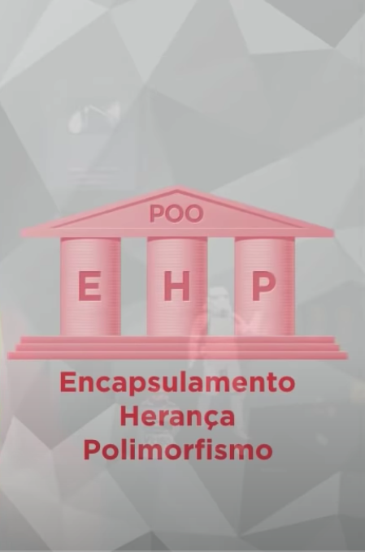
<a href="#" target="_blank"></a>
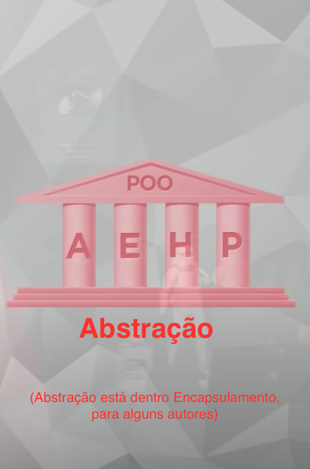
<a href="#" target="_blank"></a>
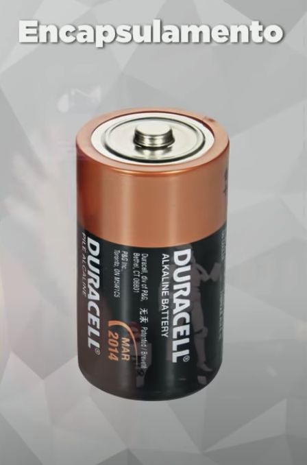
<a href="#" target="_blank"></a>
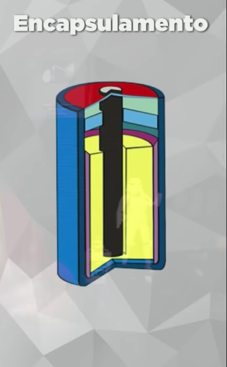
<a href="#" target="_blank"></a>

<a href="#" target="_blank"></a>
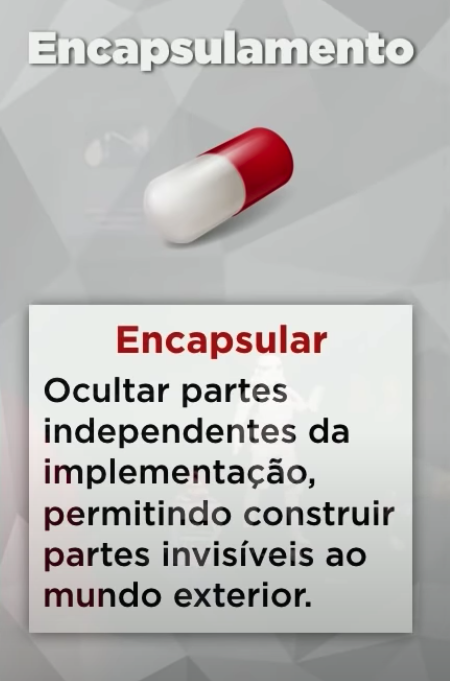
<a href="#" target="_blank"></a>
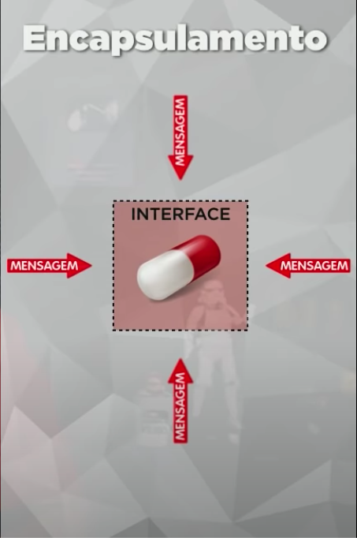
<a href="#" target="_blank"></a>

<a href="#" target="_blank"></a>
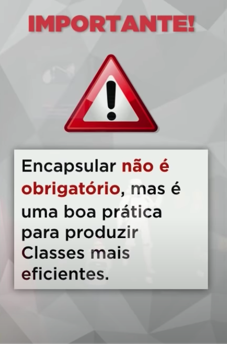
<a href="#" target="_blank"></a>
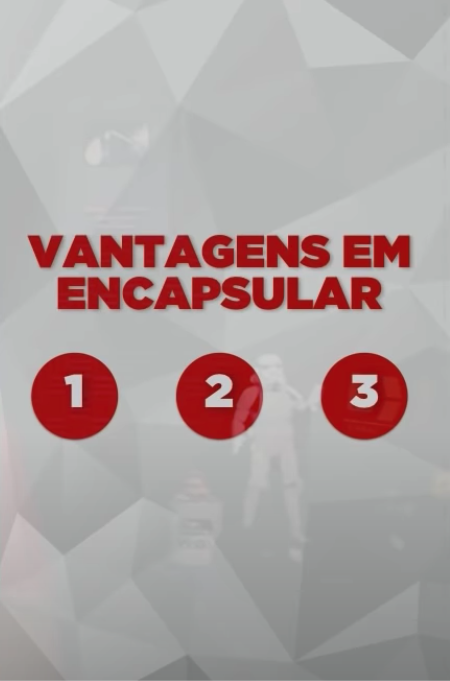
<a href="#" target="_blank"></a>
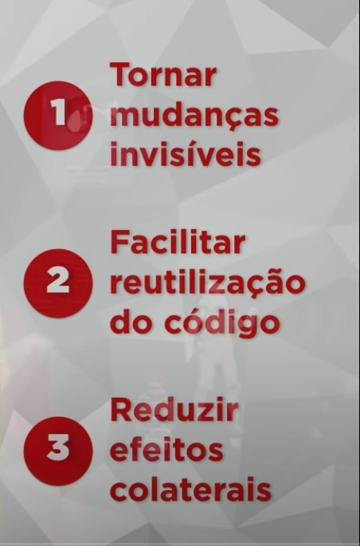
<a href="#" target="_blank"></a>
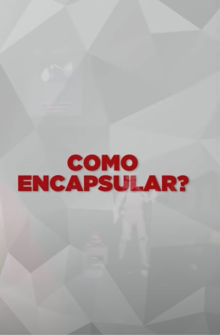
<a href="#" target="_blank"></a>

<a href="#" target="_blank"></a>
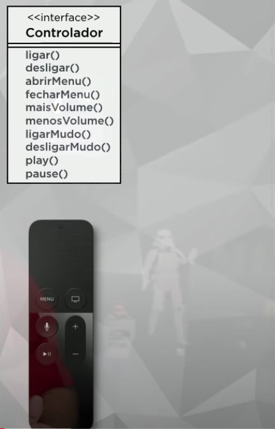
<a href="#" target="_blank"></a>
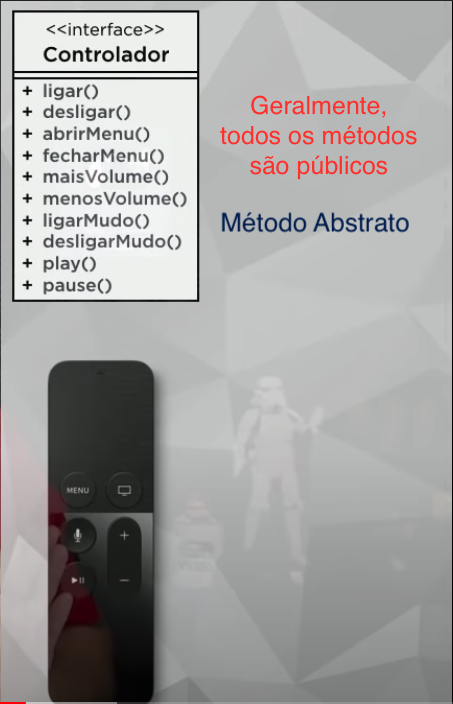
<a href="#" target="_blank"></a>
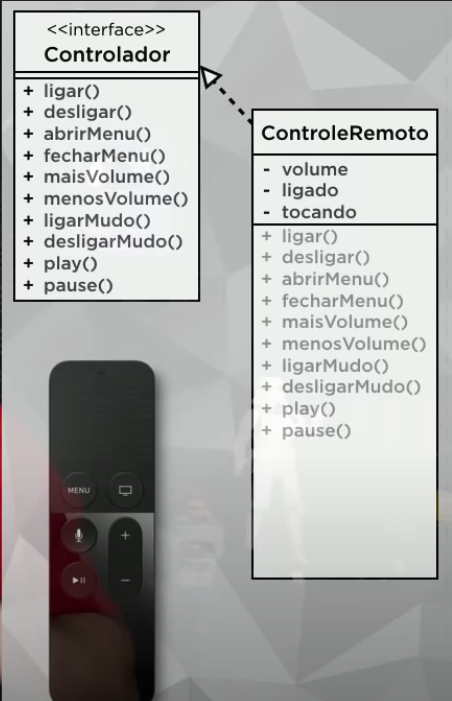
<a href="#" target="_blank"></a>
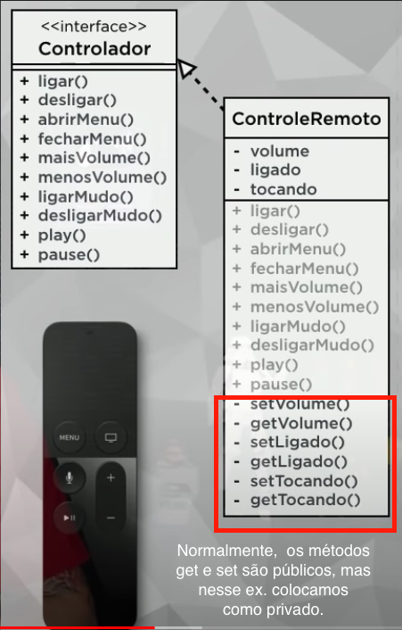
<a href="#" target="_blank"></a>
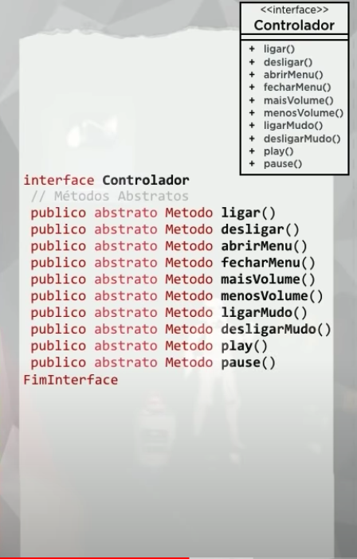
<a href="#" target="_blank"></a>
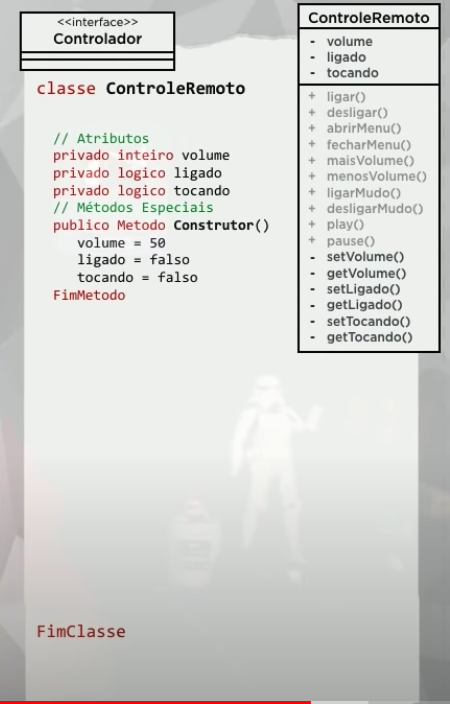
<a href="#" target="_blank"></a>
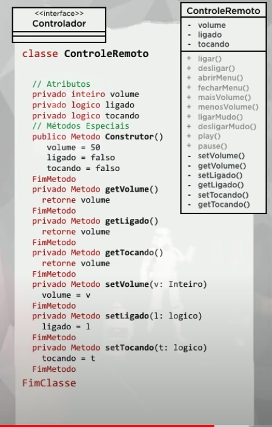
<a href="#" target="_blank"></a>
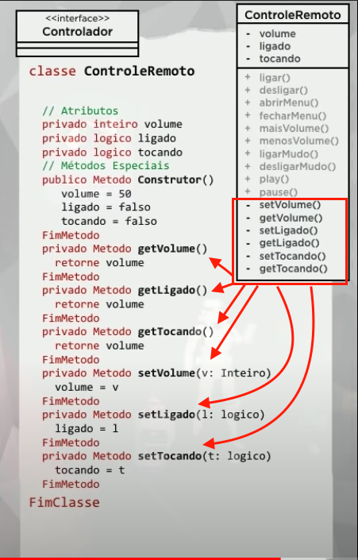
<a href="#" target="_blank"></a>
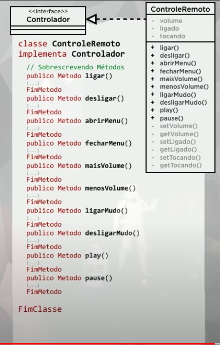
<a href="#" target="_blank"></a>
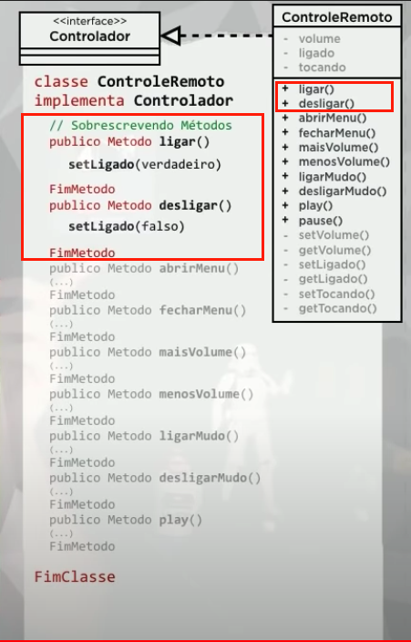
<a href="#" target="_blank"></a>
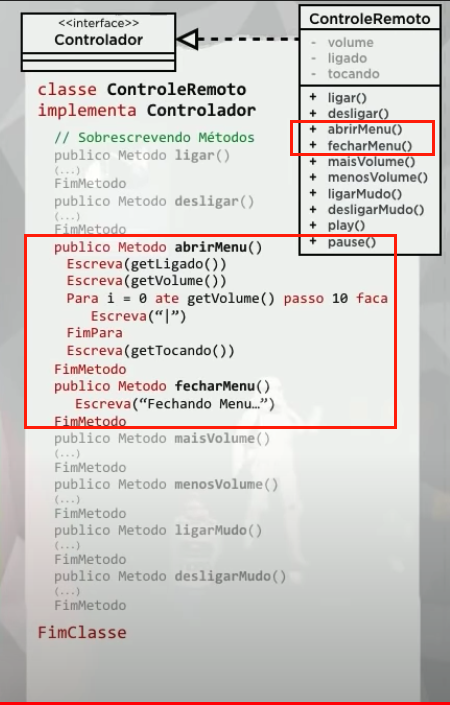
<a href="#" target="_blank"></a>

<a href="#" target="_blank"></a>
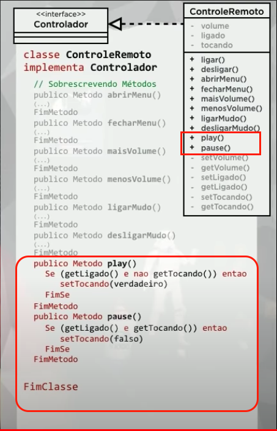


<hr>


#### Aula Prática 6 – Encapsulamento

Nessa aula de POO, vamos aprender como fazer encapsulamento em PHP, entendendo melhor o primeiro dos três pilares da POO.

<code>interface Controlador (Controlador.php)</code>

```php
<?php

interface Controlador
{
    // Metodos Abstratos
    public function ligar();
    public function desligar();
    public function abrirMenu();
    public function fecharMenu();
    public function maisVolume();
    public function menosVolume();
    public function ligarMudo();
    public function desligarMudo();
    public function play();
    public function pause();
}
```

<code>class ControleRemoto (ControleRemoto.php)</code>

```php
<?php
require_once 'Controlador.php';
class ControleRemoto implements Controlador
{
    // Atributos
    private $volume;
    private $ligado;
    private $tocando;

    // Metodos Especiais
    public function __construct()
    {
        $this->volume = 0;
        $this->ligado = false;
        $this->tocando = false;
    }

    // Metodos Getters e Setters
   
    private function getVolume(): int
    {
        return $this->volume;
    }

    private function setVolume(int $volume): void
    {
        $this->volume = $volume;
    }

    private function getLigado(): bool
    {
        return $this->ligado;
    }

    private function setLigado(bool $ligado): void
    {
        $this->ligado = $ligado;
    }

    private function getTocando(): bool
    {
        return $this->tocando;
    }

    private function setTocando(bool $tocando): void
    {
        $this->tocando = $tocando;
    }

    public function ligar()
    {
        // TODO: Implement ligar() method.
        $this->setLigado(true);
        $this->setVolume(50);
    }

    public function desligar()
    {
        // TODO: Implement desligar() method.
        $this->setLigado(false);
        $this->setTocando(false);
        $this->setVolume(0);
        // $this->setVolume(0);
    }

    public function abrirMenu()
    {
        // TODO: Implement abrirMenu() method.
        echo "<br> -------------------- MENU -------------------- </br>";

        echo "<br> Está ligado? " .($this->getLigado() ? "SIM" : "NÃO") ."<br>";

        echo "<br> Está tocando? " .($this->getTocando() ? "SIM" : "NÃO") ."<br>";

        echo "<br> Volume: " .$this->getVolume();
        for ($i = 0; $i <= $this->getVolume(); $i+=10 ) {
            echo "|";
        }
        echo "<br>";
    }

    public function fecharMenu()
    {
        // TODO: Implement fecharMenu() method.
        echo "<br> Fechando Menu... <br>";
    }

    public function maisVolume()
    {
        // TODO: Implement maisVolume() method.
        if ($this->getLigado()) {
            $this->setVolume($this->getVolume() + 10);
        } else {
             echo "<br> <span class='erro'> [ ERRO!] Não posso aumentar o volume. O controle não está ligado ! </span> <br> ";
        }
    }

    public function menosVolume()
    {
        // TODO: Implement menosVolume() method.
        if ($this->getLigado()) {
            $this->setVolume($this->getVolume() - 10);
        } else {
            echo "<br> <span class='erro'> [ ERRO!] Não posso diminuir o volume. O controle não está ligado ! </span> <br> ";
        }
    }

    public function ligarMudo()
    {
        // TODO: Implement ligarMudo() method.
        if ($this->getLigado() && $this->getVolume() > 0) {
            $this->setVolume(0);
        } else {
            echo "<br> <span class='erro'> [ ERRO!] Não posso ligar o mudo. O controle não está ligado ! </span> <br> ";
        }
    }

    public function desligarMudo()
    {
        // TODO: Implement desligarMudo() method.
        if ( ($this->getLigado()) && ($this->getVolume()) == 0 ) {
            $this->setVolume(50);
        }
    }

    public function play()
    {
        // TODO: Implement play() method.
        if ($this->getLigado() && !$this->getTocando()) {
            $this->setTocando(true);
        }
    }

    public function pause()
    {
        // TODO: Implement pause() method.
        if ($this->getLigado() && $this->getTocando()) {
            $this->setTocando(false);
        }
    }
}
```

<code>index.php</code>

```php
<!DOCTYPE html>
<html lang="pt-BR">
<head>
    <meta charset="UTF-8">
    <meta http-equiv="X-UA-Compatible" content="IE=edge">
    <meta name="viewport" content="width=device-width, initial-scale=1.0">
    <link rel="stylesheet" href="./style.css">
    <title>Aula 06 - Projeto Controle Remoto</title>
</head>
<body>
<pre>
    <h1> Projeto Controle Remoto </h1>
    <?php
        require_once 'ControleRemoto.php';

        $c = new ControleRemoto();
        $c->abrirMenu();

        echo "<br><br> #####1 <strong> TESTE DE LIGAR O CONTROLE REMOTO </strong> <br>";
        $c->ligar();    // [ligado:ControleRemoto:private] => 1 (true)
        $c->abrirMenu();

        echo "<br><br> #####2 <strong> TESTE DE DESLIGAR O CONTROLE REMOTO </strong> <br>";
        $c->desligar(); // [ligado:ControleRemoto:private] => false (vazio no PHP)
        $c->abrirMenu();

        echo "<br><br> #####3 <strong> TESTES COM O CONTROLE REMOTO DESLIGADO </strong> <br>";
        $c->maisVolume();   // [ ERRO!] Não posso aumentar o volume. O controle não está ligado !
        $c->menosVolume();  // [ ERRO!] Não posso diminuir o volume. O controle não está ligado !
        $c->ligarMudo();    // [ ERRO!] Não posso ligar o mudo. O controle não está ligado !
        // $c->abrirMenu();

        echo "<br><br> ######4 <strong> TESTE DE LIGAR O CONTROLE REMOTO </strong> <br>";
        $c->ligar();        // [volume:ControleRemoto:private] => 50 // Volume: 50
        $c->abrirMenu();

        echo "<br><br> #####5 <strong> TESTE DE PLAY NO CONTROLE REMOTO </strong> <br>";
        $c->play();         // [tocando:ControleRemoto:private] => 1 (true)
        $c->abrirMenu();

        echo "<br><br> #####6 <strong> TESTE DE MAIS VOLUME (2 VEZES) </strong> <br>";
        $c->maisVolume();   // +10
        $c->maisVolume();   // +10
        $c->abrirMenu();    // [volume:ControleRemoto:private] => 70 // Volume: 70

        echo "<br><br> #####7 <strong> TESTE DE MENOS VOLUME (1 VEZ) </strong> <br>";
        $c->menosVolume();
        $c->abrirMenu();    // [volume:ControleRemoto:private] => 60 // Volume: 60

        echo "<br><br> #####8 <strong> TESTE DE PAUSE NO CONTROLE REMOTO </strong> <br>";
        $c->pause();
        $c->abrirMenu();    // [tocando:ControleRemoto:private] => false (vazio no PHP)

        echo "<br><br> #####9 <strong> TESTE DE PLAY NO CONTROLE REMOTO </strong> <br>";
        $c->play();         // [tocando:ControleRemoto:private] => 1 (true)
        $c->abrirMenu();

        echo "<br><br> #####10 <strong> TESTE DE DESLIGAR O CONTROLE REMOTO </strong> <br>";
        $c->desligar(); // [ligado:ControleRemoto:private] => false (vazio no PHP)
        $c->abrirMenu();

        echo "<br><br> #####11 <strong> TESTE DE LIGAR O CONTROLE REMOTO </strong> <br>";
        $c->ligar();
        $c->abrirMenu();

    ?>
</pre>
</body>
</html>
```

<code>RESULTADO DO PROGRAMA:</code>

```php
Projeto Controle Remoto 

    
 -------------------- MENU -------------------- 

 Está ligado? NÃO

 Está tocando? NÃO

 Volume: 0|


 #####1  TESTE DE LIGAR O CONTROLE REMOTO  

 -------------------- MENU -------------------- 

 Está ligado? SIM

 Está tocando? NÃO

 Volume: 50||||||


 #####2  TESTE DE DESLIGAR O CONTROLE REMOTO  

 -------------------- MENU -------------------- 

 Está ligado? NÃO

 Está tocando? NÃO

 Volume: 0|


 #####3  TESTES COM O CONTROLE REMOTO DESLIGADO  

  [ ERRO!] Não posso aumentar o volume. O controle não está ligado !  
 
  [ ERRO!] Não posso diminuir o volume. O controle não está ligado !  
 
  [ ERRO!] Não posso ligar o mudo. O controle não está ligado !  
 

 ######4  TESTE DE LIGAR O CONTROLE REMOTO  

 -------------------- MENU -------------------- 

 Está ligado? SIM

 Está tocando? NÃO

 Volume: 50||||||


 #####5  TESTE DE PLAY NO CONTROLE REMOTO  

 -------------------- MENU -------------------- 

 Está ligado? SIM

 Está tocando? SIM

 Volume: 50||||||


 #####6  TESTE DE MAIS VOLUME (2 VEZES)  

 -------------------- MENU -------------------- 

 Está ligado? SIM

 Está tocando? SIM

 Volume: 70||||||||


 #####7  TESTE DE MENOS VOLUME (1 VEZ)  

 -------------------- MENU -------------------- 

 Está ligado? SIM

 Está tocando? SIM

 Volume: 60|||||||


 #####8  TESTE DE PAUSE NO CONTROLE REMOTO  

 -------------------- MENU -------------------- 

 Está ligado? SIM

 Está tocando? NÃO

 Volume: 60|||||||


 #####9  TESTE DE PLAY NO CONTROLE REMOTO  

 -------------------- MENU -------------------- 

 Está ligado? SIM

 Está tocando? SIM

 Volume: 60|||||||


 #####10  TESTE DE DESLIGAR O CONTROLE REMOTO  

 -------------------- MENU -------------------- 

 Está ligado? NÃO

 Está tocando? NÃO

 Volume: 0|


 #####11  TESTE DE LIGAR O CONTROLE REMOTO  

 -------------------- MENU -------------------- 

 Está ligado? SIM

 Está tocando? NÃO

 Volume: 50||||||
```

<br>

<span id="aula07">

### 7. Aula 7

#### Aula Teórica 7 – Relacionamento entre Classes

Nessa aula de POO, vamos aprender como fazer relacionamentos entre as classes.


<!-- 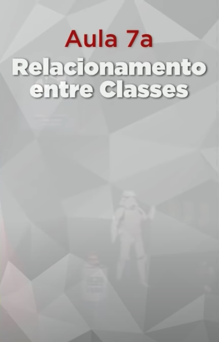
<a href="#" target="_blank"></a> -->

<a href="#" target="_blank"></a>
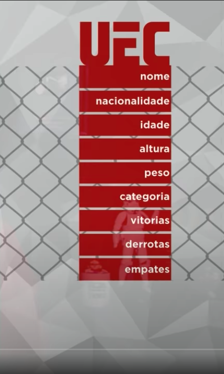
<a href="#" target="_blank"></a>
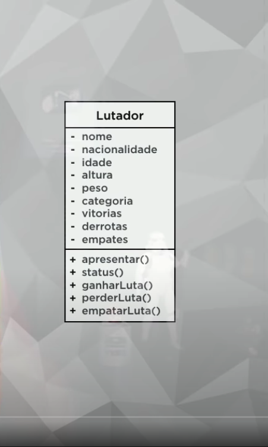
<a href="#" target="_blank"></a>
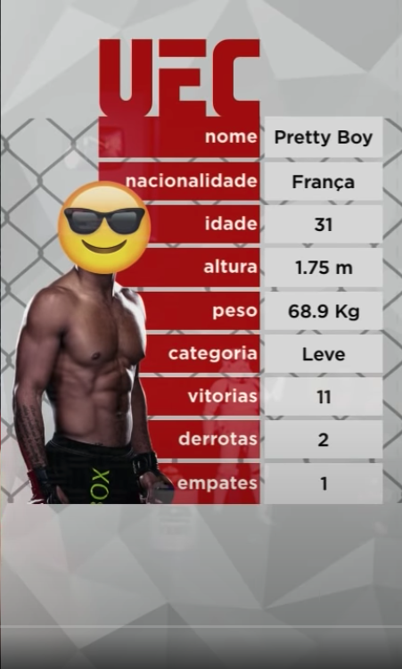
<a href="#" target="_blank"></a>
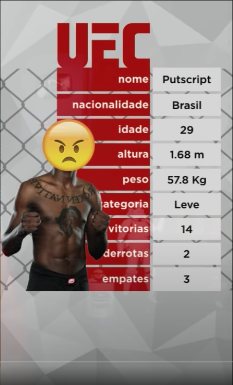
<a href="#" target="_blank"></a>

<a href="#" target="_blank"></a>
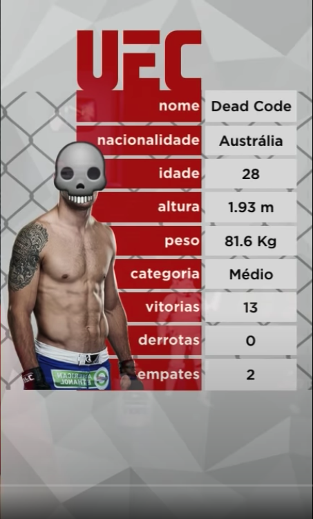
<a href="#" target="_blank"></a>
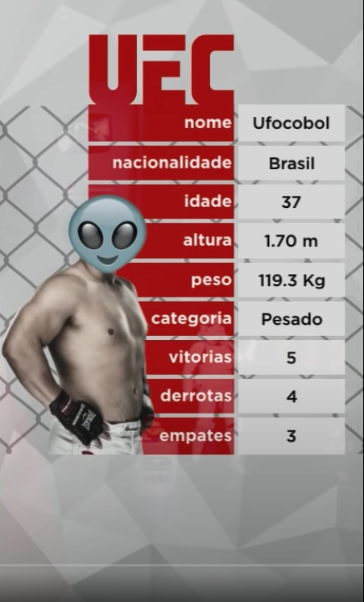
<a href="#" target="_blank"></a>
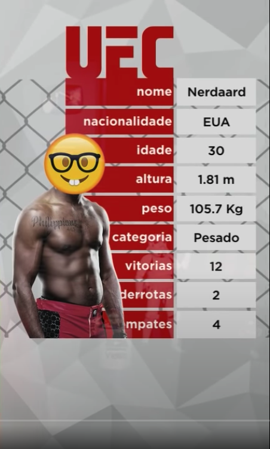
<a href="#" target="_blank"></a>

<a href="#" target="_blank"></a>
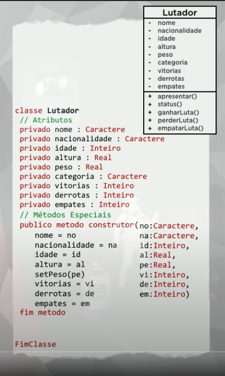
<a href="#" target="_blank"></a>

<a href="#" target="_blank"></a>
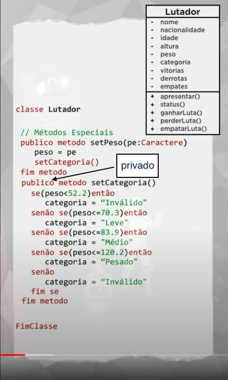
<a href="#" target="_blank"></a>

<a href="#" target="_blank"></a>
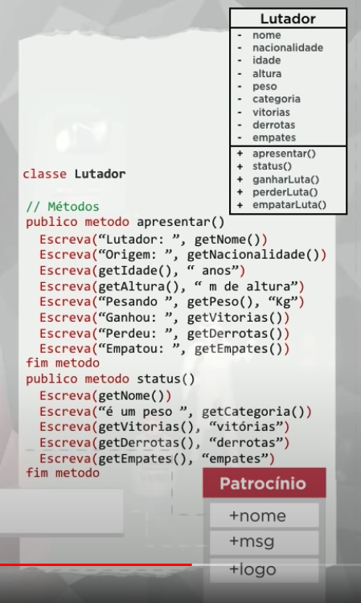
<a href="#" target="_blank"></a>
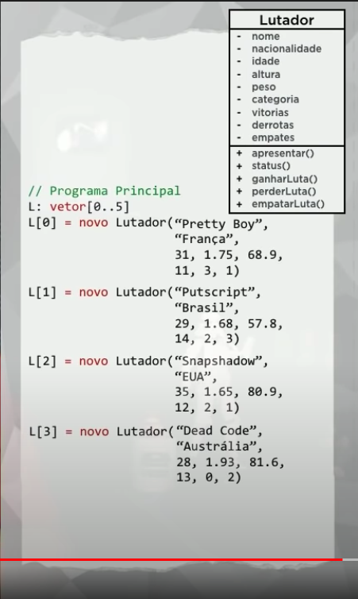
<a href="#" target="_blank"></a>

<a href="#" target="_blank"></a>
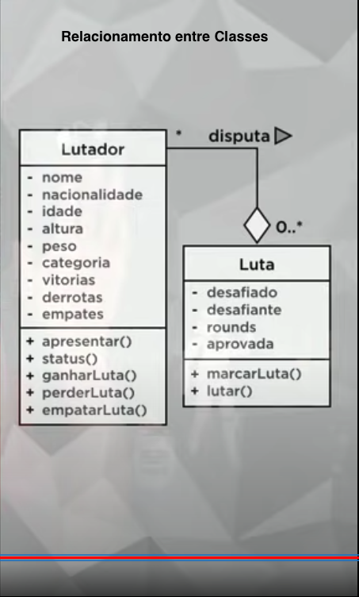
<a href="#" target="_blank"></a>


#### Aula Prática 7 – Objetos Compostos em PHP

<code>Lutador.php</code>

```php
<?php

class Lutador
{
    // ATRIBUTOS

    private $nome;
    private $nacionalidade;
    private $idade;
    private $altura;
    private $peso;
    private $categoria;
    private $vitorias;
    private $derrotas;
    private $empates;

    // METODO CONSTRUTOR
    // Nao quero $categoria no metodo construtor! A $categoria sera calcula nos metodos:
    //  function setPeso($peso) chama function setCategoria()

    public function __construct($nome, $nacionalidade, $idade, $altura, $peso, $vitorias, $derrotas, $empates)
    {
        $this->nome = $nome;
        $this->nacionalidade = $nacionalidade;
        $this->idade = $idade;
        $this->altura = $altura;
        $this->setPeso($peso);      // $this->peso = $peso; [Não apresenta o peso dessa forma]
        $this->vitorias = $vitorias;
        $this->derrotas = $derrotas;
        $this->empates = $empates;
    }

    // METODOS

    public function mensagem() {
        // https://www.php.net/manual/pt_BR/timezones.america.php
        $dtz = new DateTimeZone("America/Sao_Paulo");
        $dt = new DateTime("now", $dtz);
        $currentTime = $dt->format("d-m-Y") . ". Hora: " . $dt->format("H:i:s");
        echo "<br> Data: " .$currentTime;

        echo "\n\n";
        echo "";
        echo "<br><br> 'Welcome to the UEC'!";
        echo "<br> 'Ladies and gentlemen, we are live!' (Senhoras e senhores, estamos ao vivo!)";
        echo "<br> 'This is the moment you've all been waiting for' (Este é o momento que todos estavam esperando)";
        echo "<br> 'It's time!' (Está na hora!) <br>";
    }

    public function apresentar() {
        echo "<br><strong># <u> APRESENTACAO DO LUTADOR </u> # </strong><br>";

        echo "<br> Lutador: <strong>" .$this->getNome() ."</strong>.";
        echo "<br> Origem: " .$this->getNacionalidade() .".";
        echo "<br> Idade: " .$this->getIdade() ." anos.";
        echo "<br> Pesando: " .$this->getPeso() ." Kg.";
        echo "<br> Categoria: " .$this->getCategoria() .".";
        echo "<br> Ganhou:  <span class='foco'>" .$this->getVitorias() ."</span>.";
        echo "<br> Perdeu:  <span class='foco'>" .$this->getDerrotas() ."</span>.";
        echo "<br> Empatou: <span class='foco'>" .$this->getEmpates() ."</span>.";
        echo "<br>";
    }
    public function status() {
        echo "<br><strong> # <u> STATUS DO LUTADOR </u> # </strong><br>";

        echo "<br> Nome: <strong>" .$this->getNome() ."</strong>";
        echo "<br> Categoria: " .$this->getCategoria();
        echo "<br> Vitórias: <span class='foco'>" .$this->getVitorias() ."</span>";
        echo "<br> Derrotas: <span class='foco'>" .$this->getDerrotas() ."</span>";
        echo "<br> Empates:  <span class='foco'>" .$this->getEmpates() ."</span>";
        echo "<br>";
    }
    public function ganharLuta() {
       $this->setVitorias($this->getVitorias() + 1);
       // $this->vitorias = $this->vitorias + 1; // declarar de outra forma, sem utilizar os metodos getters e setters
    }
    public function perderLuta() {
        $this->setDerrotas($this->getDerrotas() + 1);
    }
    public function empatarLuta() {
        $this->setEmpates($this->getEmpates() + 1);
    }

    // METODOS ESPECIAIS, GETTERS E SETTERS

    public function getNome()
    {
        return $this->nome;
    }

    public function setNome($nome): void
    {
        $this->nome = $nome;
    }

    public function getNacionalidade()
    {
        return $this->nacionalidade;
    }

    public function setNacionalidade($nacionalidade): void
    {
        $this->nacionalidade = $nacionalidade;
    }

    public function getIdade()
    {
        return $this->idade;
    }

    public function setIdade($idade): void
    {
        $this->idade = $idade;
    }

    public function getAltura()
    {
        return $this->altura;
    }

    public function setAltura($altura): void
    {
        $this->altura = $altura;
    }

    public function getPeso()
    {
        return $this->peso;
    }

    public function setPeso($peso): void
    {
        $this->peso = $peso;
        $this->setCategoria();
    }

    public function getCategoria()
    {
        return $this->categoria;
    }

    private function setCategoria(): void
    {
        if ($this->peso < 52.2) {
            $this->categoria = "Inválido";
        }
        else if ($this->peso <= 70.3) {
            $this->categoria = "Leve";
        }
        else if ($this->peso <= 83.9) {
            $this->categoria = "Médio";
        }
        else if ($this->peso <= 120.2) {
            $this->categoria = "Pesado";
        }
        else {
            $this->categoria = "Inválido";
        }
    }

     public function getVitorias()
    {
        return $this->vitorias;
    }

     public function setVitorias($vitorias): void
    {
        $this->vitorias = $vitorias;
    }

    public function getDerrotas()
    {
        return $this->derrotas;
    }

    public function setDerrotas($derrotas): void
    {
        $this->derrotas = $derrotas;
    }

    public function getEmpates()
    {
        return $this->empates;
    }

    public function setEmpates($empates): void
    {
        $this->empates = $empates;
    }

}
```

<code>index.php</code>

```php
<!DOCTYPE html>
<html lang="pt-BR">
<head>
    <meta charset="UTF-8">
    <meta http-equiv="X-UA-Compatible" content="IE=edge">
    <meta name="viewport" content="width=device-width, initial-scale=1.0">
    <link rel="stylesheet" href="./style.css">
    <title>Aula 07 - Relacionamento entre Classes </title>
</head>
<body>
<pre>
    <?php
        require_once 'Lutador.php';

        $arr = array();
        $arr[0] = new Lutador('[0]. Pretty Boy', 'França', '31', '1.75', '68.9', '11', '2', '1' );
        $arr[1] = new Lutador('[1]. Putscript', 'Brasil', '29', '1.68', '57.8', '14', '2', '3' );
        $arr[2] = new Lutador('[2]. Snapshadown', 'EUA', '35', '1.65', '80.9', '12', '2', '1' );
        $arr[3] = new Lutador('[3]. Dead Code', 'Austrália', '28', '1.93', '81.6', '13', '0', '2' );
        $arr[4] = new Lutador('[4]. Ufocobol', 'Brasil', '37', '1.70', '119.3', '5', '4', '3' );
        $arr[5] = new Lutador('[5]. Nederland', 'EUA', '30', '1.81', '105.7', '12', '2', '4' );

        $arr[0]->mensagem(); // Mensagem inicial antes da luta


        echo "<br><strong>########## <u> CATEGORIA DOS PESOS LEVES </u> ########## </strong> <br><br>";
        // selecionar o indice do array dos 2 lutadores
        $i0 = $arr[0]->getNome();
        $i1 = $arr[1]->getNome();

        echo "<strong> Luta: </strong> " .$i0 . " VS " .$i1;
        echo "\n";

        // Apresentação dos 2 lutadores antes da luta
        $arr[0]->apresentar();
        $arr[1]->apresentar();

        echo "<p><strong> # <u> RESULTADO DA LUTA ENTRE OS DOIS LUTADORES: </u> # </strong></p>";

        echo "Empatou a luta entre <span class='foco'>" .$i0  . " VS " .$i1 ."</span> <br>";
        $arr[0]->empatarLuta();
        $arr[1]->empatarLuta();

        // Status dos 2 lutadores apos a luta
        $arr[0]->status();
        $arr[1]->status();

        echo "\n";
        echo "<br><strong>########## <u> CATEGORIA DOS PESOS MÉDIOS </u> ########## </strong> <br><br>";
        // selecionar o indice do array dos 2 lutadores
        $i2 = $arr[2]->getNome();
        $i3 = $arr[3]->getNome();

        echo "<strong> Luta: </strong> " .$i2 . " VS " .$i3;
        echo "\n";

        // Apresentação dos 2 lutadores antes da luta
        $arr[2]->apresentar();
        $arr[3]->apresentar();

        echo "<p><strong> # <u> RESULTADO DA LUTA ENTRE OS DOIS LUTADORES: </u> # </strong></p>";

        echo "Ganhou a luta : <span class='foco'>" .$i2 ."</span> <br>";
        $arr[2]->ganharLuta();

        echo "Perdeu a luta : <span class='foco'>" .$i3 ."</span> <br>";
        $arr[3]->perderLuta();

        // Status dos 2 lutadores apos a luta
        $arr[2]->status();
        $arr[3]->status();

        echo "\n";
        echo "<br><strong>########## <u> CATEGORIA DOS PESOS PESADOS </u> ########## </strong> <br><br>";
        // selecionar o indice do array dos 2 lutadores
        $i4 = $arr[4]->getNome();
        $i5 = $arr[5]->getNome();

        echo "<strong> Luta: </strong> " .$i4 . " VS " .$i5; // Lutador $i2 X Lutador $i3
        echo "\n";

        // Apresentação dos 2 lutadores
        $arr[4]->apresentar();
        $arr[5]->apresentar();

        echo "<p><strong> # <u> RESULTADO DA LUTA ENTRE OS DOIS LUTADORES: </u> # </strong></p>";

        echo "Ganhou a luta : <span class='foco'>" .$i4 ."</span> <br>";
        $arr[4]->ganharLuta();

        echo "Perdeu a luta : <span class='foco'>" .$i5 ."</span> <br>";
        $arr[5]->perderLuta();

        // Status dos 2 lutadores apos a luta
        $arr[4]->status(); 
        $arr[5]->status(); 

    ?>
</pre>
</body>
</html>
```

<code>Resultado do programa da aula 07</code>

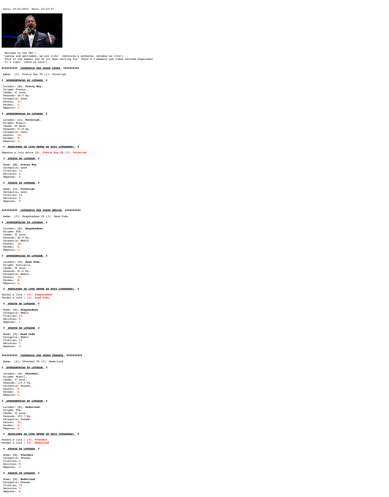
<a href="#" target="_blank"></a>

[Resultado do programa da aula 07 - PDF](https://github.com/eduardodsr/cursoemvideo/tree/master/php-poo/pdf/php-poo-resultado-aula07.pdf) 

<br>

<span id="aula08">

### 8. Aula 8

Objetos são instância de classes.

Preciso de uma Classe para poder instanciar um Objeto.

Não consigo ter Objetos sem ter uma Classe definindo a estrutura.

Uma Classe encapsula dados e funcionalidades.

Na programação OO, o encapsulamento se refere ao agrupamento de dados com os métodos que operam nesses dados ou à restrição do acesso direto a alguns dos componentes de um objeto.


#### Aula Teórica 8 – Relacionamento de Agregação

Nessa aula de POO, vamos aprender como realizar um relacionamento de agregação entre classes para gerar objetos ainda mais poderosos.


<a href="#" target="_blank"></a>
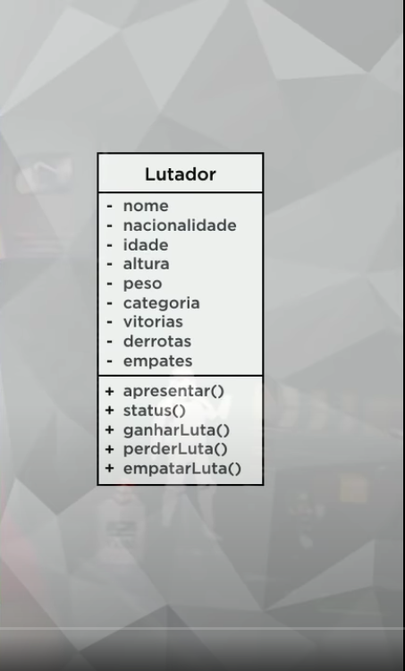
<a href="#" target="_blank"></a>
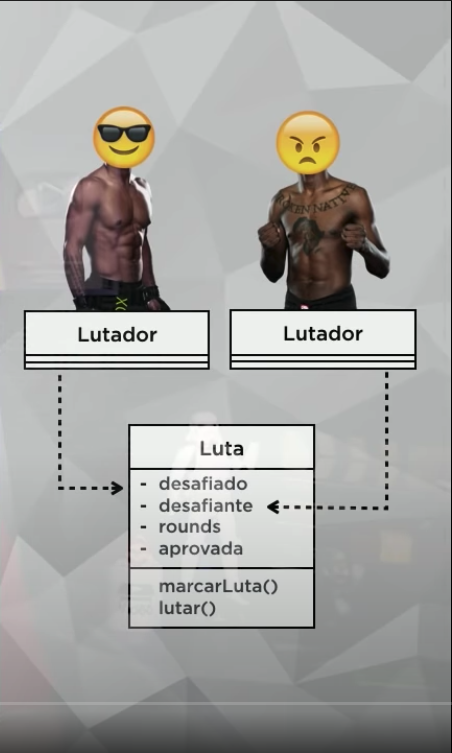
<a href="#" target="_blank"></a>

<a href="#" target="_blank"></a>
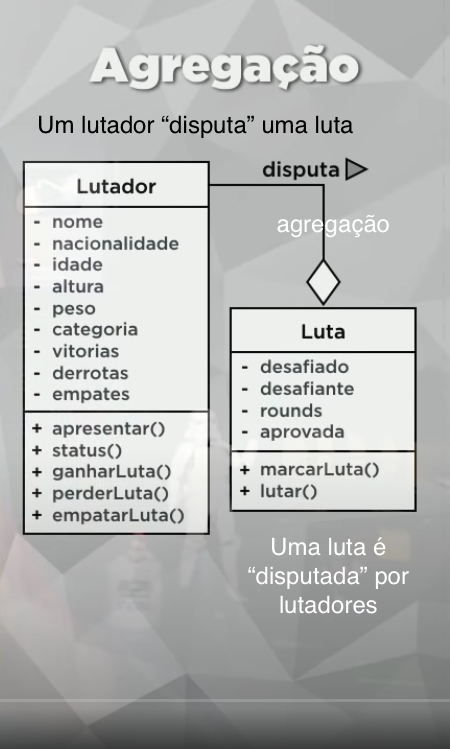
<a href="#" target="_blank"></a>
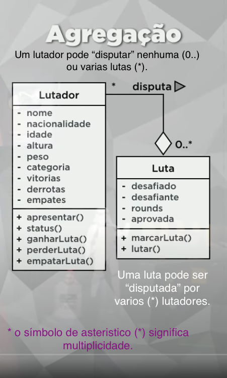
<a href="#" target="_blank"></a>
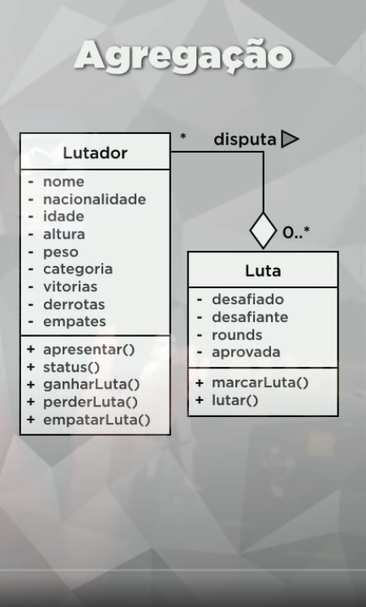
<a href="#" target="_blank"></a>
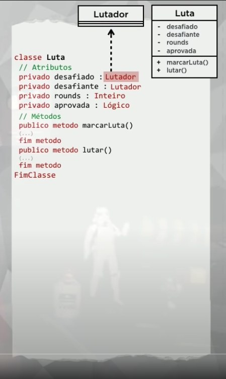
<a href="#" target="_blank"></a>

<a href="#" target="_blank"></a>
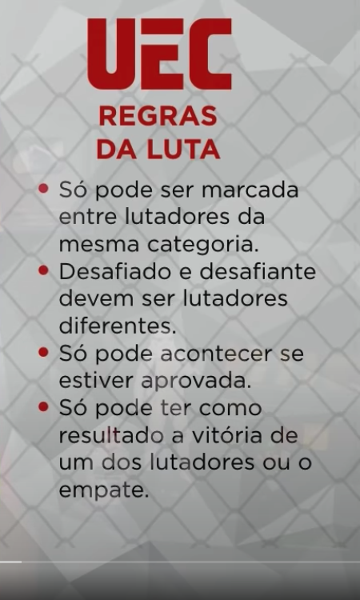
<a href="#" target="_blank"></a>
<!-- 
<a href="#" target="_blank"></a> -->
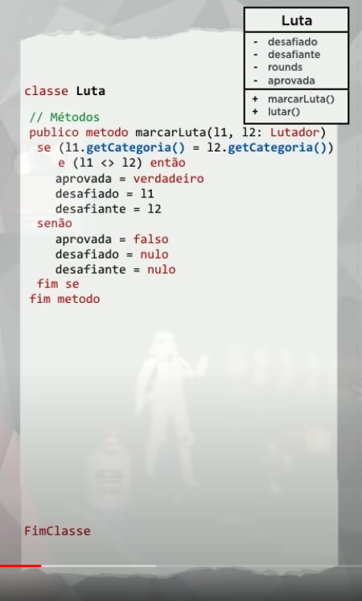
<a href="#" target="_blank"></a>

<a href="#" target="_blank"></a>
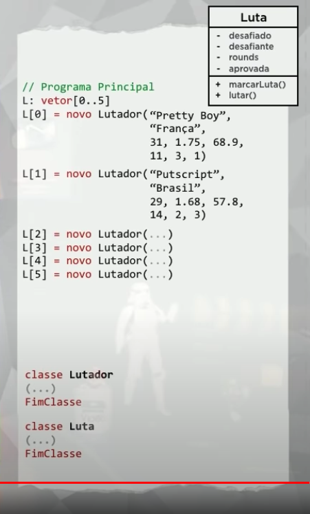
<a href="#" target="_blank"></a>
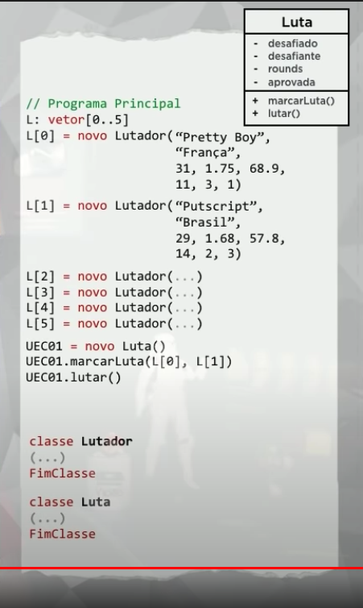
<a href="#" target="_blank"></a>

#### Aula Prática 8 – Agregação entre Objetos em PHP

Nessa aula de POO, vamos aprender como realizar a agregação entre objetos usando a linguagem PHP..


<code>Luta.php</code>

```php
<?php

class  Lutador
{
    // ATRIBUTOS

    private $nome;
    private $nacionalidade;
    private $idade;
    private $altura;
    private $peso;
    private $categoria;
    private $vitorias;
    private $derrotas;
    private $empates;

    // METODO CONSTRUTOR
    // Nao quero $categoria no metodo construtor! A $categoria sera calcula nos metodos:
    //  function setPeso($peso) chama function setCategoria()

    public function __construct($nome, $nacionalidade, $idade, $altura, $peso, $vitorias, $derrotas, $empates)
    {
        $this->nome = $nome;
        $this->nacionalidade = $nacionalidade;
        $this->idade = $idade;
        $this->altura = $altura;
        $this->setPeso($peso);      // $this->peso = $peso; [Não apresenta o peso dessa forma]
        $this->vitorias = $vitorias;
        $this->derrotas = $derrotas;
        $this->empates = $empates;
    }

    // METODOS

    public function apresentar() {
        echo "<br><strong># <u> APRESENTACAO DO LUTADOR </u> # </strong><br>";

        echo "<br> Lutador: <strong>" .$this->getNome() ."</strong>.";
        echo "<br> Origem: " .$this->getNacionalidade() .".";
        echo "<br> Idade: " .$this->getIdade() ." anos.";
        echo "<br> Pesando: " .$this->getPeso() ." Kg.";
        echo "<br> Categoria: " .$this->getCategoria() .".";
        echo "<br> Ganhou:  <span class='foco'>" .$this->getVitorias() ."</span>.";
        echo "<br> Perdeu:  <span class='foco'>" .$this->getDerrotas() ."</span>.";
        echo "<br> Empatou: <span class='foco'>" .$this->getEmpates() ."</span>.";
        echo "<br>";
    }
    public function status() {
        echo "<br><strong> # <u> STATUS DO LUTADOR </u> # </strong><br>";

        echo "<br> Nome: <strong>" .$this->getNome() ."</strong>";
        echo "<br> Categoria: " .$this->getCategoria();
        echo "<br> Vitórias: <span class='foco'>" .$this->getVitorias() ."</span>";
        echo "<br> Derrotas: <span class='foco'>" .$this->getDerrotas() ."</span>";
        echo "<br> Empates:  <span class='foco'>" .$this->getEmpates() ."</span>";
        echo "<br>";
    }
    public function ganharLuta() {
       $this->setVitorias($this->getVitorias() + 1);
       // $this->vitorias = $this->vitorias + 1; // declarar de outra forma, sem utilizar os metodos getters e setters
    }
    public function perderLuta() {
        $this->setDerrotas($this->getDerrotas() + 1);
    }
    public function empatarLuta() {
        $this->setEmpates($this->getEmpates() + 1);
    }

    // METODOS ESPECIAIS, GETTERS E SETTERS

    public function getNome()
    {
        return $this->nome;
    }

    public function setNome($nome): void
    {
        $this->nome = $nome;
    }

    public function getNacionalidade()
    {
        return $this->nacionalidade;
    }

    public function setNacionalidade($nacionalidade): void
    {
        $this->nacionalidade = $nacionalidade;
    }

    public function getIdade()
    {
        return $this->idade;
    }

    public function setIdade($idade): void
    {
        $this->idade = $idade;
    }

    public function getAltura()
    {
        return $this->altura;
    }

    public function setAltura($altura): void
    {
        $this->altura = $altura;
    }

    public function getPeso()
    {
        return $this->peso;
    }

    public function setPeso($peso): void
    {
        $this->peso = $peso;
        $this->setCategoria();
    }

    public function getCategoria()
    {
        return $this->categoria;
    }

    private function setCategoria(): void
    {
        if ($this->peso < 52.2) {
            $this->categoria = "Inválido";
        }
        else if ($this->peso <= 70.3) {
            $this->categoria = "Leve";
        }
        else if ($this->peso <= 83.9) {
            $this->categoria = "Médio";
        }
        else if ($this->peso <= 120.2) {
            $this->categoria = "Pesado";
        }
        else {
            $this->categoria = "Inválido";
        }
    }

     public function getVitorias()
    {
        return $this->vitorias;
    }

     public function setVitorias($vitorias): void
    {
        $this->vitorias = $vitorias;
    }

    public function getDerrotas()
    {
        return $this->derrotas;
    }

    public function setDerrotas($derrotas): void
    {
        $this->derrotas = $derrotas;
    }

    public function getEmpates()
    {
        return $this->empates;
    }

    public function setEmpates($empates): void
    {
        $this->empates = $empates;
    }

}
```

<code>Luta.php</code>

```php
<?php
require_once 'Lutador.php';
class Luta
{
    // Atributos
    public $desafiado;
    private $desafiante;
    private $rounds;
    private $aprovada;

    // Métodos Públicos
    public function marcarLuta($l1, $l2) {
        // TODO implement method - √
        if ( $l1->getCategoria() === $l2->getCategoria()
            && ($l1 != $l2) )
        {
            $this->aprovada = true;
            $this->desafiado = $l1;
            $this->desafiante = $l2;
        } else {
            $this->aprovada = false;
            $this->desafiado =  null; // O valor especial null representa uma variável sem valor.
            $this->desafiante = null;
        }
    }
    public function lutar() {
        // TODO implement method
        if ($this->aprovada) {

            $this->desafiado->apresentar();
            $this->desafiante->apresentar();

            $vencedor = rand(0,2);
            // 0-> empate;
            // 1 -> vitoria do desafiado;
            // 2 -> vitoria do desafiante;

            echo "<br>";
            $tracejadoInicial = str_repeat("-", 40);
            echo($tracejadoInicial);

            switch ($vencedor) {
                case 0: // TODO - EMPATE
                    echo "<br><strong> EMPATE! </strong><br>";
                    $this->desafiado->empatarLuta();
                    $this->desafiante->empatarLuta();
                    break;
                case 1: // TODO - GANHOU O DESAFIADO
                    echo "<br><strong> GANHOU A LUTA: " .$this->desafiado->getNome() ."</strong><br>";
                    $this->desafiado->ganharLuta();
                    $this->desafiante->perderLuta();
                    break;
                case 2 : // TODO - GANHOU O DESAFIANTE
                    echo "<br><strong> GANHOU A LUTA: " .$this->desafiante->getNome() ."</strong><br>";
                    $this->desafiante->ganharLuta();
                    $this->desafiado->perderLuta();
                    break;
                }

        } else {
            echo "<br>";
            $tracejadoInicial = str_repeat("-", 40);
            echo($tracejadoInicial);

            echo "<br><span class='foco'> LUTA NÃO PODE ACONTECER! </span> <br>";
        }

        $tracejadoFinal = str_repeat("-", 40);
        echo($tracejadoFinal);
        echo "<br>";
    }

    // Métodos Especiais (Getters e Setters)
    public function getDesafiado()
    {
        return $this->desafiado;
    }

    public function setDesafiado($desafiado): void
    {
        $this->desafiado = $desafiado;
    }

    public function getDesafiante()
    {
        return $this->desafiante;
    }

    public function setDesafiante($desafiante): void
    {
        $this->desafiante = $desafiante;
    }

    public function getRounds()
    {
        return $this->rounds;
    }

    public function setRounds($rounds): void
    {
        $this->rounds = $rounds;
    }

    public function getAprovada()
    {
        return $this->aprovada;
    }

    public function setAprovada($aprovada): void
    {
        $this->aprovada = $aprovada;
    }

}
```

<code>Mensagem.php</code>

```php
<?php

class Mensagem
{
    public function mensagem() {
        echo "<br><strong># <u> MENSAGEM INICIAL </u> # </strong><br>";

        // https://www.php.net/manual/pt_BR/timezones.america.php
        $dtz = new DateTimeZone("America/Sao_Paulo");
        $dt = new DateTime("now", $dtz);
        $currentTime = $dt->format("d-m-Y") . ". Hora: " . $dt->format("H:i:s");
        echo "<br> Data: " .$currentTime;

        echo "\n\n";
        echo "";
        echo "<br><br> 'Welcome to the UEC'!";
        echo "<br> 'Ladies and gentlemen, we are live!' (Senhoras e senhores, estamos ao vivo!)";
        echo "<br> 'This is the moment you've all been waiting for' (Este é o momento que todos estavam esperando)";
        echo "<br> 'It's time!' (Está na hora!) <br>";
    }
}
```

<code>index.php</code>

```php
<!DOCTYPE html>
<html lang="pt-BR">
<head>
    <meta charset="UTF-8">
    <meta http-equiv="X-UA-Compatible" content="IE=edge">
    <meta name="viewport" content="width=device-width, initial-scale=1.0">
    <link rel="stylesheet" href="./style.css">
    <title>Aula 08 - Agregação entre Objetos  </title>
</head>
<body>
<pre>
    <?php
        require_once 'Lutador.php';
        require_once 'Luta.php';
        require_once 'Mensagem.php';

        $arr = array();
        $arr[0] = new Lutador('[0]. Pretty Boy', 'França', '31', '1.75', '68.9', '11', '2', '1' );
        $arr[1] = new Lutador('[1]. Putscript', 'Brasil', '29', '1.68', '57.8', '14', '2', '3' );
        $arr[2] = new Lutador('[2]. Snapshadown', 'EUA', '35', '1.65', '80.9', '12', '2', '1' );
        $arr[3] = new Lutador('[3]. Dead Code', 'Austrália', '28', '1.93', '81.6', '13', '0', '2' );
        $arr[4] = new Lutador('[4]. Ufocobol', 'Brasil', '37', '1.70', '119.3', '5', '4', '3' );
        $arr[5] = new Lutador('[5]. Nerdaar', 'EUA', '30', '1.81', '105.7', '12', '2', '4' );

        $MSG = new Mensagem(); // Mensagem inicial antes da luta

        echo "<br><strong>########## <u> CATEGORIA DOS PESOS LEVES </u> ########## </strong> <br><br>";
        $UEC_1 = new Luta();
        $UEC_1->marcarLuta($arr[0], $arr[1]);
        $UEC_1->lutar();
        $arr[0]->status();
        $arr[1]->status();

        echo "<br><strong>########## <u> CATEGORIA DOS PESOS MÉDIOS </u> ########## </strong> <br><br>";
        $UEC_2 = new Luta();
        $UEC_2->marcarLuta($arr[2], $arr[3]);
        $UEC_2->lutar();
        $arr[2]->status();
        $arr[3]->status();

        echo "<br><strong>########## <u> CATEGORIA DOS PESOS PESADOS </u> ########## </strong> <br><br>";
        $UEC_3 = new Luta();
        $UEC_3->marcarLuta($arr[4], $arr[5]);
        $UEC_3->lutar();
        $arr[4]->status();
        $arr[5]->status();

        echo "<br><strong>########## <u> TESTANDO AS REGRAS </u> ########## </strong> <br><br>";

        $testeRegra01 = new Luta();
        $testeRegra02 = new Luta();
        $testeRegra03 = new Luta();
        $testeRegra04 = new Luta();

        echo "<br> <u> REGRA 1 </u> &rarr; Só pode ser marcada luta entre lutadores da mesma categoria <br>";
        $testeRegra01->marcarLuta($arr[0], $arr[2]);
        $testeRegra01->lutar(); // TODO √

        echo "<br> <u> REGRA 2 </u> &rarr; Desafiado e desafiante devem ser lutadores diferentes <br>";
        $testeRegra02->marcarLuta($arr[0], $arr[0]);
        $testeRegra02->lutar(); // TODO √

        echo "<br> <u> REGRA 3 </u> &rarr; Só pode acontecer se tiver aprovada <br>";
        $testeRegra03->marcarLuta($arr[0], $arr[0]);
        $testeRegra03->setAprovada(false);
        $testeRegra03->lutar(); // TODO √

        echo "<br> <u> REGRA 4 </u> &rarr; Resultados possiveis Vitoria Empate e Derrota <br>";
        $testeRegra04->marcarLuta($arr[0], $arr[1]);
        $testeRegra04->lutar(); // TODO √

    ?>
</pre>
</body>
</html>
```

<code>Resultado do programa da aula 08</code>

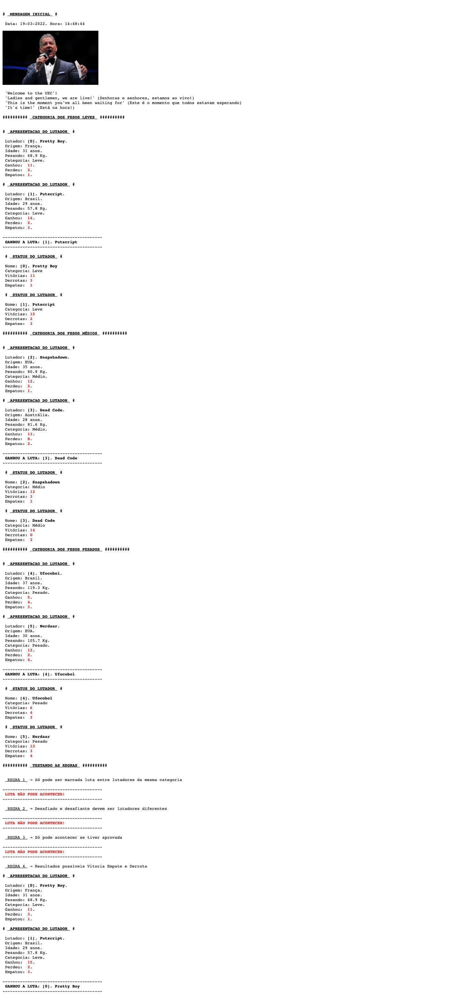
<a href="#" target="_blank"></a>

[Resultado do programa da aula 08 - PDF](https://github.com/eduardodsr/cursoemvideo/tree/master/php-poo/pdf/php-poo-resultado-aula08.pdf) 


<br>

<span id="aula09">

### 9. Aula 9

#### Aula Teórica 9 – Exercícios de POO

Nessa aula de POO, vamos fazer alguns exercícios de Programação Orientada a Objeto conceituais que já apareceram em concursos. Coloque em prática tudo aquilo que aprendeu até aqui.


<a href="#" target="_blank"></a>
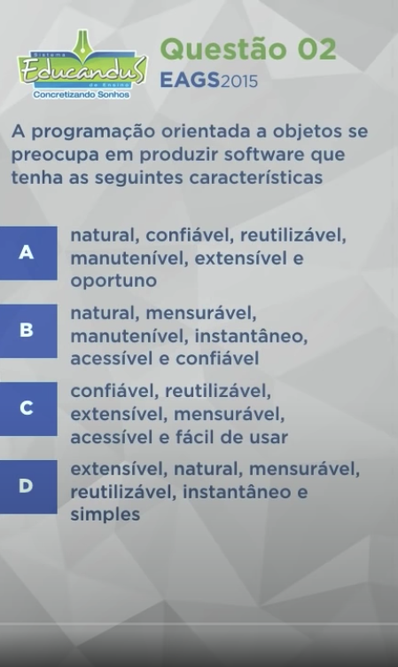
<a href="#" target="_blank"></a>
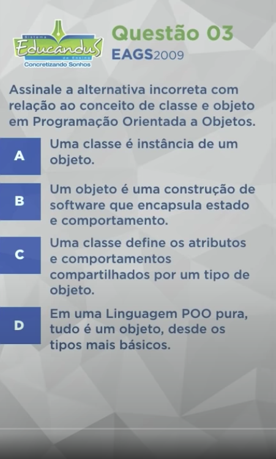
<a href="#" target="_blank"></a>

<a href="#" target="_blank"></a>
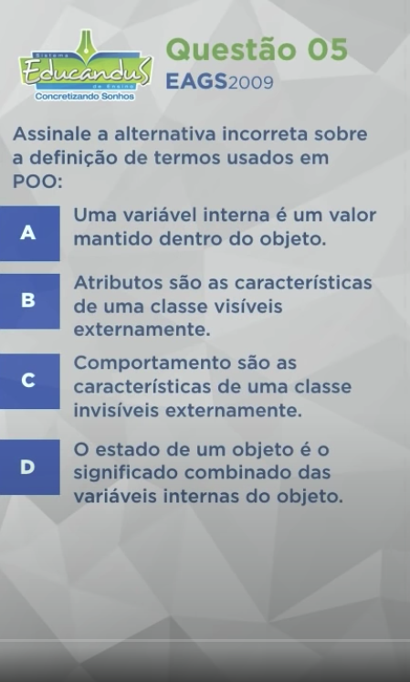
<a href="#" target="_blank"></a>
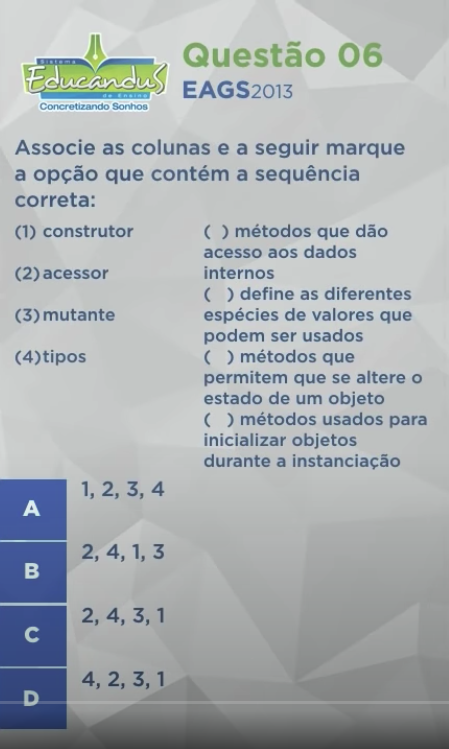
<a href="#" target="_blank"></a>
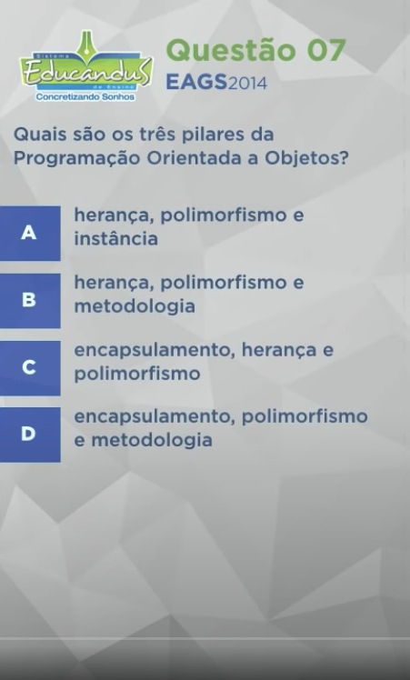
<a href="#" target="_blank"></a>
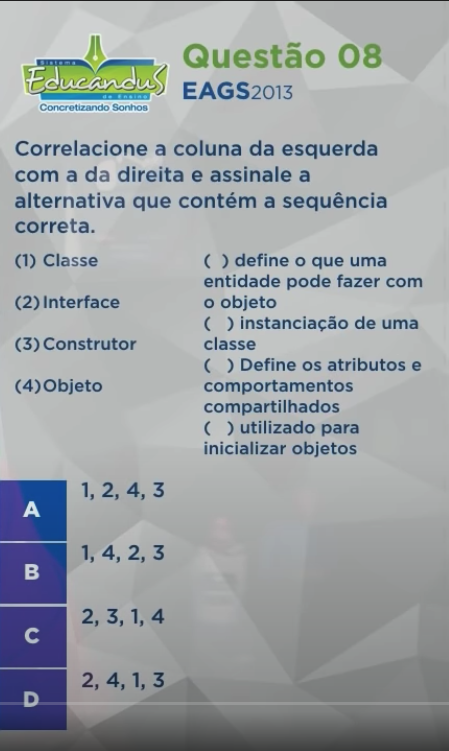
<a href="#" target="_blank"></a>
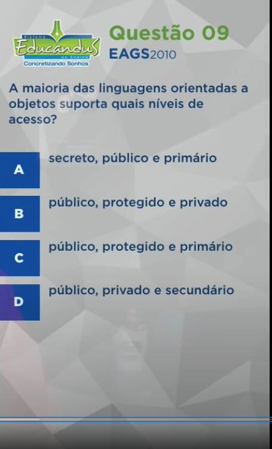
<a href="#" target="_blank"></a>
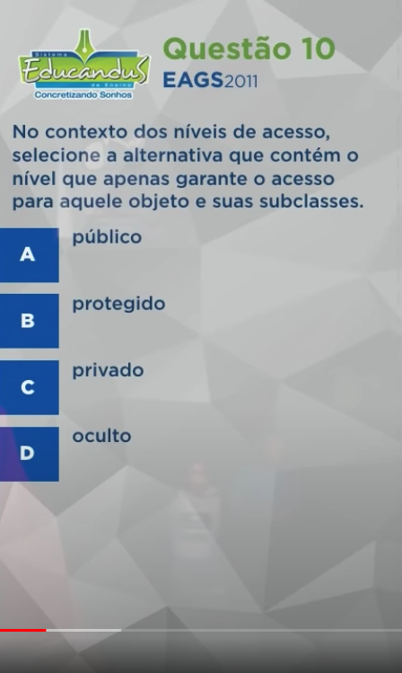
<a href="#" target="_blank"></a>
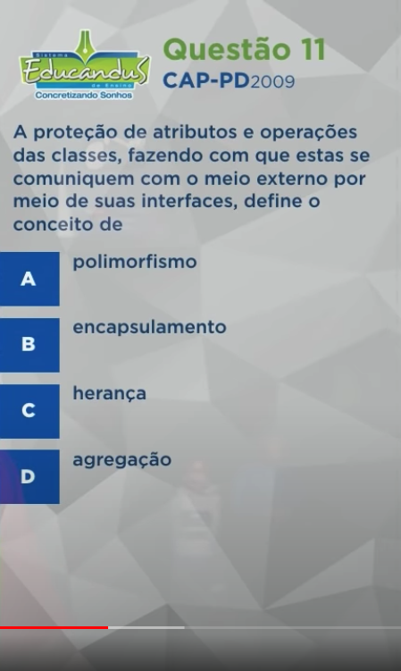
<a href="#" target="_blank"></a>

<a href="#" target="_blank"></a>
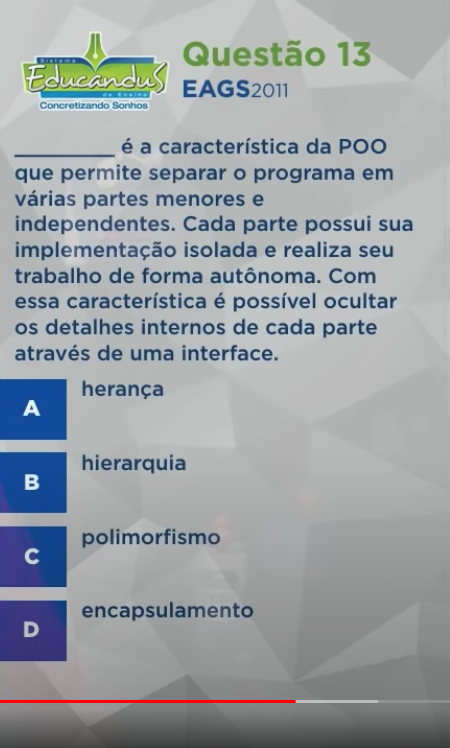
<a href="#" target="_blank"></a>
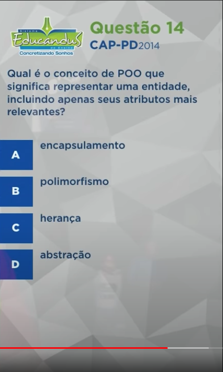
<a href="#" target="_blank"></a>
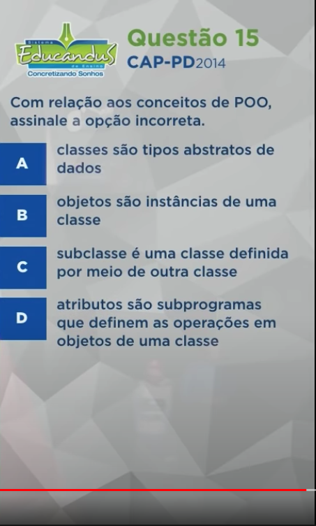
<a href="#" target="_blank"></a>


- Q1 -> Uma casa está para uma planta arquitetônica assim como um **objeto** está para... 

**uma classe**

- Q2 -> Vantagens da POO

**C O M E R N**ada
**C** -> Confiável
**O**-> Oportuno
**M** -> Manutenível
**E** -> Extensível
**R** -> Reutilizavel
**N**ada -> Natural

- Q3

Uma **classe** é instância de um **objeto**.

- Q4

**OBJETO** -> construção de sw que encapsula estado e comportamento
**CLASSE** -> define os atributos e comportamentos comuns
**ATRITUBO** -> característica de uma classe que é visível
**COMPORTAMENTO** -> ação executada por um objeto
**DOMÍNIO** -> espaço onde o problema reside


* Q5 

- Uma **variável interna** é um valor mantido dentro do objeto
- **Atributos** são as características de uma classe visíveis externamente
- **Comportamentos (Métodos)** são funcionalidades externas.
- O **estado de um objeto** é o significado das variáveis internas do objeto

* Q6

- **Construtor** -> métodos usados para inicializar objetos durante a inicialização
- **Acessor** -> métodos que dão acessos aos dados internos
- **Mutante (Modificador)** -> métodos que permitem que se altere o estado de um objeto.
- **Tipos** -> define as diferentes espécies de valores que podem ser usados

* Q7 - 3 Pilares da POO (Programação Orientada a Objetos)

-  E H P
- **Encapsulamento**
- **Herança**
- **Polimorfismo** 

* Q8

- **CLASSE** -> define os atributos e comportamentos (métodos) compartilhados
- **OBJETO** -> instanciação de uma classe
- **CONSTRUTOR** -> utilizado para inicializar objetos
- **INTERFACE** -> Define o que uma entidade pode fazer com o objeto. A interface diz quais são os métodos que são determinados como públicos que estão diretamente acessíveis.

* Q9 - Níveis de acesso (visibilidade) em POO

- público (+) , privado (-) e protegido (#).

* Q10 - niveis de acesso (Visibilidade dos Modificadores)

público -> qualquer um pode acessar. A classe atual e outras classes.
privado -> é visível somente dentro da classe. Somente a classe atual.
protegido -> nível intermediário entre o publico e o privado. A classe atual e todas as sub-classes (filhas)

- Q11

Conceito de **Encapsulamento** -> A proteção de atributos e operações das classes, fazendo com que estas se comuniquem com o meio externo por meio de suas interfaces.

- Q12

**Implementação** -> define os detalhes internos do componente
**Interface** -> lista os serviços fornecidos por ele.

- Q13

**ENCAPSULAMENTO** -> é a característica da POO que permite separar o programa em várias partes menores e independentes. Cada parte possui sua implementação isolada e realiza seu trabalho de forma autônoma. Com essa característica é possível ocultar os detalhes internos de cada parte através de uma interface.

* Q14

- **ABSTRAÇÃO** -> significa representar uma entidade, incluindo apenas seus atributos relevantes.

* Q15

- **CLASSES** -> são tipos abstratos de dados
- **OBJETOS** -> são instâncias de uma classe
- **SUBCLASSE** -> é um classe definida por meio de outra classe
- **MÉTODOS** -> são subprogramas que definem as operações em objetos de uma classe.

<br>

#### Aula Prática 9 – Exercício prático POO em PHP

Nessa aula de POO, vamos fazer um exercício de Programação Orientada a Objeto em PHP com tudo aquilo que aprendemos até aqui.

<code></code>

```php

```

<code></code>

```php

```

<br>

<span id="aula10">

### 10. Aula 10

#### Aula Teórica 10 – Herança (Parte 1)

Nessa aula de POO, vamos aprender o que é Herança em Programação Orientada a Objetos.


#### Aula Prática 10 – Herança (Parte 1)

Nessa aula de POO, vamos aprender a aplicar o conceito de Herança ao PHP.

<code></code>

```php

```

<code></code>

```php

```

<br>

<span id="aula11">

### 11. Aula 11

#### Aula Teórica 11 – Herança (Parte 2)

Nessa aula de POO, vamos aprender como funcionam os tipos de Herança, que são a Herança de Implementação e Herança para Diferença. Além disso, vamos ver algumas nomenclaturas importantes para a Programação Orientada a Objetos.


#### Aula Prática 11 – Herança (Parte 2)

Nessa aula de POO com PHP, vamos aprender a colocar a Herança em prática, usando as técnicas de Herança de Implementação e Herança para Diferença.

<code></code>

```php

```

<code></code>

```php

```

<br>

<span id="aula12">

### 12. Aula 12

#### Aula Teórica 12 – Conceito Polimorfismo (Parte 1)

Nessa aula de POO, vamos aprender como funciona o Polimorfismo em Programação Orientada a Objetos, o terceiro pilar de teoria.


#### Aula Prática 12 – Polimorfismo em PHP (Parte 1)

Nessa aula de POO, vamos aprender como fazer Polimorfismo de Sobreposição (Override) em PHP.

<code></code>

```php

```

<code></code>

```php

```

<br>

<span id="aula13">

### 13. Aula 13

#### Aula Teórica 13 – Conceito Polimorfismo (Parte 2)

Nessa aula de POO, vamos aprender como aplicar o Polimorfismo de Sobrecarga às nossas classes. Veja também a diferença entre sobrecarga e sobreposição, algo que muita gente confunde.


#### Aula Prática 13 – Polimorfismo Sobrecarga (Parte 2)

Nessa aula de POO, vamos aprender uma maneira alternativa de implementar sobrecarga aos métodos em PHP. Veja como fazer polimorfismo de sobrecarga em PHP.

<code></code>

```php

```

<code></code>

```php

```

<br>

<span id="aula14">

### 14. Aula 14

#### Aula Teórica 14 – Exercícios de POO (Parte 2)

Nessa aula de POO, vamos fazer uma lista de exercícios de programação orientada a objetos para você testar os seus conhecimentos adquiridos durante as 13 primeiras aulas do curso.

#### Aula Prática 14 – Projeto Final em PHP (Parte 1)

Nessa aula de POO, vamos iniciar a construção de um exemplo completo de um modelo 100% construído em Programação Orientada a Objetos com PHP.

<code></code>

```php

```

<code></code>

```php

```

<br>

<span id="aula15">

### 15. Aula 15

#### Aula Teórica 15 – Exercícios de POO (Parte 3)

Nessa aula de POO, vamos fazer mais 10 Exercícios de Programação Orientada a Objetos e continuar a construção do modelo do Diagrama de Classes da aula anterior.


#### Aula Prática 15 – Projeto Final em PHP (Parte 2)

Nessa aula de POO, vamos aplicar o modelo de agregação em Classes utilizando linguagem PHP. Um exercício prático e completamente feito em Programação Orientada a Objetos.

<code></code>

```php

```

<code></code>

```php

```

<br>

<hr>

<span id="autor">

### Autor :smile:

<div align="rigth">
  <a href="https://github.com/eduardodsr">
   
  </a>
</div>

  * ` Dev: ` Eduardo da Silva Rodrigues
  
  * ` GitHub: ` [github.com/eduardodsr](https://www.github.com/eduardodsr) :link:
 
  * ` E-mail: ` <eduardodsr@gmail.com> :email:

