### 03. PHP POO [40 Horas] 

- Curso completo de **Programação Orientada a Objetos (POO)** com a linguagem PHP. 
- Aborda os principais conceitos como Classes, Objetos, instanciamento, abstração, encapsulamento, herança, polimorfismo e muito mais. 
- Criado pelo professor Gustavo Guanabara para o Curso em Vídeo, explica todos os conceitos de POO de uma maneira simples, objetiva e divertida.


<h1 align="center"> PHP POO - Índice</h1> 

<p align="center"> |&nbsp;&nbsp;&nbsp; 
  <a href="#aula01">Aula 01</a>&nbsp;&nbsp;&nbsp;|&nbsp;&nbsp;&nbsp;
  <a href="#aula02">Aula 02</a>&nbsp;&nbsp;&nbsp;|&nbsp;&nbsp;&nbsp;
  <a href="#aula03">Aula 03</a>&nbsp;&nbsp;&nbsp;|&nbsp;&nbsp;&nbsp;
  <a href="#aula04">Aula 04</a>&nbsp;&nbsp;&nbsp;|&nbsp;&nbsp;&nbsp;
  <a href="#aula05">Aula 05</a>&nbsp;&nbsp;&nbsp;|&nbsp;&nbsp;&nbsp;
  <a href="#aula06">Aula 06</a>&nbsp;&nbsp;&nbsp;|&nbsp;&nbsp;&nbsp;
  <a href="#aula07">Aula 07</a>&nbsp;&nbsp;&nbsp;|&nbsp;&nbsp;&nbsp;
  <a href="#aula08">Aula 08</a>&nbsp;&nbsp;&nbsp;|&nbsp;&nbsp;&nbsp;
  <a href="#aula09">Aula 09</a>&nbsp;&nbsp;&nbsp;|&nbsp;&nbsp;&nbsp;
  <a href="#aula10">Aula 10</a>&nbsp;&nbsp;&nbsp;|&nbsp;&nbsp;&nbsp;
  <a href="#aula11">Aula 11</a>&nbsp;&nbsp;&nbsp;|&nbsp;&nbsp;&nbsp;
  <a href="#aula12">Aula 12</a>&nbsp;&nbsp;&nbsp;|&nbsp;&nbsp;&nbsp;
  <a href="#aula13">Aula 13</a>&nbsp;&nbsp;&nbsp;|&nbsp;&nbsp;&nbsp;
  <a href="#aula14">Aula 14</a>&nbsp;&nbsp;&nbsp;|&nbsp;&nbsp;&nbsp;
  <a href="#aula15">Aula 15</a>&nbsp;&nbsp;&nbsp;|&nbsp;&nbsp;&nbsp;
</p>


### Aulas :bookmark:

1. Aula 1
    - Aula Teórica 1 – O que é Programação Orientada a Objetos?
    - Aula Prática 1 – Instalando o XAMPP e o NetBeans
2. Aula 2
    - Aula Teórica 2 – O que é um Objeto?
    - Aula Prática 2 – Criando Classes e Objetos em PHP
3. Aula 3
    - Aula Teórica 3 – O que é Visibilidade em um Objeto?
    - Aula Prática 3 – Configurando Visibilidade de Atributos e Métodos
4. Aula 4
    - Aula Teórica 4 – Métodos Especiais
    - Aula Prática 4 – Métodos Getter, Setter e Construtor
5. Aula 5
    - Aula Teórica 5 – Exemplo Prático com Objetos
    - Aula Prática 5 – Exemplo Prático em PHP
6. Aula 6
    - Aula Teórica 6 – Pilares da POO: Encapsulamento
    - Aula Prática 6 – Encapsulamento
7. Aula 7
    - Aula Teórica 7 – Relacionamento entre Classes
    - Aula Prática 7 – Objetos Compostos em PHP
8. Aula 8
    - Aula Teórica 8 – Relacionamento de Agregação
    - Aula Prática 8 – Agregação entre Objetos em PHP
9. Aula 9
    - Aula Teórica 9 – Exercícios de POO
    - Aula Prática 9 – Exercício prático POO em PHP
10. Aula 10
    - Aula Teórica 10 – Herança (Parte 1)
    - Aula Prática 10 – Herança (Parte 1)
11. Aula 11
    - Aula Teórica 11 – Herança (Parte 2)
    - Aula Prática 11 – Herança (Parte 2)
12. Aula 12
    - Aula Teórica 12 – Conceito Polimorfismo (Parte 1)
    - Aula Prática 12 – Polimorfismo em PHP (Parte 1)
13. Aula 13
    - Aula Teórica 13 – Conceito Polimorfismo (Parte 2)
    - Aula Prática 13 – Polimorfismo Sobrecarga (Parte 2)
14. Aula 14
    - Aula Teórica 14 – Exercícios de POO (Parte 2)
    - Aula Prática 14 – Projeto Final em PHP (Parte 1)
15. Aula 15
    - Aula Teórica 15 – Exercícios de POO (Parte 3)
    - Aula Prática 15 – Projeto Final em PHP (Parte 2)


### Conteúdo do Módulo :bookmark:

<span id="aula01">

### 1. Aula 1

#### Aula Teórica 1 – O que é Programação Orientada a Objetos?

Nessa aula de POO, vamos aprender o que é Programação Orientada a Objetos e quais são as suas principais vantagens em relação a outros tipos de Linguagem de Programação.

* Como era?

Programação de baixo nível -> Programação linear -> Programação estruturada -> Programação modular -> POO (Programação Orientada a Objetos)

* Quem criou?

Alan Kay


* Linguagens POO
    - C++
    - Java
    - PHP
    - Python
    - Ruby
    - Visual Basic


-  Vantagens da POO

Acrônimo das vantagens da POO: <strong><big> C O M E R N </strong>a d a </big>

- C -> Confiável
- O -> Oportuno
- M -> Manutenível
- E -> Extensível
- R -> Reutilizável
- N -> Natural

<br>

#### Aula Prática 1 – Instalando o XAMPP e o NetBeans

Nessa aula de POO, vamos aprender como instalar o XAMPP e o NetBeans.

Estou utilizando o PhpStorm.

- O que é o XAMPP?

**XAMPP** é o ambiente de desenvolvimento PHP mais popular
O XAMPP é completamente gratuito, de fácil de instalar a distribuição Apache, contendo MySQL, PHP e Perl. O pacote de código aberto do XAMPP foi criado para ser extremamente fácil de instalar e de usar.

[XAMPP - Donwload ](https://www.apachefriends.org/pt_br/index.html)


<br>

<span id="aula02">

### 2. Aula 2

#### Aula Teórica 2 – O que é um Objeto?

Nessa aula de POO, vamos aprender os conceitos de Classes e Objetos, passando pela teoria de Atributos, Métodos, Estado e Instâncias. Veja como criar uma classe e instanciar, criando objetos.

- O que é um objeto?

Coisa material ou abstrata que pode ser percebida pelos sentidos e descrita por meio das suas características, comportamentos e estado atual (status).

Tudo que tiver característica, comportamento e estado atual é considerado um **objeto**.

Exemplo:
    - Caneta pode ser um objeto ou uma classe.

- **OBJETO** - Caneta.
    
Todo objeto vem a partir de uma classe (molde que foi gerado para criar o objeto).
 
- **CLASSE** - Classificar a caneta (molde para gerar o objeto). 

    - Uma **classe** precisa responde as 3 perguntas abaixo.

    * **Coisas que eu tenho? (ATRIBUTO)**
        - Modelo
        - Cor
        - Ponta
        - Carga
        - Tampada

    * **Coisas que eu faço? (MÉTODO)**
        - Escrever
        - Rabiscar
        - Pintar
        - Tampar
        - Destampar

    * **Como eu estou agora? (ESTADO ATUAL)**
        - Cor azul
        - Ponta do tipo fina
        - 50% de carga
        - A caneta está sem tampa (tampa aberta)
        - A caneta está escrevendo agora

**POO - OBJETO** :
- **Atributos** (características) -> Coisas que eu tenho;
- **Métodos** (comportamentos) -> Coisas que eu faço;
- **Estado atual** (estado/características atuais no momento que estou analisando o objeto) -> Como eu estou agora.

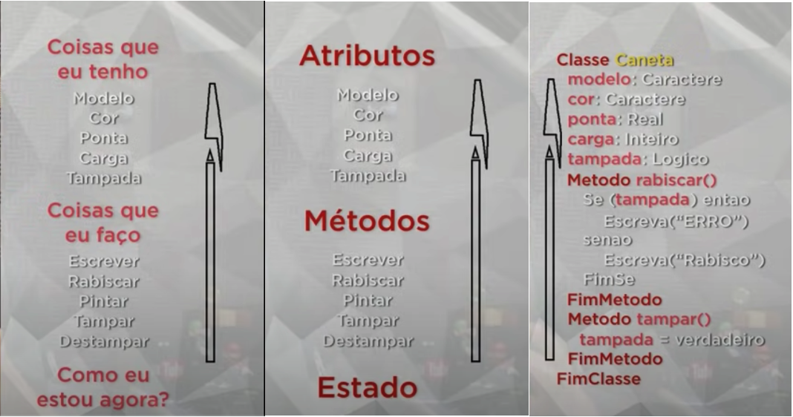
<a href="#" target="_blank"></a>

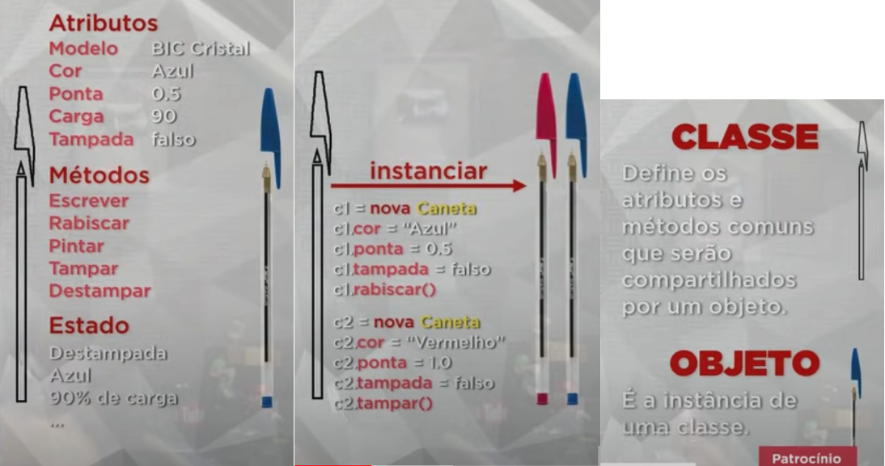
<a href="#" target="_blank"></a>


**POO - Resumo** :

- **CLASSE**

Define os atributos e métodos comuns que serão compartilhados por um objeto.

**Classes** são os modelos ou moldes nos quais surgirão os objetos. As classes definem algumas propriedades e métodos que deverão fazer parte do objeto que derivar dela ou então, como dizemos, os objetos que serão instanciados a partir dela.

- **OBJETO**

É a instância de uma classe.

- **ABSTRAÇÃO**

Abstração consiste de focalizar nos aspectos essenciais inerentes a uma entidade e ignorar propriedades "acidentais." Em termos de desenvolvimento de sistemas, isto significa concentrar-se no que um objeto é e faz antes de se decidir como ele será implementado. O uso de abstração preserva a liberdade para tomar decisões de desenvolvimento ou de implementação apenas quando há um melhor entendimento do problema a ser resolvido.

<br>

#### Aula Prática 2 – Criando Classes e Objetos em PHP

Nessa aula de POO, vamos aprender como criar classes e objetos.

<code>index.php</code>

```php
<!DOCTYPE html>
<html lang="pt-BR">
<head>
    <title>Aula 02 - PHP POO</title>
</head>
<body>
<pre>
    <?php
        require_once 'Caneta.php';

        $c1 = new Caneta; // instanciando a caneta

        $c1->cor = "Azul";
        $c1->ponta = 0.5;
//        $c1->tampada = false;
        $c1->destampar(); // chamando o método destampar();
//        $c1->rabiscar();
//        $c1->tampar();

        var_dump($c1);
//        print_r($c1);

        $c2 = new Caneta;   // criando outro objeto
        $c2->cor = "verde";
        $c2->carga = 50;
        $c2->tampar();

        var_dump($c2);
    ?>
</pre>
</body>
</html>
```

<code>Caneta.php</code>

```php
<?php

class Caneta
{
    var $modelo;
    var $cor;
    var $ponta;
    var $carga;
    var $tampada;

    function rabiscar() {
        if ($this->tampada == true) {
            echo "<p>ERRO. Não posso rabiscar!</p>";
        } else {
        echo "<p>Estou rabiscando...</p>";
        }
    }

    function tampar() {
        $this->tampada = true;
    }

    function destampar() {
        $this->tampada = false;
    }
}
```

<br>

<span id="aula03">

### 3. Aula 3

#### Aula Teórica 3 – O que é Visibilidade em um Objeto?

Nessa aula de POO, vamos aprender qual a importância dos modificadores de visibilidade público (+), privado (-) e protegido (#) na Programação Orientada a Objetos.

- UML - Linguagem Modelada Unificada


- Diagrama de Classes

    No Diagrama de Classes -> toda classe será representada por um retangulo.

- **Modificadores de Visibilidade**

    Indicam o nível de acesso aos componentes internos de uma classe na Programação Orientada a Objetos (POO):

    - público   ( + )
    - privado   ( - )
    - protegido ( # )

   

| Simbolo   | Modificadores de Visibilidade | Definição |
| :---------:                   | :-----:| :-----|
| +  | **public** (público)     | a classe atual e todas as outras classes |
| -  | **private** (privado)    | somente a classe atual |
| #  | **protected** (protegido)| a classe atual e todas as suas sub-classes |


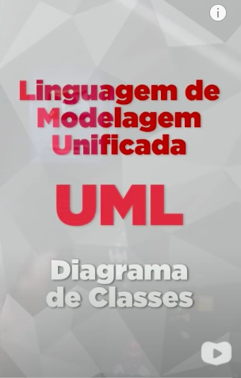
<a href="#" target="_blank"></a>
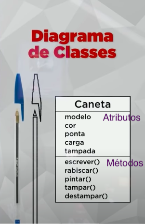
<a href="#" target="_blank"></a>
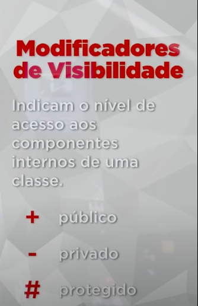
<a href="#" target="_blank"></a>
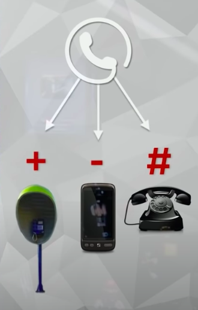
<a href="#" target="_blank"></a>
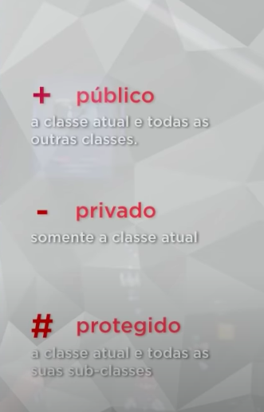
<a href="#" target="_blank"></a>
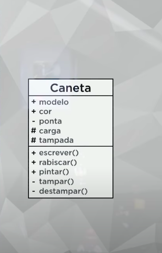
<a href="#" target="_blank"></a>
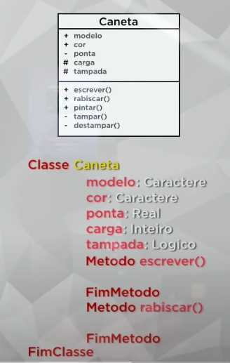
<a href="#" target="_blank"></a>
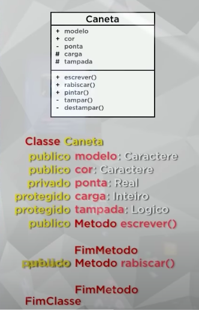
<a href="#" target="_blank"></a>
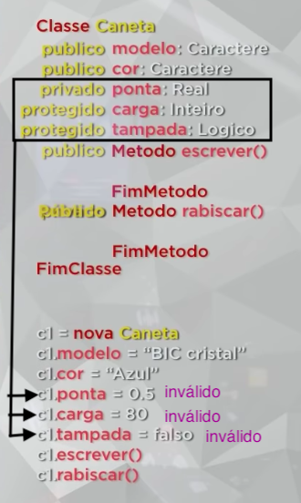
<a href="#" target="_blank"></a>


#### Aula Prática 3 – Configurando Visibilidade de Atributos e Métodos

Nessa aula de POO, vamos aprender na prática como utilizar os modificadores de visibilidade public, private e protected e qual é o efeito de cada um deles.

<code>Caneta.php</code>

```php
<?php

class Caneta
{
    public $modelo;
    public $cor;
    private $ponta;
    protected $carga;
    protected $tampada;

    public function rabiscar() {
        if ($this->tampada == true) {
            echo "<p>ERRO. Não posso rabiscar!</p>";
        } else {
        echo "<p>Estou rabiscando...</p>";
        }
    }

    public function tampar() {
        $this->tampada = true;
    }

    public function destampar() {
        $this->tampada = false;
    }
}
```

<code>index.php</code>

```php
<!DOCTYPE html>
<html lang="pt-BR">
<head>
    <title>Aula 03  - PHP POO</title>
</head>
<body>
<pre>
    <?php
        require_once 'Caneta.php';

        $c1 = new Caneta;
        $c1->modelo = "BIC cristal";
        $c1->cor = "Azul";

        $c1->rabiscar();
        $c1->tampar();
        $c1->destampar();
        var_dump($c1);
    ?>
</pre>
</body>
</html>
```

<br>

<span id="aula04">

### 4. Aula 4

#### Aula Teórica 4 – Métodos Especiais

Nessa aula de POO, vamos aprender como funcionam os Métodos Acessores (Getters), Métodos Modificadores (Setters) e Métodos Construtores (Construct) para a Programação Orientada a Objetos. 

- **Métodos Acessores (Getters)** &rarr; são métodos que dão acesso a uma determinada coisa; Getter (sentido de pegar/acessar alguma coisa), ele pega/acessa alguma informação c/ segurança. 

Os Métodos Acessores (Getters) conseguem acessar um determinado atributo mantendo a segurança de acesso a ele.


- **Métodos Modificadores (Setters)** &rarr; são métodos que modificam coisas dentro de um objeto. Setters (sentido de modificar/atualizar alguma coisa), ele modifica alguma informação c/ segurança.


**Getters** e **setters** são usados para proteger seus dados, especialmente na criação de classes.

Para cada instância de variável, um método **getter** retorna seu valor, enquanto um método **setter** o define ou atualiza. Com isso em mente, getters e setters também são conhecidos como métodos de acesso e de modificação, respectivamente.

Por convenção, **getters** começam com a palavra "**get**" e **setters** com a palavra "**set**", seguidos de um nome de variável.

**Por que usar getters e setters?**
Getters e setters permitem controlar a forma como variáveis importantes são acessadas e atualizadas no seu código. 


- **Métodos Construtores (Construct)** &rarr; Classes que tem um método construtor chamam o método a cada objeto recém criado, sendo apropriado para qualquer inicialização que o objeto necessite antes de ser utilizado.

O método construtor (Construct) de uma classe serve para executar algum comportamento (atribuição de valor, execução de método, etc) logo no momento em que uma instancia da mesma for criada. Isso traz vantagens pois evita a execução de tarefas repetitivas e obrigatórias.

**Construtores** são métodos ordinários que são chamados durante a criação do objeto correspondente. Eles podem definir um número arbitrários de argumentos, quais podem ser obrigatórios, podem ter um tipo, e podem ter valores padrão. Argumentos de construtores são informados dentro de parênteses depois do nome da classe.

O **construtor** pode ser private ou protected para evitar que ele seja chamado externamente.


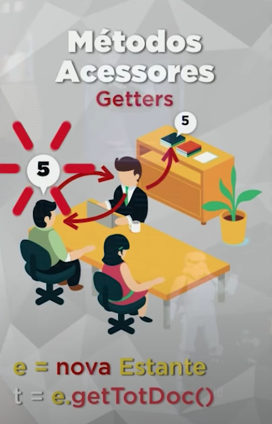
<a href="#" target="_blank"></a>
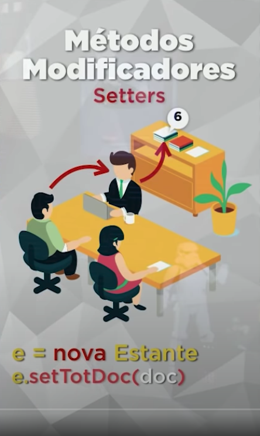
<a href="#" target="_blank"></a>
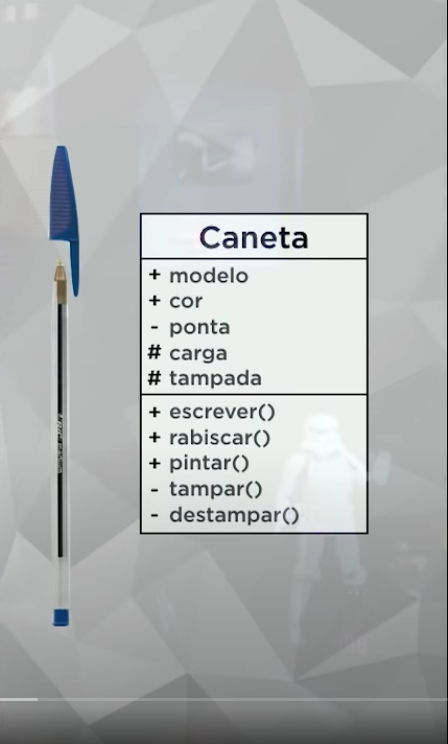
<a href="#" target="_blank"></a>
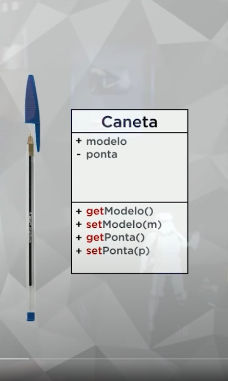
<a href="#" target="_blank"></a>
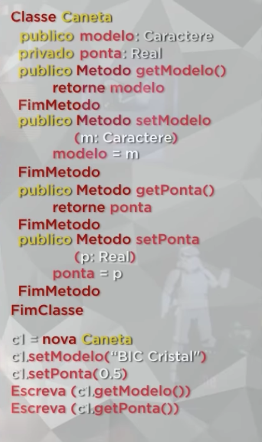
<a href="#" target="_blank"></a>
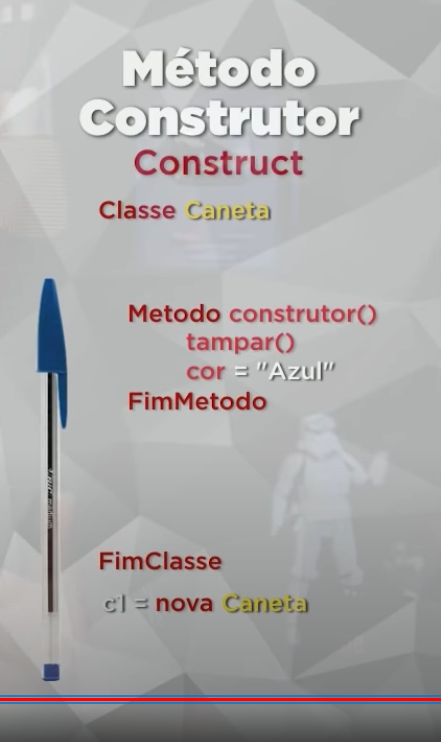
<a href="#" target="_blank"></a>
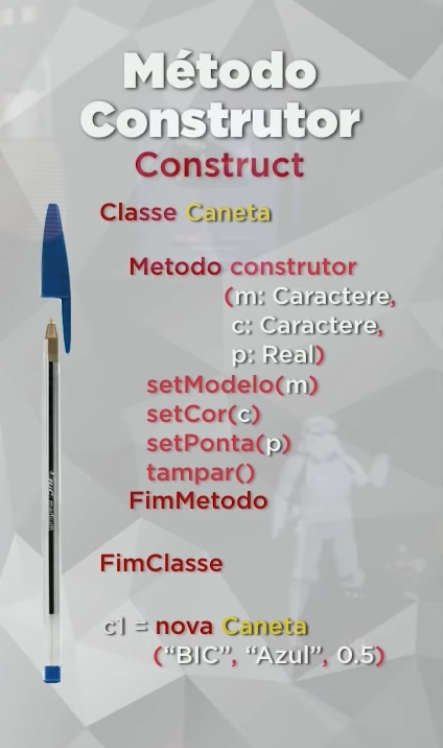
<a href="#" target="_blank"></a>

<br>

#### Aula Prática 4 – Métodos Getter, Setter e Construtor

Nessa aula de POO, vamos aprender como criar em PHP os Métodos Acessores (Getters), Métodos Modificadores (Setters) e Métodos Construtores (Construct).

Por convenção, getters começam com a palavra "get" e setters com a palavra "set", seguidos de um nome de variável.

**Exemplo do Métodos Modificadores (Setters) e Métodos Acessores (Getters)**

<code>Caneta.php</code>

```php
<?php

class Caneta
{
    private $modelo;
    private $ponta;

    public function getModelo() {
        return $this->modelo;
    }

    public function setModelo($m) {
        $this->modelo = $m;
    }

    public function getPonta() {
        return $this->ponta;
    }

    public function setPonta($p) {
        $this->ponta = $p;
    }
}
```

<code>index.php</code>

```php
<!DOCTYPE html>
<html lang="pt-BR">
<head>
    <title>Aula 04 - PHP POO</title>
</head>
<body>
<pre>
    <?php
        require_once 'Caneta.php';

        $c1 = new Caneta();

        /* Métodos Modificadores (Setters) - 
        Por convenção, setters com a palavra "set", seguidos de um nome de variável.  */

        $c1->setModelo("BIC");

        $c1->setPonta(0.5);

        /* Métodos Acessores (Getters) - 
        Por convenção, getters com a palavra "get", seguidos de um nome de variável. */

        print "Eu tenho uma caneta {$c1->getModelo()} de ponta {$c1->getPonta()}";

        echo "<br><br>";
        print_r($c1);
        
        echo "<br>";
        var_dump($c1);
    ?>
</pre>
</body>
</html>
```

**Método Construtor (Construct), exemplo mais simples, sem argumentos.**

<code>Caneta.php</code>

```php
<?php

class Caneta
{
    private $modelo;
    private $cor;
    private $ponta;
    private $tampada;

    // Método Construtor, 1º forma: public function __construct() {}
    // Método Construtor, 2º forma: public function Caneta() {}

    public function __construct() {
        $this->cor = "Azul";
        $this->tampar();
    }
    public function tampar() {
        $this->tampada = true;
    }
    public function getModelo() {
        return $this->modelo;
    }
    public function setModelo($m) {
        $this->modelo = $m;
    }
    public function getPonta() {
        return $this->ponta;
    }
    public function setPonta($p) {
        $this->ponta = $p;
    }
}
```

<code>index.php</code>

```php
<!DOCTYPE html>
<html lang="pt-BR">
<head>
    <title>Aula 04 - PHP POO</title>
</head>
<body>
<pre>
    <?php
        require_once 'Caneta.php';

        $c1 = new Caneta();

        /* Exemplo do Método Construtor (Construct) */

        print_r($c1);

        echo "<br>";

        var_dump($c1);
    ?>
</pre>
</body>
</html>
```

<code> print_r($c1) </code> :

    Caneta Object
    (
        [modelo:Caneta:private] => 
        [cor:Caneta:private] => Azul
        [ponta:Caneta:private] => 
        [tampada:Caneta:private] => 1
    )

**Método Construtor (Construct), exemplo mais complexo, com argumentos.**

Argumentos de construtores são informados dentro de parênteses depois do nome da classe.

Construtor que recebe parametros e consegue fazer a instanciação e consegue fazer a inicialização mais rapido.

<code>Caneta.php</code>

```php
<?php

class Caneta
{
    private $modelo;
    private $cor;
    private $ponta;
    private $tampada;

    public function __construct($m, $c, $p) {
        $this->modelo = $m;
        $this->cor = $c;
        $this->ponta = $p;
        $this->tampar(); // tampar todas as canetas que forem criadas
    }
    public function tampar() {
        $this->tampada = true;
    }
    public function getModelo() {
        return $this->modelo;
    }
    public function setModelo($m) {
        $this->modelo = $m;
    }
    public function getPonta() {
        return $this->ponta;
    }
    public function setPonta($p) {
        $this->ponta = $p;
    }
}
```

<code>index.php</code>

```php
<!DOCTYPE html>
<html lang="pt-BR">
<head>
    <title>Aula 04 - PHP POO</title>
</head>
<body>
<pre>
    <?php
        require_once 'Caneta.php';

        /* Exemplo do Método Construtor (Construct) com argumentos */

        $c1 = new Caneta("BIC Cristal Ponta Fina", "Azul", 0.8);
        $c2 = new Caneta("BIC Cristal", "Vermelha", 1.0);
        $c3 = new Caneta("BIC Cristal Ponta Fina", "Preta", 0.8);
        $c4 = new Caneta("BIC Cristal", "Verde", 1.0);

        print_r($c1);
        print_r($c2);
        print_r($c3);
        print_r($c4);
    ?>
</pre>
</body>
</html>
```

* Resultado (print_r):

```php
    Caneta Object
(
    [modelo:Caneta:private] => BIC Cristal Ponta Fina
    [cor:Caneta:private] => Azul
    [ponta:Caneta:private] => 0.8
    [tampada:Caneta:private] => 1
)
Caneta Object
(
    [modelo:Caneta:private] => BIC Cristal
    [cor:Caneta:private] => Vermelha
    [ponta:Caneta:private] => 1
    [tampada:Caneta:private] => 1
)
Caneta Object
(
    [modelo:Caneta:private] => BIC Cristal Ponta Fina
    [cor:Caneta:private] => Preta
    [ponta:Caneta:private] => 0.8
    [tampada:Caneta:private] => 1
)
Caneta Object
(
    [modelo:Caneta:private] => BIC Cristal
    [cor:Caneta:private] => Verde
    [ponta:Caneta:private] => 1
    [tampada:Caneta:private] => 1
)
```

<br>

<span id="aula05">

### 5. Aula 5

#### Aula Teórica 5 – Exemplo Prático com Objetos

Nessa aula de POO, vamos fazer um exemplo prático com Programação Orientada a Objetos, usando tudo aquilo que aprendemos até aqui.

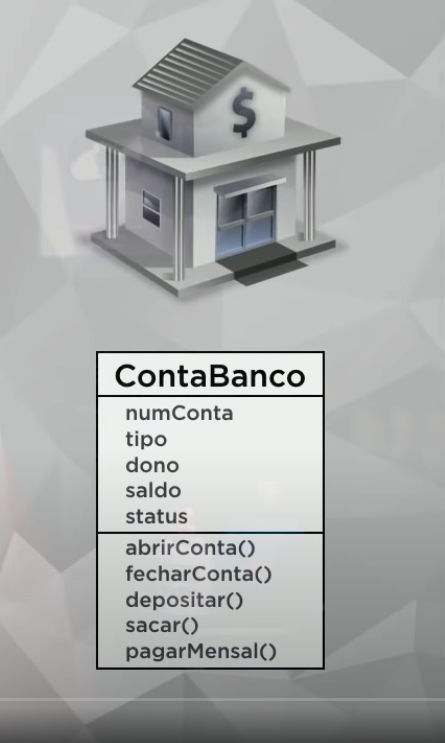
<a href="#" target="_blank"></a>

<a href="#" target="_blank"></a>
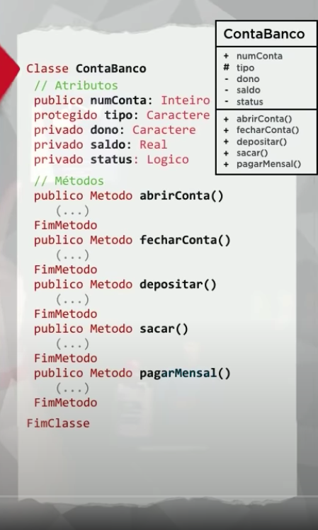
<a href="#" target="_blank"></a>
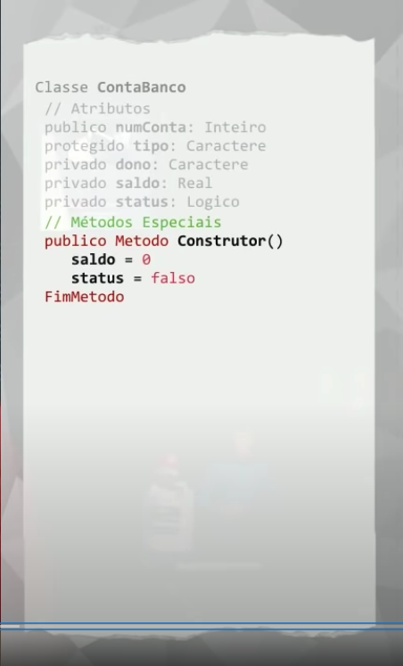
<a href="#" target="_blank"></a>
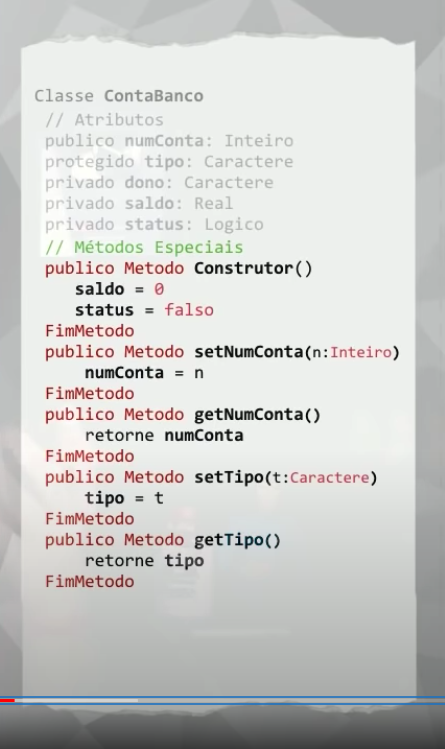
<a href="#" target="_blank"></a>

<a href="#" target="_blank"></a>
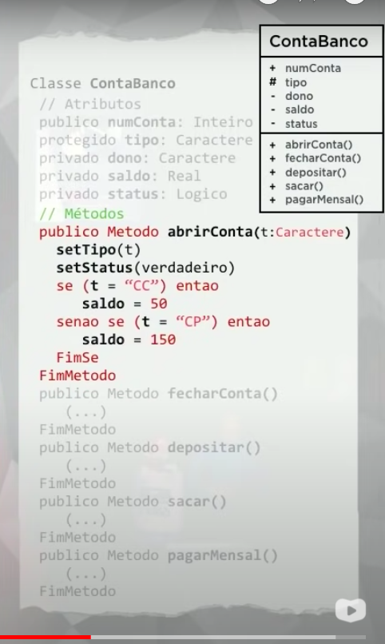
<a href="#" target="_blank"></a>
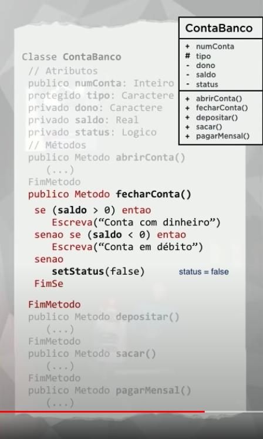
<a href="#" target="_blank"></a>
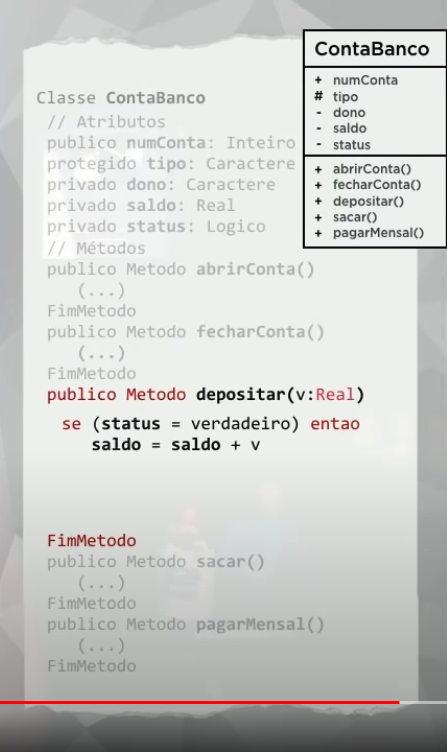
<a href="#" target="_blank"></a>
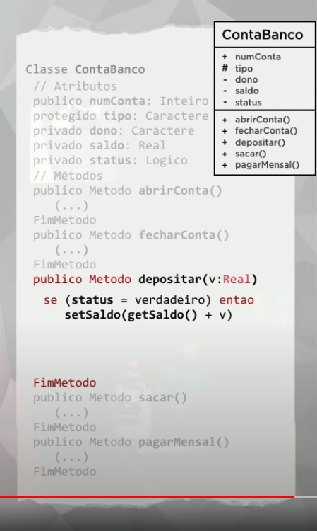
<a href="#" target="_blank"></a>

<a href="#" target="_blank"></a>
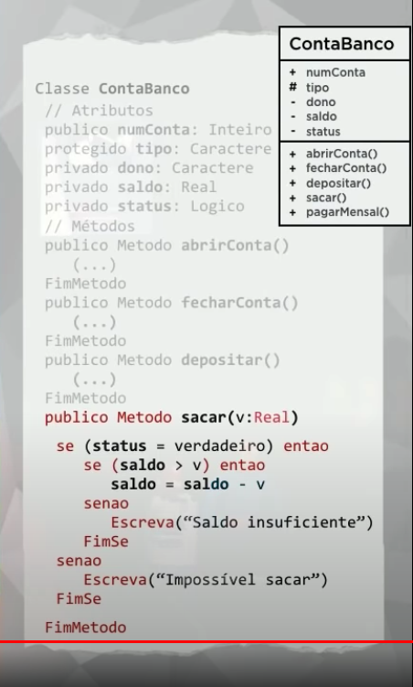
<a href="#" target="_blank"></a>
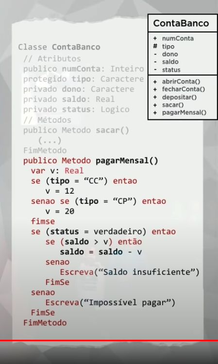
<a href="#" target="_blank"></a>


#### Aula Prática 5 – Exemplo Prático em PHP

Nessa aula de POO, vamos fazer um exercício prático em PHP com Programação Orientada a Objetos.


<code></code>

```php

```

<code></code>

```php

```

<br>

<span id="aula06">

### 6. Aula 6

#### Aula Teórica 6 – Pilares da POO: Encapsulamento

#### Aula Prática 6 – Encapsulamento

<code></code>

```php

```

<code></code>

```php

```

<br>

<span id="aula07">

### 7. Aula 7

#### Aula Teórica 7 – Relacionamento entre Classes

#### Aula Prática 7 – Objetos Compostos em PHP

<code></code>

```php

```

<code></code>

```php

```

<br>

<span id="aula08">

### 8. Aula 8

#### Aula Teórica 8 – Relacionamento de Agregação

#### Aula Prática 8 – Agregação entre Objetos em PHP

<code></code>

```php

```

<code></code>

```php

```

<br>

<span id="aula09">

### 9. Aula 9

#### Aula Teórica 9 – Exercícios de POO

#### Aula Prática 9 – Exercício prático POO em PHP

<code></code>

```php

```

<code></code>

```php

```

<br>

<span id="aula10">

### 10. Aula 10

#### Aula Teórica 10 – Herança (Parte 1)

#### Aula Prática 10 – Herança (Parte 1)

<code></code>

```php

```

<code></code>

```php

```

<br>

<span id="aula11">

### 11. Aula 11

#### Aula Teórica 11 – Herança (Parte 2)

#### Aula Prática 11 – Herança (Parte 2)

<code></code>

```php

```

<code></code>

```php

```

<br>

<span id="aula12">

### 12. Aula 12

#### Aula Teórica 12 – Conceito Polimorfismo (Parte 1)

#### Aula Prática 12 – Polimorfismo em PHP (Parte 1)

<code></code>

```php

```

<code></code>

```php

```

<br>

<span id="aula13">

### 13. Aula 13

#### Aula Teórica 13 – Conceito Polimorfismo (Parte 2)

#### Aula Prática 13 – Polimorfismo Sobrecarga (Parte 2)

<code></code>

```php

```

<code></code>

```php

```

<br>

<span id="aula14">

### 14. Aula 14

#### Aula Teórica 14 – Exercícios de POO (Parte 2)

#### Aula Prática 14 – Projeto Final em PHP (Parte 1)

<code></code>

```php

```

<code></code>

```php

```

<br>

<span id="aula15">

### 15. Aula 15

#### Aula Teórica 15 – Exercícios de POO (Parte 3)

#### Aula Prática 15 – Projeto Final em PHP (Parte 2)

<code></code>

```php

```

<code></code>

```php

```

<br>

<hr>

<span id="autor">

### Autor :smile:

<div align="rigth">
  <a href="https://github.com/eduardodsr">
   
  </a>
</div>

  * ` Dev: ` Eduardo da Silva Rodrigues
  
  * ` GitHub: ` [github.com/eduardodsr](https://www.github.com/eduardodsr) :link:
 
  * ` E-mail: ` <eduardodsr@gmail.com> :email:

