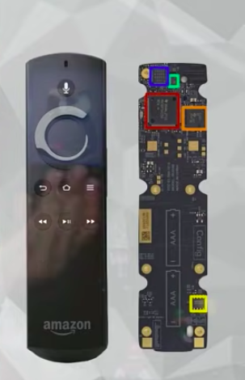

### 03. PHP POO [40 Horas] 

- Curso completo de **Programação Orientada a Objetos (POO)** com a linguagem PHP. 
- Aborda os principais conceitos como Classes, Objetos, instanciamento, abstração, encapsulamento, herança, polimorfismo e muito mais. 
- Criado pelo professor Gustavo Guanabara para o Curso em Vídeo, explica todos os conceitos de POO de uma maneira simples, objetiva e divertida.


<h1 align="center"> PHP POO - Índice</h1> 

<p align="center"> |&nbsp;&nbsp;&nbsp; 
  <a href="#aula01">Aula 01</a>&nbsp;&nbsp;&nbsp;|&nbsp;&nbsp;&nbsp;
  <a href="#aula02">Aula 02</a>&nbsp;&nbsp;&nbsp;|&nbsp;&nbsp;&nbsp;
  <a href="#aula03">Aula 03</a>&nbsp;&nbsp;&nbsp;|&nbsp;&nbsp;&nbsp;
  <a href="#aula04">Aula 04</a>&nbsp;&nbsp;&nbsp;|&nbsp;&nbsp;&nbsp;
  <a href="#aula05">Aula 05</a>&nbsp;&nbsp;&nbsp;|&nbsp;&nbsp;&nbsp;
  <a href="#aula06">Aula 06</a>&nbsp;&nbsp;&nbsp;|&nbsp;&nbsp;&nbsp;
  <a href="#aula07">Aula 07</a>&nbsp;&nbsp;&nbsp;|&nbsp;&nbsp;&nbsp;
  <a href="#aula08">Aula 08</a>&nbsp;&nbsp;&nbsp;|&nbsp;&nbsp;&nbsp;
  <a href="#aula09">Aula 09</a>&nbsp;&nbsp;&nbsp;|&nbsp;&nbsp;&nbsp;
  <a href="#aula10">Aula 10</a>&nbsp;&nbsp;&nbsp;|&nbsp;&nbsp;&nbsp;
  <a href="#aula11">Aula 11</a>&nbsp;&nbsp;&nbsp;|&nbsp;&nbsp;&nbsp;
  <a href="#aula12">Aula 12</a>&nbsp;&nbsp;&nbsp;|&nbsp;&nbsp;&nbsp;
  <a href="#aula13">Aula 13</a>&nbsp;&nbsp;&nbsp;|&nbsp;&nbsp;&nbsp;
  <a href="#aula14">Aula 14</a>&nbsp;&nbsp;&nbsp;|&nbsp;&nbsp;&nbsp;
  <a href="#aula15">Aula 15</a>&nbsp;&nbsp;&nbsp;|&nbsp;&nbsp;&nbsp;
</p>


### Aulas :bookmark:

1. Aula 1
    - Aula Teórica 1 – O que é Programação Orientada a Objetos?
    - Aula Prática 1 – Instalando o XAMPP e o NetBeans
2. Aula 2
    - Aula Teórica 2 – O que é um Objeto?
    - Aula Prática 2 – Criando Classes e Objetos em PHP
3. Aula 3
    - Aula Teórica 3 – O que é Visibilidade em um Objeto?
    - Aula Prática 3 – Configurando Visibilidade de Atributos e Métodos
4. Aula 4
    - Aula Teórica 4 – Métodos Especiais
    - Aula Prática 4 – Métodos Getter, Setter e Construtor
5. Aula 5
    - Aula Teórica 5 – Exemplo Prático com Objetos
    - Aula Prática 5 – Exemplo Prático em PHP
6. Aula 6
    - Aula Teórica 6 – Pilares da POO: Encapsulamento
    - Aula Prática 6 – Encapsulamento
7. Aula 7
    - Aula Teórica 7 – Relacionamento entre Classes
    - Aula Prática 7 – Objetos Compostos em PHP
8. Aula 8
    - Aula Teórica 8 – Relacionamento de Agregação
    - Aula Prática 8 – Agregação entre Objetos em PHP
9. Aula 9
    - Aula Teórica 9 – Exercícios de POO
    - Aula Prática 9 – Exercício prático POO em PHP
10. Aula 10
    - Aula Teórica 10 – Herança (Parte 1)
    - Aula Prática 10 – Herança (Parte 1)
11. Aula 11
    - Aula Teórica 11 – Herança (Parte 2)
    - Aula Prática 11 – Herança (Parte 2)
12. Aula 12
    - Aula Teórica 12 – Conceito Polimorfismo (Parte 1)
    - Aula Prática 12 – Polimorfismo em PHP (Parte 1)
13. Aula 13
    - Aula Teórica 13 – Conceito Polimorfismo (Parte 2)
    - Aula Prática 13 – Polimorfismo Sobrecarga (Parte 2)
14. Aula 14
    - Aula Teórica 14 – Exercícios de POO (Parte 2)
    - Aula Prática 14 – Projeto Final em PHP (Parte 1)
15. Aula 15
    - Aula Teórica 15 – Exercícios de POO (Parte 3)
    - Aula Prática 15 – Projeto Final em PHP (Parte 2)


### Conteúdo do Módulo :bookmark:

<span id="aula01">

### 1. Aula 1

#### Aula Teórica 1 – O que é Programação Orientada a Objetos?

Nessa aula de POO, vamos aprender o que é Programação Orientada a Objetos e quais são as suas principais vantagens em relação a outros tipos de Linguagem de Programação.

* Como era?

Programação de baixo nível -> Programação linear -> Programação estruturada -> Programação modular -> POO (Programação Orientada a Objetos)

* Quem criou?

Alan Kay


* Linguagens POO
    - C++
    - Java
    - PHP
    - Python
    - Ruby
    - Visual Basic


-  Vantagens da POO

Acrônimo das vantagens da POO: <strong><big> C O M E R N </strong>a d a </big>

- C -> Confiável
- O -> Oportuno
- M -> Manutenível
- E -> Extensível
- R -> Reutilizável
- N -> Natural


#### Aula Prática 1 – Instalando o XAMPP e o NetBeans

Nessa aula de POO, vamos aprender como instalar o XAMPP e o NetBeans.

- O que é o XAMPP?

**XAMPP** é o ambiente de desenvolvimento PHP mais popular
O XAMPP é completamente gratuito, de fácil de instalar a distribuição Apache, contendo MySQL, PHP e Perl. O pacote de código aberto do XAMPP foi criado para ser extremamente fácil de instalar e de usar.

[XAMPP ](https://www.apachefriends.org/pt_br/index.html)


<br>

<span id="aula02">

### 2. Aula 2

#### Aula Teórica 2 – O que é um Objeto?

Nessa aula de POO, vamos aprender os conceitos de Classes e Objetos, passando pela teoria de Atributos, Métodos, Estado e Instâncias. Veja como criar uma classe e instanciar, criando objetos.

- O que é um objeto?

<mark>Coisa material ou abstrata que pode ser percebida pelos sentidos e descrita por meio das suas características, comportamentos e estado atual.</mark>

Tudo que tiver característica, comportamento e estado atual é considerado um **objeto**.

Exemplo:
    - Caneta pode ser um objeto ou uma classe.

- **OBJETO** - Caneta.

Todo objeto vem a partir de uma classe (molde que foi gerado para criar o objeto).
 
- **CLASSE** - Serve para classificar a caneta. Pensar no molde que foi considerado para gerar o objeto.
Uma classe precisa responde as 3 perguntas abaixo.

    * **ATRIBUTO - Coisas que eu tenho?**
        - Modelo
        - Cor
        - Ponta
        - Carga
        - Tampada

    * **MÉTODO - Coisas que eu faço?**
        - Escrever
        - Rabiscar
        - Pintar
        - Tampar
        - Destampar

    * **ESTADO - Como eu estou agora?**
        - Cor azul
        - Ponta do tipo fina
        - 50% de carga
        - A caneta está sem tampa
        - A caneta está escrevendo agora

Todo **OBJETO** tem:
- Atributos (características);
- Métodos (comportamentos);
- Estado atual (status / características atuais no momento que estou analisando o objeto).


<a href="#" target="_blank"></a>


<a href="#" target="_blank"></a>


**Resumo**

- **CLASSE**

Define os atributos e métodos comuns que serão compartilhados por um objeto.

Classes são os modelos ou moldes nos quais surgirão os objetos. As classes definem algumas propriedades e métodos que deverão fazer parte do objeto que derivar dela ou então, como dizemos, os objetos que serão instanciados a partir dela.

- **OBJETO**

É a instância de uma classe.

- **ABSTRAÇÃO**

Abstração consiste de focalizar nos aspectos essenciais inerentes a uma entidade e ignorar propriedades ``acidentais.'' Em termos de desenvolvimento de sistemas, isto significa concentrar-se no que um objeto é e faz antes de se decidir como ele será implementado. O uso de abstração preserva a liberdade para tomar decisões de desenvolvimento ou de implementação apenas quando há um melhor entendimento do problema a ser resolvido.

<br>

#### Aula Prática 2 – Criando Classes e Objetos em PHP

<code>index.php</code>

```php
<!DOCTYPE html>
<html lang="pt-BR">
<head>
    <title>Aula 02 - PHP POO</title>
</head>
<body>
<pre>
    <?php
        require_once 'Caneta.php';

        $c1 = new Caneta; // instanciando a caneta

        $c1->cor = "Azul";
        $c1->ponta = 0.5;
//        $c1->tampada = false;
        $c1->destampar(); // chamando o método destampar();
//        $c1->rabiscar();
//        $c1->tampar();

        var_dump($c1);
//        print_r($c1);

        $c2 = new Caneta;   // criando outro objeto
        $c2->cor = "verde";
        $c2->carga = 50;
        $c2->tampar();

        var_dump($c2);
    ?>
</pre>
</body>
</html>
```

<code>Caneta.php</code>

```php
<?php

class Caneta
{
    var $modelo;
    var $cor;
    var $ponta;
    var $carga;
    var $tampada;

    function rabiscar() {
        if ($this->tampada == true) {
            echo "<p>ERRO. Não posso rabiscar!</p>";
        } else {
        echo "<p>Estou rabiscando...</p>";
        }
    }

    function tampar() {
        $this->tampada = true;
    }

    function destampar() {
        $this->tampada = false;
    }

}
```

<br>

<span id="aula03">

### 3. Aula 3

#### Aula Teórica 3 – O que é Visibilidade em um Objeto?

Nessa aula de POO, vamos aprender qual a importância dos modificadores de visibilidade público (+), privado (-) e protegido (#) na Programação Orientada a Objetos.

**UML - Linguagem Modelada Unificada**

- Diagrama de Classes

Toda classe será representada por um retangulo.


<a href="#" target="_blank"></a>

<a href="#" target="_blank"></a>

<a href="#" target="_blank"></a>

<a href="#" target="_blank"></a>

<a href="#" target="_blank"></a>

<a href="#" target="_blank"></a>

<a href="#" target="_blank"></a>

<a href="#" target="_blank"></a>

<a href="#" target="_blank"></a>



#### Aula Prática 3 – Configurando Visibilidade de Atributos e Métodos

<code></code>

```php

```

<code></code>

```php

```

<br>

<span id="aula04">

### 4. Aula 4

#### Aula Teórica 4 – Métodos Especiais

#### Aula Prática 4 – Métodos Getter, Setter e Construtor

<code></code>

```php

```

<code></code>

```php

```

<br>

<span id="aula05">

### 5. Aula 5

#### Aula Teórica 5 – Exemplo Prático com Objetos

#### Aula Prática 5 – Exemplo Prático em PHP

<code></code>

```php

```

<code></code>

```php

```

<br>

<span id="aula06">

### 6. Aula 6

#### Aula Teórica 6 – Pilares da POO: Encapsulamento

#### Aula Prática 6 – Encapsulamento

<code></code>

```php

```

<code></code>

```php

```

<br>

<span id="aula07">

### 7. Aula 7

#### Aula Teórica 7 – Relacionamento entre Classes

#### Aula Prática 7 – Objetos Compostos em PHP

<code></code>

```php

```

<code></code>

```php

```

<br>

<span id="aula08">

### 8. Aula 8

#### Aula Teórica 8 – Relacionamento de Agregação

#### Aula Prática 8 – Agregação entre Objetos em PHP

<code></code>

```php

```

<code></code>

```php

```

<br>

<span id="aula09">

### 9. Aula 9

#### Aula Teórica 9 – Exercícios de POO

#### Aula Prática 9 – Exercício prático POO em PHP

<code></code>

```php

```

<code></code>

```php

```

<br>

<span id="aula10">

### 10. Aula 10

#### Aula Teórica 10 – Herança (Parte 1)

#### Aula Prática 10 – Herança (Parte 1)

<code></code>

```php

```

<code></code>

```php

```

<br>

<span id="aula11">

### 11. Aula 11

#### Aula Teórica 11 – Herança (Parte 2)

#### Aula Prática 11 – Herança (Parte 2)

<code></code>

```php

```

<code></code>

```php

```

<br>

<span id="aula12">

### 12. Aula 12

#### Aula Teórica 12 – Conceito Polimorfismo (Parte 1)

#### Aula Prática 12 – Polimorfismo em PHP (Parte 1)

<code></code>

```php

```

<code></code>

```php

```

<br>

<span id="aula13">

### 13. Aula 13

#### Aula Teórica 13 – Conceito Polimorfismo (Parte 2)

#### Aula Prática 13 – Polimorfismo Sobrecarga (Parte 2)

<code></code>

```php

```

<code></code>

```php

```

<br>

<span id="aula14">

### 14. Aula 14

#### Aula Teórica 14 – Exercícios de POO (Parte 2)

#### Aula Prática 14 – Projeto Final em PHP (Parte 1)

<code></code>

```php

```

<code></code>

```php

```

<br>

<span id="aula15">

### 15. Aula 15

#### Aula Teórica 15 – Exercícios de POO (Parte 3)

#### Aula Prática 15 – Projeto Final em PHP (Parte 2)

<code></code>

```php

```

<code></code>

```php

```

<br>

<hr>

<span id="autor">

### Autor :smile:

<div align="rigth">
  <a href="https://github.com/eduardodsr">
   
  </a>
</div>

  * ` Dev: ` Eduardo da Silva Rodrigues
  
  * ` GitHub: ` [github.com/eduardodsr](https://www.github.com/eduardodsr) :link:
 
  * ` E-mail: ` <eduardodsr@gmail.com> :email:

